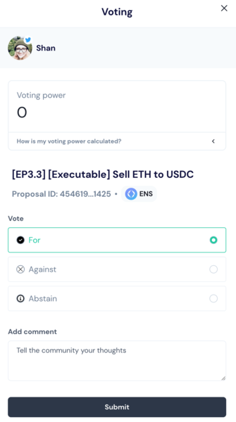
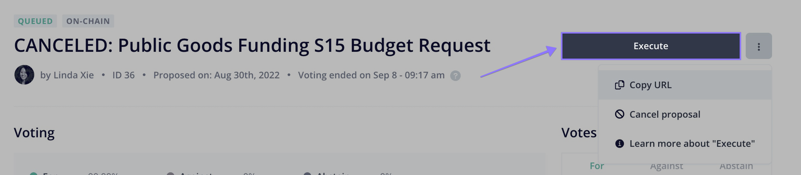

# How to set up on-chain governance
在本指南中，我们将学习OpenZeppelin的Governor合约如何工作，如何设置它，并使用Ethers.js和Tally提供的工具创建提案、投票并执行它们。

> NOTE
在*Governance API*中找到详细的合约文档。

## 介绍
分散式协议在公开发布后不断发展。通常，初始团队在最初的阶段保留对这种演变的控制权，但最终将其委托给利益相关者社区。这个社区做出决策的过程称为链上治理，它已成为分散式协议的核心组件，推动各种决策，例如参数调整、智能合约升级、与其他协议的集成、财务管理、赠款等。

这个治理协议通常在一个特殊用途的合约中实现，称为“Governor”。Compound设计的GovernorAlpha和GovernorBravo合约迄今为止非常成功和受欢迎，但缺点是具有不同要求的项目必须分叉代码，以定制它们的需求，这可能会带来引入安全问题的高风险。对于OpenZeppelin Contracts，我们着手建立了一套模块化的Governor合约系统，因此不需要分叉，并且可以通过使用Solidity继承编写小模块来适应不同的要求。您会在OpenZeppelin Contracts中找到最常见的要求，但编写其他要求很简单，我们在未来的发布版本中将根据社区的要求添加新功能。此外，OpenZeppelin Governor的设计要求最小化存储的使用，并导致更高的燃气效率运行。

## 兼容性
OpenZeppelin的Governor系统考虑了与基于Compound的GovernorAlpha和GovernorBravo的现有系统的兼容性。因此，您会发现许多模块都有两个变体之一，其中一个是为与这些系统兼容而构建的。

### ERC20Votes和ERC20VotesComp
跟踪投票和投票委托的ERC20扩展就是这样一个例子。较短的版本是更通用的版本，因为它可以支持大于2^96的代币供应，而“Comp”变体在这方面受到限制，但正好符合GovernorAlpha和Bravo使用的COMP代币的接口。两个合约变体共享相同的事件，因此仅查看事件时它们是完全兼容的。

### Governor和GovernorCompatibilityBravo
默认情况下，OpenZeppelin Governor合约与Compound的GovernorAlpha或Bravo不兼容。即使事件完全兼容，提案生命周期函数（创建、执行等）具有不同的签名，旨在优化存储使用。GovernorAlpha和Bravo的其他函数也不可用。可以选择继承GovernorCompatibilityBravo模块以获得更高级别的兼容性，该模块重写提案生命周期函数，例如提出和执行。

请注意，即使使用此模块，`proposalId`的计算方式仍将有所不同。Governor使用提案参数的哈希，目的是通过事件索引将其数据保持在链外，而原始的Bravo实现使用顺序`proposalId`。由于这个和其他差异，GovernorBravo的几个函数不包括在兼容性模块中。

### GovernorTimelockControl和GovernorTimelockCompound
在使用Governor合约的timelock时，您可以使用OpenZeppelin的TimelockController或Compound的Timelock。根据timelock的选择，您应选择相应的Governor模块：GovernorTimelockControl或GovernorTimelockCompound。这允许您将现有的GovernorAlpha实例迁移到基于OpenZeppelin的Governor，而无需更改使用的timelock。

### 计数
Tally是一个完整的用户拥有的链上治理应用程序。它包括投票仪表板、提案创建向导、实时研究和分析以及教育内容。

对于所有这些选项，Governor将与Tally兼容：用户将能够创建提案、可视化投票权力和倡导者、浏览提案并投票。特别是对于提案创建，项目还可以使用Defender Admin作为替代接口。

在本指南的其余部分，我们将专注于部署基本的OpenZeppelin Governor功能，而不考虑与GovernorAlpha或Bravo的兼容性。

## 设置

### 代币

我们治理设置中每个帐户的投票权将由一个ERC20代币确定。该代币必须实现ERC20Votes扩展。该扩展将跟踪历史余额，以便从过去的快照中检索投票权，而不是当前余额，这是一种重要的保护，可防止双重投票。
```
// SPDX-License-Identifier: MIT
pragma solidity ^0.8.2;

import "@openzeppelin/contracts/token/ERC20/ERC20.sol";
import "@openzeppelin/contracts/token/ERC20/extensions/ERC20Permit.sol";
import "@openzeppelin/contracts/token/ERC20/extensions/ERC20Votes.sol";

contract MyToken is ERC20, ERC20Permit, ERC20Votes {
    constructor() ERC20("MyToken", "MTK") ERC20Permit("MyToken") {}

    // The functions below are overrides required by Solidity.

    function _afterTokenTransfer(address from, address to, uint256 amount) internal override(ERC20, ERC20Votes) {
        super._afterTokenTransfer(from, to, amount);
    }

    function _mint(address to, uint256 amount) internal override(ERC20, ERC20Votes) {
        super._mint(to, amount);
    }

    function _burn(address account, uint256 amount) internal override(ERC20, ERC20Votes) {
        super._burn(account, amount);
    }
}
```

如果您的项目已经有一个活跃的代币，但不包括ERC20Votes且不可升级，您可以使用ERC20Wrapper将其包装成一个治理代币。这将允许代币持有人通过1对1包装他们的代币来参与治理。

```
// SPDX-License-Identifier: MIT
pragma solidity ^0.8.2;

import "@openzeppelin/contracts/token/ERC20/ERC20.sol";
import "@openzeppelin/contracts/token/ERC20/extensions/ERC20Permit.sol";
import "@openzeppelin/contracts/token/ERC20/extensions/ERC20Votes.sol";
import "@openzeppelin/contracts/token/ERC20/extensions/ERC20Wrapper.sol";

contract MyTokenWrapped is ERC20, ERC20Permit, ERC20Votes, ERC20Wrapper {
    constructor(
        IERC20 wrappedToken
    ) ERC20("MyTokenWrapped", "MTK") ERC20Permit("MyTokenWrapped") ERC20Wrapper(wrappedToken) {}

    // The functions below are overrides required by Solidity.

    function decimals() public pure override(ERC20, ERC20Wrapper) returns (uint8) {
        return 18;
    }

    function _afterTokenTransfer(address from, address to, uint256 amount) internal override(ERC20, ERC20Votes) {
        super._afterTokenTransfer(from, to, amount);
    }

    function _mint(address to, uint256 amount) internal override(ERC20, ERC20Votes) {
        super._mint(to, amount);
    }

    function _burn(address account, uint256 amount) internal override(ERC20, ERC20Votes) {
        super._burn(account, amount);
    }
}
```

> NOTE
目前在OpenZeppelin Contracts中唯一可用的投票权力来源是*ERC721Votes*。不提供此功能的ERC721代币可以使用*ERC721Votes*和*ERC721Wrapper*的组合将其包装成投票代币。

> NOTE
代币用于存储投票余额的内部时钟将决定附加到其上的Governor合约的操作模式。默认情况下，使用块号。自v4.9以来，开发人员可以重写IERC6372时钟，改用时间戳而不是块号。

### Governor
首先，我们将构建一个没有时间锁定的Governor。Governor合约提供了核心逻辑，但我们仍需要选择：1）如何确定投票权力，2）需要多少票才能达成法定人数，3）人们在投票时有哪些选项以及如何计算这些选票，以及4）应使用哪种类型的代币进行投票。每个方面都可以通过编写自己的模块来自定义，或者更轻松地从OpenZeppelin Contracts中选择一个模块。

对于1），我们将使用GovernorVotes模块，它钩入IVotes实例，根据在提案变为活动状态时持有的代币余额确定账户的投票权。该模块需要代币的地址作为构造函数参数。该模块还发现代币使用的时钟模式（ERC6372），并将其应用于Governor。

对于2），我们将使用GovernorVotesQuorumFraction，它与ERC20Votes一起工作，将法定人数定义为在提案的投票权力被检索时总供应量的一定比例。这需要一个构造函数参数来设置百分比。现在大多数Governors使用4％，因此我们将使用参数4来初始化该模块（这表示百分比，结果为4％）。

对于3），我们将使用GovernorCountingSimple，这是一个提供3个选项给选民的模块：赞成、反对和弃权，只有赞成和弃权的票数会计入法定人数。

除了这些模块，Governor本身还有一些必须设置的参数。

votingDelay：在提案创建后多长时间应该固定投票权力。较长的投票延迟时间可以给用户留出时间，以便必要时解除质押代币。

votingPeriod：提案保持开放以接受投票的时间有多长。

这些参数在代币时钟定义的单位中指定。假设代币使用块号，并假设块时间约为12秒，则我们将设置votingDelay = 1天= 7200个块，votingPeriod = 1周= 50400个块。

我们还可以选择设置提案门槛。这将限制提案创建仅限于拥有足够投票权的账户。

```
// SPDX-License-Identifier: MIT
pragma solidity ^0.8.2;

import "@openzeppelin/contracts/governance/Governor.sol";
import "@openzeppelin/contracts/governance/compatibility/GovernorCompatibilityBravo.sol";
import "@openzeppelin/contracts/governance/extensions/GovernorVotes.sol";
import "@openzeppelin/contracts/governance/extensions/GovernorVotesQuorumFraction.sol";
import "@openzeppelin/contracts/governance/extensions/GovernorTimelockControl.sol";

contract MyGovernor is
    Governor,
    GovernorCompatibilityBravo,
    GovernorVotes,
    GovernorVotesQuorumFraction,
    GovernorTimelockControl
{
    constructor(
        IVotes _token,
        TimelockController _timelock
    ) Governor("MyGovernor") GovernorVotes(_token) GovernorVotesQuorumFraction(4) GovernorTimelockControl(_timelock) {}

    function votingDelay() public pure override returns (uint256) {
        return 7200; // 1 day
    }

    function votingPeriod() public pure override returns (uint256) {
        return 50400; // 1 week
    }

    function proposalThreshold() public pure override returns (uint256) {
        return 0;
    }

    // The functions below are overrides required by Solidity.

    function state(
        uint256 proposalId
    ) public view override(Governor, IGovernor, GovernorTimelockControl) returns (ProposalState) {
        return super.state(proposalId);
    }

    function propose(
        address[] memory targets,
        uint256[] memory values,
        bytes[] memory calldatas,
        string memory description
    ) public override(Governor, GovernorCompatibilityBravo, IGovernor) returns (uint256) {
        return super.propose(targets, values, calldatas, description);
    }

    function cancel(
        address[] memory targets,
        uint256[] memory values,
        bytes[] memory calldatas,
        bytes32 descriptionHash
    ) public override(Governor, GovernorCompatibilityBravo, IGovernor) returns (uint256) {
        return super.cancel(targets, values, calldatas, descriptionHash);
    }

    function _execute(
        uint256 proposalId,
        address[] memory targets,
        uint256[] memory values,
        bytes[] memory calldatas,
        bytes32 descriptionHash
    ) internal override(Governor, GovernorTimelockControl) {
        super._execute(proposalId, targets, values, calldatas, descriptionHash);
    }

    function _cancel(
        address[] memory targets,
        uint256[] memory values,
        bytes[] memory calldatas,
        bytes32 descriptionHash
    ) internal override(Governor, GovernorTimelockControl) returns (uint256) {
        return super._cancel(targets, values, calldatas, descriptionHash);
    }

    function _executor() internal view override(Governor, GovernorTimelockControl) returns (address) {
        return super._executor();
    }

    function supportsInterface(
        bytes4 interfaceId
    ) public view override(Governor, IERC165, GovernorTimelockControl) returns (bool) {
        return super.supportsInterface(interfaceId);
    }
}
```

### 时间锁

在治理决策中添加时间锁是一个好的实践。这使得用户在执行决策之前，如果不同意该决策，可以退出系统。我们将使用OpenZeppelin的TimelockController与GovernorTimelockControl模块结合使用。

>IMPORTANT
在使用时间锁时，应该是时间锁执行提案，因此时间锁应该持有任何资金、所有权和访问控制角色。在版本4.5之前，当使用时间锁时，在Governor合约中无法恢复资金！在版本4.3之前，当使用Compound Timelock时，时间锁中的ETH不容易被访问。

TimelockController使用了AccessControl设置，我们需要了解它以设置角色。

* Proposer角色负责排队操作：这是Governor实例应该被授予的角色，它很可能是系统中唯一的提议者。

* Executor角色负责执行已经可用的操作：我们可以将此角色分配给特殊的零地址，以允许任何人执行（如果操作可能特别时间敏感，则应将Governor设为Executor）。

* 最后，还有Admin角色，可以授予和撤销前两个角色：这是一个非常敏感的角色，将自动授予时间锁本身，并可选择授予第二个帐户，用于设置方便，但应立即放弃该角色。

## 提案生命周期

让我们来看看如何在新部署的Governor上创建和执行提案。

提案是Governor合约将执行的一系列操作，如果通过，则执行。每个操作由目标地址、调用函数的calldata编码和要包括的ETH金额组成。此外，提案包括一个可读的描述。

### 创建提案

假设我们想创建一个提案，以授予团队一笔资助，以治理宝库中的ERC20代币形式。该提案将由一个单一操作组成，其中目标是ERC20代币，calldata是编码的函数调用transfer(<team wallet>, <grant amount>)，并附加0 ETH。

通常，提案将通过接口（如Tally或Defender）的帮助来创建。在这里，我们将展示如何使用Ethers.js创建提案。

首先，我们获取提案操作所需的所有参数。

```
const tokenAddress = ...;
const token = await ethers.getContractAt(‘ERC20’, tokenAddress);

const teamAddress = ...;
const grantAmount = ...;
const transferCalldata = token.interface.encodeFunctionData(‘transfer’, [teamAddress, grantAmount]);
```

现在我们准备调用Governor的提议功能。请注意，我们不会传递一个动作数组，而是传递三个数组，分别对应目标列表、值列表和调用数据列表。在这种情况下，只有一个动作，所以非常简单：
```
await governor.propose(
  [tokenAddress],
  [0],
  [transferCalldata],
  “Proposal #1: Give grant to team”,
);
```
这将创建一个新的提案，提案ID是通过将提案数据进行哈希处理获得的，并且该ID也将在交易日志中的事件中找到。

### 投票
一旦提案处于活动状态，代表就可以投票。请注意，投票权由代表持有：如果代币持有人想要参与，他们可以将可信代表设置为自己的代表，或者通过自我委派其投票权来成为代表。

投票通过与Governor合约交互来进行，使用castVote函数系列进行。投票者通常会从治理UI（例如Tally）调用此函数。


### 执行提案
投票期结束后，如果达到法定人数（足够的投票权参与）并且多数投票赞成，则认为提案成功并可以继续执行。一旦提案通过，它可以排队并从您投票的同一位置执行。


现在我们将手动使用Ethers.js来执行此操作。

如果设置了时间锁，则执行的第一步是排队。您会注意到，无论是队列还是执行函数都需要传递整个提案参数，而不仅仅是提案ID。这是必要的，因为这些数据不存储在链上，这是为了节省gas的措施。请注意，这些参数始终可以在合约发出的事件中找到。唯一不以完整形式发送的参数是描述，因为只需要以其散列形式来计算提案ID。

要排队，我们调用queue函数：
```
const descriptionHash = ethers.utils.id(“Proposal #1: Give grant to team”);

await governor.queue(
  [tokenAddress],
  [0],
  [transferCalldata],
  descriptionHash,
);
```
这将导致州长与时间锁合约进行交互，并在必要的延迟后排队执行操作。

足够的时间过去后（根据时间锁参数），提案可以执行。如果一开始没有时间锁，那么在提案成功后可以立即运行此步骤。
```
await governor.execute(
  [tokenAddress],
  [0],
  [transferCalldata],
  descriptionHash,
);
```
执行该提案将把ERC20代币转移给选定的接收者。总之，我们建立了一个系统，由项目的代币持有者的集体决策控制资金库，所有操作都通过通过链上投票执行的提案实施。

## 时间戳基础治理

### 激励
有时候，由于区块之间的时间不一致或不可预测，处理以区块数量表示的时间段可能会很困难。这在一些L2网络中尤其如此，因为区块的生成是基于区块链使用情况的。使用区块数量还可能导致治理规则受到修改预期区块之间时间的网络升级的影响。

用时间戳替换块号的困难在于，当查询过去的投票时，治理者和代币必须使用相同的格式。如果代币是围绕块号设计的，治理者无法可靠地进行基于时间戳的查找。

因此，设计基于时间戳的投票系统始于代币。

### 代币
自v4.9以来，所有投票合约（包括*ERC20Votes*和*ERC721Votes*）都依赖于*IERC6372*进行时钟管理。要从使用块号操作转换为使用时间戳操作，只需要重写clock()和CLOCK_MODE()函数即可。

```
// SPDX-License-Identifier: MIT
pragma solidity ^0.8.2;

import "@openzeppelin/contracts/token/ERC20/ERC20.sol";
import "@openzeppelin/contracts/token/ERC20/extensions/ERC20Permit.sol";
import "@openzeppelin/contracts/token/ERC20/extensions/ERC20Votes.sol";

contract MyTokenTimestampBased is ERC20, ERC20Permit, ERC20Votes {
    constructor() ERC20("MyTokenTimestampBased", "MTK") ERC20Permit("MyTokenTimestampBased") {}

    // Overrides IERC6372 functions to make the token & governor timestamp-based

    function clock() public view override returns (uint48) {
        return uint48(block.timestamp);
    }

    // solhint-disable-next-line func-name-mixedcase
    function CLOCK_MODE() public pure override returns (string memory) {
        return "mode=timestamp";
    }

    // The functions below are overrides required by Solidity.

    function _afterTokenTransfer(address from, address to, uint256 amount) internal override(ERC20, ERC20Votes) {
        super._afterTokenTransfer(from, to, amount);
    }

    function _mint(address to, uint256 amount) internal override(ERC20, ERC20Votes) {
        super._mint(to, amount);
    }

    function _burn(address account, uint256 amount) internal override(ERC20, ERC20Votes) {
        super._burn(account, amount);
    }
}
```
###Governor
Governor会自动检测代币使用的时钟模式，并相应地进行适应。在Governor合约中无需重写任何内容。然而，时钟模式确实会影响某些值的解释。因此，需要相应地设置votingDelay()和votingPeriod()。

```
// SPDX-License-Identifier: MIT
pragma solidity ^0.8.2;

import "@openzeppelin/contracts/governance/Governor.sol";
import "@openzeppelin/contracts/governance/compatibility/GovernorCompatibilityBravo.sol";
import "@openzeppelin/contracts/governance/extensions/GovernorVotes.sol";
import "@openzeppelin/contracts/governance/extensions/GovernorVotesQuorumFraction.sol";
import "@openzeppelin/contracts/governance/extensions/GovernorTimelockControl.sol";

contract MyGovernor is Governor, GovernorCompatibilityBravo, GovernorVotes, GovernorVotesQuorumFraction, GovernorTimelockControl {
    constructor(IVotes _token, TimelockController _timelock)
        Governor("MyGovernor")
        GovernorVotes(_token)
        GovernorVotesQuorumFraction(4)
        GovernorTimelockControl(_timelock)
    {}

    function votingDelay() public pure virtual override returns (uint256) {
        return 1 days;
    }

    function votingPeriod() public pure virtual override returns (uint256) {
        return 1 weeks;
    }

    function proposalThreshold() public pure virtual override returns (uint256) {
        return 0;
    }

    // ...
}
```

### 免责声明
时间戳投票是最近在EIP-6372和EIP-5805中正式规范并在v4.9中引入的功能。在该功能发布时，像[Tally](https://www.tally.xyz/)这样的治理工具还不支持它。虽然时间戳的支持很快就会到来，但用户可能会遇到截止日期和持续时间的无效报告。这些非链上工具的无效报告不会影响治理合约的链上安全性和功能。

具有时间戳支持（v4.9及以上版本）的治理者与旧代币（v4.9之前）兼容，并将在“区块号”模式下运行（这是所有旧代币的模式）。另一方面，旧的治理者实例（v4.9之前）不兼容使用时间戳的新代币。如果更新您的代币代码以使用时间戳，请确保同时更新您的治理者代码。