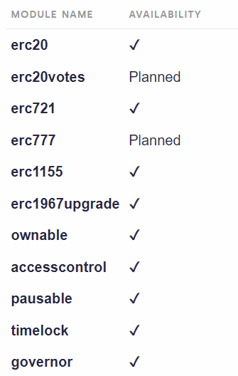

# Subgraphs
OpenZeppelin Subgraphs是用于轻松索引OpenZeppelin合约活动的模块。

可以通过npm安装[@openzeppelin/subgraphs](https://www.npmjs.com/package/@openzeppelin/subgraphs)。

在GitHub上浏览[OpenZeppelin/openzeppelin-subgraphs](https://github.com/OpenZeppelin/openzeppelin-subgraphs)。

## 用法
子图使用三个组件描述：

* **graphql模式**，通常命名为schema.graphql，描述数据库实体和链接。

* **子图清单**，通常命名为subgraph.yaml，描述应监听的活动（合约地址，事件处理程序，函数处理程序）。

* 编写在汇编脚本中的**索引逻辑**，该逻辑将处理区块链活动并相应地更新数据库。

OpenZeppelin Subgraphs提供模式描述，包括相应的索引逻辑和用于构建子图清单的模板。

与OpenZeppelin合约类似，OpenZeppelin子图提供专用于索引相应功能的模块集。这些模块可以组合以索引复杂的链上活动，而无需实际编写大多数功能的索引逻辑。

### 构建清单
你可以使用为每个模块提供的模板构建应用程序的清单。这些模板可在src/datasource/<module-name>.yaml中使用。对于每个数据源，你将需要填写合约的名称、网络、地址和startBlock。如果合约实现了多个模块，则你将希望有多个数据源监听同一个地址（每个模块一个）。

**注意**：为了使索引逻辑工作，你需要为每个使用的模块命名一个数据源，名称与模块名称相同。

@amxx/graphprotocol-utils提供了工具来[自动生成清单](../Automatic-Generation/Automatic-Generation.md)。

### 组装模式
根据你使用的模块，你的模式将必须包括相应的实体。组装模式可能很困难，因为graphql模式不本地支持导入和合并操作。我们为每个模块提供了预编译的模式，可以在generated/<module-name>.schema.graphql中找到。我们还提供了一个包含所有模块的所有实体的模式，可以在generated/all.schema.graphql中找到。

与清单类似，@amxx/graphprotocol-utils提供了工具来*自动生成模式*。

## 模块


## 例子
通过将多个模块和数据源组合在子图中，你可以构建查询，例如检查具有AccessControl的ERC20代币的详细信息，并返回管理员的余额。
```
{
  erc20Contract(id: "<erc20-with-accesscontrol-address-in-lowercase>") {
    name
    symbol
    decimals
    totalSupply { value }
    asAccount {
      asAccessControl {
        admins: roles(where: { role: "0x0000000000000000000000000000000000000000000000000000000000000000" }) {
          members {
            account {
              address: id
              balance: ERC20balances(where: { contract: "<erc20-with-accesscontrol-address-in-lowercase>" }) {
                value
              }
            }
          }
        }
      }
    }
  }
}
```
