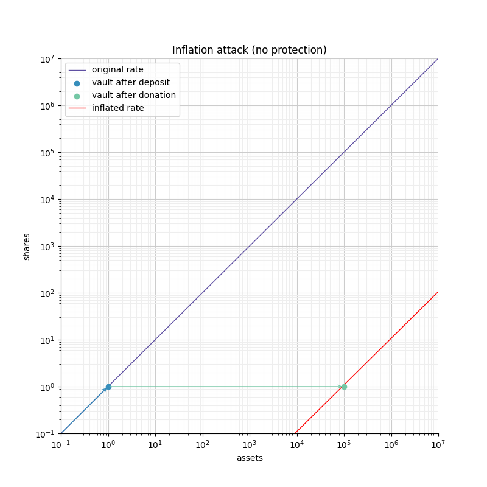
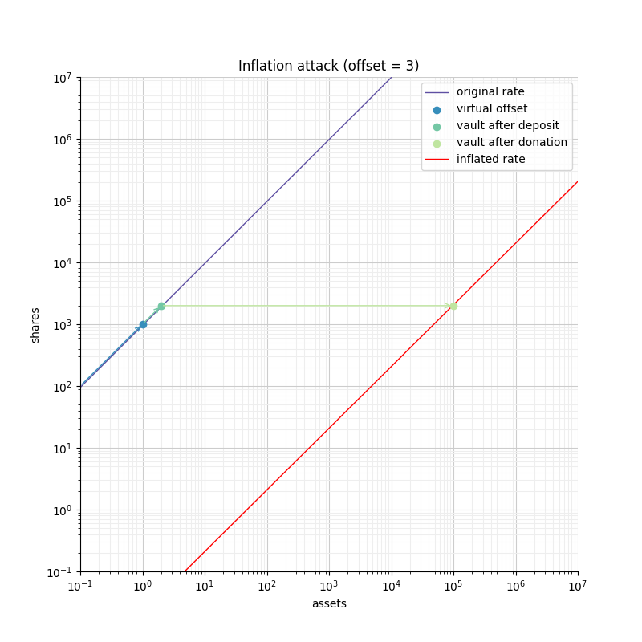
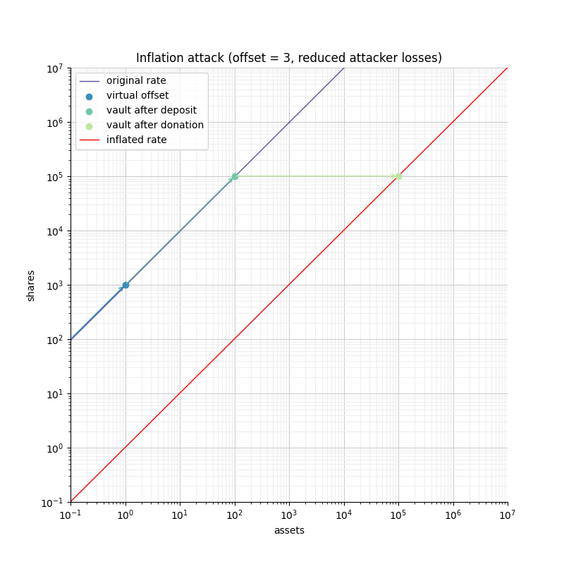
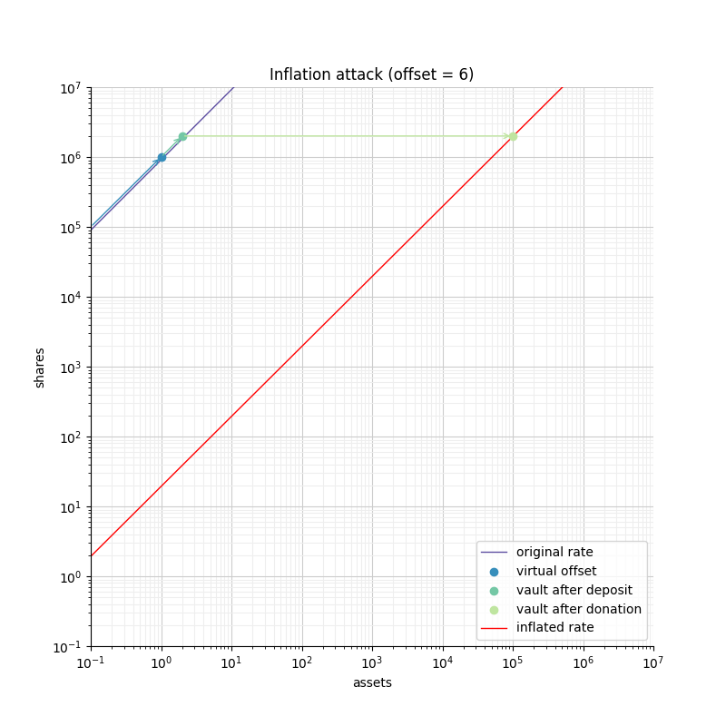

# ERC4626
[ERC4626](https://eips.ethereum.org/EIPS/eip-4626)是[ERC20](../ERC20/ERC20.md)的扩展，提出了一个用于代币保险库的标准接口。这个标准接口可以被不同的合约使用（包括借贷市场、聚合器和固有利息代币），这带来了许多微妙的问题。了解这些潜在问题对于实现符合规范和可组合的代币保险库至关重要。

我们提供了一个基本的ERC4626实现，其中包括一个简单的保险库。这个合约设计的方式使得开发人员可以轻松地重新配置保险库，只需进行最少的重写，同时保持符合规范。在本指南中，我们将讨论一些影响ERC4626的安全考虑因素。我们还将讨论保险库的常见自定义设置。

## 安全问题：通货膨胀攻击

### 可视化保险库
交换ERC4626保险库中存入的资产，用户会得到股份。这些股份可以在以后被销毁，来赎回相应的基础资产。用户获得的股份数量取决于他们存入的资产数量和保险库的汇率。这个汇率由保险库持有的当前流动性定义。

* 如果保险库有100个代币支持200个股份，那么每个股份的价值为0.5个资产。

* 如果保险库有200个代币支持100个股份，那么每个股份的价值为2.0个资产。

换句话说，汇率可以被定义为通过原点和保险库中当前资产和股份数量的直线的斜率。存款和取款会在这条直线上移动保险库。

在线性刻度上的汇率

当在对数-对数刻度上绘制时，汇率的定义方式类似，但显示方式不同（因为点（0,0）是无限远的）。汇率由具有不同偏移量的“对角线”表示。

在对数比例尺上的汇率

在这种表示中，非常不同的汇率可以在同一个图表中清晰可见。这在线性刻度下不是这种情况。

更多在对数刻度上的汇率

### 攻击
存入代币时，用户获得的股份数量会向下取整。这种取整会从用户处取走价值，转移到保险库中（即所有当前股份持有者的利益）。由于涉及的金额很少，这种取整通常是可以忽略的。如果您存入1e9股份的代币，舍入将最多使您损失0.0000001%的存款。但是，如果您存入价值为10股份的代币，则可能损失10%的存款。更糟糕的是，如果您存入少于1股份的代币，则您将获得0股份，基本上是一种捐赠。

对于一定数量的资产来说，您获得的股份越多，您就越安全。如果您想将损失限制在最多1％以下，您需要获得至少100股份。

存入资产

在图中，我们可以看到对于500个资产的存款，我们获得的股份数量和相应的取整损失取决于汇率。如果汇率是橙色曲线的汇率，则我们获得的股份少于1个，因此我们损失100％的存款。但是，如果汇率是绿色曲线的汇率，则我们获得5000个股份，将我们的舍入损失限制在最多0.02％。

铸造股份

相对的，如果我们专注于将损失限制在最多0.5％，则我们需要获得至少200股份。对于绿色汇率，这仅需要20个代币，但对于橙色汇率，这需要200000个代币。

我们可以清楚地看到，蓝色和绿色曲线对应的保险库比黄色和橙色曲线更安全。

通货膨胀攻击的想法是攻击者可以捐赠资产到保险库中，将汇率曲线向右移动，使保险库不安全。

通胀攻击没有保护措施

图6显示了攻击者如何操纵空保险库的汇率。首先，攻击者必须存入少量代币（1个代币），然后直接向保险库捐赠1e5个代币，以将汇率“向右”移动。这将使保险库处于任何存款小于1e5的状态都会完全损失给保险库的状态。鉴于攻击者是唯一的股东（来自他们的捐赠），攻击者将窃取所有存入的代币。

攻击者通常会等待用户进行首次存款，然后使用上述攻击抢先进行操作。风险很低，而操纵保险库所需的“捐赠”金额与被攻击的存款金额相当。

在数学上给出：


对于攻击者来说，为了使用户失去所有押金，将其押金稀释为0股，它必须确保：


将上述结果推广到攻击者针对用户存款的一小部分的情况很容易。为了针对*u/n* 
，用户需要遭受类似比例的舍入，这意味着用户最多只能收到 *n*份股份。这将导致：


在这种情况下，攻击的威力（即窃取的金额）减少了*n*倍，执行成本也减少了*n*倍。在两种情况下，攻击者需要投入的资金与其潜在收益相当。

### 使用虚拟偏移量进行防御
我们提出的防御方法基于[YieldBox](https://github.com/boringcrypto/YieldBox)所采用的方法，它由两部分组成：

* 使用股份和资产表示的“精度”之间的偏移量。换句话说，我们使用更多的小数位来表示股份，而基础代币则使用较少的小数位来表示资产。

* 在汇率计算中包含虚拟股份和虚拟资产。这些虚拟资产在保险库为空时强制执行转换率。

这两个部分共同确保保险库的安全。首先，增加的精度对应着更高的比率，这是更安全的，因为在计算股份数量时减少了舍入误差。其次，虚拟资产和股份（除了简化了很多计算）捕捉到了一部分捐赠，使开发人员难以从攻击中获利。

根据前面的数学定义，我们有：


为了让攻击者将存款稀释为0股，使用户失去所有存款，攻击者必须确保


* 如果偏移量为0，则攻击者的损失至少等于用户的存款。

* 如果偏移量大于0，则攻击者将不得不承受比从用户可能窃取的价值金额大得多的损失。
  
这表明即使偏移量为0，虚拟股份和资产也使得攻击对攻击者来说不具有盈利性。更大的偏移量进一步增加了安全性，使得攻击用户变得非常浪费。

下图显示了偏移量如何影响初始速率，并限制了资金有限的攻击者有效地进行膨胀。











## 自定义行为：向保险库添加费用

在ERC4626保险库中，可以在存款/铸造和/或取款/赎回步骤中收取费用。在这两种情况下，保持符合ERC4626要求的预览功能至关重要。

例如，如果调用deposit(100，receiver)，调用者应该存入包括费用在内的确切的100个基础代币，接收者应该收到与previewDeposit(100)返回值相匹配的股票数量。同样地，previewMint应该考虑用户除股票成本外还需支付的费用。

至于Deposit事件，在EIP规范本身中，这一点不太清楚，但似乎有共识认为它应该包括用户支付的资产数量，包括费用。

另一方面，在提取资产时，用户提供的数字应与他收到的数字相对应。任何费用都应添加到previewWithdraw执行的报价（以股票为单位）中。

Withdraw事件应包括用户燃烧的股票数量（包括费用）和用户实际收到的资产数量（扣除费用后）。

这种设计的后果是，Deposit和Withdraw事件将描述两个汇率。买入价和退出价之间的差距对应于保险库收取的费用。

以下示例描述了如何实现与存款/提款金额成比例的费用：

```
// SPDX-License-Identifier: MIT

pragma solidity ^0.8.0;

import "@openzeppelin/contracts/token/ERC20/extensions/ERC4626.sol";

abstract contract ERC4626Fees is ERC4626 {
    using Math for uint256;

    /** @dev See {IERC4626-previewDeposit}. */
    function previewDeposit(uint256 assets) public view virtual override returns (uint256) {
        uint256 fee = _feeOnTotal(assets, _entryFeeBasePoint());
        return super.previewDeposit(assets - fee);
    }

    /** @dev See {IERC4626-previewMint}. */
    function previewMint(uint256 shares) public view virtual override returns (uint256) {
        uint256 assets = super.previewMint(shares);
        return assets + _feeOnRaw(assets, _entryFeeBasePoint());
    }

    /** @dev See {IERC4626-previewWithdraw}. */
    function previewWithdraw(uint256 assets) public view virtual override returns (uint256) {
        uint256 fee = _feeOnRaw(assets, _exitFeeBasePoint());
        return super.previewWithdraw(assets + fee);
    }

    /** @dev See {IERC4626-previewRedeem}. */
    function previewRedeem(uint256 shares) public view virtual override returns (uint256) {
        uint256 assets = super.previewRedeem(shares);
        return assets - _feeOnTotal(assets, _exitFeeBasePoint());
    }

    /** @dev See {IERC4626-_deposit}. */
    function _deposit(address caller, address receiver, uint256 assets, uint256 shares) internal virtual override {
        uint256 fee = _feeOnTotal(assets, _entryFeeBasePoint());
        address recipient = _entryFeeRecipient();

        super._deposit(caller, receiver, assets, shares);

        if (fee > 0 && recipient != address(this)) {
            SafeERC20.safeTransfer(IERC20(asset()), recipient, fee);
        }
    }

    /** @dev See {IERC4626-_deposit}. */
    function _withdraw(
        address caller,
        address receiver,
        address owner,
        uint256 assets,
        uint256 shares
    ) internal virtual override {
        uint256 fee = _feeOnRaw(assets, _exitFeeBasePoint());
        address recipient = _exitFeeRecipient();

        super._withdraw(caller, receiver, owner, assets, shares);

        if (fee > 0 && recipient != address(this)) {
            SafeERC20.safeTransfer(IERC20(asset()), recipient, fee);
        }
    }

    function _entryFeeBasePoint() internal view virtual returns (uint256) {
        return 0;
    }

    function _entryFeeRecipient() internal view virtual returns (address) {
        return address(0);
    }

    function _exitFeeBasePoint() internal view virtual returns (uint256) {
        return 0;
    }

    function _exitFeeRecipient() internal view virtual returns (address) {
        return address(0);
    }

    function _feeOnRaw(uint256 assets, uint256 feeBasePoint) private pure returns (uint256) {
        return assets.mulDiv(feeBasePoint, 1e5, Math.Rounding.Up);
    }

    function _feeOnTotal(uint256 assets, uint256 feeBasePoint) private pure returns (uint256) {
        return assets.mulDiv(feeBasePoint, feeBasePoint + 1e5, Math.Rounding.Up);
    }
}
```
