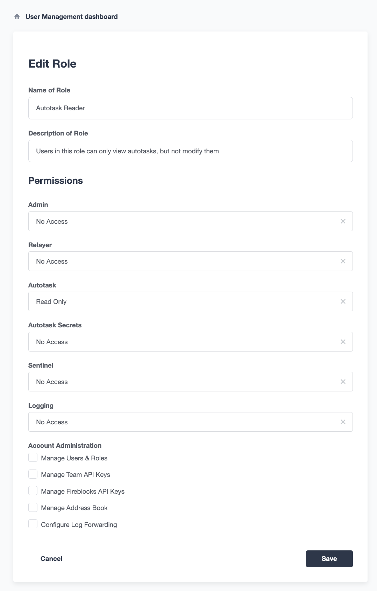
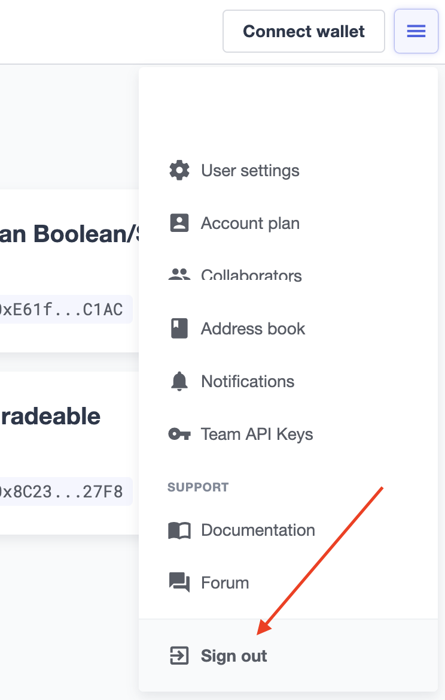
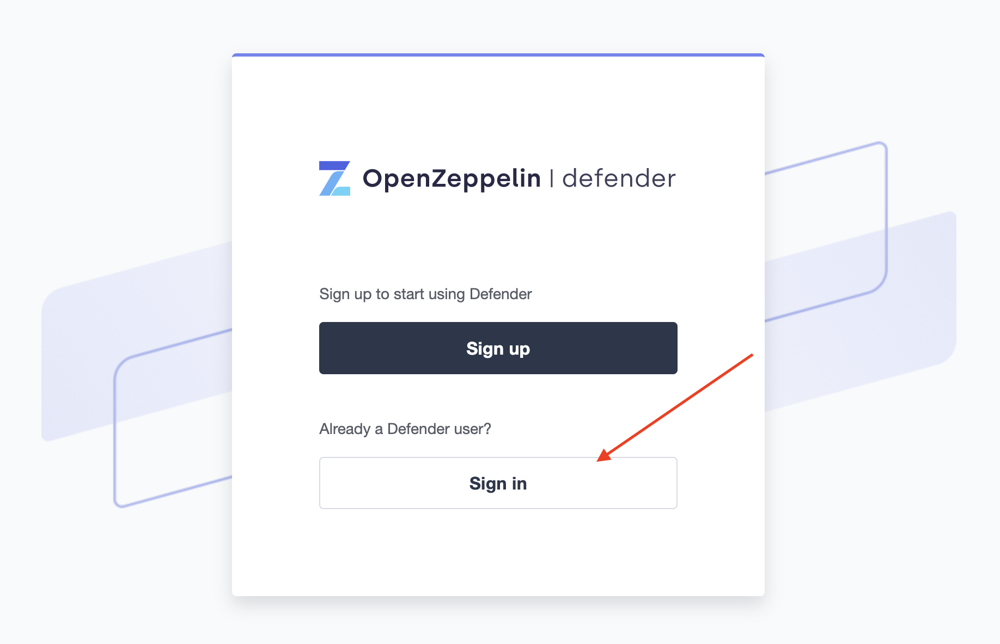
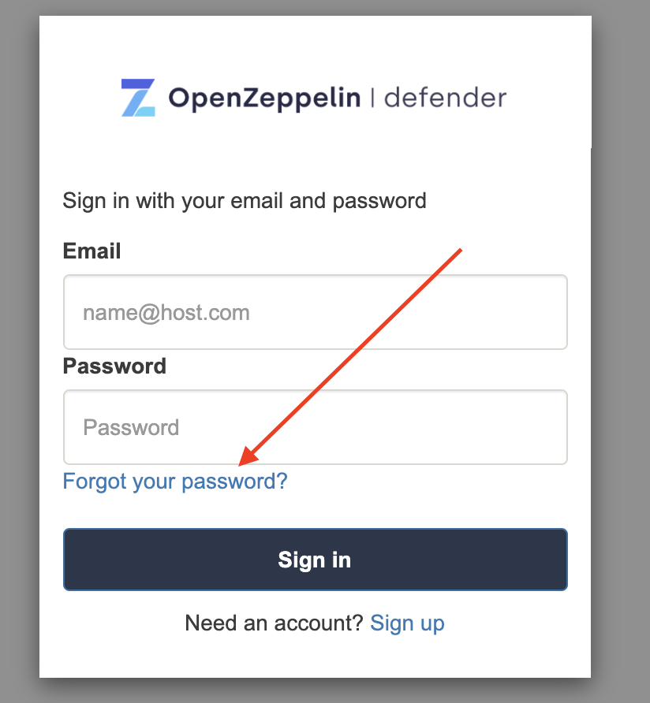
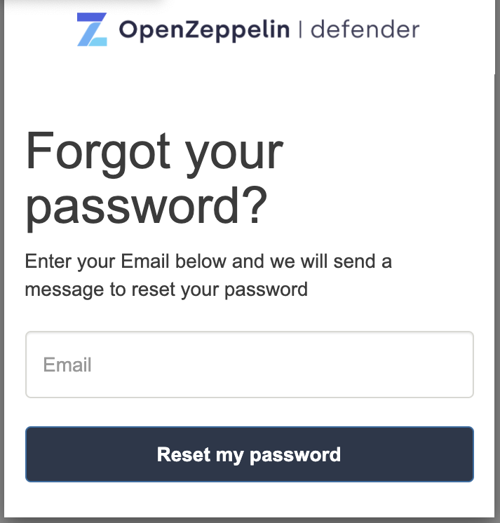

# Account Management

## 用户管理
你可以在应用程序顶部右侧菜单中访问的“用户管理”部分中邀请、管理和删除你Defender账户的团队成员。

> NOTE
如果你想将用户添加到你的团队中，请确保从“用户管理”部分邀请他们。如果他们直接注册应用程序，将被自动添加到自己的新团队中。如果发生这种情况，请考虑让你的团队成员删除他们的账户，这样你就可以重新发送邀请加入你的团队。或者，他们可以使用另一个电子邮件地址加入你的团队。

### 基于角色的访问控制

你可以通过Defender的基于角色的访问控制系统管理授权访问、修改和/或操作你的Defender资源（ Relayer 、Sentinels、自动任务、合约等），你可以从“用户管理”部分操作。

当你邀请新用户加入你的团队时，Defender会要求你为他们分配一个角色，这将确定他们获得的访问权限。如果你想邀请一个新的团队成员拥有对你的Defender团队账户的完全访问权限，你可以选择授予他们所有权限。

> NOTE
拥有所有权限的用户在用户表中被分配内置角色Admin。

要创建一个新角色，请单击角色表中的“创建角色”。你将被要求输入角色名称和描述，并设定该角色的用户对每个Defender子组件的访问级别：管理员、 Relayer 、自动任务、自动任务机密、Sentinels、日志记录。你还可以指定该角色将授予哪些管理权限：团队API密钥管理、Fireblocks API密钥管理、地址簿、日志转发和用户和角色管理。

保存后，新角色将从用户邀请表单中可用，并且你还可以使用它来管理团队中现有用户的访问级别。

自然而然地，如果在将来你决定修改特定角色的访问级别，则所有具有该访问级别的用户将随之看到他们的访问级别发生变化。

> WARNING
在授予管理权限时要小心。拥有修改角色但无权访问任何其他组件的用户可以修改自己的角色以授予他们访问应用程序的任何其他部分的权限。

## 双因素认证（2FA）
我们强烈建议你启用2FA以提高Defender帐户的安全性。作为第二个身份验证因素，Defender[依赖于基于时间的一次性密码标准（TOTP）](https://en.wikipedia.org/wiki/Time-based_One-time_Password_algorithm)。要在Defender上启用2FA，你需要一个TOTP兼容的应用程序，例如[Authy](https://authy.com/)或Google Authenticator。你可以在顶部右侧用户菜单中访问“帐户设置”部分下启用2FA。 Defender将指导你完成必要的步骤。

## 重置密码
要更改Defender用户密码，请按照以下步骤操作。

如果你已登录Defender，请通过打开右上角菜单并单击“退出”来注销。你将被重定向到Defender的启动页面。如果你尚未登录Defender，请跳到下一步。

从Defender的闪屏页面上，点击**“登录”**。你将被重定向到Defender的登录页面。

从Defender的登录页面，点击“忘记密码？”。

输入你的电子邮件地址，然后单击“重置我的密码”。你很快将收到一封电子邮件，其中包含有关如何继续进行密码重置过程的说明。

