# 管理员
Defender Admin服务充当一个接口，通过安全的多签合约或时间锁来管理您的智能合约项目。Defender Admin完全不控制您的系统，您的系统完全由签名者的密钥控制。

##  使用案例
在需要对智能合约进行安全管理的情况下，请使用Defender Admin。任何管理操作都不应由单个所有者单方面控制。相反，设置一个多签名钱包，并依靠Defender Admin通过它运行以下任何操作：

* 升级合约

* 调整影响协议行为的数值参数

* 管理受限操作的访问控制列表

* 在紧急情况下暂停合约

## 合约和提案
要开始在Defender Admin中管理您的合约，第一步是注册它。这是一个一次性的过程，您需要指定网络和地址，并为您的合约分配一个名称。如果合约已经通过etherscan或sourcify进行了验证，合约的ABI将自动获取，否则您需要手动输入它。
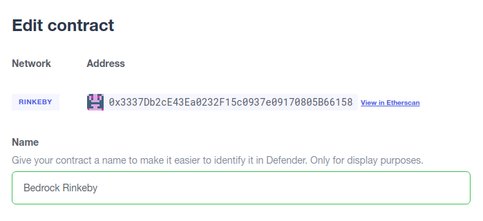

> NOTE
Defender Admin会自动尝试检测您的合约的一些特征。今天，它将检测它是否是兼容[EIP1967](https://eips.ethereum.org/EIPS/eip-1967)或传统的zOS代理（在这种情况下加载实现的ABI），以及它是否由[ProxyAdmin](../../../Upgrades%20Plugins/Frequently%20Asked%20Questions.md)合约管理。如果您已经使用[Sourcify](https://sourcify.dev/)验证了您的合约，您的NatSpec注释将在管理面板中可用。

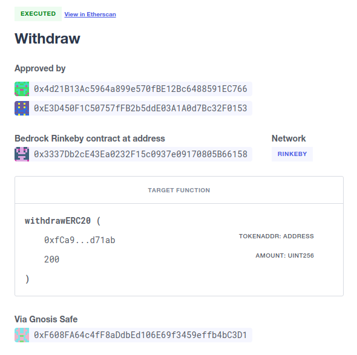

一旦合同被添加，您可以为其创建新的提案。每个提案都是您希望在合约上执行的操作，该操作通过多重签名合约执行，并需要达成一定数量的管理员同意。创建后，其他管理员可以审查和批准提案，直到其达到批准阈值并被执行。

或者，您还可以选择使用管理员直接在合同上执行操作，如果该函数不受多签限制。

> NOTE
在创建新提案时，Defender Admin将首先模拟执行，并且如果该操作回退，它将拒绝创建提案，并显示合同返回的回滚原因。

这是一个视频演示，展示了使用EOA和多重签名来提出和批准管理操作的过程：
https://youtu.be/XJ3UUNYlbxg

## API访问
您可以通过[Defender Admin API](../../API%20Reference/Admin.md)以编程方式向您的Admin仪表板添加合约，并通过该API创建新的提案。请查看[defender-admin-client npm](https://www.npmjs.com/package/defender-admin-client)包以获取更多信息。

## 提案类型
Defender Admin目前支持三种提案类型：升级、暂停和自定义操作。未来将会添加更多的提案类型。

### 升级
升级操作只能在支持 EIP1967 或传统zOS可升级代理的合约上执行，这些代理公开了 upgradeTo(address) 函数。Defender Admin 将直接处理由多重签名钱包直接拥有的代理，或者由ProxyAdmin管理的代理，而 ProxyAdmin 又由钱包拥有。升级操作只需要选择新的实现地址，Defender Admin 就会处理其余的事情。

> WARNING
Defender Admin目前不会验证实现的存储布局兼容性。因此，我们强烈建议使用openzeppelin-upgrades库来[部署目标实现](../../../Upgrades%20Plugins/Overview.md)。可以使用[Truffle](../../../Upgrades%20Plugins/API%20Reference/Truffle%20Upgrades.md)中的prepareUpgrade函数或[Hardhat](../../../Upgrades%20Plugins/API%20Reference/Hardhat%20Upgrades.md)中的defender.proposeUpgrade函数来完成此操作。

### 暂停/恢复
可以在ABI公开了pause()函数的合约上执行暂停操作。如果ABI还公开了unpause()函数，Defender Admin还可以让您执行取消暂停操作。暂停和取消暂停操作仅需要您指定应通过哪个Admin账户执行。

此外，如果您的合约ABI公开了paused()或isPaused()函数，Defender将查询它，并在合约的仪表板页面上显示其状态，如下图所示。
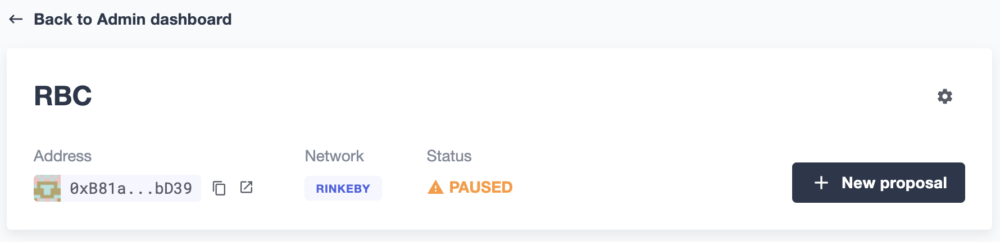

### 访问控制管理
访问控制操作是指符合[OpenZeppelin访问控制](../../../Contracts/Contracts.4.x/Access%20Control.md)的grantRole和revokeRole接口的调用，通过其ABI实现。

Defender提供了创建此类提案的功能，当ABI包含grantRole和revokeRole函数时，您可以使用合约已经索引的角色来填充它们（通过从[TheGraph](https://thegraph.com/)消耗的事件，如果合约的网络受支持，则通过getLogs JSON-RPC调用索引）。

如果您想提供一个未在您的合约中索引的角色，您可以通过给它相应的bytes32来为您的合约提供新的角色。
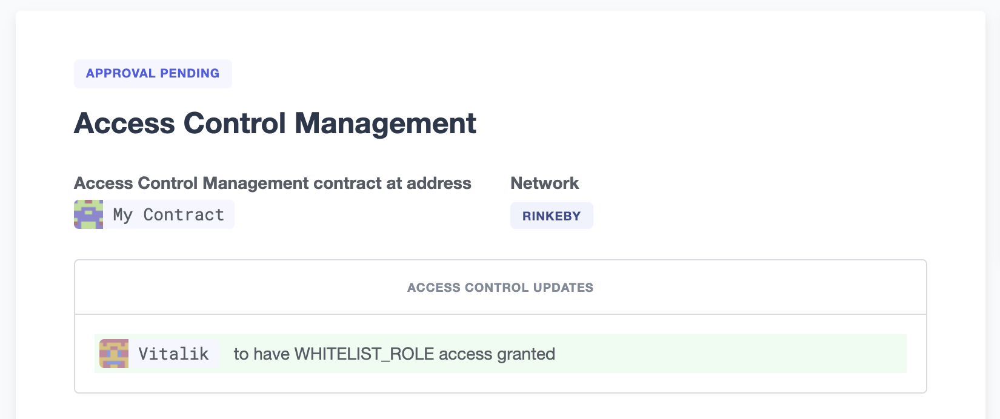

此外，如果检测到合约具有访问控制接口，我们会提供一个小部件，以便轻松地浏览合约角色、管理员和成员。
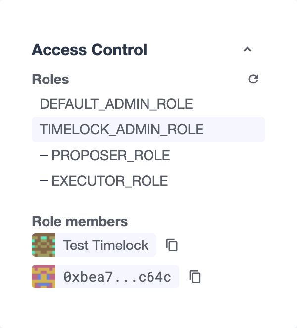

### 定制操作
自定义操作是对托管合约中的任何函数的调用。Defender管理员将处理事务数据的编码，并通过选择的多重签名钱包将其提交为新的提案。

如果未指定多重签名钱包，Defender将直接将交易发送到合约。

自定义操作也可以重复，这将呈现给您一个预填充的表单，以便您在批准之前审查和调整操作。

> WARNING
目前还不支持某些 ABI 类型，例如嵌套结构体。如果您需要调用当前不支持的函数，请联系我们！

### 批处理
批处理提案是对多个合约的多个函数进行调用（或仅一个合约）。它允许您在单个交易中原子地执行多个操作。

> NOTE
目前仅支持使用多重签名（例如Gnosis Safe）进行批量交易，通过对[Gnosis MultiSendCallOnly模块](https://github.com/safe-global/safe-contracts/blob/v1.3.0/contracts/libraries/MultiSendCallOnly.sol)进行DELEGATECALL编码来实现。

> NOTE
批量交易也需要在同一网络上进行。

Defender通过在主仪表板上点击“添加提案”选项来提供此功能，通过管理员UI实现。
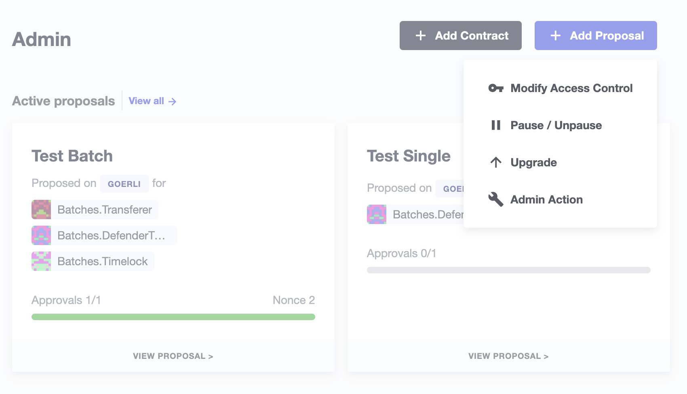

通过使用此提案创建工作流程，您可以在定义第一步之后添加新步骤，然后再创建提案。例如，您可以添加“修改访问控制”步骤，然后添加另一个步骤来调用自定义操作。这将显示在提案创建审核页面中，并在创建之前作为一个整体进行验证。
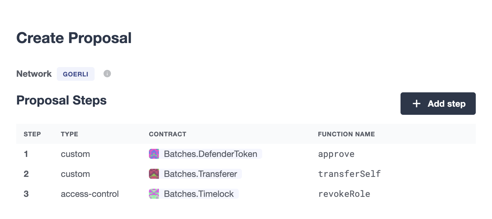

> NOTE
目前仅支持访问控制管理和自定义操作。

## 多重签名钱包
Defender Admin支持两种多签钱包：[Gnosis Safe](https://gnosis-safe.io/)和[Gnosis MultisigWallet](https://github.com/gnosis/MultiSigWallet)。如果您使用的多签实现不受支持，请告诉我们！

### Gnosis Safe
Gnosis Safe钱包收集每个管理员的离线签名，然后提交一个包含所有签名的单个交易来执行操作。为了分享签名，它依赖于由Gnosis托管的[Safe Transaction Service](https://safe-transaction.gnosis.io/)。

> NOTE
Safe Transaction Service仅在Mainnet、xDai、BSC、Polygon、Avalanche、Aurora、Optimism、Arbitrum、Goerli和Sepolia上可用。但是，您可以在任何网络上使用Defender Admin；如果该服务不可用，它将跳过与事务服务的同步。

使用Gnosis Safe时，Defender Admin将同步所有签名到和从Safe Transaction Service。这样，您团队中使用[Safe UI](https://gnosis-safe.io/app)的任何管理员仍然可以对Defender Admin提案进行签名。

> NOTE
Safe合约要求所有提案必须按顺序执行。如果你已经收集了所有提案的签名，但仍无法执行它，请确保没有先前的提案等待执行。

Gnosis Safe钱包还允许执行DELEGATECALL到其他合约中，以在多签上下文中执行任意代码。您可以使用“defender-admin-client”通过API创建一个Admin action提案来发出委托调用。

### 发送资金

Gnosis Safe钱包上的发送资金功能可以让您将网络原生资产从您的Gnosis Safe转移到您选择的接收者。

要使用此功能，您需要将Gnosis Safe钱包添加到Defender Admin合约集合中。在Admin中转到您的Gnosis Safe页面，点击New proposal→Send funds。然后选择收件人地址和要转移的资金金额。从那时起，它就像任何其他管理提案一样运作：您需要从足够的Gnosis Safe所有者那里收集批准才能执行交易。Defender会指导您完成该过程。

> NOTE
如果您最初从Defender部署了您的Gnosis Safe，则已在Defender Admin合约列表中的Multisigs部分中。

我们正在努力扩展此功能，使其能够发送ERC20代币资金，请保持关注。

### Gnosis多签钱包

Gnosis MultisigWallet要求每个管理员提交新的交易以获得他们的批准，因此无需单独的服务来协调。

除了普通的MultisigWallet外，Defender Admin还支持dYdX开发的[PartiallyDelayedMultisig变体](https://gist.github.com/spalladino/1e853ce79254b9aea70c8b49fd7d9ab3#file-partiallydelayedmultisig-sol)。在这个钱包中，一旦提案获得批准，就需要等待一段时间锁定期才能执行。Defender Admin会从合约中加载这些信息并在界面上显示。

### 从Defender Admin管理您的多重签名

使用Defender创建Gnosis Safe多重签名
https://youtu.be/IOescPDrF7Y
您可以直接从Defender创建和部署新的Gnosis Safe多重签名钱包。这在官方Gnosis Safe UI尚未可用的网络中特别方便。要创建新的Gnosis Safe，请转到“管理”并单击“合约”，然后单击“创建Gnosis Safe”。您将进入一个简单的表单，要求您提供多重签名的初始所有者列表和门槛。就是这样！

### 从Defender修改您的多重签名设置
您可以通过创建自定义操作提案来修改您的多重签名设置，以执行管理函数addOwner或changeThreshold，就像您导入Defender中的任何其他合约一样。
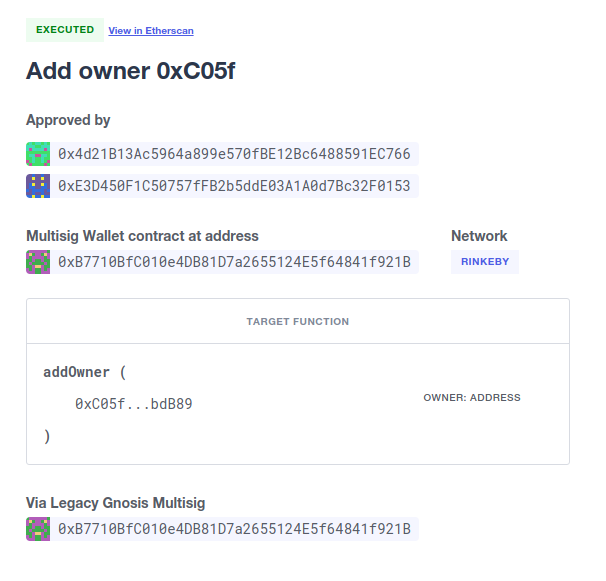

## 时间锁
从Defender创建一个时间锁控制器
https://youtu.be/Yi9Y0bcj-Zc
您可以直接从Defender创建和部署新的Timelock Controller。要创建新的Timelock，请转到“管理”并单击“合约”，然后单击“创建Timelock”。您将进入一个简单的表格，在那里您将被要求提供最初的提议者和执行者列表，以及提议执行的最小延迟时间。

为了在etherscan上验证合约，您可以在下面找到源代码和编译器设置：

部署使用OpenZeppelin Contracts库提供的[TimelockController合约v4.8.1的原始实例](https://github.com/OpenZeppelin/openzeppelin-contracts/blob/v4.8.1/contracts/governance/TimelockController.sol)。

部署合约的编译器设置：
```
solidity: {
    version: "0.8.4",
    settings: {
        optimizer: {
            enabled: true,
            runs: 200
        }
    }
}
```

### 将合约所有权转移给TimelockController
为了利用时间锁执行函数，需要将其分配访问权限到相应的智能合约，可以通过角色或所有权来实现。可以通过调用transferOwnership或相*关角色*分配函数来完成。
https://youtu.be/cXDp2n5al7U

### 创建时间锁定提案
Defender Admin支持通过OpenZeppelin Contracts库提供的*TimelockController合约进行时间锁定的管理提案*。
https://youtu.be/59p98wGqdVo
要执行一个时间锁定的提案，您需要：

1. 一个多重签名（或EOA），作为TimelockController中的提案人。

2. 一个具有您想在合约上运行的操作权限的TimelockController。

一旦权限得到适当的设置，只需像平常一样创建一个提案，在执行策略部分勾选Timelock复选框。然后输入您的timelock地址，并选择批准提案和执行之间的最小延迟时间。
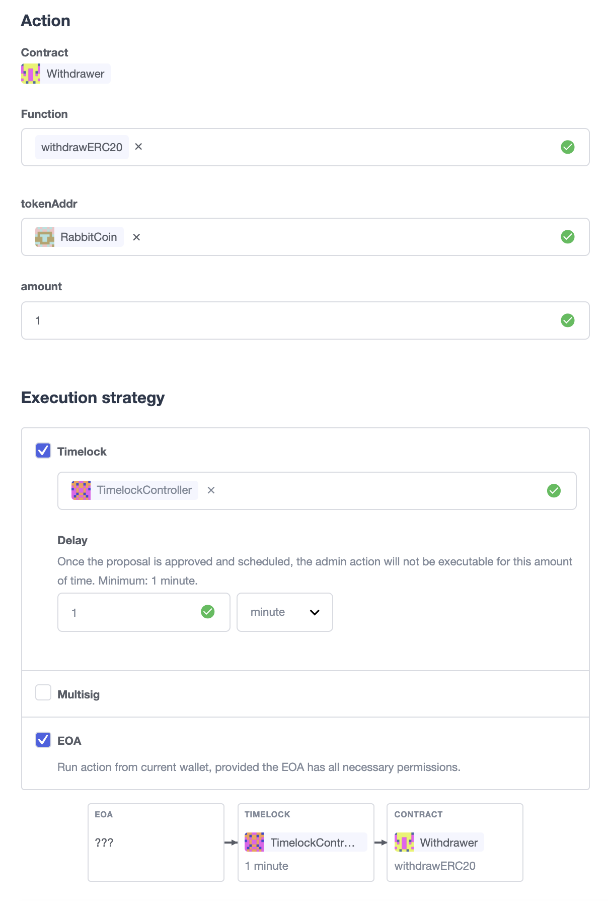

请注意，无论是通过多重签名还是EOA（外部账户）批准，您都可以创建一个时间锁定的提案。只要正确的链上权限结构得到设置，任何批准政策都应该可以运作。
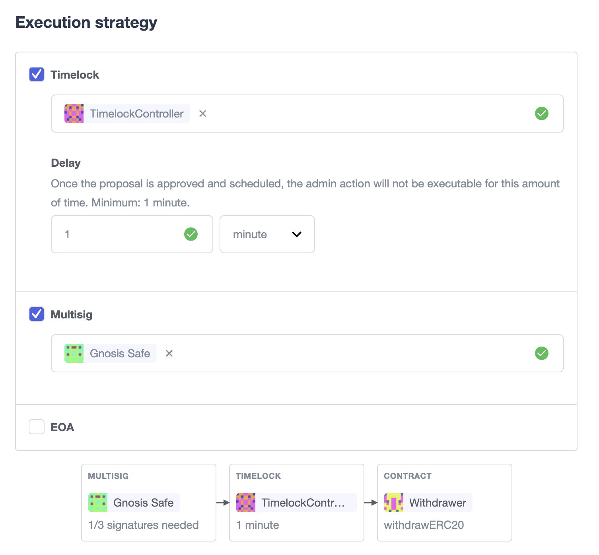

### 管理时间锁定的提案
一旦您创建了一个时间锁定的提案，Defender将指导您和您的合作者完成它。假设您选择通过Gnosis Safe批准提案，从提案创建到基础管理操作执行的步骤如下：

1. 收集足够的多签所有者批准（根据多签的当前配置）。

2. 安排行动，具有指定的延迟期。请注意，使用的多签需要是TimelockController合约中的提议者。在此阅读更多信息。

3. 在指定的延迟期结束后执行操作。值得注意的是，在TimelockController合约中执行此操作的EOA需要是执行者。

> NOTE
目前Defender不支持定时锁定的升级提案。这项能力正在开发中，我们计划很快发布它。

https://youtu.be/z6EP6JTj7ME

## 治理
您还可以将Admin提案的控制委托给Governor合约。要创建Governor提案，只需将执行策略设置为Governor，并输入有效的Governor合约地址。Defender将执行基本检查以验证合约是否实际符合Governor接口，然后才会让您继续进行。

Defender Admin支持在OpenZeppelin的Governor合约以及Compound的Alpha和Bravo方言上创建提案。
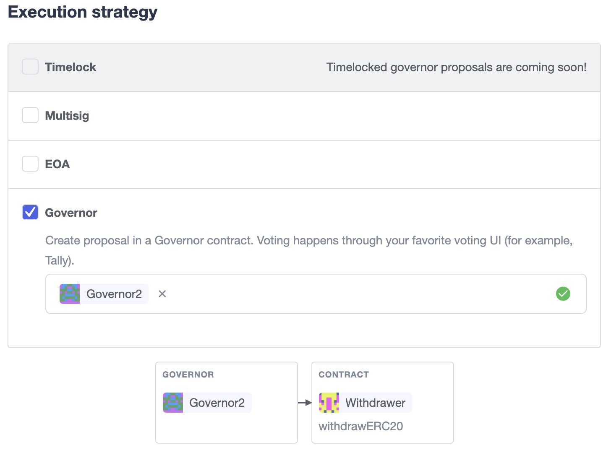

一旦您输入了这些详细信息，Defender将允许您将提案发送到Governor合约。
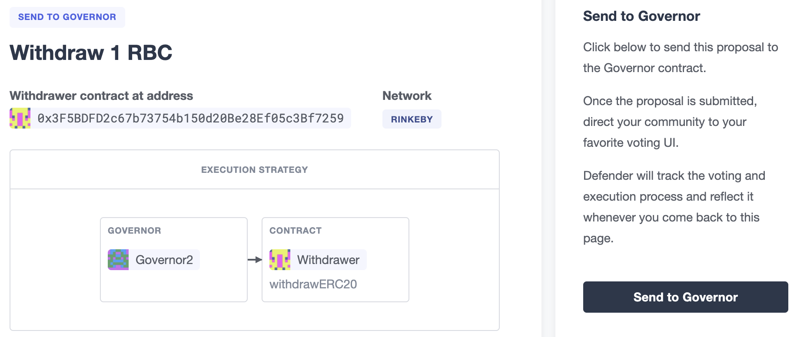

从那时起，您的社区可以使用任何兼容Governor的投票DApp（例如[Tally](https://www.withtally.com/)）。 Defender将跟踪每次打开提案的状态。
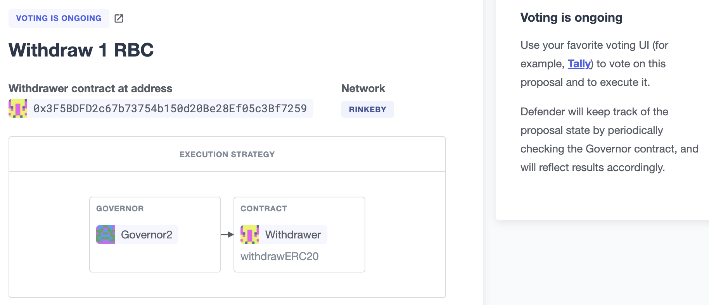

## Relayer
您还可以使用其中一个中继器执行提案交易，这样您就无需连接钱包或签署交易即可在合约上执行操作。一个例子是将特权角色（如暂停器）授予您的中继器，这样在Defender中具有中继器访问权限的任何人都可以暂停合约，而无需访问metamask中的任何私钥。

要执行此操作，只需将执行策略设置为Relayer并选择有效的中继器。Defender将执行基本检查以确保中继器能够执行提案，然后才会让您继续。
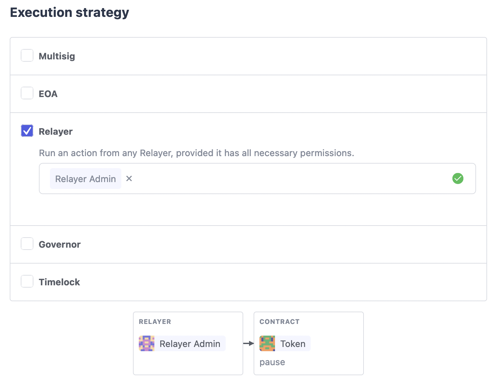

一旦您创建了提案，您将能够使用您的Relayer执行它，而无需连接任何钱包。
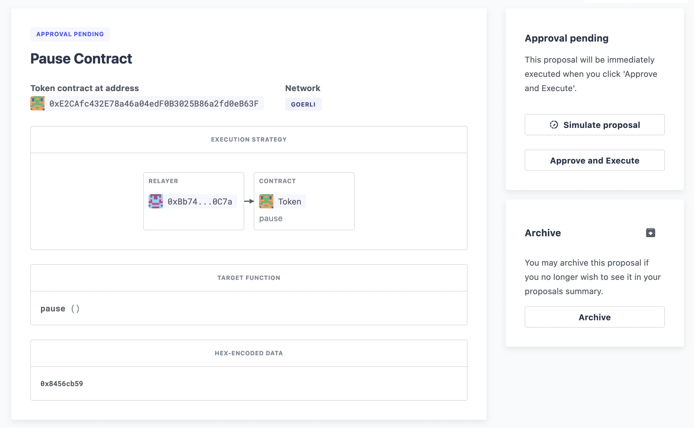

## Fireblocks
您还可以直接从Defender向Fireblocks提交交易。[Fireblocks](https://www.fireblocks.com/)是一个资产管理解决方案，利用多方计算来保护所有财务操作。

要使用此功能，您首先需要生成证书签名请求（CSR）文件。
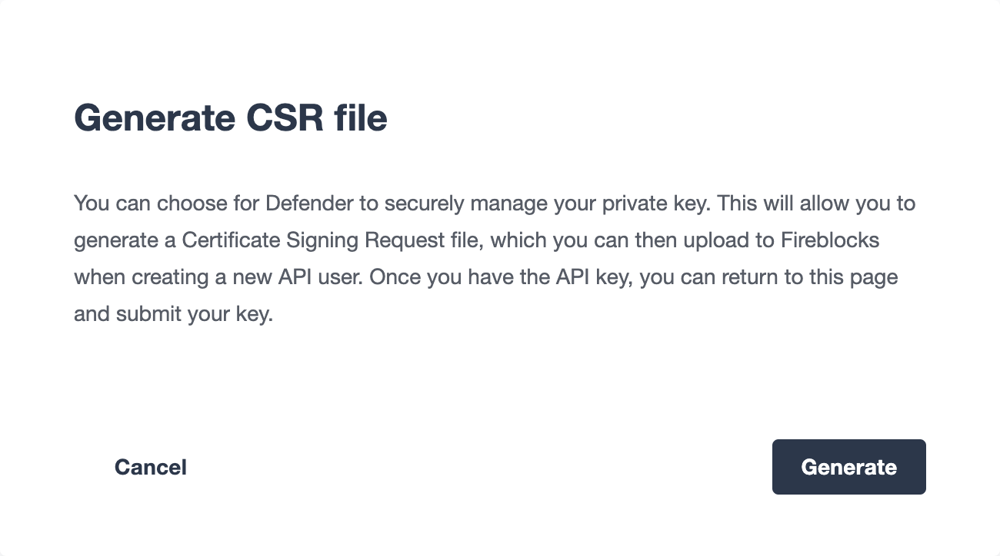
这将触发Defender生成公钥/私钥对。然后生成CSR，并用私钥签名并安全地存储以防止泄露。

接下来，在创建新的API用户时，您需要在Fireblocks UI中导入CSR。请注意，API用户将需要任何至少可以启动交易的角色，例如签名者。
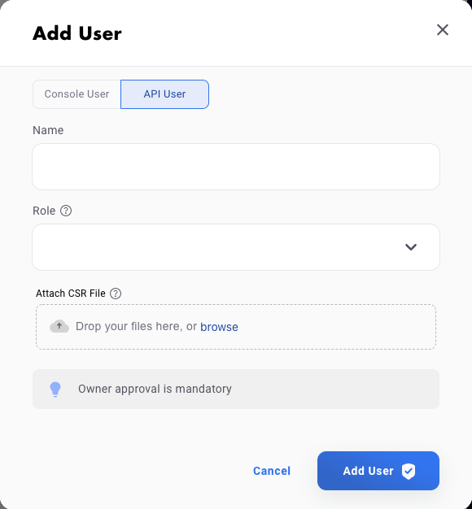
一旦API用户已经被Fireblocks工作区所有者创建并批准，复制Fireblocks API密钥并导航到Fireblocks API密钥页面。您应该会看到一个不完整的API密钥设置，您可以编辑并使用Fireblocks API密钥完成它。请注意，除非您完成设置或删除以前不完整的设置，否则您将无法生成新的CSR文件。
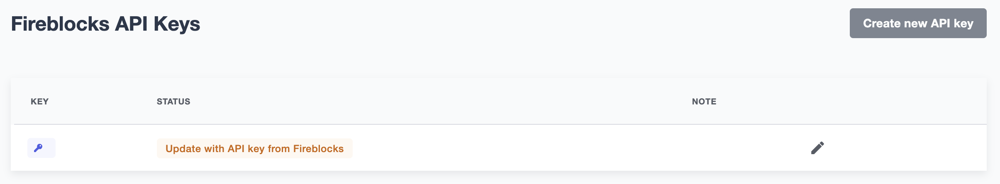
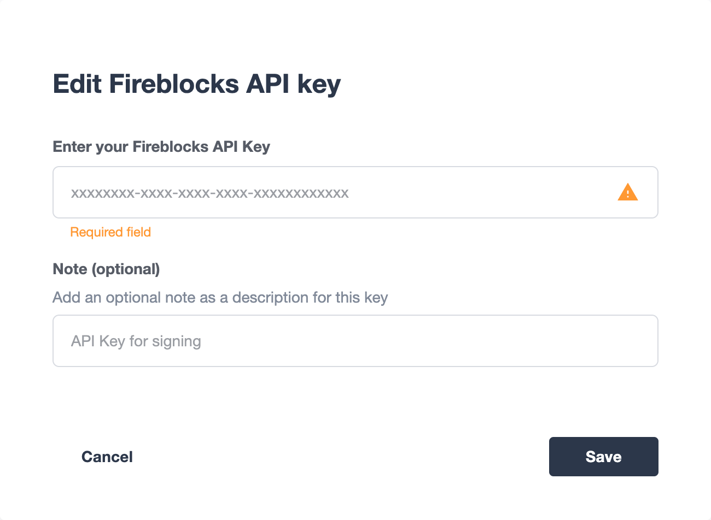

要通过Defender向Fireblocks提交交易，请确保在Fireblocks中设置了正确的权限，例如相关的白名单地址和交易访问策略（TAP）。例如，您可能需要将您希望与之交互的合约地址加入白名单，同时确保新创建的API用户被允许与定义在TAP中的相关账户和保险库进行交互。
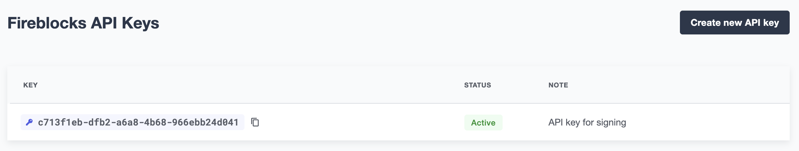
一旦配置完成，您将能够通过提议提交交易。选择Fireblocks作为执行策略，API密钥和您希望从中启动交易的保险库。提交后，Defender将跟踪交易的状态。请注意，Defender不允许您在UI上批准或拒绝交易。这将需要Fireblocks移动应用程序或控制台。
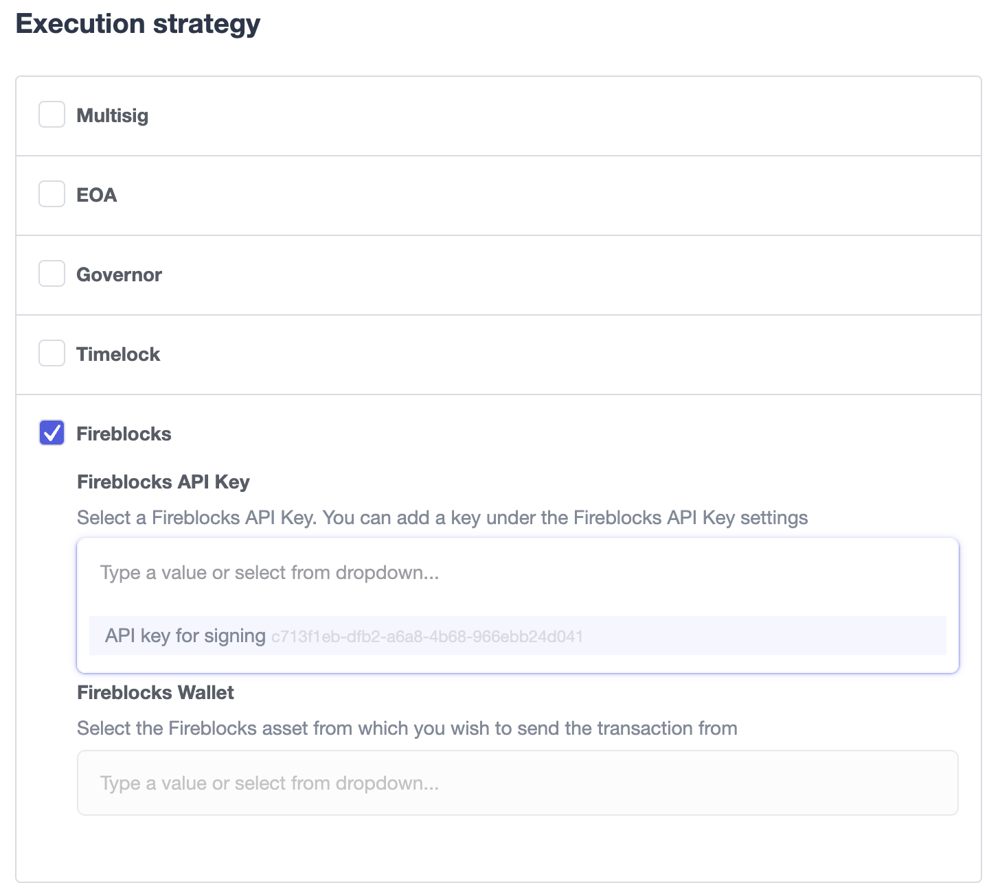

## 钱包
今天在Defender Admin中的所有批准都通过Metamask处理。Defender Admin还通过[Metamask支持硬件钱包](https://metamask.zendesk.com/hc/en-us/articles/360020394612-How-to-connect-a-Trezor-or-Ledger-Hardware-Wallet)。到目前为止，我们已经测试了与[Ledger Nano](https://www.ledger.com/)的支持。如果您想使用不同的钱包（软件或硬件）与Defender配合使用，请联系我们。

## 地址簿
您团队的所有成员都可以共享一个地址簿，您可以在其中为您的账户或合约定义用户友好的名称。您可以在 Defender 中任何看到地址的地方单击它来设置这些名称，或者您可以在右上角用户菜单中的相应部分管理您的整个地址簿。当您将新合约导入 Admin 时，Defender 也会自动为您创建地址簿条目。
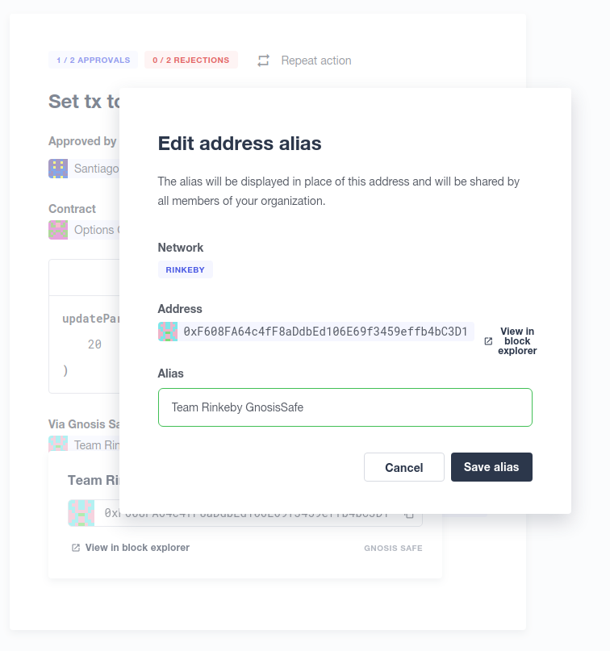

Defender还将在需要输入地址时从通讯录中获取信息，因此您可以轻松地从通讯录中获取地址以创建新的提案或发送交易。
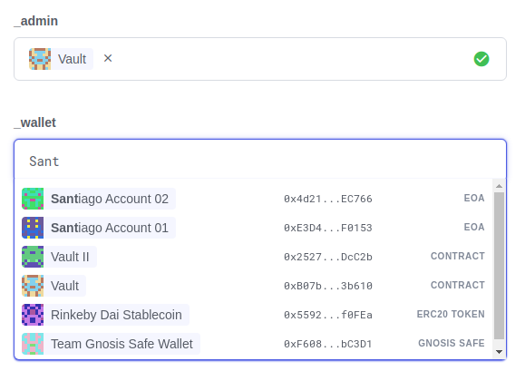

## 模拟和影响
Defender可以模拟与任何待处理提案相关的交易，因此您可以在批准提案之前审查执行提案的影响。该交易被模拟，就像在最近的已确定块上运行一样，确认数取决于网络，并直接从执行合约（通常是多签）发送到接收方。模拟使用Hardhat分叉作为动力，并存储供其他团队成员审查。

模拟将显示：

* ERC20代币转移

* 在交易中发出的事件

* 所有涉及到的合约的存储更改

* 所有涉及到的合约的公共getter的更改
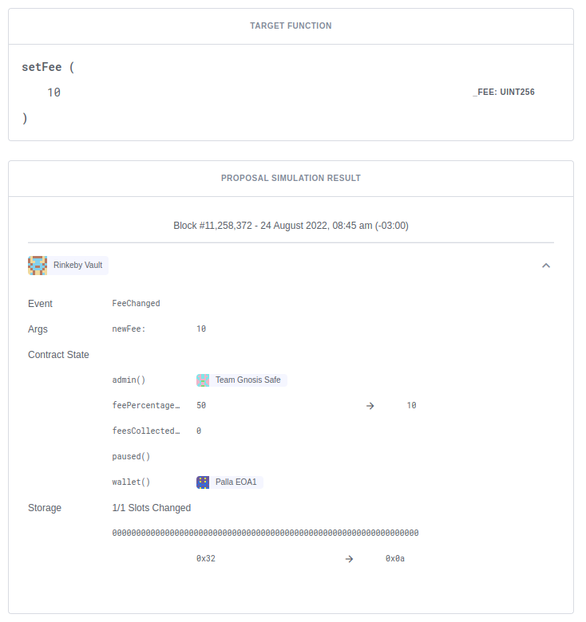

> NOTE
模拟每个团队每小时限制为六次。如果您需要更高的配额，请与我们联系。

### 执行的提案影响
此外，一旦提案被执行，Defender将显示其交易中所有ERC20代币转移和事件，包括执行合约（例如Gnosis Safe）发出的事件（例如ExecutionSuccess）。请注意，存储和状态更改将不可见，但您可以在公共区块浏览器（例如Etherscan）上查看这些更改。

## 已部署合约的字节码验证
您可以让Defender检查合约的字节码编译产物是否与特定地址上部署的字节码相匹配。这个验证结果会被存储在Defender的地址簿中，这样您团队中的任何人都可以检查一个合约是否与编译产物相匹配。您可以依靠这个功能来实现合约的可审计部署和升级。

> NOTE
目前，这个 Defender 功能只支持 Hardhat 编译产物。如果你有兴趣使用这个功能，但是你使用的是不同的工具链，请告诉我们。

### 验证升级提案的新实施方案。
您可以通过Defender的用户界面或编程方式验证升级提案的新实现。

要从用户界面验证，请导航到升级提案。您将看到一个On-chain bytecode verification status部分。当Defender没有关于所提出的新实现的字节码的任何信息时，此部分如下图所示。
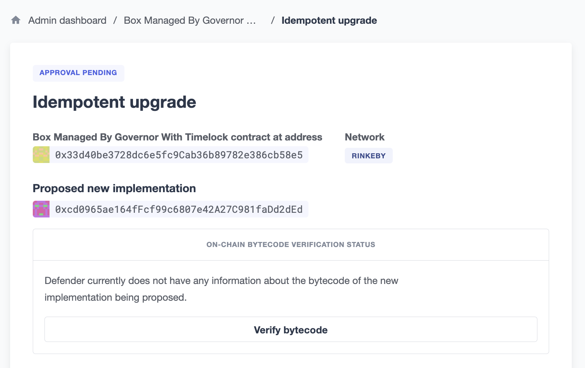

然后，您可以单击“验证字节码”，将Defender指向与新实现的部署字节码匹配的编译成果。
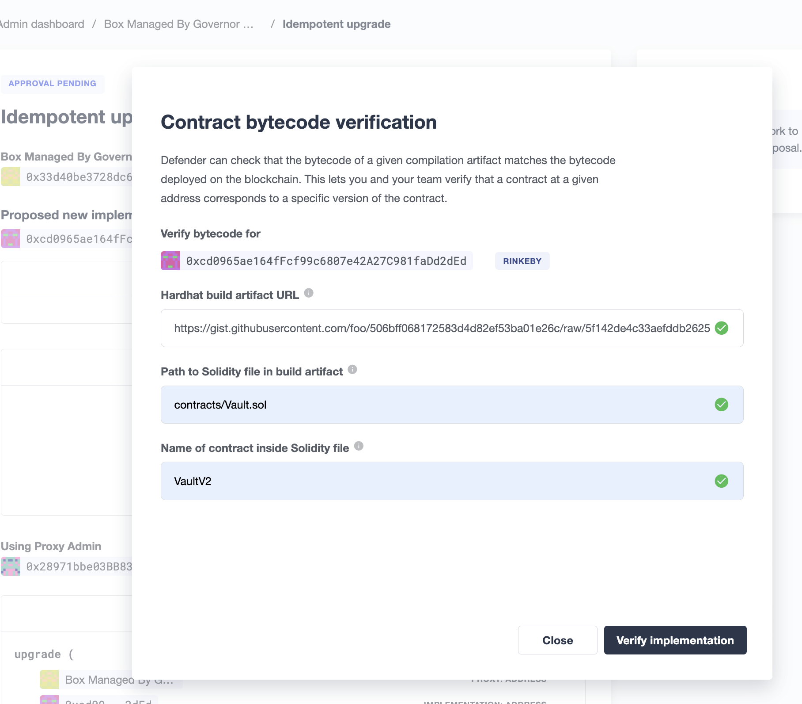

Defender将要求您提供三个信息以继续验证过程：

* **Hardhat构建工件URL**：一个公开可访问的URL，指向Hardhat构建输出文件。Defender将提取新实现的字节码，并将其与新实现地址上链上找到的字节码进行匹配。

* **构建工件中Solidity文件的路径**：某些构建工件格式包含多个合约的多个编译输出。此路径告诉Defender在哪里查找定义要验证的合约的.sol文件。

* **Solidity文件中的合约名称**：由于Solidity文件可以包含多个合约声明，因此我们要求您指示哪个合约对应于要验证的实现。

单击“验证实现”后，Defender将从您提供的URL中提取工件并尝试将其与部署在新实现地址的字节码进行匹配。

这可能会产生以下四种结果之一：

* **Defender无法处理您的验证请求。**例如，如果您提供的编译工件URL不是公开可访问的，或者工件格式当前不受支持，就可能发生这种情况。

* **Defender验证编译工件与部署的字节码完全匹配。**

* **Defender验证编译工件与部署的字节码部分匹配。**这通常意味着字节码匹配，除了元数据哈希之外，这通常意味着编译工件和部署的字节码在功能上是等效的，但在理论上它们可能在注释或变量名称等方面不同。实际上，源代码中可能隐藏着有副作用的指令，因此对具有此验证结果的合约进行额外的评估。值得注意的是，由于Solidity编译器的内部原因，根据合约的不同，可能无法获得完全匹配。在这种情况下，部分匹配是我们可以接近字节码验证的最佳方式。

* **Defender可以处理您的验证请求，但发现编译工件和部署的字节码不匹配，甚至不部分匹配。**在这种情况下，升级提案的签署者不应批准该提案。

下面是一个完全匹配的示例。
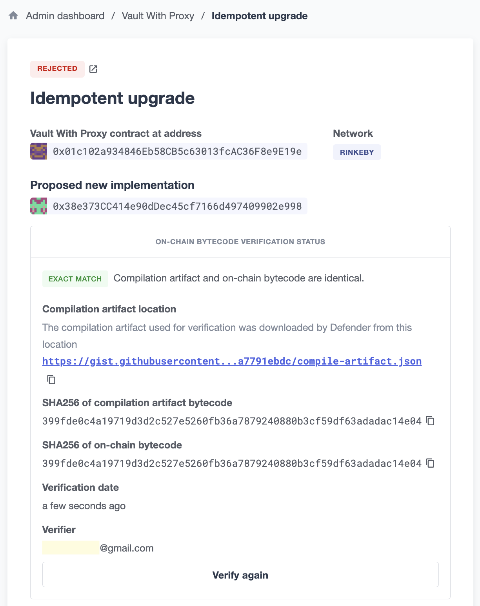

为了进行程序验证，我们强烈建议使用hardhat-defender插件。但是，您也可以使用defender-client包（请参见此处的验证示例），或直接与原始REST API进行交互。这些组件相互构建，因此最终所有功能都可通过任何一个组件使用。我们仍然建议您使用hardhat-defender插件以获得最流畅的体验。

### 验证任何合约
虽然我们预计大多数Defender用户将使用此功能来帮助确保其升级工作流程的安全性，但值得注意的是，无论是否是可升级实现，验证功能都可用于任何合约。

在这种情况下，验证的UI可以在Defender中悬停任何合约地址并单击“验证”来找到。


同样地，您也可以使用defender-admin-client客户端库或@openzeppelin/hardhat-defender插件来触发任何合约的程序验证。已验证的合约不需要参与升级。

## 安全考虑
Defender Admin 仅作为您的合约和多重签名钱包的接口。这意味着使用 Admin 管理合约时，您不会授予 Defender 任何对您的合约的权利。所有提案批准都是通过 Metamask 使用管理员用户私钥在客户端签名的。Defender Admin 后端仅涉及存储提案元数据和共享批准签名，当这些签名未存储在链上时。最终，多重签名钱包合约会验证这些批准并执行所提议的操作。

Defender Admin 对安全性的主要贡献与可用性有关。首先，它自动化了提案交易的制作过程，避免了手动错误。其次，它提供了一个清晰的界面，可以在不必手动解码提案十六进制数据的情况下查看提案。

## Hedera支持
在Hedera网络上，目前Defender Admin只支持测试网。要使用此功能，请通过*defender@openzeppelin.com*与我们联系。

我们目前正在测试治理执行策略和可升级合约管理，它们还未在Admin模块上可用，但很快就会推出。