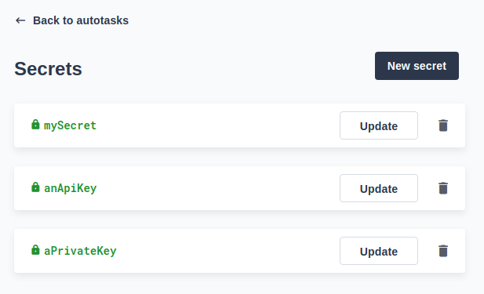
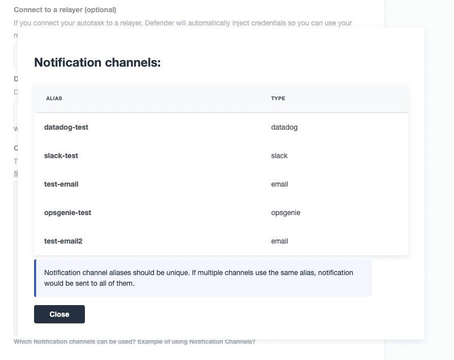

# Autotasks
Defender Autotasks服务允许您定期运行代码片段，通过Webhooks或响应事件。由于与[Relay](../Relay/Relay.md)和[Sentinels](../Sentinel/Sentinel.md)的紧密集成，您可以使用Autotasks通过轻松发送交易或对合约事件做出反应来自动化定期操作。

## 使用案例
在您需要定期运行的合约操作时，请使用Autotasks。由于您可以运行任意代码片段，因此可以触发任何所需的交易，检查任何所需的条件，并从任何外部API中收集信息。

* 检查合约余额，并在达到阈值时将**资金转移到钱包**中

* 使用外部API的信息**更新链上oracle**

* **监视您的合约**以验证其状态或检查离线数据源是否同步

* 在满足一组条件后，触发合约以使其**转换到新状态**

* 通过Webhooks与**外部第三方服务**集成

* 通过**元交易**为您的Dapp用户提供无需燃气费的交易

## Autotask中有什么?
简而言之，Autotask是一段JavaScript代码片段，类似于无服务器函数，会定期调用，实际上它们是使用[Lambda函数](https://aws.amazon.com/lambda/)实现的。

创建Autotask时，您提供JavaScript代码片段，选择触发器运行它，并可选择将其链接到_Relayer _。Defender目前支持两种触发器：

* **Schedule**：选择执行Autotask的频率，Defender将确保在指定的间隔内调用您的函数。请注意，指定的间隔是两个连续执行开始之间的间隔，而不是一个Autotask结束和下一个Autotask开始之间的间隔。或者，您可以使用[cron表达式](https://crontab.cronhub.io/)指定Autotask应该运行的时间。

* **Webhook**：Defender将为您的Autotask创建一个 secrets URL，并在将HTTP请求POST到该端点时调用它。您可以随时重新生成此URL。Defender将HTTP请求信息注入到您的Autotask中，并返回Autotask运行信息以及您从代码中返回的任何数据。

* **Sentinel**：使用Sentinel触发器的Autotask不能按计划或使用 secrets URL执行。它们只能从Sentinel或手动操作执行。

> NOTE
如果您在Webhook HTTP请求的响应中收到{"message":"Missing Authentication Token"}，请仔细检查您的请求是否实际上是POST。当发出GET请求时，您通常会看到{"message":"Missing Authentication Token"}响应。

Autotask也可以从UI手动执行以进行快速测试。 Autotask视图中将显示最后30个Autotask运行，允许您访问运行日志（通过console.log生成）进行故障排除。此外，当Autotask失败时，Defender将向您发送通知电子邮件。

> NOTE
请访问[OpenZeppelin/defender-autotask-examples存储库](https://github.com/OpenZeppelin/defender-autotask-examples/)，以获取现成的Autotask示例的快速入门！

### 处理程序函数
代码片段必须导出一个处理程序异步函数，该函数将在每次执行Autotask时调用。鉴于每个Autotask都由AWS Lambda在后台支持，因此在[处理全局变量](https://docs.aws.amazon.com/lambda/latest/dg/runtimes-context.html)时应遵循相同的规则。
```
exports.handler = async function(event) {
  // Your code here
}
```

### Relayer 集成
如果您将Autotask连接到Relayer ，那么Defender将自动注入临时凭据来从Autotask访问您的Relayer 。只需将事件对象传递到Relayer 客户端，而不是凭据即可：
```
const { Relayer  } = require('defender-relay-client');

exports.handler = async function(event) {
  const Relayer  = new Relayer (event);
  // Use Relayer  for sending txs or querying the network...
}
```
这使您可以在不设置任何API密钥或密码的情况下，从您的自动任务中使用Relayer 发送交易。此外，您还可以使用Relayer  JSON RPC端点查询任何以太坊网络，而无需为外部网络提供程序配置API密钥。

如果您想[使用ethers.js](https://www.npmjs.com/package/defender-relay-client#ethersjs)通过您的Relayer 进行查询或发送交易，请更改上述内容为：
```
const { DefenderRelaySigner, DefenderRelayProvider } = require('defender-relay-client/lib/ethers');
const ethers = require('ethers');

exports.handler = async function(event) {
  const provider = new DefenderRelayProvider(event);
  const signer = new DefenderRelaySigner(event, provider, { speed: 'fast' });
  // Use provider and signer for querying or sending txs from ethers, for example...
  const contract = new ethers.Contract(ADDRESS, ABI, signer);
  await contract.ping();
}
```

如果您更喜欢[使用web3.js](https://www.npmjs.com/package/defender-relay-client#web3js)，则使用以下代码片段：
```
const { DefenderRelayProvider } = require('defender-relay-client/lib/web3');
const Web3 = require('web3');

exports.handler = async function(event) {
  const provider = new DefenderRelayProvider(event, { speed: 'fast' });
  const web3 = new Web3(provider);
  // Use web3 instance for querying or sending txs, for example...
  const [from] = await web3.eth.getAccounts();
  const contract = new web3.eth.Contract(ABI, ADDRESS, { from });
  await contract.methods.ping().send();
}
```

### Webhook调用
当通过 Webhook 调用您的 Autotask 时，您可以在处理程序中访问 HTTP 请求信息作为事件参数的一部分。同样，您的返回值将包含在 HTTP 响应有效负载的结果字段中。
```
exports.handler = async function(event) {
  const {
    body,    // Object with JSON-parsed POST body
    headers, // Object with key-values from HTTP headers
    queryParameters, // Object with key-values from query parameters
  } = event.request;

  return {
    hello: 'world' // JSON-serialized and included in the `result` field of the response
  };
}
```

目前只支持JSON负载，并且只提供带有X-或Stripe-前缀的非标头到Autotask。如果任何这些限制对您的用例造成问题，请与我们联系。

来自Webhook端点的示例响应如下，其中状态是成功或错误之一，encodedLogs具有来自运行的base64编码日志，而result具有从执行返回的JSON编码值。
```
{
  "autotaskRunId": "37a91eba-9a6a-4404-95e4-38d178ba69ed",
  "autotaskId": "19ef0257-bba4-4723-a18f-67d96726213e",
  "trigger": "webhook",
  "status": "success",
  "createdAt": "2021-02-23T18:49:14.812Z",
  "encodedLogs": "U1RBU...cwkK",
  "result": "{\"hello\":\"world\"}",
  "requestId": "e7979150-44d3-4021-926c-9d9679788eb8"
}
```

> NOTE
需要超过25秒才能完成的自动任务将返回一个“待定”状态的响应。然而，自动任务将继续在后台运行，并最终完成。

### secrets
Autotask的secrets是大小写敏感的键值对字符串，可以从任何Autotask中使用event.secrets对象访问。您可以定义尽可能多的secrets，供您的Autotasks使用。secrets在所有Autotasks之间共享，而不是针对单个Autotask。
```
exports.handler = async function(event) {
  const { mySecret, anApiKey } = event.secrets;
}
```

secrets被加密并存储在安全保险库中，只有在您的自动任务运行时才能解密注入。一旦写入，secrets只能从用户界面中删除或重写，但不能读取。

> WARNING
自动任务可能会记录一个secrets的值，意外地泄露出来。



您可以使用secrets来存储访问外部API的安全密钥，或任何其他您不想在Autotask代码中公开的secrets值。


> NOTE
虽然您也可以使用Autotasksecrets来存储用于签署消息或交易的私钥，但我们建议您使用Relayer 。 Relayer 的签名操作在安全保险库中执行，比在Autotask运行中加载私钥并在那里签名提供了额外的安全级别。

### 键值数据存储
Autotask键值数据存储允许您在Autotask运行之间以及不同的Autotask之间持久化简单的数据。您可以使用它来存储交易标识符、哈希用户电子邮件，甚至是小的序列化对象。

通过[defender-kvstore-client](http://npmjs.com/package/defender-kvstore-client)包来管理对键值存储的访问：
```
const { KeyValueStoreClient } = require('defender-kvstore-client');

exports.handler =  async function(event) {
  const store = new KeyValueStoreClient(event);

  await store.put('myKey', 'myValue');
  const value = await store.get('myKey');
  await store.del('myKey');
}
```
键值存储允许您获取、放置和删除键值对。键和值必须是字符串。键限制为1 KB，值限制为300 KB。您可以存储最多1000、3000或10000个键值对，具体取决于您是否使用免费、个人或付费计划。

请注意，数据存储是所有自动任务共享的。为了隔离每个自动任务管理的记录，请考虑为每个自动任务唯一的命名空间添加前缀。

> WARNING
每个项目在最后一次更新后90天后过期。如果您需要一个长期的数据存储，考虑设置一个外部数据库，并使用Autotask secrets存储连接它的凭据。

### 通知
Autotask通知功能允许您通过您已在通知渠道设置中定义的各种渠道发送通知。

此集成允许您快速通知其他连接的系统有关Autotasks检测到或进行的更改。

要发送通知，请使用notificationClient.send()方法，如下例所示：
```
exports.handler = async function(credentials, context) {
  const { notificationClient } = context;

  try {
    notificationClient.send({
      channelAlias: 'example-email-notification-channel-alias',
      subject: 'Autotask notification example',
      message: 'This is an example of a email notification sent from an autotask',
    });
  } catch (error) {
    console.error('Failed to send notification', error);
  }
}
```
对于电子邮件通知，支持基本的HTML标记。以下是生成HTML消息的示例：
```
function generateHtmlMessage(autotaskName, txHash) {
  return `
<h1>Transaction sent from Autotask ${autotaskName}</h1>
<p>Transaction with hash <i>${txHash}</i> was sent.</p>
`;
}

exports.handler = async function(event, context) {
  const { notificationClient } = context;

  const Relayer  = new Relayer (credentials);

  const txRes = await Relayer .sendTransaction({
    to: '0xc7464dbcA260A8faF033460622B23467Df5AEA42',
    value: 100,
    speed: 'fast',
    gasLimit: '21000',
  });

  try {
    notificationClient.send({
      channelAlias: 'example-email-notification-channel-alias',
      subject: `Transaction sent from Autotask ${event.autotaskName}`,
      message: generateHtmlMessage(event.autotaskName, txRes.hash),
    });
  } catch (error) {
    console.error('Failed to send notification', error);
  }
}
```
要发送度量通知，请使用notificationClient.sendMetric()方法，如下例所示：
```
exports.handler = async function(credentials, context) {
  const { notificationClient } = context;

  try {
    notificationClient.sendMetric({
      channelAlias: 'example-email-notification-channel-alias',
      name: 'datadog-test-metric',
      value: 1,
    });
  } catch (error) {
    console.error('Failed to send notification', error);
  }
}
```
可以在Autotask创建/更新代码屏幕的代码编辑器下找到可用的通知渠道列表，通过点击链接来查看可以使用哪些通知渠道。


> NOTE
如果传递了无效或暂停的通知渠道别名，将会抛出错误。

> NOTE
如果由于其他原因无法发送通知，则不会抛出错误，但会将状态消息添加到Autotask日志中。例如，如果向具有非活动URL的Webhook渠道发送通知，则会添加日志条目，但不会抛出错误。

> NOTE
如果多个通知渠道使用相同的别名，则通知将发送到所有渠道。

### 错误处理
导致错误的Autotask调用会在Autotask运行响应中包含一个errorType字段，该字段将设置为[AutotaskErrorType as defined in defender-client](https://github.com/OpenZeppelin/defender-client/blob/master/packages/autotask-client/src/models/autotask-run.res.ts#L6)。Autotask运行表中也会出现可读的用户错误。

## 环境
自动任务在一个具有256MB RAM和5分钟超时的[Node 16](https://nodejs.org/dist/latest-v16.x/docs/api/)运行时中执行。代码片段的大小限制为小于5MB。为了方便使用，环境中预先安装了一组常见的依赖项。：
```
"@datadog/datadog-api-client": "^1.0.0-beta.5",
"@gnosis.pm/safe-core-sdk": "^0.3.1",
"@gnosis.pm/safe-ethers-adapters": "^0.1.0-alpha.3",
"axios": "0.21.2",
"axios-retry": "3.1.9",
"defender-admin-client": "1.37.0-rc.2",
"defender-autotask-client": "1.37.0-rc.2",
"defender-autotask-utils": "1.34.0",
"defender-kvstore-client": "1.37.0-rc.2",
"defender-relay-client": "1.37.0-rc.2",
"defender-sentinel-client": "1.37.0-rc.2",
"ethers": "5.5.3",
"fireblocks-sdk": "^2.3.2",
"graphql": "^15.5.1",
"graphql-request": "3.4.0",
"web3": "1.3.6"
```

> WARNING
使用Node.js 12运行时创建的自动任务需要迁移到最新支持的运行时。\

> NOTE
如果您需要使用未列出的任何依赖项，您可以使用JavaScript模块打包程序（如rollup或webpack）将其包含在您的代码中，或者只需联系我们将其添加到常见依赖项集中。请参考此[示例项目](https://github.com/OpenZeppelin/defender-autotask-examples/tree/master/rollup)以获取更多信息。

### 本地开发
要在开发设置中完全复制相同的Autotask环境：

* 初始化一个新的npm项目（npm init）

* 在package.json中设置dependencies键为上面_环境_部分中指定的包

* 下载yarn.lock：📎 [yarn.lock](https://docs.openzeppelin.com/defender/_attachments/yarn.lock)

* 运行yarn install --frozen-lockfile。

您还可以使用以下模板进行本地开发，当使用node本地调用时，它将运行您的Autotask代码。在本地运行时，它将从环境变量中加载Relayer 凭据，或者在Defender中运行时使用注入的凭据。
```
const { Relayer  } = require('defender-relay-client');

// Entrypoint for the Autotask
exports.handler = async function(event) {
  const Relayer  = new Relayer (event);
  // Use Relayer  for sending txs
}

// To run locally (this code will not be executed in Autotasks)
if (require.main === module) {
  const { API_KEY: apiKey, API_SECRET: apiSecret } = process.env;
  exports.handler({ apiKey, apiSecret })
    .then(() => process.exit(0))
    .catch(error => { console.error(error); process.exit(1); });
}
```

### TypeScript支持
我们的Defender开发团队非常喜欢使用[TypeScript](https://www.typescriptlang.org/)，希望你也同样喜欢！如果你想使用TypeScript编写自己的Autotasks，你需要先使用tsc编译或使用你喜欢的打包工具，然后上传生成的JavaScript代码。我们的Defender网页界面不支持直接使用TypeScript进行编码。

所有的defender-client包都是用TypeScript编写的，并且包含它们的类型声明。你还可以使用[defender-autotask-utils](https://www.npmjs.com/package/defender-autotask-utils)包来定义事件负载的类型。
```
import { AutotaskEvent, SentinelTriggerEvent } from 'defender-autotask-utils';

// Example for an Autotask being triggered by a Sentinel
export async function handler(event: AutotaskEvent) {
  const match = event.request.body as SentinelTriggerEvent;
  console.log(`Matched tx ${match.hash}`);
}
```

### 更新代码
您可以通过Defender webapp编辑Autotask的代码，也可以通过_API编程_方式使用[defender-autotask-client](https://www.npmjs.com/package/defender-autotask-client) npm包进行编辑。后者允许您上传包含多个文件的代码包：
```
echo API_KEY=$API_KEY >> .env
echo API_SECRET=$API_SECRET >> .env
defender-autotask update-code $AUTOTASK_ID ./path/to/code
```

> NOTE
代码包在压缩和base64编码后不得超过5MB的大小，并且您必须始终在zip文件的根目录中包含一个index.js作为入口点。

## 一个完整的例子
以下示例使用ethers.js和Autotask-Relayer 集成来发送调用给定合约的execute的交易。在发送交易之前，它使用Defender提供程序检查canExecute视图函数，并验证通过Webhook接收到的参数是否与本地secrets匹配。如果发送了交易，则返回哈希值作为响应，该哈希值将发送回Webhook调用者。
```
const { ethers } = require("ethers");
const { DefenderRelaySigner, DefenderRelayProvider } = require('defender-relay-client/lib/ethers');

// Entrypoint for the Autotask
exports.handler = async function(event) {
  // Load value provided in the webhook payload (not available in schedule or sentinel invocations)
  const { value } = event.request.body;

  // Compare it with a local secret
  if (value !== event.secrets.expectedValue) return;

  // Initialize defender Relayer  provider and signer
  const provider = new DefenderRelayProvider(event);
  const signer = new DefenderRelaySigner(event, provider, { speed: 'fast' });

  // Create contract instance from the signer and use it to send a tx
  const contract = new ethers.Contract(ADDRESS, ABI, signer);
  if (await contract.canExecute()) {
    const tx = await contract.execute();
    console.log(`Called execute in ${tx.hash}`);
    return { tx: tx.hash };
  }
}

// To run locally (this code will not be executed in Autotasks)
if (require.main === module) {
  const { API_KEY: apiKey, API_SECRET: apiSecret } = process.env;
  exports.handler({ apiKey, apiSecret })
    .then(() => process.exit(0))
    .catch(error => { console.error(error); process.exit(1); });
}
```

>TOTE
我们不需要等待交易被挖掘。Defender Relayer 会负责监控交易并在需要时重新提交。Autotask只需请求发送给Relayer 并退出。

## 安全考虑
每个Autotask都作为单独的AWS Lambda实现，确保在每个单独的Autotask和Defender用户之间有强大的隔离。

通过身份和访问管理，Autotasks受限于对Defender内部基础架构的零访问权限。唯一的例外是，Autotask可以访问其链接的Relayer ，这是通过Defender Autotask服务在每次执行时注入的临时凭据进行协商的。但是，Autotask只能调用Relayer 公开的方法，并且无法直接访问支持私钥。

## 即将呈现...
我们正在努力改进Autotasks与系统中其他部分的连接，例如在Admin中使用的[Address Book](../Admin/Admin.md)，以便您可以将其视为注册表。如果您有任何想法，请告诉我们！
