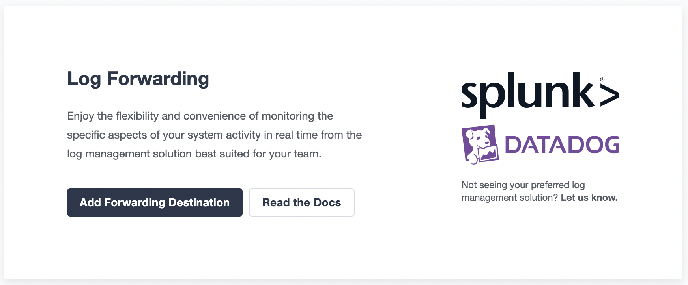
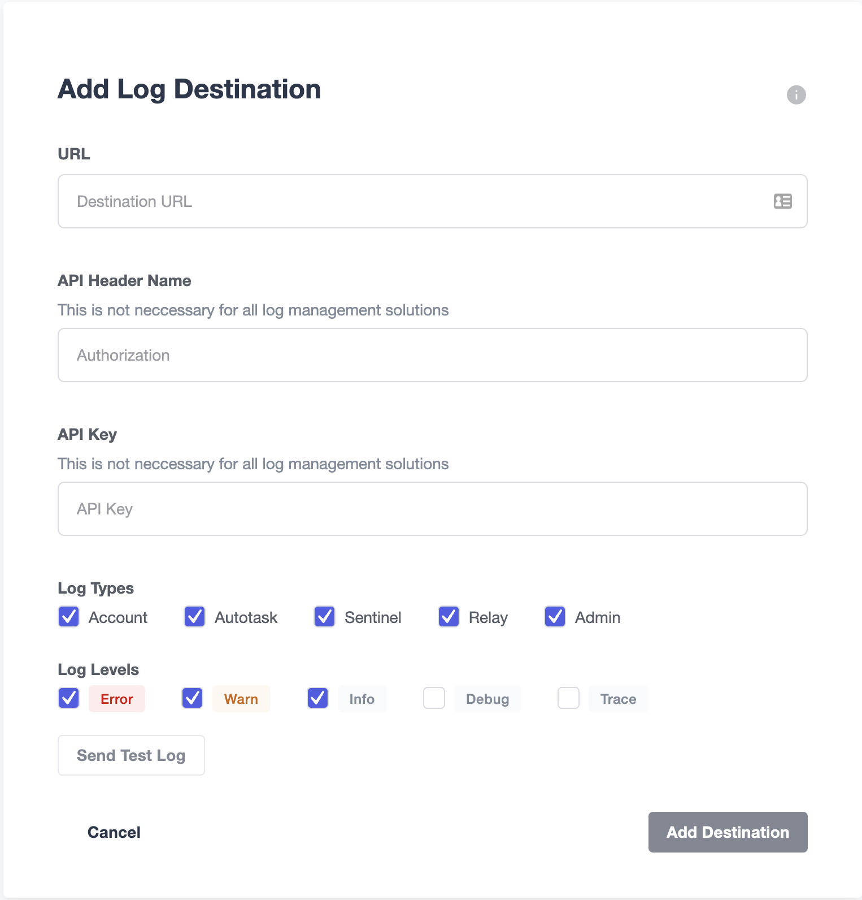

# Logging
Defender会生成系统中每个可能相关事件的日志记录。这包括手动操作，例如修改Autotask或Sentinel，以及自动操作，例如发送交易或触发通知。日志可以选择转发到Datadog或Splunk进行聚合。

这是一个高级功能，如果您有兴趣，请通过填写此[表格](https://zpl.in/defender-inquiry)告诉我们。

## 用例
使用Defender Logging跟踪系统中的所有更改和操作，例如：

* 通过**监视应用程序**中的登录和活动跟踪团队成员的用户操作

* 检测基础架构中的**潜在攻击**，例如登录失败的尝试

* 跟踪**relayer活动**以了解从您的账户发送的交易

* 保留对Autotasks、Sentinels和Relayers的所有更改的**审计记录**

## 日志条目
每个日志条目都将分配给autotask、sentinel、relay、admin或account之一，并标记为从trace到error的严重性级别。日志条目是跟踪操作的主体和客体，并将事件分类为以下之一：

* 添加
* 存档
* 创建
* 删除
* 超限
* 执行
* 邀请
* 调用
* 通知
* 暂停
* 建议
* 替换
* 发送
* 设置
* 触发
* 更新
* 无效登录
* 已登录
* 已注销

## 日志转发
生成的日志可以转发到Datadog和Splunk，或任何支持API密钥身份验证的其他服务。您可以使用此功能将所有日志聚合到一个地方，跨您的基础架构。

## 设置日志转发目的地
要设置日志转发目的地，请在Defender的右上角打开用户菜单或[单击此处](https://defender.openzeppelin.com/#/logs/forwarding)。

您可以通过点击“添加转发目的地”按钮来访问日志目的地配置页面。

表单字段：

* **URL**字段是必填字段。所有日志都将通过HTTP POST方法转发到此URL地址。

* **API Header Name**是可选字段。这是包含API密钥值的请求头的名称。大多数日志管理服务都需要它。请参考您的日志管理服务文档以确定您是否需要它。

* **API Key**是可选字段。API密钥会随每个请求一起发送，用于身份验证目的。大多数日志管理服务都需要它。请参考您的日志管理服务文档以确定您是否需要它。

* **日志类型**让您指定要转发的Defender生成日志的子集，基于Defender组件。

* **日志级别**让您指定要转发的Defender生成日志的子集，基于日志级别。例如，调试日志可用于Autotasks调试目的，并且可能包含不应导出到外部系统的数据。

> NOTE
在下一节中，我们将介绍如何使用Splunk和Datadog设置日志转发，但值得注意的是，日志转发适用于支持API密钥身份验证的任何其他服务。

### plunk
将日志转发到Splunk是通过使用Splunk HEC（HTTP事件收集器）完成的。可以在[此处](https://docs.splunk.com/Documentation/Splunk/latest/Data/UsetheHTTPEventCollector)找到设置与Splunk HEC一起使用日志记录的文档。

> NOTE
由于Splunk的内部机制，日志转发不适用于Splunk试用帐户。

示例：

* **URL**：
https：//username.splunkcloud.com/services/collector/raw

* **API头名称**：授权

* **API密钥**：Splunk xxxxxxxxxxxxxxxxxxxxxxxxxxx

> NOTE
URL值是动态的，因为URL包括帐户用户名。

> NOTE
API密钥应包含Splunk前缀。

### Datadog
可以在此处找到有关在Datadog上设置日志记录的文档。

示例：

* **URL**：https：//http-intake.logs.datadoghq.com/api/v2/logs

* **API头名称**：DD-API-KEY

* **API密钥**：xxxxxxxxxxxxxxxxxxxxxxxxxxxxxxx

> NOTE
Datadog在世界各地使用不同的站点。例如，如果您依赖于欧盟服务器，则URL字段值应为https://http-intake.logs.datadoghq.eu/api/v2/logs

> NOTE
可以通过从左侧菜单中打开日志部分并选择AWS提供程序来从Datadog站点获取API密钥值。在按照这些步骤操作后，“API密钥”值将显示在页面底部的部分中。