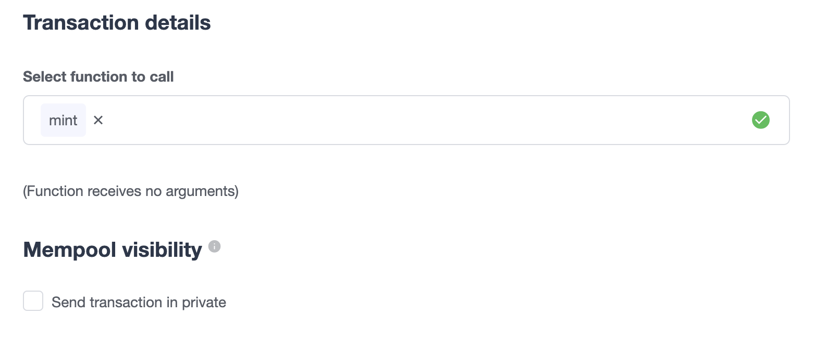
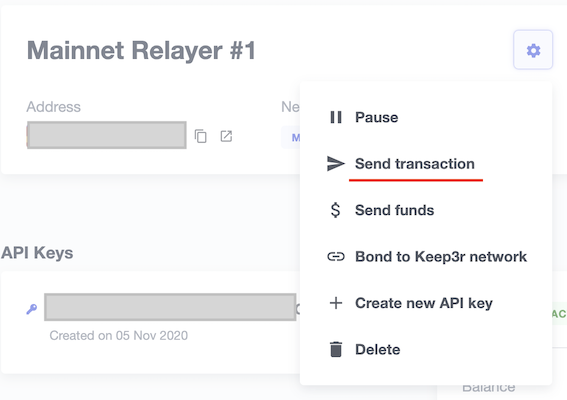
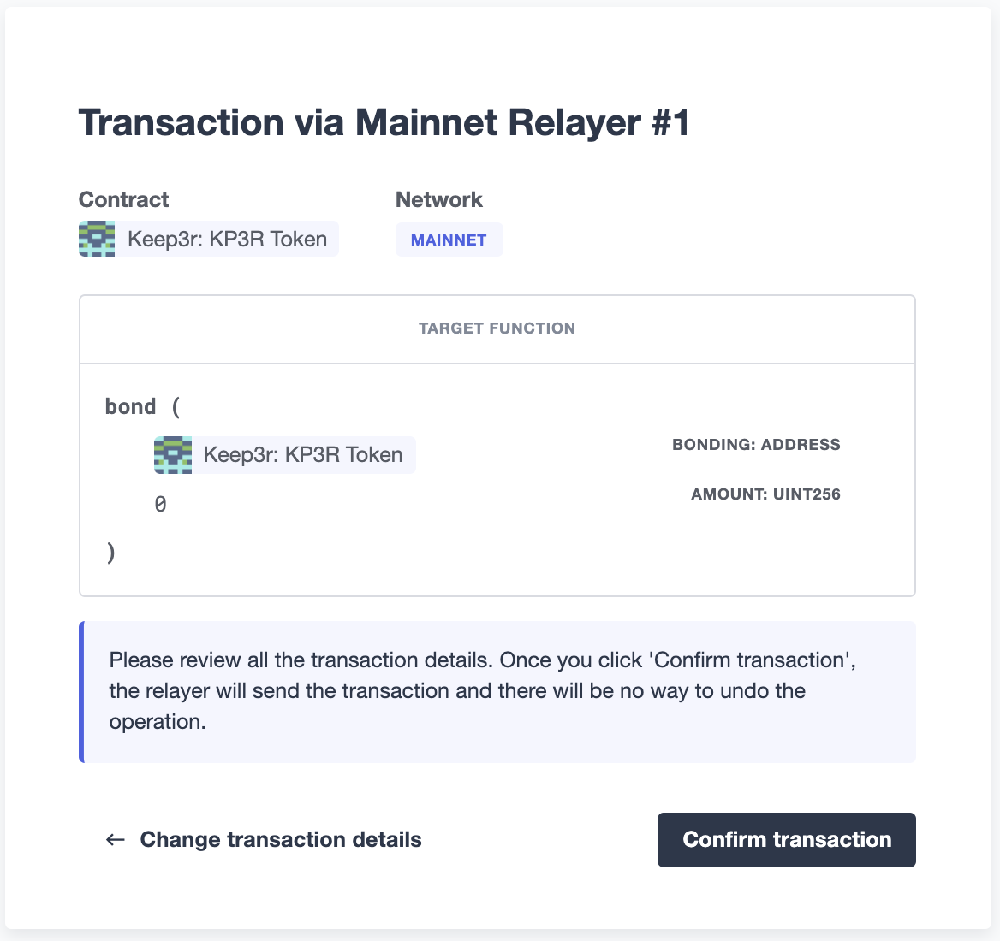
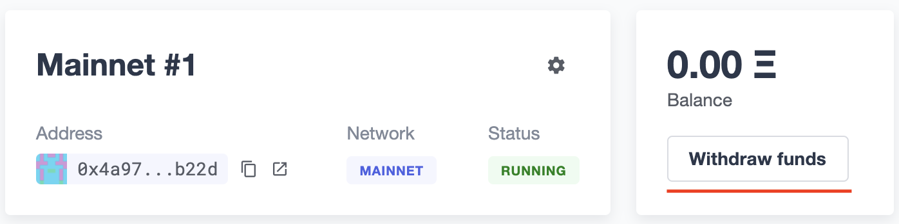
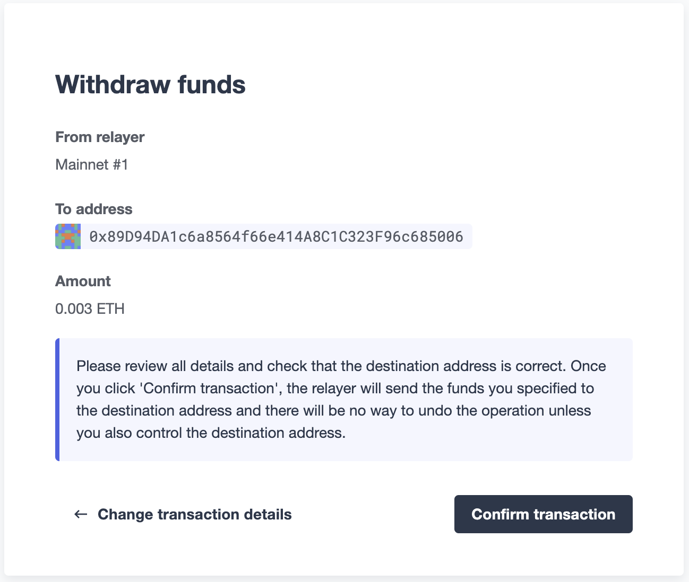

# Relay
Defender中继服务允许您通过常规的HTTP API发送交易，并负责私钥安全存储、交易签名、nonce管理、燃气定价估计和重新提交。这样，您就不必担心在后端脚本中保护私钥，或者监视您的交易以确保它们得到挖掘。

## 用例
每次在代码中使用热钱包时，请使用 Defender Relayer。每当您需要从脚本或后端发送交易时，您可以连接到Relayer，以简化密钥管理和交易提交。

* **通过触发状态转换**来更新合约

* 使用外部数据**更新链上Oracle**

* 发送**元交易**以构建无需燃气费的体验

* 通过**空投代币**来响应用户的注册

* 从协议合约中**转移资金**到安全钱包

* 构建与智能合约协议**交互的机器人**。

## 一个Relayer中有什么？
Defender Relayer是专门分配给您团队的以太坊账户。每当您创建一个新的Relayer时，Defender将在安全的保险库中创建一个新的私钥。每当您请求Defender通过该Relayer发送交易时，相应的私钥将用于签名。

您可以将每个Relayer视为发送交易的队列，所有通过同一Relayer发送的交易将按顺序发送，并且由您团队专属控制的同一以太坊账户进行控制。如果您想了解Relayers在*幕后的*工作原理，请跳到“底层原理”部分！

>IMPORTANT
请记住，您需要为每个Relayer单独提供ETH资金，以确保它们具有足够的资金支付您发送的交易的燃气费用。如果Relayer的资金低于0.1 ETH，Defender将向您发送电子邮件通知。

> NOTE
Defender Relayers实现为外部拥有账户。我们正在努力实现智能账户，以支持批量交易、燃气代币和链上管理的冷钥匙。

### API密钥
每个Relayer可以关联一个或多个**API密钥**。为了通过Relayer发送交易，您需要使用一个API密钥/密钥对对请求进行身份验证。您可以根据需要创建或删除API密钥，这不会更改发送地址或Relayer余额。

>IMPORTANT
Relayer的API密钥与其私钥无关。私钥始终保存在安全的密钥保管库中，永远不会被公开（有关更多信息，请参阅安全注意事项部分）。这种解耦允许您自由地旋转API密钥，同时保持相同的以太坊地址用于您的Relayer。

> WARNING
创建新API密钥时，请记住API密钥仅在创建期间显示一次-如果您不将其写下来，则永远丢失。幸运的是，创建新API密钥就像点击一个按钮一样简单。

### 暂停
您可以通过Defender网站暂停Relayer，以快速响应紧急情况。这将导致Relayer拒绝任何传入的发送交易请求，无论是来自Autotask还是通过API。但是，请记住，已发送的任何交易都不会被取消。当您准备好恢复运营时，只需点击“取消暂停”按钮，您的Relayer将恢复正常。

### 地址
每当您创建一个Relayer时，都会创建一个新的以太坊账户来支持它。出于安全考虑，无法将现有私钥导入Relayer，也无法导出Defender创建的Relayer的私钥。为避免平台锁定，在您的系统中为Relayer地址授予特权角色时，请考虑拥有一种管理方法，以便在需要时将其切换到其他地址。

您可以选择重用现有Relayer之一的地址，用于另一个网络上的不同Relayer。这使您可以在多链系统中在不同的网络上拥有相同的地址。要执行此操作，请在Relayer的设置菜单中选择克隆Relayer，然后选择应具有相同地址的新Relayer的网络。请注意，每个网络无法拥有具有相同地址的多个Relayer。

### 政策
您可以通过指定策略来限制中继的行为。

要配置您的中继策略，请转到中继设置页面，单击齿轮图标按钮，选择“管理策略”。然后，您将看到一个表单，您可以选择启用策略并调整其参数。

目前，这些是不同的可选策略：

#### 燃料价格上限
为中继发送的每个交易指定最大燃料价格。当启用此策略时，Defender将覆盖任何超出指定上限的交易的gasPrice或maxFeePerGas。请注意，交易的燃料价格是基于燃料价格预言机在中继实际发送交易以进行挖掘时指定的，因此此策略可用作燃料价格激增的保护。

> NOTE
除了此处可以指定的最大燃料价格策略外，Defender还实现了向发送到Polygon网络的交易指定最低燃料价格策略为30 Gwei。[您可以在此处阅读有关Polygon决定建立最低燃料价格的更多信息。](https://forum.polygon.technology/t/recommended-min-gas-price-setting/7604)

#### 接收者白名单
为中继发送的每个交易指定授权接收者列表。Defender将拒绝并丢弃任何收件人地址不在列表中的交易。

> NOTE
接收者白名单仅适用于交易的to字段。它不过滤ERC20或其他资产的接收者。

#### EIP1559定价
指定中继发送的交易是否应默认为EIP1559。这适用于中继使用*speed*参数发送交易或未指定gasPrice或maxFeePerGas / maxPriorityFeePerGas的情况。请注意，这仅适用于EIP1559兼容的网络。

> NOTE
EIP1559定价策略默认为新中继启用。如果您有一个没有默认选择的中继，则始终可以启用此标志。

#### 私人交易
指定交易是否应通过私有mempool发送。这意味着交易在包含在块中之前不会公开显示。

通过使用[Flashbots Protect RPC](https://docs.flashbots.net/flashbots-protect/rpc/quick-start)仅为goerli和mainnet启用私人交易。因此，发送私人交易时可能适用相同的[关键考虑因素](https://docs.flashbots.net/flashbots-protect/rpc/quick-start#key-considerations)（例如[uncle bandit风险](https://docs.flashbots.net/flashbots-protect/rpc/uncle-bandits)）。

## 发送交易
通过Relayer发送交易的最简单方法是使用[defender-relay-client](https://www.npmjs.com/package/defender-relay-client) npm包。该客户端使用API密钥/密钥进行初始化，并公开了一个简单的API，用于通过相应的Relayer发送交易。
```
import { Relayer } from 'defender-relay-client';
const relayer = new Relayer({apiKey: YOUR_API_KEY, apiSecret: YOUR_API_SECRET});

const tx = await relayer.sendTransaction({
  to, value, data, gasLimit, speed: 'fast'
});
```

> NOTE
在初始化Relayer客户端时，您不需要输入私钥，因为私钥被安全保存在Defender保险库中。

>IMPORTANT
目前，zkSync除了使用eth_estimateGas端点之外，没有一种精确计算gasLimit的方法。因此，Defender无法进行任何gasLimit，并用RPC估计覆盖用户输入。

### 使用ethers.js
Relayer客户端通过自定义签名者与ethers.js集成。这使您可以轻松地切换到Defender Relayer以进行发送交易，而无需大量更改您的代码库。
```
const { DefenderRelaySigner, DefenderRelayProvider } = require('defender-relay-client/lib/ethers');
const { ethers } = require('ethers');

const credentials = { apiKey: YOUR_API_KEY, apiSecret: YOUR_API_SECRET };
const provider = new DefenderRelayProvider(credentials);
const signer = new DefenderRelaySigner(credentials, provider, { speed: 'fast' });

const erc20 = new ethers.Contract(ERC20_ADDRESS, ERC20_ABI, signer);
const tx = await erc20.transfer(beneficiary, 1e18.toString());
const mined = await tx.wait();
```
在上面的示例中，我们还使用了 DefenderRelayProvider 来进行对网络的调用。Defender 签名器可以与任何提供程序一起工作，例如 ethers.getDefaultProvider()，但您也可以依赖 Defender 作为网络提供程序。

您可以在[此处](https://www.npmjs.com/package/defender-relay-client#user-content-ethersjs)阅读有关 ethers 集成的更多信息。

### 使用web3.js
Relayer客户端可以通过[web3.js](https://web3js.readthedocs.io/)和自定义提供程序进行[集成](https://web3js.readthedocs.io/en/v1.3.4/web3-eth.html#providers)。这使您可以使用熟悉的web3接口发送交易和查询网络。
```
const { DefenderRelayProvider } = require('defender-relay-client/lib/web3');
const Web3 = require('web3');

const credentials = { apiKey: YOUR_API_KEY, apiSecret: YOUR_API_SECRET };
const provider = new DefenderRelayProvider(credentials, { speed: 'fast' });
const web3 = new Web3(provider);

const [from] = await web3.eth.getAccounts();
const erc20 = new web3.eth.Contract(ERC20_ABI, ERC20_ADDRESS, { from });
const tx = await erc20.methods.transfer(beneficiary, (1e18).toString()).send();
```
以上示例中，转账交易由Defender中继器签名和广播，任何额外的JSON RPC调用都通过Defender私有端点路由。

您可以在[此处](https://www.npmjs.com/package/defender-relay-client#user-content-web3js)阅读有关web3集成的更多信息。

### 支持EIP1559
由于Defender支持的网络并非全部兼容EIP1559，因此团队只**启用了被认定为兼容**并启用了EIP1559的网络的EIP1559交易支持。

中继器可以通过以下方式发送EIP1559交易：

* 使用启用了*EIP1559定价策略*的UI发送交易

* 使用指定了maxFeePerGas和maxPriorityFeePerGas的API发送交易

* 使用速度和启用了EIP1559定价策略的API发送交易

一旦任何交易被发送，它在其生命周期的每个阶段（例如替换和重新定价）都将具有**相同的类型**，因此如果已经提交，目前无法更改类型。

> NOTE
任何尝试将maxFeePerGas或maxPriorityFeePerGas发送到不兼容EIP1559的网络的尝试都将被中继器拒绝和丢弃。

您可以查看中继器*策略*来确定网络是否支持EIP1559。如果没有显示EIP1559定价策略，则意味着我们尚未为该网络添加EIP1559支持。

> NOTE
如果您注意到我们已经支持但尚未启用支持的EIP1559兼容网络，请不要犹豫在我们的社区论坛或defender@openzeppelin.com上请求支持。

### 私人交易
私人交易支持允许中继器发送交易，而不会出现在公共mempool中，而是通过使用特殊的eth_sendRawTransaction提供程序通过私人mempool中继，这将取决于网络和当前支持（例如Flashbots网络覆盖）。

中继器可以通过以下任何方式发送私人交易：

* 启用privateTransactions*策略通过API发送交易*

* 通过API发送交易，将isPrivate参数设置为true

* 通过UI发送交易并勾选Mempool Visibility复选框


> NOTE
将isPrivate标志设置为true的交易发送到不支持私有交易的网络将被中继器拒绝和丢弃。
目前，仅支持以下网络：

* Mainnet：通过[Flashbots Protect RPC](https://docs.flashbots.net/flashbots-protect/rpc/quick-start)

* Goerli：通过[Flashbots Protect RPC](https://docs.flashbots.net/flashbots-protect/rpc/quick-start)

> WARING
在使用私人交易时，应考虑eth_sendRawTransaction提供程序的关键考虑因素，例如[叔叔强盗风险](https://docs.flashbots.net/flashbots-protect/rpc/uncle-bandits)。

### 速度
与通常的gasPrice或maxFeePerGas/maxPriorityFeePerGas不同，Relayer还可以接受*速度参数*，可以是safeLow、average、fast或fastest。当交易被发送或重新提交时，这些值会映射到实际的gas价格，并根据网络状态而变化。

如果提供了速度参数，则交易将按照*EIP1559Pricing中继器策略定价*。

> NOTE
主网络的燃气价格和优先费用是根据EthGasStation、EtherChain、GasNow、BlockNative和Etherscan报告的值计算的。在Polygon及其测试网络中，使用燃气站。在其他网络中，燃气价格是通过调用eth_gasPrice或eth_feeHistory到网络获取的。

### 固定gas价
或者，您可以通过设置**gasPrice参数**或**maxFeePerGas和maxPriorityFeePerGas参数**中的一个固定的*gasPrice*或*固定的组合来指定交易的定价*。具有固定定价的交易将以指定的定价进行挖掘，或者如果在validUntil时间之前无法挖掘，则被替换为NOOP交易。

请记住，您必须提供速度、gasPrice、maxFeePerGas/maxPriorityFeePerGas或不提供任何参数，但不能在发送交易请求时混合使用它们。

> NOTE
如果没有任何定价参数发送发送交易请求，则将使用快速默认速度定价。

> NOTE
如果您同时提供固定的maxFeePerGas和maxPriorityFeePerGas，请确保maxFeePerGas大于或等于maxPriorityFeePerGas。否则，它将被拒绝。

### 有效期至
Defender Relay中的每个交易都在validUntil时间之前有效提交到以太坊网络。在*validUntil*时间之后，交易将被替换为一个NOOP交易，以防止中继器在交易的nonce上卡住。NOOP交易除了推进中继器的nonce之外什么也不做。

validUntil默认为交易创建后的8小时。请注意，您可以将validUntil与*固定定价*结合使用，以实现极快的挖矿时间，并击败其他以gasPrice或maxFeePerGas为基础的交易。

如果您正在使用ethers.js，则可以设置validForSeconds选项而不是validUntil。在下面的示例中，我们配置一个DefenderRelaySigner，以发出一个在其创建后120秒内有效的交易。
```
const signer = new DefenderRelaySigner(credentials, provider, { validForSeconds: 120 });
```

> NOTE
validUntil是一个UTC时间戳。请确保使用UTC时区而不是本地时区。

### 交易ID
由于中继可能会在预期时间内未被挖掘的情况下，使用更新的燃气定价重新提交交易，因此给定交易的哈希值可能会随时间而变化。为了跟踪给定交易的状态，中继API返回一个transactionId标识符，您可以使用它来[查询](https://www.npmjs.com/package/defender-relay-client#querying)交易状态。
```
const tx = await relayer.query(tx.transactionId);
```

> NOTE
查询端点将返回Defender服务的最新交易视图，该视图每分钟更新一次。

### 替换交易
虽然Defender Relay会自动重新提交交易并提高gas价格，如果它们没有被挖掘，并且会在有效期截止时间后自动取消它们，但如果您的交易尚未被挖掘，您仍然可以手动替换或取消它。这使您可以在交易不再有效时取消交易，调整其TTL或提高其速度或gas价格。

要执行此操作，请使用defender-relay-client的replaceByNonce或replaceById函数。
```
// Cancel tx payload (tx to a random address with zero value and data)
replacement = {
  to: '0x6b175474e89094c44da98b954eedeac495271d0f',
  value: '0x00',
  data: '0x',
  speed: 'fastest',
  gasLimit: 21000
};

// Replace a tx by nonce
tx = await relayer.replaceTransactionByNonce(42, replacement);

// Or by transactionId
tx = await relayer.replaceTransactionById('5fcb8a6d-8d3e-403a-b33d-ade27ce0f85a', replacement);
```
您还可以通过在使用以太网或web3.js适配器发送交易时设置nonce来替换挂起的交易。
```
// Using ethers
erc20 = new ethers.Contract(ERC20_ADDRESS, ERC20_ABI, signer);
replaced = await erc20.functions.transfer(beneficiary, 1e18.toString(), {
  nonce: 42
});

// Using web3.js
erc20 = new web3.eth.Contract(ERC20_ABI, ERC20_ADDRESS, { from });
replaced = await erc20.methods.transfer(beneficiary, (1e18).toString()).send({
  nonce: 42
});
```

> NOTE
你只能用相同类型的交易替换交易。例如，如果你试图替换一个EIP1559交易，它不能被替换为传统的交易。此外，如果提供的是速度，交易将被重新定价为其原始类型所需的速度。

### 列出交易记录
您还可以列出通过您的Relayer发送的最新交易，可选择按状态（待处理，已挖掘或失败）进行过滤。这对于防止您的Autotask脚本重新发送已在飞行中的交易特别有用：在发送交易之前，您可以使用按待处理状态过滤的列表方法，以查看队列中是否有与您即将发送的目标和calldata相同的交易。
```
const txs = await relayer.list({
  since: new Date(Date.now() - 60 * 1000),
  status: 'pending', // can be 'pending', 'mined', or 'failed'
  limit: 5, // newest txs will be returned first
})
```

## 签名
除了发送交易之外，Relayer还可以根据[EIP-191标准](https://eips.ethereum.org/EIPS/eip-191)（以\x19Ethereum Signed Message：\n为前缀）使用其私钥签名任意消息。您可以通过客户端的sign方法或等效的ethers.js方法访问此功能。
```
const signResponse = await relayer.sign({ message });
```

> NOTE
与大多数图书馆不同，Relayer使用非确定性ECDSA签名。这意味着如果您请求Relayer多次签署相同的消息，则会获得多个不同的签名，可能与使用ethersjs或web3js签署的结果不同。所有这些不同的签名都是有效的。请参阅[RFC6979](https://datatracker.ietf.org/doc/html/rfc6979#section-3)获取更多信息。

## 签署已输入数据
除了sign API方法外，Relayer还实现了signTypedData方法，您可以使用它根据[EIP712标准](https://eips.ethereum.org/EIPS/eip-712)对数据进行签名。您可以提供domainSeparator和hashStruct（message），或使用等效的ethers.js方法。
```
const signTypedDataResponse = await relayer.signTypedData({
  domainSeparator,
  hashStructMessage
});
```

## Relayer信息
可以使用 DefenderRelaySigner 类的 getAddress 方法来检索中继器的地址。
```
const address = await signer.getAddress();
```
如果您需要更多关于中继的信息，请查看客户端的getRelayer方法。它返回以下数据：
```
const info = await relayer.getRelayer();
console.log('Relayer info', info);

export interface RelayerModel {
  relayerId: string;
  name: string;
  address: string;
  network: string;
  paused: boolean;
  createdAt: string;
  pendingTxCost: string;
}
```

## 网络调用
Defender还提供了一种简单的方法来向网络发出任意的JSON RPC调用。您可以使用低级别的relayer.call方法发送任何JSON RPC HTTP请求：
```
const balance = await relayer.call('eth_getBalance', ['0x6b175474e89094c44da98b954eedeac495271d0f', 'latest']);
```
如果您正在使用ethers.js，则可以通过自定义的DefenderRelayProvider[提供](https://docs.ethers.io/v5/api/providers/provider/)程序对象来支持此功能：
```
const provider = new DefenderRelayProvider(credentials);
const balance = await provider.getBalance('0x6b175474e89094c44da98b954eedeac495271d0f');
```

## 自动任务集成
一个Relayer可以附加到一个*Autotask*上，Autotask是由Defender运行的代码片段。这样做，Autotask代码将直接访问附加的Relayer方法，而不需要指定API密钥。相反，Defender将在Autotask处理程序函数中注入短暂的Relayer凭据。
```
const { Relayer } = require('defender-relay-client');

// The credentials object is injected by the Defender Autotasks engine
exports.handler = async function(credentials) {
  const relayer = new Relayer(credentials);
  // ... use relayer as usual
}
```

> NOTE
自动任务可以按计划或通过Webhook调用。如果您想从Web应用程序调用Relayer，则建议通过Webhook触发的自动任务来执行。永远不要将Relayer的API密钥和密钥放在前端中，因为拥有这些密钥的任何人将对您的Relayer拥有无限制的控制权。

## 元交易
Defender中继器是通用的中继器，您可以使用它们将任何您想要发送到合约的交易发送出去。特别地，它们也可用于代表您的用户中继元交易。这需要设置一个服务器端函数，该函数决定是否中继给定的元交易，并调用Defender中继器以有效地发送它。

特别地，您可以使用Autotasks来托管该函数，并通过Webhook调用它。您可以在*此处阅读有关Webhook激活*的Autotasks的更多信息。

### EIP2771是GSNv2兼容的元交易协议。
我们在这里创建了一个用于Defender-powered meta-txs的[演示应用程序](https://defender-example-metatx-relay.netlify.app/)。该应用程序依赖于[EIP-2771转发器合约](https://eips.ethereum.org/EIPS/eip-2771)。该合约的唯一责任是接收签名的meta-tx请求，验证其签名，并通过将签名者地址附加到调用中将请求转发给接收方合约。

这个设置与[GSNv2](https://docs.opengsn.org/)兼容，这意味着您可以使用Defender中继器发送您的meta-transactions，并且在将来的任何时候，您可以切换到GSN中继器的分散网络，而不需要对您的合约进行任何更改。

> NOTE
您可以在[此处](https://gist.github.com/spalladino/7fb3533e36e9b9a833f8e5c568c86815)探索应用程序的关键部分代码。

### 更多元交易模式
上述描述的模式只是可用的几种元交易变体之一。鉴于 Defender Relayers 是通用的，您还可以使用它们进行任何其他类型的元交易，例如使用 [EIP2612](https://eips.ethereum.org/EIPS/eip-2612) 或 [EIP3009](https://eips.ethereum.org/EIPS/eip-3009) 中继无需燃气的 ERC20 转移。

特别是，您可以利用 Defender xDai Relayers 代表您的用户在 xDai 上发送交易，鉴于该侧链中交易成本较低。这样，您可以为您的 dapp 提供完整的无燃气体验。同样适用于 Defender 支持的其他侧链，如 BSC、Fuse、Fantom、Polygon、Avalanche、Celo、Moonbeam、Moonriver、Aurora、Harmony 和 Arbitrum。

## 手动操作
您还可以通过Relayer手动发送交易或直接从Defender网站上提取资金。要这样做，请转到Relayer页面，打开齿轮菜单，并选择所需的选项。

### 发送交易
您可以通过选择“发送交易”在您的中继齿轮菜单中手动向合约发送交易：


在发送交易屏幕上，输入您想要与之交互的合约地址，选择要执行的函数，并输入其参数。

> NOTE
在撰写本文时，Defender仅支持向已验证源代码的合约发送交易，请确保目标合约已在Etherscan或Sourcify上进行了验证。


当您点击“确认交易”时，交易将通过中继器发送。我们建议您等待交易确认，然后再离开此屏幕，或在您选择的区块链浏览器上监视它，以确保它已确认且无需进一步操作。

> NOTE
防御者将通过UI创建的中继器交易的速度设置为快速。

### 提取资金
您可以通过在Relayer页面上点击“提取资金”来从Relayer中提取资金。


在提取资金屏幕上，您可以选择以ETH发送资金或从内置的ERC20令牌列表中选择。


## Under the hood
每个Relayer都与一个私钥相关联。当接收到发送交易的请求时，Relayer验证该请求，原子性地为其分配一个nonce，预留用于支付其gas费用的余额，根据其*EIP1559定价策略*将其速度解析为gasPrice或maxFeePerGas/maxPriorityFeePerGas，使用其私钥对其进行签名，并将其排队等待提交到区块链。只有在此过程完成后，响应才会发送回客户端。然后，交易会通过多个节点提供程序进行广播，以实现冗余，并在API关闭的情况下尝试重试多达三次。

每分钟，系统会检查所有正在进行的交易。如果它们尚未被挖掘，并且已经过了一定的时间（取决于交易速度），则会以其各自的交易类型定价的10％增加（或者如果其速度的最新定价更高，则以其速度的最新定价），这可能高达其**速度报告的gas定价的150％**。此过程会导致交易哈希值发生更改，但其ID仍然保留。另一方面，如果交易已经被挖掘，它仍然会被监视多个块，直到我们认为它已经确认。

## Concurrency and Rate Limiting
中继器可以原子地分配nonce，从而使它们能够处理许多并发交易。但是，为了优化基础设施，确实存在一些限制（以下所有数字均为一个帐户中所有中继器的累计）：

* 每小时120笔交易（仅限免费套餐）

* 每秒100个总请求

* 每秒10笔交易

## 安全考虑
所有私钥都存储在AWS Key Management Service中。密钥在KMS中生成，从不离开KMS，即所有签名操作都在KMS内执行。此外，我们依赖动态生成的AWS Identity and Access Management策略来隔离租户之间对私钥的访问。

至于API密钥，这些仅在创建期间在内存中保留，当它们被发送到客户端时。之后，它们被哈希并安全地存储在AWS Cognito中，该服务在幕后用于验证Relayer请求。这使得API密钥易于轮换，同时保留KMS上相同的私钥。

### Rollups
当向Rollup链（如Arbitrum或Optimism）发送交易时，Relayer目前依赖于链的序列化器/聚合器。这意味着，如果序列化器崩溃或审查交易，则Relayer将无法绕过它并直接提交到第1层。

## Hedera支持
目前，在Hedera网络上，Defender Relay仅支持测试网。要启用此功能，请通过defender@openzeppelin.com与我们联系。

## 即将呈现...
我们正在开发新功能。敬请期待，如果您有任何需求，请告诉我们！
