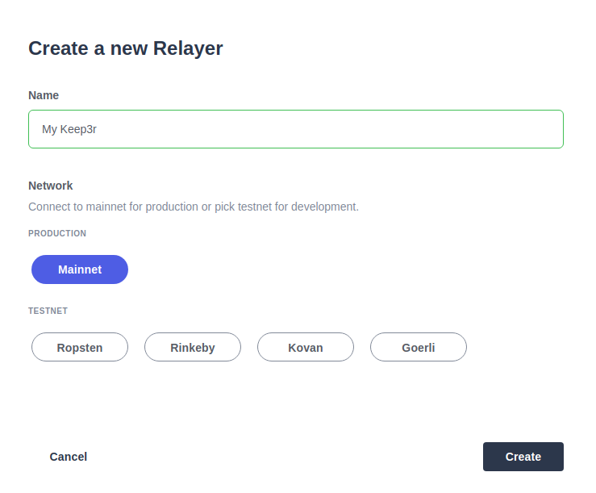
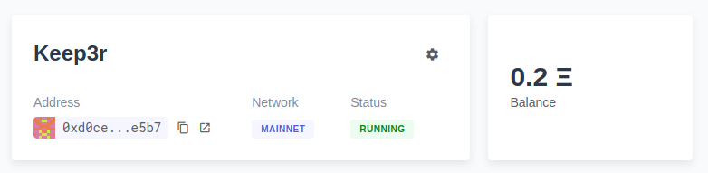
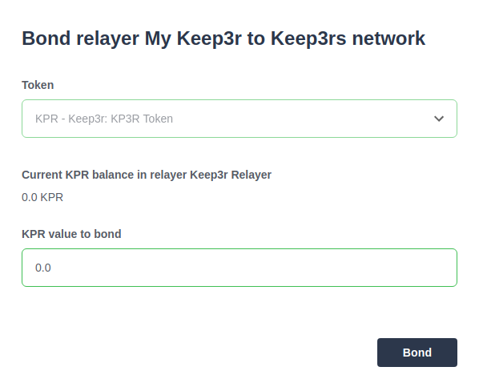
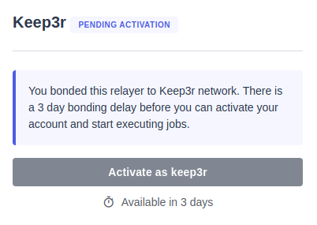
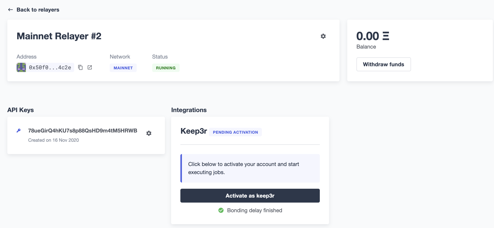
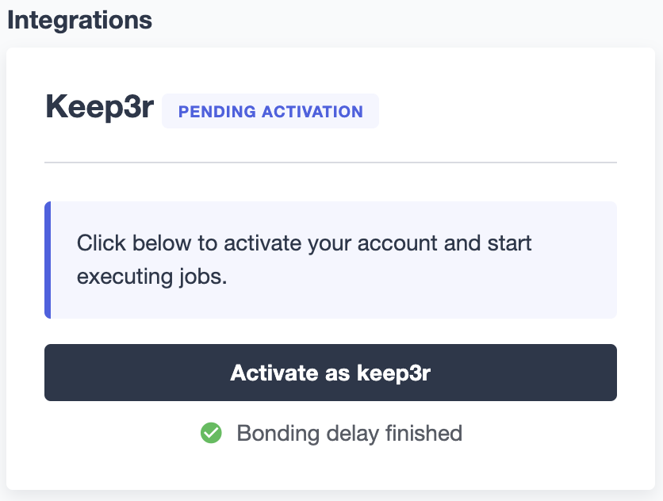
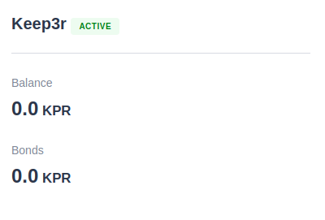
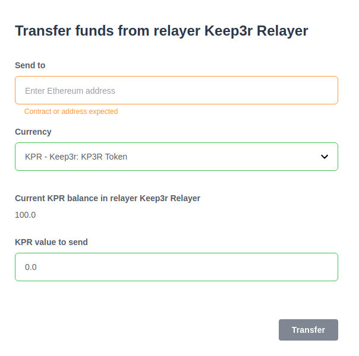
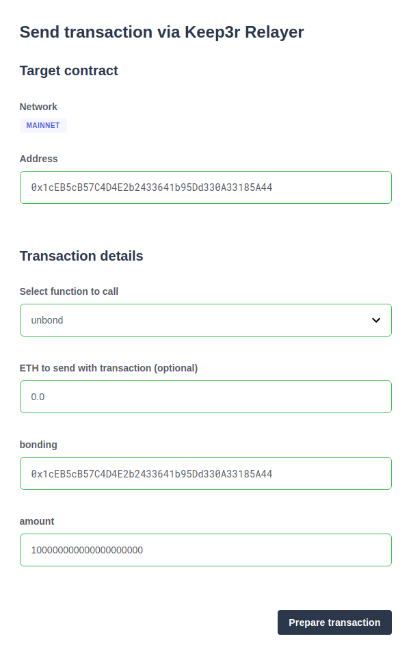

# Running a Keep3r Network keeper
本指南将为你介绍如何通过利用Defender [Relay](../../Components/Relay/Relay.md)和[Autotasks](../../Components/Autotasks/Autotasks.md)在[Keep3r Network](https://keep3r.network/)中运行Keeper的过程。

> WARNING
Keep3r Network项目处于测试阶段。请自行承担风险。

## 什么是Keeper？

在Keep3r Network的背景下，Keeper是执行可用工作以换取奖励的参与者。合约可以注册要执行的工作，一旦可用，注册的Keeper可以发送交易来执行它。

    Keeper是一个术语，用于指称执行工作的外部人员和/或团队。这可以是简单地调用交易，也可以是需要广泛的离链逻辑。 Keep3r网络的范围不是管理这些工作本身，而是允许合约注册为Keeper的工作，并允许Keeper注册自己以执行工作。每个Keeper都需要根据他们认为有利可图的交易设置自己的DevOps和基础架构，并创建自己的规则。
                                - [Keep3r.network文档](https://docs.keep3r.network/#keepers)

## 先决条件

要开始，你需要以下内容：

1. **Defender主网帐户**。请前往[Defender](https://defender.openzeppelin.com/)注册新帐户，然后申请[主网访问](https://openzeppelin.com/apply/)，表示你有兴趣运行Keeper。我们将很快与你联系，激活你的主网访问权限。
2. **支付交易gas的ETH**。Keeper交易需要gas进行执行，因此请确保有一些ETH可用于为你的Relay提供资金。
3. **债券的KP3R代币（可选）**。注册Keeper时，你可以选择[绑定](https://docs.keep3r.network/core/keepers#becoming-a-keeper)一定数量的KP3R代币。这会[影响你在执行工作时获得的奖励](https://forum.openzeppelin.com/t/what-benefit-is-there-for-adding-collateral-bonded-kp3r-vs-not-bonding/4502)。请注意，你仍然可以在不绑定任何代币的情况下运行Keeper。

## 创建Relayer 

第一步是创建Defender Relayer 作为你的Keeper。这个Relayer 将是你执行工作的以太坊帐户。

> NOTE
你不需要手动在[keep3r.network](https://keep3r.network/)上注册为Keeper，这样做将会将你的钱包注册为Keeper，而不是你的Relayer 。

要创建Relayer ，请简单地转到Defender中的[Relay](https://docs.openzeppelin.com/defender/relay)部分，并在Mainnet网络上创建一个新的Relayer 。创建完成后，请注意Relayer 地址；你不需要为本指南生成的API密钥和密码。

> WARNING
如果创建主网Relayer 的选项被锁定，那么这意味着你的Defender账户还没有主网访问权限。请先[申请主网访问权限](https://openzeppelin.com/apply/)，并等待我们的回复。

## 为Relayer 筹资
下一步是向你的Relayer 发送ETH，以便它有资金执行工作。复制你的新Relayer 的以太坊地址，并使用你喜欢的钱包向其发送ETH。你可以发送任意金额，但最好至少有大约0.2 ETH，以便在用尽之前发送一些交易。

交易确认后，你应该在Relayer 的余额中看到你转移的资金。

> NOTE
当你的Relay资金低于0.1 ETH时，Defender将向你发送电子邮件提醒你补充资金。

如果你想将任何KP3R代币绑定到你的Relayer 上，你需要将代币转移到Relayer 地址。请确保将代币发送到Relayer 地址，而不是KP3R代币合约！

## 绑定你的Relayer 
要将你的Relayer 注册为Keeper，第一步是[绑定它](https://docs.keep3r.network/core/keepers#becoming-a-keeper)。单击Relayer 设置页面中的齿轮图标，然后选择绑定到Keep3r Network。

如果你想绑定KP3R代币，现在是选择要绑定多少代币的时候了。

> NOTE
你可以使用零个绑定的KP3R代币，如果你想这样做，可以随后绑定更多代币。

完成将你的 Relayer 绑定的交易后，你的 Relayer 将进入一个**为期3天的等待期**，在此期间无法手动激活为Keeper。你可以随时访问你的 Relayer 页面，以查看剩余时间。

等待期结束后，你可以[手动激活](#激活你的-relayer)你的 Relayer 。

> NOTE
你可以随时选择再次绑定到Keep3r网络。这将允许你绑定额外的KP3R代币，但会将等待期重置为3天，然后你需要[手动激活](#激活你的-relayer)成为Keeper。

## 激活你的 Relayer 

等待3天的期限结束后，你将有选项手动激活你的keep3r。

这样做将发送一笔交易，将你的 Relayer 作为网络中的管理者激活，状态将变为Active。

## 创建Autotask
现在你已经将Relayer 激活为Keeper，让我们设置Defender Autotask，指示Relayer 发送它们。 Autotask是一小段代码，以规律间隔运行，这种情况下，我们将使用它来自动化绑定，激活，搜索工作并执行它们的过程。

在Defender的Autotasks部分中创建一个新的[Autotasks](../../Components/Autotasks/Autotasks.md)，选择每分钟运行一次，并将其连接到之前创建的Relayer 。

至于代码，请粘贴来自defender-autotask-examples存储库的[此代码段](https://github.com/OpenZeppelin/defender-autotask-examples/blob/master/keep3rs/src/frequent-keeper.js)，它将尝试运行YearnV1EarnKeep3r，HegicPoolKeep3r和UniswapV2SlidingOracle合约。一旦保存，Defender将开始每分钟执行Autotask。

> NOTE
如果你熟悉JavaScript，你随时可以编辑你的Autotask代码以添加新的作业，因为它们被发布。要做到这一点，请在代码段中将要工作的合约的ABI添加到ABIs对象中，并在Jobs中添加条目，其中包括合约名称和地址以及可工作和工作函数的名称。

### 微调

Defender将根据当前网络价格自动选择你的交易的gas价格。你可以通过在脚本中更改speed参数来调整你对gas价格的激进程度，包括safeLow，average，fast或fastest。更高的gas价格意味着如果有多个Keeper竞争一个作业，你将有更好的机会获得作业，但是你的交易也将更加昂贵！

或者，你还可以自己设置gas价格，如果你想最大限度地控制你的交易。只需设置gasPrice或maxFeePerGas / maxPriorityFeePerGas以进行交易，并且Defender将遵守该值。你可以依赖此来尝试在Defender上运行的所有其他Keeper之外出价，但请记住gas费用的成本。

## 执行作业
你设置的Autotask将自动开始查找YearnV1EarnKeep3r，HegicPoolKeep3r和UniswapV2SlidingOracle合约中的可用作业。你可以查看Autotask日志，以了解你的Keeper在每次运行中所做的工作，并在Relayer 页面上监视你的奖励。

> WARNING
请记住，发送交易并不意味着你将自动获得奖励：其他Keeper也可能监视工作，如果他们的交易在你之前被挖掘，你将无法获得奖励！更糟糕的是：撤销的交易也要支付gas费！

## 收集你的奖励
在完成一些作业后，你可以将赚取的KP3R代币从Relayer 发送回你的钱包。要执行此操作，请转到Relayer 页面，并选择提取资金。输入你的钱包地址，选择KPR作为货币，并输入你要提取的代币数量。确保正确输入你的钱包地址，否则你可能会永久性地丢失你的代币！

> NOTE
你还可以使用“提取资金”选项随时将ETH从你的Relayer 发送回你的钱包。

## 离开Keeper网络
如果你不再希望作为Keeper参与，你可以停止Autotask以停止执行作业，并从你的Relayer 中提取KP3R和ETH。如果你在注册阶段没有绑定任何代币，这就可以离开了。

如果你在注册期间绑定了代币并且想要检索，你需要[注销Keeper](https://docs.keep3r.network/core/keepers#removing-a-keeper)。要执行此操作，请首先在Relayer 页面中选择“发送交易”，输入Keeper合约地址[0x1cEB5cB57C4D4E2b2433641b95Dd330A33185A44](https://etherscan.io/address/0x1cEB5cB57C4D4E2b2433641b95Dd330A33185A44)，并选择解除绑定功能。绑定参数对应于你已绑定的代币的地址（再次为KP3R的[0x1cEB5cB57C4D4E2b2433641b95Dd330A33185A44](https://etherscan.io/address/0x1cEB5cB57C4D4E2b2433641b95Dd330A33185A44)），金额是你要解除绑定的代币数量（包括额外的小数点后的零，因此100 KP3R应输入为100000000000000000000）。

发送此交易后，你将需要等待14天的解绑期。解绑期结束后，你需要从Relayer 再次发送一个交易，这次调用的是撤回函数，并使用之前相同的绑定参数。这将有效地将你的Relayer 作为Keeper移除，并将你的绑定代币发送回Relayer 地址，从那里你可以将其提取到你的钱包中。

## 问题

如果你有任何问题或评论，请在[论坛](https://forum.openzeppelin.com/c/support/defender/36)上提出！