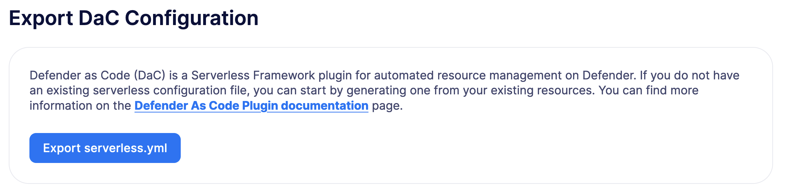

# Defender as Code Plugin
Defender as Code (DaC) 是一个用于自动化资源管理和代码配置的 Serverless Framework 插件。

> WARNING
该插件正在开发中，可能会发生变化。请小心使用。

## Prerequisites
Serverless Framework: https://www.serverless.com/framework/docs/getting-started/

## Installation
你可以直接使用我们预配置的模板初始化你的 Serverless 项目：

```
sls install --url https://github.com/OpenZeppelin/defender-as-code/tree/main/template -n my-service
```

> NOTE
要使上述命令正确工作，你需要访问这个仓库。

或者，你可以直接将其安装到现有项目中：
yarn add @openzeppelin/defender-as-code

## Setup
你可以通过几种方式设置 serverless.yml 配置：

* 从头开始创建；

* 使用 Defender 的 2.0 Serverless 导出功能；

* 利用 defender-as-code 仓库中提供的[示例](https://github.com/OpenZeppelin/defender-as-code/blob/main/template/serverless.yml)模板。

如果你在 Defender 2.0 中已经有了诸如合约、通知、中继器、操作等资源，你可以从管理 → 高级页面导出一个包含这些资源的 serverless.yml 配置文件。



> NOTE
如果你之前已经使用 defender-as-code 部署到同一个账户，并且随后通过 Defender 2.0 用户界面创建了新资源，导出功能将自动基于你最新部署堆栈的名称为新资源分配一个 stackResourceId。如果你之前没有使用 defender-as-code 部署，将使用默认堆栈名称 mystack。

此插件允许你从 serverless.yml 中声明性地定义 Actions、Monitors、Notifications、Categories、Block Explorer API Keys、Relayers、Contracts、Policies 和 Secrets，并通过 CLI 使用 serverless deploy 来配置它们。下面是一个示例模板，其中定义了一个操作、一个中继器、一个策略和一个单独的中继器 API 密钥：
```
service: defender-as-code-template
configValidationMode: error
frameworkVersion: '3'

provider:
  name: defender
  stage: ${opt:stage, 'dev'}
  stackName: 'mystack'
  ssot: false

defender:
  key: '${env:TEAM_API_KEY}'
  secret: '${env:TEAM_API_SECRET}'

resources:
  actions:
    action-example-1:
      name: 'Hello world from serverless'
      path: './actions/hello-world'
      relayer: ${self:resources.relayers.relayer-1}
      trigger:
        type: 'schedule'
        frequency: 1500
      paused: false
      # optional - unencrypted and scoped to the individual action
      environment-variables:
        hello: 'world!'
    action-example-2: 2cbc3f58-d962-4be8-a158-1035be4b661c

  policies:
    policy-1:
      gas-price-cap: 1000
      whitelist-receivers:
        - '0x0f06aB75c7DD497981b75CD82F6566e3a5CAd8f2'
      eip1559-pricing: true

  relayers:
    relayer-1:
      name: 'Test Relayer 1'
      network: 'goerli'
      min-balance: 1000
      policy: ${self:resources.policies.policy-1}
      api-keys:
        - key1

plugins:
  - '@openzeppelin/defender-as-code'
```

这要求在 YAML 文件的 defender 属性下设置密钥和秘密。我们建议使用环境变量或安全的（gitignored）配置文件来检索这些值。相应地修改 serverless.yml。

确保 Defender 2.0 团队 API 密钥已设置所有适当的 API 功能。

stackName（例如 mystack）与资源键（例如 relayer-1）结合在一起，以唯一标识每个资源。这个标识符称为 stackResourceId（例如 mystack.relayer-1），允许你在同一租户内管理多个部署。

你还可以直接通过其唯一 ID（例如 2cbc3f58-d962-4be8-a158-1035be4b661c）引用现有的 Defender 资源。这些资源将不会由插件管理，并将在部署过程中被忽略。但是，你可以在其他资源中引用它们以相应地更新其配置。支持直接引用的属性列表：

* relayer 可以在 Actions 中引用 relayerId

* action-trigger 可以在 Monitor 中引用 actionid

* action-condition 可以在 Monitor 中引用 actionId

* address-from-relayer 可以在 Relayer 中引用 relayerId

* notification-ids 可以在 Category 中引用多个 notificationId

* notify-config.channels 可以在 Monitor 中引用多个 notificationId

* notify-config.category 可以在 Monitor 中引用 categoryId

contracts 可以在 Monitor 中引用多个 contractId 代替地址 下面是一个示例，展示了如何在 monitor 和 action 中分别直接引用 Defender 合约和中继器：
```
...
contracts:
  contract-1: 'goerli-0xd70d6A0480420b4C788AF91d0E1b0ca6141A9De8' # contractId of an existing resource in Defender
relayers:
  relayer-2: 'bcb659c6-7e11-4d37-a15b-0fa9f3d3442c' # relayerId of an existing relayer in Defender
actions:
  action-example-1:
    name: 'Hello world from serverless'
    path: './actions/hello-world'
    relayer: ${self:resources.relayers.relayer-2}
    trigger:
      type: 'schedule'
      frequency: 1500
    paused: false
monitors:
  block-example:
    name: 'Block Example'
    type: 'BLOCK'
    network: 'goerli'
    risk-category: 'TECHNICAL'
    # optional - either contracts OR addresses should be defined
    contracts:
      - ${self:resources.contracts.contract-1}
    ...
...
```

### SSOT mode
在 serverless.yml 文件的 provider 属性下，你可以选择性地添加一个 ssot 布尔值。SSOT 或单一真实来源，确保你的堆栈状态在 Defender 2.0 中与 serverless.yml 模板完全同步。这意味着所有未在当前模板文件中定义的资源都将从 Defender 2.0 中删除，除了中继器，在部署时除外。如果模板中未定义 SSOT，则默认为 false。

从 serverless.yml 文件中删除的任何资源不会自动删除，以防止意外删除资源。要预期此行为，必须启用 SSOT 模式。

### Secrets (Actions)
操作秘密可以全局定义，也可以按堆栈定义。在 global 下定义的秘密不受 stackName 更改的影响，并且在重新部署为新堆栈时会保留。在 stack 下定义的秘密将在重新部署为新 stackName 时被删除（条件是启用了 [SSOT 模式](#ssot-mode)）。要引用在 stack 下定义的秘密，请使用以下格式：<stackname>_<secretkey>，例如 mystack_test。
```
secrets:
  # optional - global secrets are not affected by stackName changes
  global:
    foo: ${self:custom.config.secrets.foo}
    hello: ${self:custom.config.secrets.hello}
  # optional - stack secrets (formatted as <stackname>_<secretkey>)
  stack:
    test: ${self:custom.config.secrets.test}
```

### Types and Schema validation
我们提供基于 JSON 架构的自动生成文档：

* [Defender Property](https://github.com/OpenZeppelin/defender-as-code/blob/main/src/types/docs/defender.md)

* [Provider Property](https://github.com/OpenZeppelin/defender-as-code/blob/main/src/types/docs/provider.md)

* [Resources Property](https://github.com/OpenZeppelin/defender-as-code/blob/main/src/types/docs/resources.md)

更多类型信息可以在[这里](https://github.com/OpenZeppelin/defender-as-code/blob/main/src/types/index.ts)找到。特别是以 Y 开头的类型（例如 YRelayer）。有关架构，你可以查看 [docs-schema](https://github.com/OpenZeppelin/defender-as-code/blob/main/src/types/docs-schemas) 文件夹。

此外，还有一个示例项目可用，提供了可以在 [serverless.yml](https://github.com/OpenZeppelin/defender-as-code/blob/main/examples/defender-test-project/serverless.yml) 文件中定义的大多数属性。

## Commands

### Deploy
你可以使用 sls deploy 将当前堆栈部署到 Defender 2.0。

deploy 接受一个可选的 --stage 标志，默认为在上面的模板中安装时设置为 dev。

此外，serverless.yml 可能包含一个 ssot 属性。更多信息可以在 *SSOT 模式*部分找到。

此命令将在当前工作目录的 .defender 文件夹中追加一个日志条目。此外，如果创建了任何新的中继器密钥，这些将以 JSON 对象的形式存储在 .defender/relayer-keys 文件夹中。

> WARNING
从模板安装时，我们确保 .defender 文件夹被忽略，不会提交任何 git 提交。但是，直接安装时，请确保在你的 .gitignore 文件中添加此文件夹。

### Info
你可以使用 sls info 检索在 serverless.yml 文件中定义的每个资源的信息，包括唯一标识符和每个组件独有的属性。

### Remove
你可以使用 sls remove 从 Defender 2.0 中删除在 serverless.yml 文件中定义的所有资源。

> NOTE
为避免潜在的资金损失，只能直接从 Defender 2.0 UI 删除中继器。

### Logs
你可以使用 sls logs --function <stack_resource_id> 检索给定操作标识符（例如 mystack.action-example-1）的最新操作日志。此命令将持续运行并每 2 秒检索一次日志。

### Invoke
你可以使用 sls invoke --function <stack_resource_id> 手动运行给定标识符的操作（例如 mystack.action-example-1）。

> NOTE
每个命令都有一个标准输出到 JSON 对象。

## Caveats
请注意，在为监视器设置通知配置时，channels 属性将始终优先于 category。只有在没有链接通知渠道的情况下，才能将通知类别关联到监视器。这意味着如果你希望使用类别属性，则应将 channels 属性赋值为 []。
```
notify-config:
  channels: [] # 如果你希望使用类别，请将 channels 分配为空列表
  category: ${self:resources.categories.medium-severity} # 可选
```

部署过程中抛出的错误不会撤销任何先前的更改。常见错误包括：

* 未设置 API 密钥和秘密

* API 密钥权限不足

* serverless.yml 文件的验证错误（参见[类型和模式验证](#types-and-schema-validation)）

通常，修复错误并重试部署应该足够，因为任何现有资源都将在部署的更新条款中。但是，如果不确定，你始终可以调用 sls remove 来删除整个堆栈，并重试。

操作秘密是加密的键值对，在运行时注入到 lambda 环境中。秘密默认适用于所有操作。或者，你可以使用 environment-variables 定义键值对，这些键值对限定于单个操作，并在运行时通过 process.env 获得。请注意，这些值未加密。