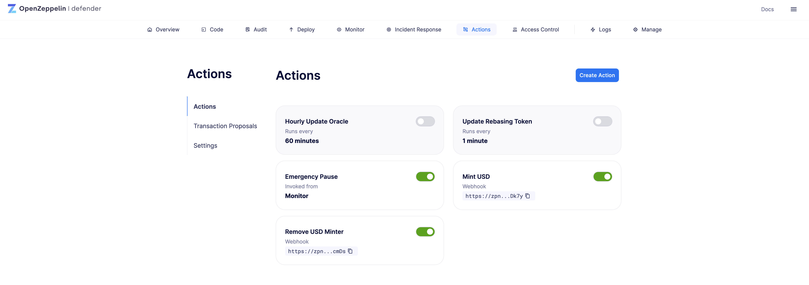
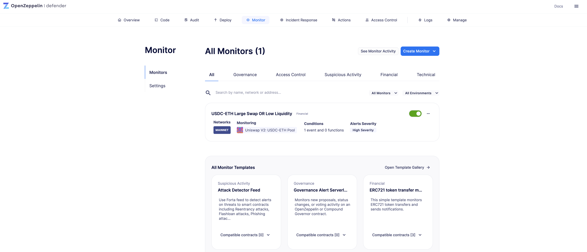
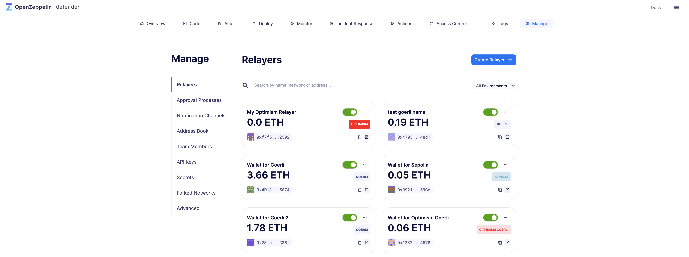
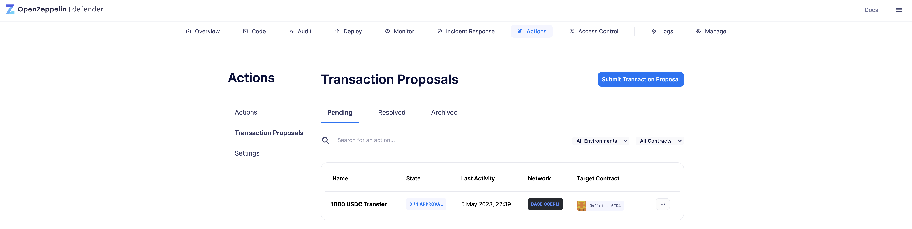
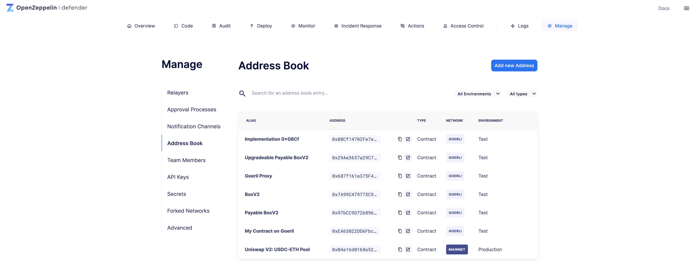
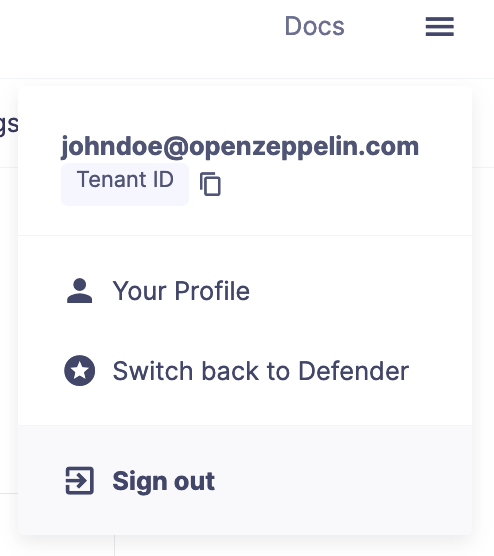

# Frequently Asked Questions (FAQ)
OpenZeppelin Defender 2.0 是 Defender 的更新版本，它提供了更优的用户体验、更清晰的界面和一系列功能，这些新功能在 DevSecOps 生命周期中提供了更加流畅的体验。

## Defender 2.0 是否支持 Defender 1.0 中的相同功能？
是的。Defender 1.0 中的功能在新版本中都能找到，尽管可能会有一些名称上的变化。

* 自动任务现在被称为自动操作

* 哨兵现在被称为监控器

* 中继器现在位于管理部分

* 管理部分的活跃提案现在位于行动部分的交易提案中

* 管理合约、多签和EOA的地址簿现在位于管理部分，之前在管理部分

**Actions - formerly Autotask**

**Monitors - formerly Sentinels**

**Relayers - located under the Manage section**

**Transaction Proposals - formerly Admin proposals**

**Address Book - located under the Manage section used to manage contracts, EOAs, and multisigs, formerly under the Admin section**

## 我如何获得 Defender 2.0 beta 版本的早期访问？
你可以使用以下链接提交加入 beta 计划的请求，以获得早期访问权限。一旦你的请求获得批准，你将收到一封电子邮件，其中包含如何完成的流程以及如何从您当前的 Defender 账户启用 Defender 2.0 的指导。

## 现有的 Defender 版本是否仍然得到支持？
是的。我们的团队将继续维护 Defender，并在可预见的未来继续提供支持。我们会在事情进展中与你沟通我们的计划，确保现有的 Defender 用户有一个平滑的升级路径。

## 我是否能够将现有的 Defender 配置导入到 Defender 2.0 beta 版本？
是的。所有现有的自动任务、哨兵等配置将自动导入到 Defender 2.0 beta 版本中，并采用新功能的命名约定。

## Defender 2.0 何时会普遍可用？
目前还没有具体时间表。我们将收集来自 beta 阶段的反馈，并根据我们收集的数据，我们将宣布我们的计划，使 Defender 2.0 普遍可用。

## Defender 1.0 和 Defender 2.0 之间是否有任何破坏性变更？
是的，API 端点有多处变化，这将要求你更新你的集成。你可以访问新的 API 文档和 SDK 来了解更多信息。

## Defender 2.0 是否提供与 Defender 1.0 相同的订阅？
我们还没有最终确定新的订阅服务详情。一旦它们确定下来，我们将通知现有用户预期的变化。

## 如果我已经迁移到 Defender 2.0 beta，我可以切换回 Defender 1.0 吗？
是的。你可以通过点击导航菜单中的“切换回 Defender”选项，在 Defender 2.0 beta 和现有的 Defender 版本之间来回切换。

## Defender 2.0 beta 是否提供相同水平的支持？
是的。你可以通过与现有 Defender 版本相同的渠道提交支持请求来寻求 Defender 2.0 的帮助。此外，你还可以直接从网页应用程序使用专门的反馈表单提交反馈或报告问题。