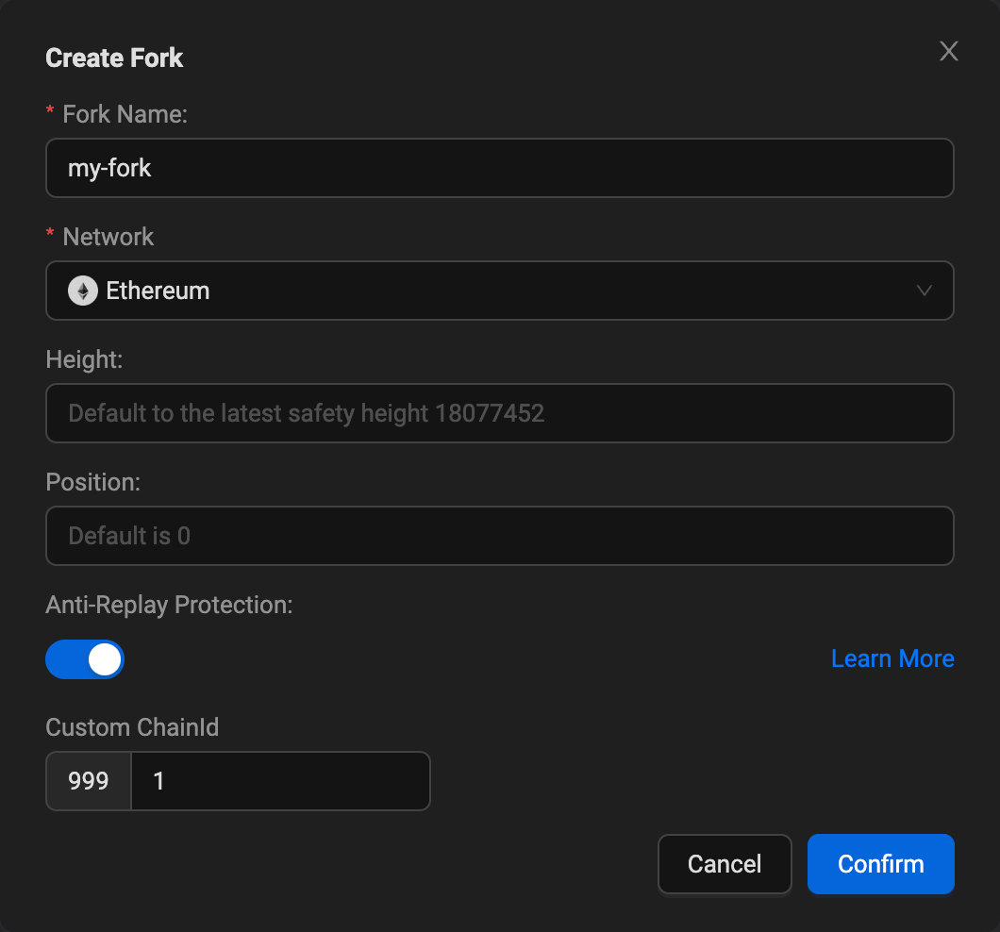
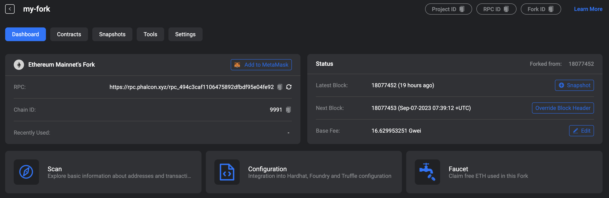
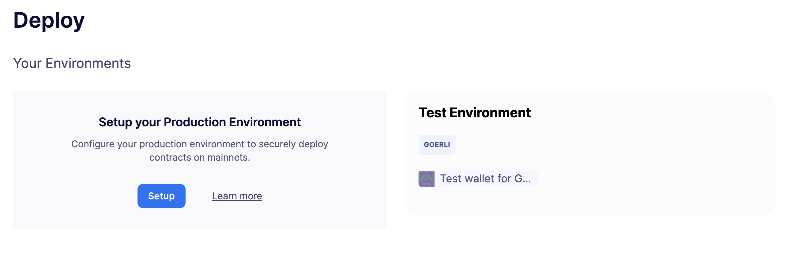
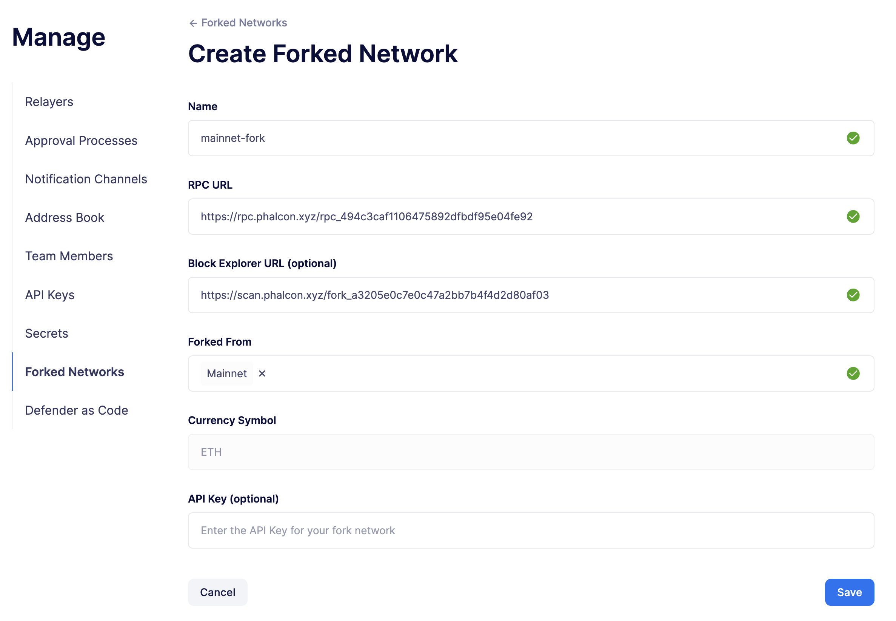
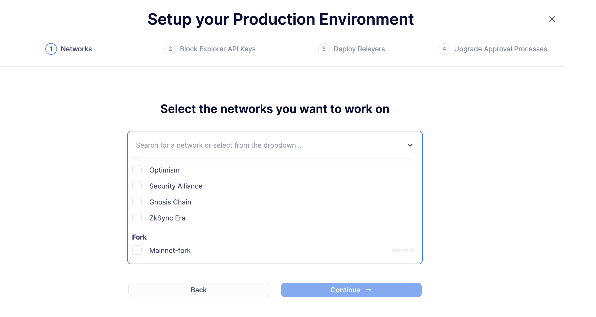
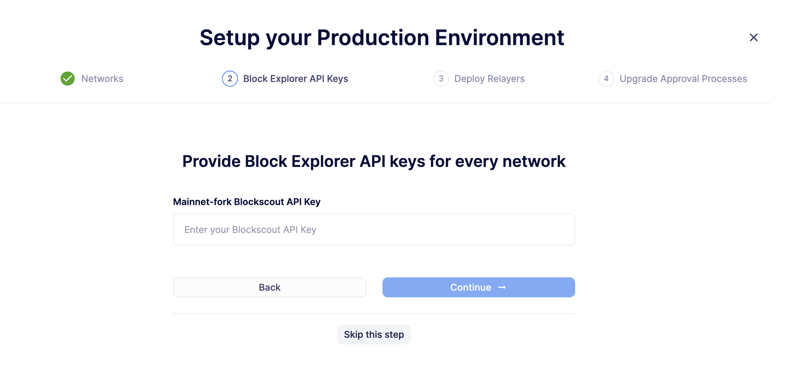
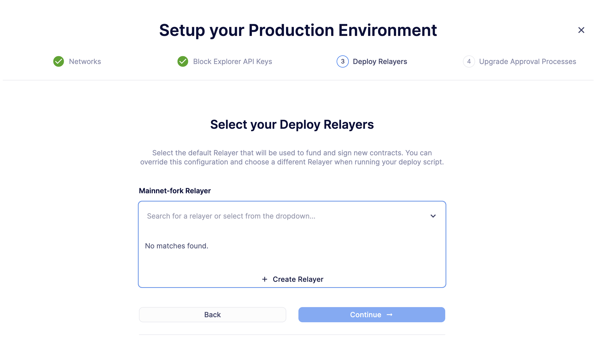

# Deploy a smart contract on a forked network
Defender 2.0 使你能够利用定制的网络分叉来部署和测试智能合约，以及相关配置，例如操作、监控和事件响应。本指南将引导你完成在分叉网络上部署智能合约并与之交互的步骤。

## Pre-requisites
你可以在[此处](https://www.openzeppelin.com/defender2-waitlist)注册以获取 Defender 2.0 的早期访问权限。

## 1. Configure your forked network

你将在 [Phalcon](https://phalcon.xyz/) 上设置一个分叉网络，并将此网络添加到 Defender 2.0。要配置分叉网络，请按照以下步骤操作：

1. 在 [Phalcon](https://phalcon.xyz/) 上注册一个账户并使用以太坊主网作为源网络创建一个新的分叉。

2. 确保激活反重放保护，以使用独特的链 ID 来为你的分叉，防止与公共链 ID 冲突。



3. 复制你分叉网络的 RPC URL 和 Explorer URL（可以在“扫描”下找到）。你需要它来将网络添加到 Defender 2.0。



4. 在 Web 浏览器中打开 [Defender 2.0 分叉网络](https://defender.openzeppelin.com/v2/#/manage/networks/forks)。

5. 点击**Add Forked Network**。



6. 输入你在 Phalcon 仪表板中找到的分叉网络的详细信息。

7. 点击**Save**。



> NOTE
你可以使用任何提供商来分叉网络，例如 [Conduit](https://conduit.xyz/)。但是，我们建议使用 Phalcon，因为它是免费且易于使用的。

## 2. Configure the deploy environment
你将为刚刚添加到 Defender 2.0 的分叉网络设置部署环境。要配置部署环境，请按照以下步骤操作：

1. 在 Web 浏览器中打开 [Defender 2.0 部署](https://defender.openzeppelin.com/v2/#/deploy)。

2. 点击**Setup**以配置你的生产环境（或者如果你的网络从测试网分叉，设置一个测试环境）。


3. 从网络下拉菜单中，选择你刚刚添加的分叉网络。



4. 点击**Next**继续。

5. 当被要求提供区块浏览器 API 密钥时，点击**Skip this step**，因为分叉网络**无法使用区块浏览器 API 密钥**。



6. 在部署向导的第 3 步中，通过点击下拉菜单中的**Create Relayer**来创建一个新的中继器，你的部署交易将从中发起。



7. 最后，当被要求选择升级审批流程时，点击**Skip this step**。目前，分**叉网络不支持升级**。

8. 确保复制生成的团队 API 密钥并将其存放在安全的地方。你将需要它们来与你的部署环境进行交互。

你的部署环境现在已经设置好了！

> NOTE
你应该为中继器账户充足的 ETH 以支付你的部署交易的燃气费用。大多数提供商都有一个水龙头，你可以使用它来为你的中继器账户充值。对于 Phalcon，你可以在仪表板上找到这个。

## 3. Deploy a smart contract on a forked network
你将在刚刚添加到 Defender 2.0 的分叉网络上部署智能合约。要部署智能合约，请按照以下步骤操作：

1. 设置一个 JavaScript 项目并安装 [defender-sdk-deploy-client](https://www.npmjs.com/package/@openzeppelin/defender-sdk-deploy-client) NPM 包。或者，你可以使用 OpenZeppelin Defender SDK 存储库中提供的 [defender-sdk 部署示例脚本](https://github.com/OpenZeppelin/defender-sdk/blob/main/examples/deploy-contract/index.js)。

部署代码可能看起来像这样：
```
// 检索并确认在你的分叉网络上部署的审批流程
const config = await client.deploy.getDeployApprovalProcess('mainnet-fork');
console.log(config);

// 使用上面检索到的审批流程部署一个简单的 Box 合约
const deployment = await client.deploy.deployContract({
    contractName: 'Box',
    contractPath: 'contracts/Box.sol',
    network: 'mainnet-fork',
    artifactPayload: JSON.stringify(artifactFile),
    licenseType: 'MIT',
    verifySourceCode: true,
    // 仅在你希望使用 `CREATE2` 时提供 `salt`。否则，省略此字段以使用 `CREATE`。
    salt: "a-unique-salt"
});

// 检索部署状态
const deploymentStatus = await client.deploy.getDeployedContract(deployment.deploymentId);
console.log(deploymentStatus);
```

1. 运行脚本以部署合约。**请注意，**提供盐将使用 CREATE2 部署合约。否则，合约将使用 CREATE 操作码部署。有关[部署的注意事项](../../Tutorials/Deploy/Deploy.md#caveats)，请访问文档。

部署完成后，你可以在 [Defender 2.0 部署仪表板](https://defender.openzeppelin.com/v2/#/deploy/environment/production)上跟踪部署状态。

## Next steps
恭喜！你已经成功在分叉网络上部署了智能合约。如果你提供了 blockExplorerUrl，你可以在分叉网络的区块浏览器上验证交易。

> NOTE
部署合约后，我们建议在 Defender 2.0 上创建监控器并设置操作。了解如何设置监控器，请点击[这里](../../Tutorials/Monitor/Monitor.md)，使用操作的教程，请点击[这里](../../Tutorials/Actions/Actions.md)。

## Reference
* [Deploy Documentation](../../Modules/Deploy.md)

* [Actions Documentation](../../Modules/Actions/Actions.md)

* [Monitor Documentation](../../Modules/Monitor/Monitor.md)

* [Phalcon](https://phalcon.xyz/)

* [Conduit](https://conduit.xyz/)