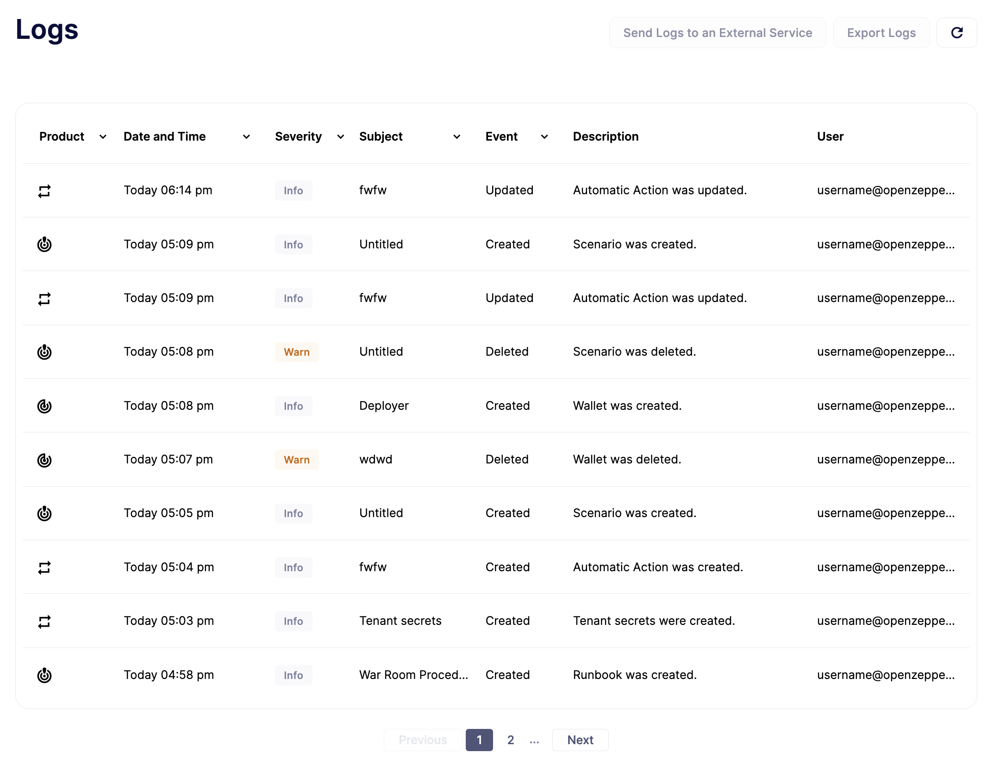
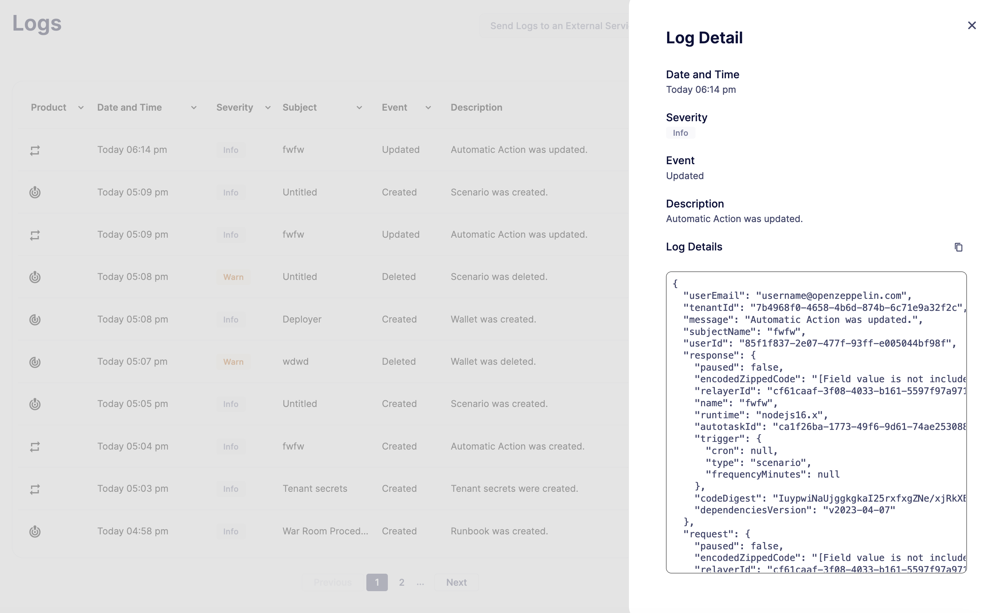

# Logs
Defender 2.0 生成系统中每个可能相关事件的日志记录。这包括手动操作，如修改操作或监视器，以及自动活动，如发送交易或触发通知。日志可以选择性地转发到 Datadog 和 Splunk 进行聚合或导出。

## Use cases
* 通过监控应用程序中的登录和活动来跟踪团队用户的行为

* 从失败的登录尝试中检测对基础设施的潜在攻击

* 跟踪中继器活动以了解从你的账户发送的交易

* 保留所有模块配置更改的审计跟踪

* 根据严重性、类型、用户、模块、时间等进行过滤

## Log Entries
每个日志条目的结构如下：

* 模块：日志条目的来源，例如监视器、操作、事件响应、部署等。

* 日期和时间：日志条目生成的日期和时间，格式为“日 月 年”以及浏览器本地时区的12小时制时间格式

* 严重性：日志条目的严重性级别，范围从跟踪到错误

* 主题：生成日志的触发器/原因。如果与合约相关，则显示合约名称

* 事件：记录的活动类型。例如，创建、添加、委托、更新等。

* 描述：事件的详细信息。例如，合约被更新，地址簿条目被更新等。

* 用户：直接或间接生成日志条目的团队用户

你可以点击每个日志条目以获取详细视图，其中包括租户ID、用户ID、活动响应、请求、日志ID、时间戳等。

## Log Forwarding
生成的日志可以转发到 Datadog 和 Splunk，或任何支持 API 密钥认证的其他服务。你可以使用此功能将基础设施中的所有日志聚合到一个地方。

## Setup Log Forwarding Destination
要设置日志转发目的地，请打开“日志”页面，然后点击“将日志发送到外部服务”按钮。

表单字段：

* **URL** 字段是必填字段。所有日志都通过 HTTP POST 转发到此 URL 地址。

* **API 头名称**是可选的。这是包含 API 密钥值的请求头的名称。大多数日志管理服务都需要它。请参阅你的日志管理服务文档以确定是否需要它。

* **API 密钥**是一个可选字段。API 密钥随每个请求一起发送以用于认证目的。大多数日志管理服务都需要它。请参阅你的日志管理服务文档以确定是否需要它。

* **日志类型**让你指定你希望基于 Defender 组件转发的 Defender 生成的日志的子集。

* **日志级别**让你指定你希望基于日志级别转发的 Defender 生成的日志的子集。例如，调试日志可用于 Autotasks 调试目的，并且它们可能包含不应导出到外部系统的数据。

> NOTE
在下一节中，我们将介绍如何使用 Splunk 和 Datadog 设置日志转发，但值得注意的是，日志转发适用于任何支持 API 密钥认证的其他服务。

### Splunk
将日志转发到 Splunk 是通过使用 Splunk HEC（HTTP 事件收集器）完成的。设置 Splunk HEC 日志记录的文档可以在[这里](https://docs.splunk.com/Documentation/Splunk/latest/Data/UsetheHTTPEventCollector)找到。

> NOTE
日志转发不适用于 Splunk 试用账户，因为 Splunk 内部原因。

示例：

* **URL：**https://username.splunkcloud.com/services/collector/raw

* **API 头名称：**Authorization

* **API 密钥：**Splunk xxxxxxxxxxxxxxxxxxxxxxxxxxx

> NOTE
URL 值是动态的，因为 URL 包括账户用户名。

> NOTE
API 密钥应包含 Splunk 前缀。

### Datadog
在 Datadog 上设置日志记录的文档可以在[这里](https://docs.datadoghq.com/logs/)找到。

示例：

* **URL：**https://http-intake.logs.datadoghq.com/api/v2/logs

* **API 头名称：**DD-API-KEY

* **API 密钥：**xxxxxxxxxxxxxxxxxxxxxxxxxxxxx

> NOTE
Datadog 在世界各地使用不同的站点。例如，如果你依赖欧洲服务器，则 URL 字段值应为 https://http-intake.logs.datadoghq.eu/api/v2/logs

> NOTE
API 密钥值可以通过打开左侧菜单中的“日志”部分从 Datadog 站点获取。转到“云”部分并选择 AWS 提供商。按照这些步骤操作后，在页面底部部分显示 API 密钥值。