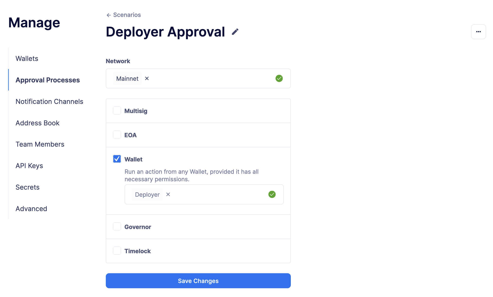
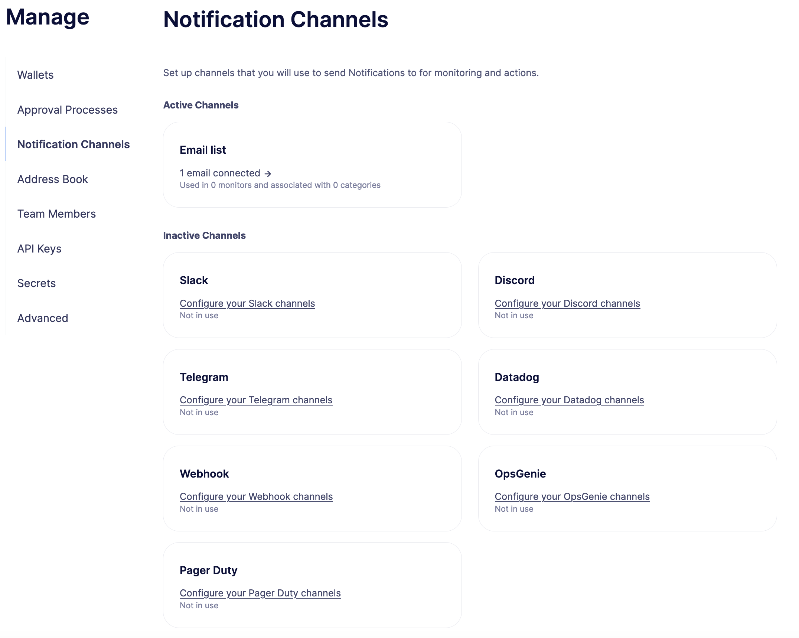
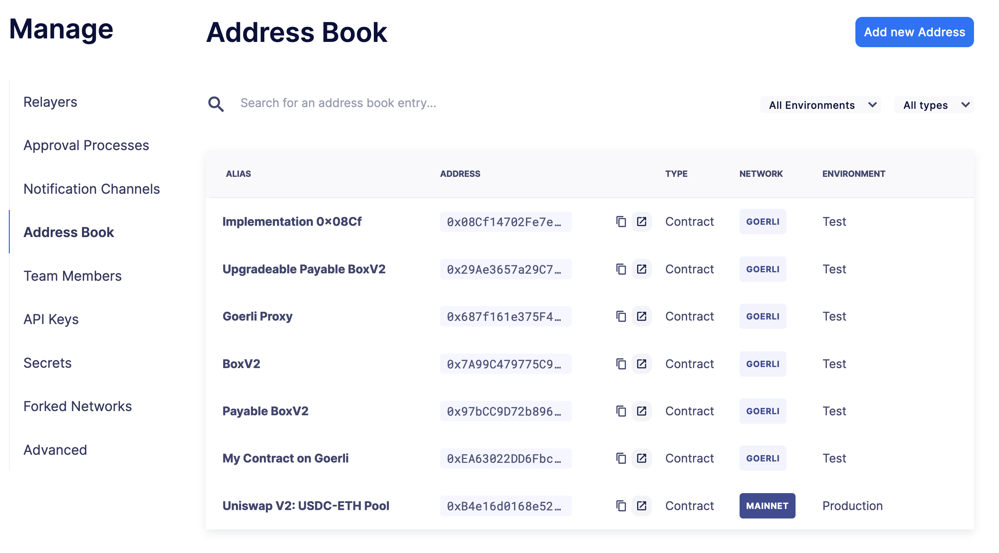
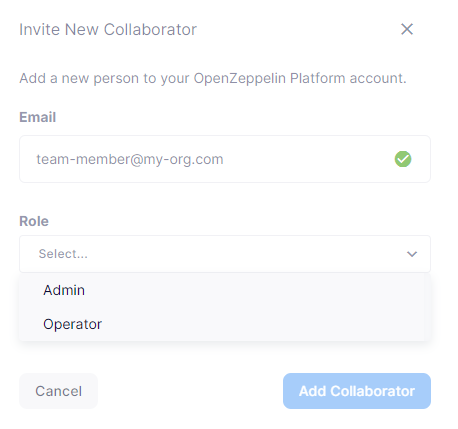
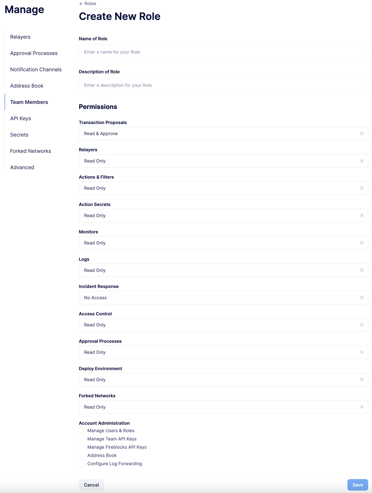
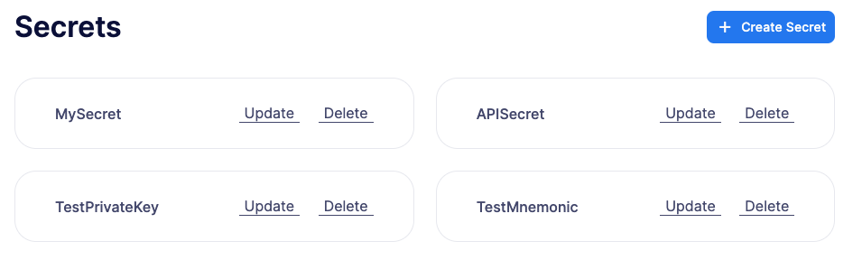
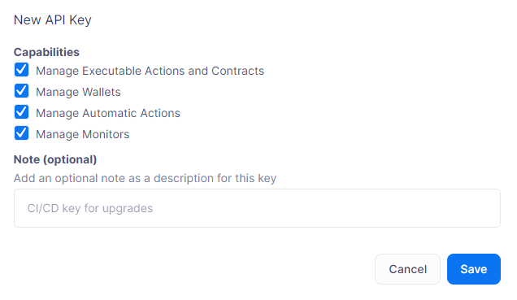
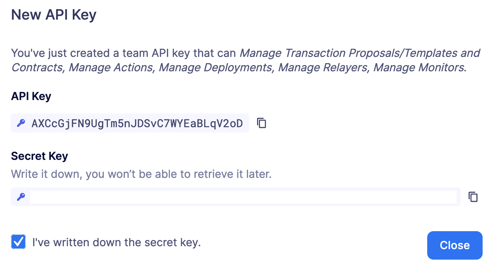
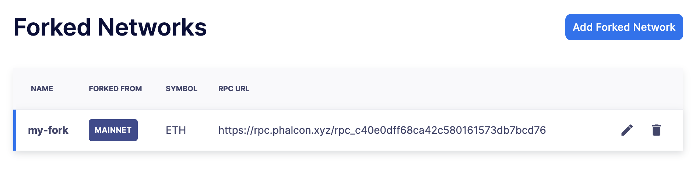
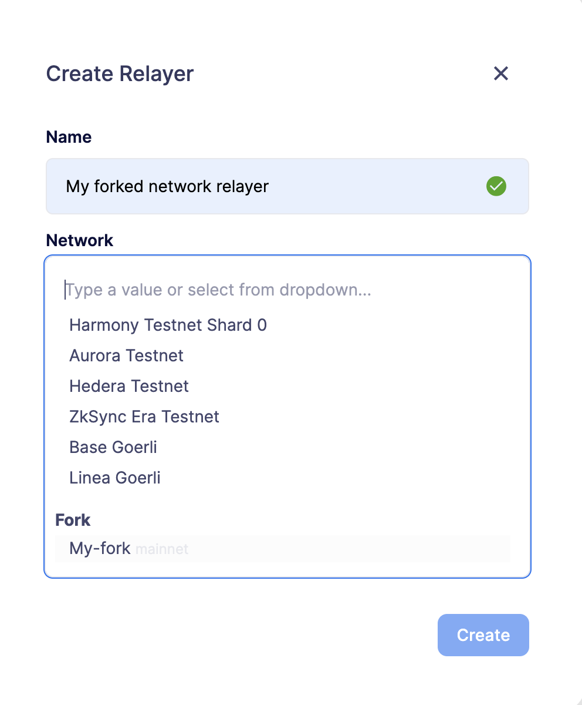

# Manage
管理与Defender 2.0配置相关的一切，包括中继器、通知渠道、地址、团队成员、API密钥等。

## Relayers
中继器用于通过Defender 2.0自动向区块链发送交易。在*中继器部分*阅读更多信息。

## Approval Processes
审批流程作为执行链上交易的包装器。它们目前包装以下内容：

* 多签名钱包

* EOA（在Defender 2.0之外）

* 中继器（在Defender 2.0内部）

* 治理合约

* 定时锁合约

* Fireblocks

它们按网络定义，并在Defender 2.0中用于执行交易，例如在*部署向导*、*操作*和*事件响应*中。


## Notification Channels
当触发时，Defender 2.0可以将通知发送到一个或多个配置的通知渠道，这些渠道可以包括Slack、电子邮件、Telegram、Discord、Datadog、PagerDuty、OpsGenie或自定义webhooks。这些通知渠道可以在监视器、操作和事件响应中使用。


### Slack Configuration
请查阅[Slack webhook文档](https://api.slack.com/messaging/webhooks)来配置Slack webhook。一旦配置好Slack，将webhook URL输入到Defender 2.0中。

* **Alias**是你为这个Slack配置起的名字。例如，你可以根据频道的名字来命名。

* **Webhook URL**是你从Slack管理控制台获得的用于接收通知的URL。

### Email Configuration
* **Alias**是你为这个电子邮件列表起的名字。（例如，开发者）

* **Emails**是你希望通知的电子邮件列表。这些可以用逗号或分号分隔。

### Discord Configuration
请查阅[Discord webhook文档](https://support.discord.com/hc/en-us/articles/228383668-Intro-to-Webhooks)来为你的Discord频道配置一个webhook。

* **Alias**是你为这个Discord配置起的名字。

* **Webhook URL**是你从Discord频道获得的用于接收通知的URL。

### Telegram Configuration
请查阅[Telegram机器人文档](https://core.telegram.org/bots#6-botfather)来使用BotFather配置一个Telegram机器人。

> NOTE
Telegram机器人必须被添加到你的频道，并且有权发布消息。

要找到频道的Chat ID，执行以下curl命令（用你的机器人token值替换），并从响应中提取chat的id值。如果你没有在响应中收到任何条目，请先向你的聊天发送一个测试消息。
```
curl https://api.telegram.org/bot$BOT_TOKEN/getUpdates
{
  "ok": true,
  "result": [
    {
      "update_id": 98xxxx98,
      "channel_post": {
        "message_id": 26,
        "sender_chat": {
          "id": -100xxxxxx5976,
          "title": "Monitor Test",
          "type": "channel"
        },
        "chat": {
          "id": -100xxxxxx5976, // <--- This is your chat ID
          "title": "Monitor Test",
          "type": "channel"
        },
        "date": 1612809138,
        "text": "test"
      }
    }
  ]
}
```

* **Alias**是这个Telegram配置的名称。

* **Chat ID**是Telegram聊天的ID。

* **Bot Token**是你在创建Telegram Bot时从BotFather那里收到的令牌。

### Datadog Configuration
Datadog配置允许Defender 2.0将自定义指标转发到你的Datadog账户。有关自定义指标的更多信息，请参阅[Datadog指标文档](https://docs.datadoghq.com/developers/metrics/)。

我们发送的指标是一个COUNT指标，代表触发通知的交易数量。我们不发送零，因此如果没有触发器，则应该预期缺少数据。每个指标都会发送两个标签：网络（rinkeby、mainnet等）和当监视器触发通知时的监视器（监视器的名称）。

> NOTE
在Datadog控制台中显示新的自定义指标可能需要几分钟的时间。

* **Alias**是这个Datadog配置的名称。

* **Api Key**是你的Datadog管理中的API密钥。

* **Metric Prefix**将在所有指标名称之前。例如，使用openzeppelin.作为前缀，监视器将发送一个名为openzeppelin.monitor的指标。

### Webhook Configuration
要配置自定义Webhook通知渠道，你只需要提供Webhook端点URL和一个用于显示目的的别名。

* **Alias**是这个Webhook端点的名称。

* **Webhook URL**是将发送通知的URL。

为了避免在大量匹配情况下，通过高并发请求压倒接收Webhook，Defender 2.0发送一个包含事件数组的JSON对象，这些事件都是在一个区块中找到的匹配事件。
```
{
  events: [...] // See Event Schema info in Action or Monitor docs
}
```

有关事件模式的更多信息，请参阅*Monitor*或*Actions*的文档。

### OpsGenie Configuration
请参阅[OpsGenie集成文档](https://support.atlassian.com/opsgenie/docs/create-a-default-api-integration/)，以配置可以创建警报的OpsGenie API集成。

* **API Key** 集成API密钥，可以在集成设置中找到

* **Instance Location** OpsGenie实例服务器所在的位置

* **Responders** 警报将路由以发送通知的团队、用户、升级和时间表。每个项目的type字段是必需的，可能的值是team、user、escalation和schedule。如果API密钥属于团队集成，此字段将被拥有者团队覆盖。应提供每个响应者的id或name。你可以参考下面的示例值（50个团队、用户、升级或时间表）

* **Visible To** 警报将对其可见但不发送任何通知的团队和用户。每个项目的type字段是必需的，可能的值是team和user。除了type字段外，还应为团队提供id或name，为用户提供id或username。请注意：警报默认情况下将对在responders字段中指定的团队可见，因此无需在visibleTo字段中重新指定它们。你可以参考下面的示例值（总共50个团队或用户）

* **Alias** 客户定义的警报标识符，也是警报去重的关键元素（最多512个字符）

* **Priority** 警报的优先级。可能的值是P1、P2、P3、P4和P5。默认值是P3

* **Entity** 警报的实体字段，通常用于指定警报相关的域（最多512个字符）

* **Actions** 将为警报提供的自定义操作（10 x 50个字符）

* **Note** 创建警报时将添加的附加注释（最多25000个字符）

* **Details** 用作警报自定义属性的键值对映射（最多8000个字符）

* **Tags** 警报的标签（20 x 50个字符）

### PagerDuty Configuration
请参阅[PagerDuty集成文档](https://support.pagerduty.com/docs/services-and-integrations)，以配置可以创建更改和警报事件的PagerDuty API v2集成。

* **Event Type** PagerDuty分类的事件类型（警报或更改）

* **Routing Key** 服务上的集成或全局规则集上集成的集成密钥（32个字符）

* **Event Action** 事件的动作类型（触发、确认或解决）

* **Dedup Key** 用于关联触发器和解决方案的去重密钥（最多255个字符）

* **Severity** 事件所描述的状态对受影响系统的感知严重程度（严重、错误、警告或信息）

* **Component** 负责事件的源机器的组件

* **Group** 服务组件的逻辑分组

* **Class** 事件的类别/类型

* **Custom_detail** 提供有关事件和受影响系统的额外详细信息的键值对映射

## Address book
地址簿允许你创建一个共享的用户友好名称仓库，用于你的账户或合约。你可以通过点击Defender 2.0中任何地方看到的地址来设置这些名称，或者你可以在“管理”部分管理整个地址簿。当你在其他模块中导入账户和合约时，Defender 2.0会自动为你创建地址簿条目。

在使用Defender 2.0的产品时，当你需要输入地址时，账户和合约信息将直接从地址簿中获取，这样你就可以在配置监视器、操作和事件响应时轻松地从地址簿中获取地址。


### Team Members
你可以在“团队成员”部分邀请、管理访问权限以及从你的Defender 2.0账户中移除团队成员。


> NOTE
如果你想将用户添加到你的团队，请确保从“团队成员”部分邀请他们。如果他们直接注册应用程序，他们将被添加到他们自己的新团队中。如果发生这种情况，请考虑让你的团队成员删除他们的账户，这样你就可以重新发送邀请加入你的团队。或者，他们可以使用不同的电子邮件地址加入你的团队。

### Roles
每个团队成员都有一个指定的角色。你可以通过基于角色的访问控制系统管理对所有Defender 2.0产品的访问、修改和执行权限。

当你邀请新用户加入你的团队时，你将为他们分配一个角色，以确定他们的访问权限。

要创建新角色，请点击“创建角色”按钮。你将被要求输入角色名称和描述，并指定用户在该角色中将获得每个产品的访问级别。你还可以指定角色将授予访问的管理权限：管理用户和角色、管理团队API密钥、管理Fireblocks API密钥、管理地址簿和配置日志转发。



保存后，新角色将可用于分配给新的或现有团队成员。自然地，如果将来你决定修改给定角色的访问级别，拥有该角色的所有用户将因此看到他们的访问级别发生变化。

> WARNING
在授予管理权限时要小心。一个有权修改角色但无权访问应用程序其他组件的用户可以修改他们自己的角色，以授予他们访问应用程序任何其他部分的权限。

### Two factor authentication (2FA)
我们强烈建议你启用2FA以提高你的Defender 2.0账户安全性。作为第二个认证因素，Defender 2.0依赖于[基于时间的一次性密码标准（TOTP）](https://en.wikipedia.org/wiki/Time-based_One-time_Password_algorithm)。要在Defender 2.0上启用2FA，你需要一个符合TOTP的应用程序，如[Authy](https://authy.com/)或Google Authenticator。每个用户都可以在他们的个人资料下启用2FA，从右上角的用户菜单中可以访问。Defender 2.0将指导用户完成必要的步骤。

### Password reset
要更改你的Defender 2.0用户密码，请按照以下步骤操作。

* 如果你已经登录，请通过打开右上角菜单并点击**Sign out**来登出。你将被重定向到登录页面。

* 从Defender 2.0登录页面，点击**Sign in**。你将被重定向到登录页面。

* 从Defender 2.0登录页面，点击 **Forgot your password?**。

* 输入你的电子邮件地址并点击**Reset my password**。你将很快收到一封电子邮件，其中包含如何继续密码重置过程的说明。

## Secrets
秘密是键值对大小写敏感的字符串，可以从任何操作中使用event.secrets对象访问。你可以定义尽可能多的秘密以供你的操作使用。秘密在你所有的操作中共享，并且不特定于单个操作。
```
exports.handler = async function(event) {
  const { mySecret, anApiKey } = event.secrets;
}
```

秘密被加密并存储在安全的保险库中，只有在你的操作运行中才解密注入。一旦写入，秘密只能从用户界面删除或覆盖，但不能读取。

> WARNING
操作可能会记录秘密的值，意外泄露它。



你可以使用秘密来存储访问外部API的安全密钥，或者你不想在操作代码中暴露的任何其他秘密值。

> NOTE
虽然你也可以使用操作秘密来存储用于签名消息或交易的私钥，但我们建议你使用*中继器*代替。中继器的签名操作是在安全的保险库中执行的，提供了比在操作运行中加载私钥并在那里签名更高的安全级别。

## 
在API密钥中，你可以管理客户端用于访问你账户的Defender 2.0 API的密钥，以及如果你使用Fireblocks进行审批，则输入集成API密钥。请注意，中继器有自己的API密钥，这些密钥与这些API密钥分开，并且直接在管理中继器中配置。

要添加API密钥，请点击“创建API密钥”按钮。



选择你希望与API密钥关联的API功能：

* **管理交易提案和合约**，用于创建和发布操作以及管理合约。

* **管理中继器**，用于创建中继器和更改中继器策略。

* **管理自动操作**，用于创建和修改自动操作及其配置。

* **管理监视器**，用于创建和管理监视器及其配置。

创建API密钥后，Defender 2.0将向你展示详细信息。



确保复制密钥，它将被要求用于访问，一旦表单关闭后将无法再次访问。

## Forked Networks (coming soon)
在“分叉网络”部分，你可以管理和监督你的分叉网络。这些网络让你测试安全设置的效率，并提供在测试网和主网上推出之前识别和修复任何问题的重要机会。



设置分叉网络是通过点击“创建分叉网络”按钮完成的。这个操作要求你为分叉网络提供一个名称，并选择你打算从中分叉的基础网络。你可以从Defender 2.0支持的任何网络中进行选择。网络的货币符号将根据你选择的网络自动填充。此外，你还需要输入分叉网络的RPC URL，以及（如果需要）用于访问的API密钥。

为了改善用户体验，你还可以选择包括区块浏览器URL。

创建后，网络将可用于任何需要网络选择的Defender 2.0模块中。这在执行任务时特别有价值，例如建立审批流程、配置中继器或部署合约。



> NOTE
一旦你创建了一个分叉网络，你就不能编辑它的名称。如果你需要更改名称，你将需要删除并重新创建分叉网络。当删除分叉网络时，所有相关资源也将被删除。这包括审批流程、中继器、合约、地址簿条目等。

## Advanced
在高级选项卡中，你可以从当前配置导出Defender 2.0账户的无服务器配置文件。

这可以用来为你的账户设置自动化资源管理，使用代码作为配置。此外，在高级选项中，你还可以删除你的Defender 2.0账户。此操作是不可逆的，所有Defender 2.0配置将被删除，所有产品功能将被取消和移除。