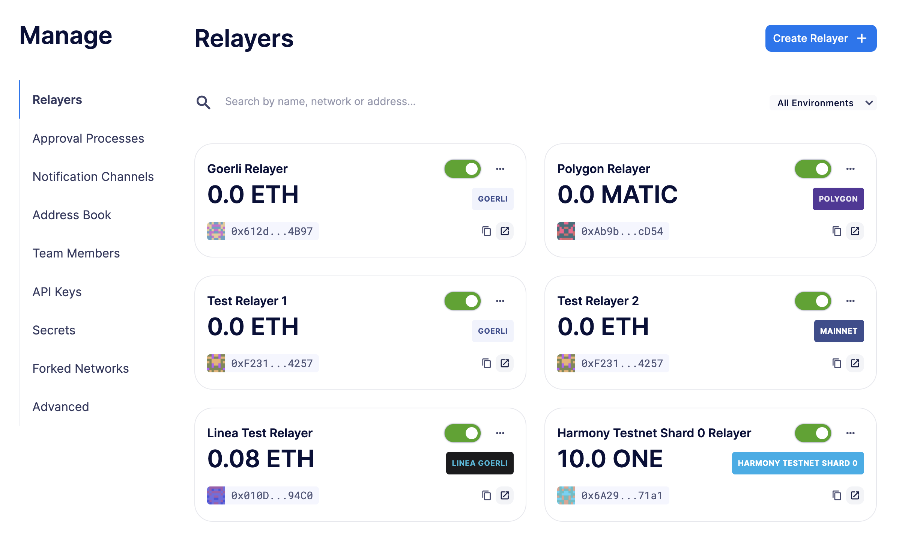
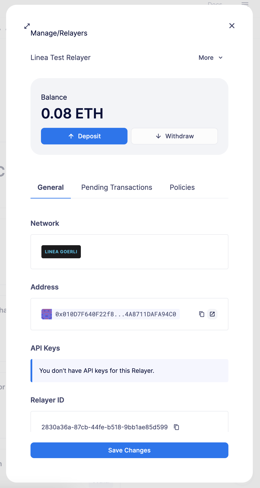
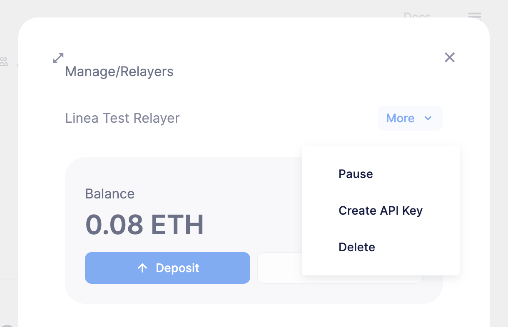
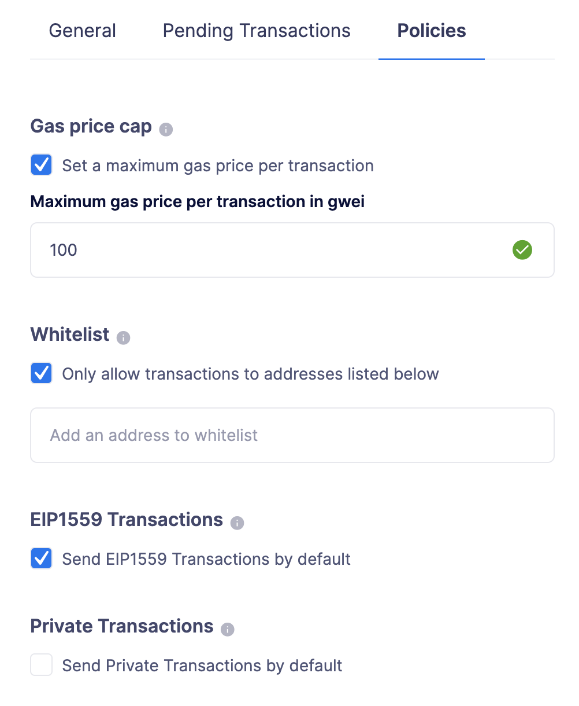
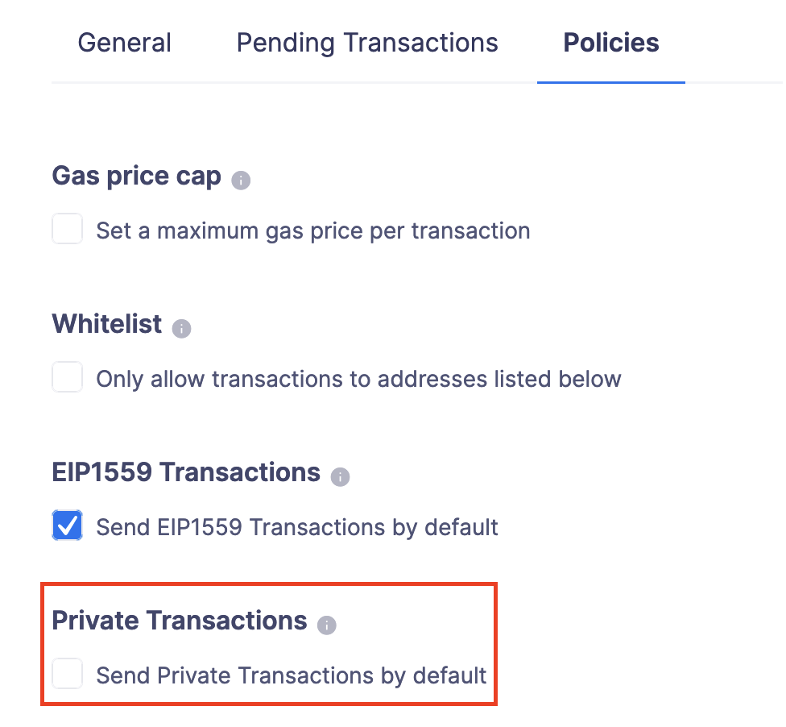
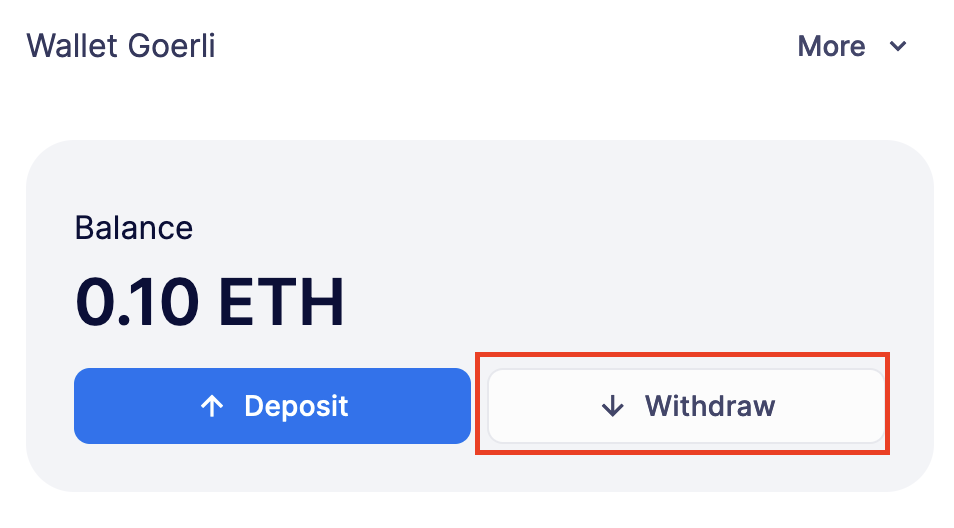
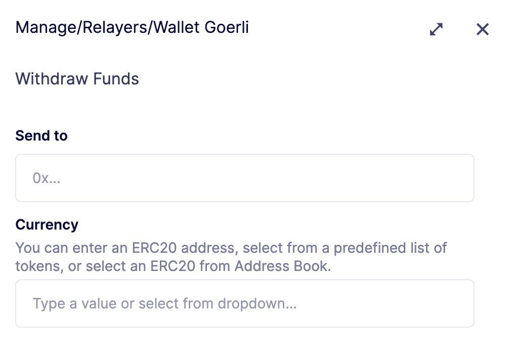

# Relayers
中继器允许你通过常规API请求或通过其他Defender 2.0模块（如Actions、Incident Response和Deploy）发送链上交易。中继器还自动支付gas用，并负责私钥的安全存储、交易签名、nonce管理、燃气价格估算和重新提交。使用中继器，你无需担心在后端服务器上存储私钥或监控燃气价格和交易以确保它们得到确认。

## Use cases
* 自动执行智能合约上的交易以触发状态转换。

* 使用外部数据更新链上预言机。

* 发送元交易以构建无gas用的体验。

* 对你的应用中的新用户进行注册，通过空投代币反应。

* 将资金从协议合约扫到安全钱包，

* 构建具有完整自定义逻辑和灵活性的机器人。

* What’s a Relayer?
中继器是一个专门分配给你团队的基于以太坊的外部拥有账户（EOA）。每次你创建一个新的中继器时，Defender 2.0都会在一个安全的保险库中创建一个新的私钥。每当你请求Defender 2.0通过该中继器发送交易时，都会使用相应的私钥进行签名。

你可以将每个中继器视为发送交易的队列，通过同一个中继器发送的所有交易都将按顺序发送，并且由你的团队专有控制。在这里了解更多技术实现。


要创建中继器，只需点击页面右上部分的**Create Relayer**按钮，指定一个名称并选择网络。


> IMPORTANT
请记住，你需要为每个中继器单独注资ETH（或原生链代币），以确保它们有足够的资金支付你发送的交易的gas。如果中继器的资金降至0.1 ETH以下，Defender 2.0将向你发送电子邮件通知。

> NOTE
通过部署向导创建的测试网中继器将在可能的情况下自动注资。在这里阅读更多信息。

### API Keys
每个中继器可以有一个或多个与之关联的**API密钥**。为了通过中继器发送交易，你需要使用API密钥/密钥对对请求进行身份验证。你可以根据需要创建或删除API密钥，这不会改变发送地址或中继器余额。

要为中继器创建API密钥，请点击中继器，然后点击**More**按钮以展开下拉菜单并选择**Create API Key**。


创建API密钥后，请务必记下密钥。API密钥在创建时只显示一次——如果你没有记下来，它将永远丢失。


> IMPORTANT
中继器的API密钥与其私钥无关。私钥始终保存在安全的密钥库中，且从不暴露（有关更多信息，请参阅*安全考虑部分*）。这种解耦允许你自由地轮换API密钥，同时保持中继器的同一地址。

### Addresses
每当你创建一个中继器时，都会创建一个新的EOA来支持它。出于安全原因，不可能将现有的私钥导入到中继器中，也不可能导出Defender 2.0创建的中继器的私钥。如果你在系统中授予中继器地址一个特权角色以避免锁定，请考虑拥有一个行政方法，以便在需要时将其切换到不同的地址。

### Policies
你可以通过指定策略来限制中继器的行为。

要配置中继器的策略，请转到[管理页面](https://defender.openzeppelin.com/v2/#/manage/relayers)，选择中继器，然后转到**策略**选项卡。然后你将看到一个表单，你可以选择启用策略并调整其参数。


#### Gas price cap
为使用中继器发送的每笔交易指定最高燃气价格。启用此策略时，Defender 2.0将覆盖任何超出指定上限的交易的gasPrice或maxFeePerGas。请考虑到交易的燃气价格是基于中继器实际发送交易以进行挖掘时刻的燃气价格预测来指定的，因此这项策略可以用作对燃气价格激增的保护。

> NOTE
除了这里可以指定的最高燃气价格策略之外，Defender 2.0还为那些有最低燃气要求的网络实施了最低燃气价格策略。请与你使用的各个网络核实要求。

#### Receiver whitelist
为使用中继器发送的每笔交易指定授权合约列表。Defender 2.0将拒绝并丢弃任何目的地址不在列表中的交易。

> NOTE
白名单仅适用于交易的to字段。它不过滤ERC20或其他资产接收者。

#### EIP1559 Pricing
指定中继器发送的交易是否应默认为EIP1559。这适用于中继器发送具有动态燃气定价的交易或未指定gasPrice或maxFeePerGas/maxPriorityFeePerGas的情况。请注意，只有对于兼容EIP1559的网络，才会显示此策略选项。

> NOTE
对于新的中继器，默认启用EIP1559定价策略。如果你有一个未默认选择加入的中继器，你始终可以启用此标志。

#### Private transactions
指定交易是否应通过私有内存池发送。这意味着交易在被包含在区块中之前不会公开显示。

> NOTE
私有交易仅对goerli和mainnet启用，通过使用[Flashbots Protect RPC](https://docs.flashbots.net/flashbots-protect/rpc/quick-start)。因此，在通过Defender 2.0发送私有交易时，可能适用相同的[关键考虑因素](https://docs.flashbots.net/flashbots-protect/rpc/quick-start#key-considerations)。


## Sending transactions
通过中继器发送交易的最简单方法是使用[Defender 2.0 SDK](https://www.npmjs.com/package/@openzeppelin/defender-sdk)包。客户端使用API密钥/秘密初始化，并为通过相应中继器发送交易提供了一个简单的API。
```
const { Defender } = require('@openzeppelin/defender-sdk');
const client = new Defender({
  relayerApiKey: 'YOUR_API_KEY',
  relayerApiSecret: 'YOUR_API_SECRET'
});

const tx = await client.relayerSigner.sendTransaction({
  to, value, data, gasLimit, speed: 'fast'
});
```

> NOTE
你在初始化Relayer客户端时不需要输入私钥，因为私钥被安全地保存在Defender 2.0保险库中。

> IMPORTANT
目前，zkSync没有精确计算gasLimit的方法，除了使用eth_estimateGas端点。因此，Defender 2.0无法进行任何gasLimit计算，并且会用RPC估算值覆盖用户输入。

### Using ethers.js
Relayer客户端通过自定义[签名者](https://docs.ethers.org/v6/api/providers/#Signer)与[ethers.js](https://docs.ethers.io/v6/)集成。这允许你切换到Relayer并且在代码库中只需做最小的更改就可以发送交易。
```
const { Defender } = require('@openzeppelin/defender-sdk');
const { ethers } = require('ethers');

const credentials = { relayerApiKey: YOUR_RELAYER_API_KEY, relayerApiSecret: YOUR_RELAYER_API_SECRET };
const client = new Defender(credentials);

const provider = client.relaySigner.getProvider();
const signer = client.relaySigner.getSigner(provider, { speed: 'fast', validUntil });

const erc20 = new ethers.Contract(ERC20_ADDRESS, ERC20_ABI, signer);
const tx = await erc20.transfer(beneficiary, 1e18.toString());
const mined = await tx.wait();
```

在上面的例子中，我们还使用了DefenderRelayProvider来对网络进行调用。签名者可以与任何提供者一起工作，例如ethers.getDefaultProvider()，但是你也可以依赖Defender 2.0作为网络提供者。

你可以在[这里](https://www.npmjs.com/package/@openzeppelin/defender-sdk-relay-client)阅读更多关于ethers集成的信息。

### 
Relayer客户端也通过自定义[提供者](https://web3js.readthedocs.io/en/v1.3.4/web3-eth.html#providers)与[web3.js](https://web3js.readthedocs.io/)集成。这允许你使用Relayer发送交易，并使用熟悉的web3接口查询网络。
```
const { Defender } = require('@openzeppelin/defender-sdk');
const Web3 = require('web3');

const credentials = { relayerApiKey: YOUR_RELAYER_API_KEY, relayerApiSecret: YOUR_RELAYER_API_SECRET };
const client = new Defender(credentials);

const provider = client.relaySigner.getProvider();

const web3 = new Web3(provider);

const [from] = await web3.eth.getAccounts();
const erc20 = new web3.eth.Contract(ERC20_ABI, ERC20_ADDRESS, { from });
const tx = await erc20.methods.transfer(beneficiary, (1e18).toString()).send();
```

在上面的例子中，转账交易由中继者（Relayer）签名并广播，任何额外的JSON RPC调用都通过Defender 2.0的私有端点路由。

你可以在[这里](https://www.npmjs.com/package/@openzeppelin/defender-sdk-relay-client)阅读更多关于web3集成的信息。

### EIP1559 support
由于并非所有支持的网络都兼容EIP1559，因此只有被**识别为兼容并由团队启用的网络**才能启用EIP1559交易支持。

中继者可以通过以下方式发送EIP1559交易：

* 通过用户界面发送交易，并启用*EIP1559定价*策略（EIP1559Pricing policy）

* 通过API发送交易，并指定maxFeePerGas和maxPriorityFeePerGas

* 通过API发送交易，并指定速度以及启用*EIP1559定价*策略

一旦发送任何交易，它在其生命周期的每个阶段（如替换和重新定价）都将**保持相同的类型**，因此如果交易已经提交，目前无法更改其类型。

> NOTE
任何尝试向不兼容EIP1559的网络发送maxFeePerGas或maxPriorityFeePerGas的操作都将被中继者拒绝并丢弃。

你可以通过查看中继者策略来判断一个网络是否支持EIP1559。如果EIP1559*定价策略*没有显示，这意味着我们尚未为该网络添加EIP1559支持。

> NOTE
如果你发现我们已经支持的EIP1559兼容网络但没有启用EIP，请通过https://www.openzeppelin.com/defender2-feedback随时联系我们。

### Private transactions
私有交易允许中继者发送交易而不在公共内存池中可见，而是通过使用特殊的eth_sendRawTransaction提供者的私有内存池中继交易，这将根据网络和当前支持情况（如Flashbots网络覆盖）而有所不同。

中继者可以通过以下任何方式发送私有交易：

* 通过API发送交易，并启用*privateTransactions*策略

* 通过API发送交易，并将isPrivate参数设置为true

* 通过用户界面发送交易，并勾选Mempool Visibility复选框


> NOTE
向不支持私有交易的网络发送带有isPrivate标志设置为true的交易将被中继者拒绝并丢弃。
目前，只有以下网络得到支持

* **主网**：通过[Flashbots Protect RPC](https://docs.flashbots.net/flashbots-protect/rpc/quick-start)

* **Goerli**：通过[Flashbots Protect RPC](https://docs.flashbots.net/flashbots-protect/rpc/quick-start)

### Speed
中继者可能会接受一个速度参数，而不是通常的gasPrice或maxFeePerGas/maxPriorityFeePerGas，这个速度参数可以是safeLow、average、fast或fastest。这些值在交易发送或重新提交时映射到实际的燃料价格，并且根据网络状态而变化。

如果提供了速度参数，交易将根据EIP1559定价中继者策略来定价。

> NOTE
主网的燃料价格和优先费用是基于[EthGasStation](https://ethgasstation.info/)、[EtherChain](https://etherchain.org/tools/gasPriceOracle)、[GasNow](https://www.gasnow.org/)、[Blockative](https://docs.blocknative.com/gas-platform)和[Etherscan](https://etherscan.io/gastracker)报告的值计算的。在Polygon及其测试网中，使用的是[gas station](https://gasstation-mainnet.matic.network/v2)。在其他网络中，燃料价格是通过对网络的eth_gasPrice或eth_feeHistory调用获得的。

### Fixed Gas Pricing
或者，你可以为交易指定*一个固定的gasPrice*或**一个固定的maxFeePerGas和maxPriorityFeePerGas**组合，通过设置gasPrice参数或maxFeePerGas和maxPriorityFeePerGas参数。具有固定定价的交易要么以指定的定价被挖掘，要么如果在*validUntil*时间之前不能被挖掘，就会被替换为NOOP交易。

请记住，你必须提供速度、gasPrice、maxFeePerGas/maxPriorityFeePerGas中的一个，或者不提供，但不能在发送交易请求时混合使用它们。

> NOTE
每当发送交易请求时不带任何定价参数，它将以快速的默认速度定价。

> NOTE
如果你同时提供了固定的maxFeePerGas和maxPriorityFeePerGas，请确保maxFeePerGas大于或等于maxPriorityFeePerGas。否则，它将被拒绝。

### Valid Until
通过中继者的每笔交易都有效，直到有效期至（validUntil）时间。在有效期至时间之后，交易将被替换为NOOP交易，以防止中继者在交易的nonce上卡住。NOOP交易除了推进中继者的nonce之外，不做任何事情。

validUntil默认为交易创建后的8小时。请注意，你可以将validUntil与*固定定价*结合使用，以实现极快的挖掘时间，并在gasPrice或maxFeePerGas上超过其他交易。

如果你使用的是ethers.js，你可以设置一个validForSeconds选项，而不是validUntil。在下面的例子中，我们配置了一个DefenderRelaySigner来发出一个交易，该交易在创建后的120秒内有效。
```
const signer = new DefenderRelaySigner(credentials, provider, { validForSeconds: 120 });
```

> NOTE
validUntil 是一个 UTC 时间戳。确保使用的是 UTC 时区，而不是本地时区。

### Transaction IDs
由于中继者可能会在交易未能在预期时间内确认的情况下，用更新的燃气价格重新提交交易，因此给定交易的哈希值可能会随时间变化。为了追踪某个特定交易的状态，中继者 API 返回一个 transactionId 标识符，你可以使用它来[查询](https://www.npmjs.com/package/@openzeppelin/defender-sdk-relay-client)交易。
```
const tx = await relayer.query(tx.transactionId);
```

> NOTE
查询端点将从Defender 2.0服务返回交易的最新视图，该服务每分钟更新一次。

### Replace Transactions
尽管Relayer会在交易未确认时自动以更高的燃气价格重新提交交易，并且会在它们的有效期截止时间后自动取消它们，但如果交易尚未被挖掘，你仍然可以手动替换或取消你的交易。这允许你在交易不再有效时取消它，调整其TTL，或提高其速度或燃气价格。

为此，请使用@openzeppelin/defender-sdk-relay-client的replaceByNonce或replaceById功能。
```
// Cancel tx payload (tx to a random address with zero value and data)
replacement = {
  to: '0x6b175474e89094c44da98b954eedeac495271d0f',
  value: '0x00',
  data: '0x',
  speed: 'fastest',
  gasLimit: 21000
};

// Replace a tx by nonce
tx = await relayer.replaceTransactionByNonce(42, replacement);

// Or by transactionId
tx = await relayer.replaceTransactionById('5fcb8a6d-8d3e-403a-b33d-ade27ce0f85a', replacement);
```

你也可以在使用 ethers 或 web3.js 适配器发送交易时通过设置 nonce 来替换一个挂起的交易:
```
// Using ethers
erc20 = new ethers.Contract(ERC20_ADDRESS, ERC20_ABI, signer);
replaced = await erc20.functions.transfer(beneficiary, 1e18.toString(), {
  nonce: 42
});

// Using web3.js
erc20 = new web3.eth.Contract(ERC20_ABI, ERC20_ADDRESS, { from });
replaced = await erc20.methods.transfer(beneficiary, (1e18).toString()).send({
  nonce: 42
});
```

> NOTE
你只能替换相同类型的交易。例如，如果你尝试替换一个EIP1559交易，它不能被一个传统交易所替换。此外，如果提供了速度，交易将根据其原始类型所需的速度重新定价。

### List Transactions
你还可以列出通过你的中继器发送的最新交易，可选择按状态（挂起、已挖掘或失败）进行过滤。这在防止你的动作脚本重新发送一个已经在途中的交易时特别有用：在发送交易之前，你可以使用按挂起状态过滤的列表方法，查看队列中是否有一个与你即将发送的交易具有相同目的地和调用数据的交易。
```
const txs = await relayer.list({
  since: new Date(Date.now() - 60 * 1000),
  status: 'pending', // can be 'pending', 'mined', or 'failed'
  limit: 5, // newest txs will be returned first
})
```

## Signing
除了发送交易之外，中继器还可以使用其私钥根据 [EIP-191 标准](https://eips.ethereum.org/EIPS/eip-191)（前缀为 \x19Ethereum Signed Message:\n）对任意消息进行签名。你可以通过客户端的 sign 方法或等效的 ethers.js 方法来访问此功能。
```
const signResponse = await relayer.sign({ message });
```

> NOTE
与大多数库不同，中继器（Relayers）使用非确定性的ECDSA签名。这意味着，如果你请求中继器多次对同一消息进行签名，你将得到多个不同的签名，这些签名可能与使用ethers.js或web3.js进行签名的结果不同。所有这些不同的签名都是有效的。有关更多信息，请参阅[RFC6979](https://datatracker.ietf.org/doc/html/rfc6979#section-3)。

## Signing Typed Data
除了签名API方法之外，中继器还实现了一个signTypedData方法，你可以使用它根据[EIP712标准](https://eips.ethereum.org/EIPS/eip-712)对类型化数据签名。你可以提供domainSeparator和hashStruct(message)，或者使用等效的ethers.js方法。
```
const signTypedDataResponse = await relayer.signTypedData({
  domainSeparator,
  hashStructMessage
});
```

## Relayer Info
一个中继器的地址可以通过DefenderRelaySigner类的getAddress方法来检索。
```
const address = await signer.getAddress();
```

如果你需要关于中继器的更多信息，可以查看客户端的 getRelayer 方法。它返回以下数据:
```
const info = await relayer.getRelayer();
console.log('Relayer info', info);

export interface RelayerModel {
  relayerId: string;
  name: string;
  address: string;
  network: string;
  paused: boolean;
  createdAt: string;
  pendingTxCost: string;
}
```

## Network calls
Defender 2.0 还提供了一种简便的方法来对网络进行任意的 JSON RPC 调用。你可以使用低级别的 relayer.call 方法来发送任何 JSON RPC HTTP 请求。
```
const balance = await relayer.call('eth_getBalance', ['0x6b175474e89094c44da98b954eedeac495271d0f', 'latest']);
```

如果你使用的是 ethers.js，可以通过自定义的 DefenderRelayProvider 提供者对象来支持这一功能:
```
const provider = new DefenderRelayProvider(credentials);
const balance = await provider.getBalance('0x6b175474e89094c44da98b954eedeac495271d0f');
```

## Withdrawing funds
你可以在[Relayers管理页面](https://defender.openzeppelin.com/v2/#/manage/relayers)上提取资金，选择一个Relayer，然后点击提取（**Withdraw**）。


在提取屏幕上，你可以选择以ETH发送资金，或者从内置的ERC20代币列表中选择。



## Under the hood
每个Relayer都关联着一个私钥。当收到发送交易的请求时，Relayer会验证请求，原子性地分配一个nonce，为支付其gas用预留余额，根据其EIP1559定价政策解析其速度为gasPrice或maxFeePerGas/maxPriorityFeePerGas，用其私钥签名，并将其排队等待提交到区块链。只有在这个过程完成后，才会将响应发送回客户端。然后，交易通过多个节点提供商广播以实现冗余，并在API出现故障的情况下尝试重试最多三次。

系统每分钟都会检查所有正在进行的交易。如果它们还没有被挖出，并且已经过去了一定的时间（这取决于交易的速度），它们会以其各自交易类型定价的10%重新提交（或者如果更高的话，以其速度的最新定价），这可能高达其速度所报告的燃气定价的150%。这个过程会导致交易哈希改变，但它们的ID被保留。另一方面，如果交易已经被挖出，系统仍然会监控它几个区块，直到我们认为它被确认。

## Concurrency and Rate Limiting
Relayers原子性地分配nonces，这使它们能够处理许多并发交易。然而，确实存在限制以优化基础设施（下面所有数字是所有Relayer账户的累计）：

* 每秒总请求100次

* 每秒交易10次

## Security considerations
所有私钥都存储在AWS密钥管理服务中。密钥在KMS内生成，且从未离开过，即所有的签名操作都在KMS内执行。此外，我们依赖动态生成的AWS身份和访问管理策略来隔离租户之间对私钥的访问。

至于API密钥，它们在创建时只保留在内存中，当发送给客户端时。之后，它们被哈希并安全地存储在AWS Cognito中，这在幕后用于认证Relayer请求。这使得API密钥易于轮换，同时保留在KMS上的相同私钥。

### Rollups
当向rollup链发送交易时，例如Arbitrum或Optimism，Relayers目前依赖于链的排序器/聚合器。这意味着，如果排序器出现故障或审查交易，Relayers将不会绕过它直接提交到第1层。