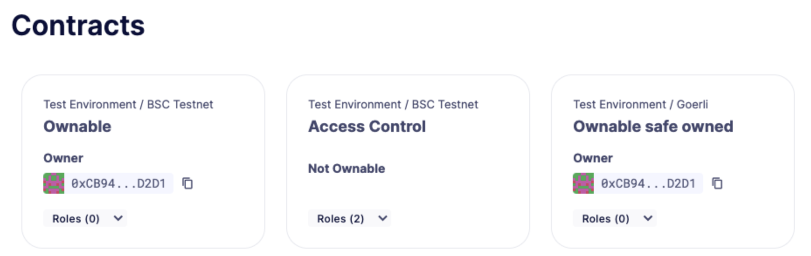
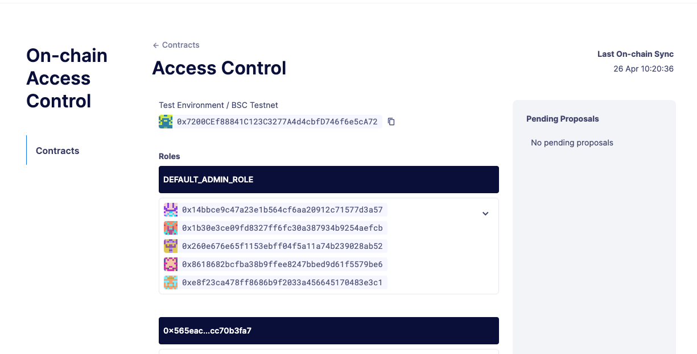

# Access Control
访问控制允许你无缝地监督和指挥合约权限，具有从宏观到微观层面查看和控制访问权限的能力。目前支持*ownable*和*基于角色*的访问控制。

> IMPORTANT
目前，除了**Base Goerli**、**Hedera**、**Fantom Testnet**和**Arbitrum Nova**之外，所有网络都支持访问控制。

## 使用案例
* 管理合约和代理的所有权，包括将所有权转移给多签名钱包或DAO。
* 通过多签名钱包或钱包识别角色，并移除或授予地址权限。
* 从支持的网络导入合约，或使用通过Defender 2.0部署的合约。

## 合约
主页面显示了你的*地址簿*中所有支持访问控制接口的合约。你也可以通过点击“添加新合约”按钮将现有合约添加到地址簿中。这是一次性表单，你需要指定网络、地址和名称。如果可用，合约的ABI将自动从相应的区块浏览器中提取。如果不可用，你将需要手动输入ABI。添加合约后，如果适用，主页面将更新并显示它。

* 不可拥有：合约没有所有权接口。
* 可拥有：当前所有者地址。
* 角色：在合约中发现的角色数量。

## 合约页面
合约页面包含了所选合约的所有信息，包括名称、环境、网络、地址和发现的角色。Defender 2.0每分钟与合约进行一次链上同步，最后同步时间显示在页面右上角。

访问控制会自动尝试获取合约中的所有角色，但有可能会遗漏一些。在这种情况下，你可以通过点击“添加新角色”按钮手动添加一个角色，并指定其名称。

修改角色时，你必须选择要使用的管理员地址。如果管理员是多签名钱包，修改角色的交易将被包装成一个提案，该提案将处于待定状态，直到被其他签名者（如果有的话）批准并执行。你可以在页面右侧看到待处理的提案。

我们提供了一个快速入门教程，使用Defender 2.0更改访问控制角色。请在*这里*查看！