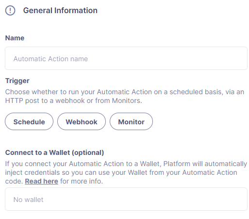

# Actions
动作允许你实现自定义应用逻辑，用于链上和链下操作。你可以启用自动响应，以应对[监控](../Monitor/Monitor.md)和[事件响应](../Incident-Response/Incident-Response.md)模块检测到的威胁。

## Use cases
* 自动化智能合约操作

* 作为对[监控](../Monitor/Monitor.md)警报的响应执行动作

* 使用动作自动化[事件响应](../Incident-Response/Incident-Response.md)步骤

* 从多重签名、中继器等创建交易提案

* 无代码（基于表单）的交易提案

* 调用外部API并与其他智能合约交互

## Actions
动作是可以通过触发器执行的自动化JavaScript代码片段。


### Triggers
支持以下触发器：

* **计划：**选择一个频率，Defender 2.0 将在指定的间隔时间调用函数。请注意，指定的间隔是两次连续执行开始之间的时间，而不是一次运行结束和下一次开始之间的时间。或者，可以使用 [cron 表达式](https://crontab.cronhub.io/)指定何时运行操作。

**Webhook：**Defender 2.0 将为操作创建一个 webhook URL，每当发送 HTTP POST 请求到该端点时，都会执行该操作。该 URL 可以随时重新生成。调用时，HTTP 请求信息将被注入到操作中，HTTP 响应将包括操作运行信息以及操作返回的任何数据。

**监视器：**由 Defender 2.0 *监视器*触发。它将包含一个带有触发事件详细信息的 body 属性，你可以使用这些信息来运行自定义逻辑。

### Environment
操作在一个带有 256MB RAM 和 5 分钟超时的 [node 16 环境](https://nodejs.org/dist/latest-v16.x/docs/api/)中运行。每个操作的代码大小必须小于 5MB。为了便于使用，环境中预安装了一组常见的依赖项。
```
"@openzeppelin/defender-sdk": "1.1.0",
"@datadog/datadog-api-client": "^1.0.0-beta.5",
"@gnosis.pm/safe-core-sdk": "^0.3.1",
"@gnosis.pm/safe-ethers-adapters": "^0.1.0-alpha.3",
"axios": "^1.4.0",
"axios-retry": "3.5.0",
"@openzeppelin/defender-admin-client": "1.50.0",
"@openzeppelin/defender-autotask-client": "1.50.0",
"@openzeppelin/defender-autotask-utils": "1.50.0",
"@openzeppelin/defender-kvstore-client": "1.50.0",
"@openzeppelin/defender-relay-client": "1.50.0",
"@openzeppelin/defender-sentinel-client": "1.49.0",
"ethers": "5.5.3",
"fireblocks-sdk": "^2.5.4",
"graphql": "^15.5.1",
"graphql-request": "3.4.0",
"web3": "1.9.0"
```

> NOTE
如果需要其他依赖项，可以使用JavaScript模块打包工具，如rollup或webpack。参考[这个示例项目](https://github.com/OpenZeppelin/defender-autotask-examples/tree/master/rollup)来学习如何操作。如果你认为其他用户会觉得有用的依赖项，请联系我们以添加！

> NOTE
OpenZeppelin开发团队非常喜欢[TypeScript](https://www.typescriptlang.org/)，我们希望你也是！如果你想用TypeScript编写你的动作，你需要首先使用tsc或你选择的打包工具来编译它们，然后上传生成的JavaScript代码。遗憾的是，我们不支持在用户界面中直接用TypeScript编码。所有defender-sdk包都是用TypeScript编写的，并且附带了它们的类型声明。你还可以使用[@openzeppelin/defender-autotask-utils包](https://www.npmjs.com/package/@openzeppelin/defender-autotask-utils)来[获取事件有效载荷的类型定义](https://github.com/OpenZeppelin/defender-client/blob/master/packages/autotask-utils/src/types.ts#L15)。

### Defining code

#### Handler function
你的代码必须导出一个异步处理函数，该函数将在执行动作时被调用。
```
exports.handler = async function(event) {
  // 你的代码在这里
}
```

以下接口包含了Defender在调用一个操作时注入的事件类型:
```
export interface AutotaskEvent {
    /**
     * 由中继客户端使用的中继函数的内部标识符
     */
    relayerARN?: string;
    /**
     * 由键值存储客户端使用的键值存储函数的内部标识符
     */
    kvstoreARN?: string;
    /**
     * Defender生成的内部凭据，用于与其他服务通信
     */
    credentials?: string;
    /**
     * 在Action密钥保险库中定义的只读键值秘密
     */
    secrets?: AutotaskSecretsMap;
    /**
     * 包含Webhook请求、监控匹配信息或监控匹配请求
     */
    request?: AutotaskRequestData;
    /**
     * autotaskId是Action的唯一标识符
     */
    autotaskId: string;
    /**
     * 分配给Action的名称
     */
    autotaskName: string;
    /**
     * 当前Action运行的Id
     */
    autotaskRunId: string;
    /**
     * 之前Action运行的信息
     */
    previousRun?: PreviousAutotaskRunInfo;
}
```

#### Relayer integration
如果你将自动操作连接到中继器，那么Defender 2.0将自动向操作代码注入临时凭据以访问中继器。只需将事件对象传递给中继器客户端，代替凭据即可。
```
const { Defender } = require('@openzeppelin/defender-2-sdk');

exports.handler = async function(event) {
  const client = new Defender(event);

  // Use relayer for sending txs or querying the network...
}
```

这使你能够使用中继器发送交易，而无需设置任何API密钥或秘密。此外，你还可以使用中继器的JSON RPC端点对任何以太坊网络进行查询，而无需为外部网络提供商配置API密钥。

我们还支持使用[ethers.js](https://www.npmjs.com/package/@openzeppelin/defender-relay-client#ethersjs)进行查询或通过中继器发送交易。要使用ethers.js，请将上述代码片段替换为此代码片段:
```
const { DefenderRelaySigner, DefenderRelayProvider } = require('defender-relay-client/lib/ethers');
const ethers = require('ethers');

exports.handler = async function(event) {
  const provider = new DefenderRelayProvider(event);
  const signer = new DefenderRelaySigner(event, provider, { speed: 'fast' });
  // 使用提供者（provider）和签名者（signer）来查询或从ethers发送交易，例如...
  const contract = new ethers.Contract(ADDRESS, ABI, signer);
  await contract.ping();
}
```

如果你更喜欢[web3.js](https://www.npmjs.com/package/@openzeppelin/defender-relay-client#web3js):
```
const { DefenderRelayProvider } = require('defender-relay-client/lib/web3');
const Web3 = require('web3');

exports.handler = async function(event) {
  const provider = new DefenderRelayProvider(event, { speed: 'fast' });
  const web3 = new Web3(provider);
  // 使用web3实例来查询或发送交易，例如...
  const [from] = await web3.eth.getAccounts();
  const contract = new web3.eth.Contract(ABI, ADDRESS, { from });
  await contract.methods.ping().send();
}
```

#### Monitor invocations
由监控器触发的操作可以有两种类型的正文属性和方案，这取决于触发操作的监控器类型：

* 在Defender 2.0监控器的情况下，正文将包含[监控器事件模式](../Monitor/Monitor.md#monitor-event-schema)。

* 在Forta监控器的情况下，正文将包含[Forta警报详情](../Actions/Actions.md)。

如果操作是用TypeScript编写的，可以从[defender-sdk-action-client](https://www.npmjs.com/package/@openzeppelin/defender-sdk-action-client)包中使用BlockTriggerEvent或FortaTriggerEvent类型。
```
exports.handler = async function(params) {
  const payload = params.request.body;
  const matchReasons = payload.matchReasons;
  const sentinel = payload.sentinel;

  // 如果是合约监控
  const transaction  = payload.transaction;
  const abi = sentinel.abi;

  // 如果是Forta监控
  const alert  = payload.alert;

  // 自定义逻辑...
}
```

#### Webhook invocations
当通过 webhook 调用一个操作时，它可以作为注入到处理程序中的事件参数的一部分来访问 HTTP 请求信息。同样，返回值将被包含在 HTTP 响应负载的 result 字段中。
```
exports.handler = async function(event) {
  const {
    body,    // 包含解析后的 JSON POST 请求体的对象
    headers, // 包含来自 HTTP 头部的键值对的对象
    queryParameters, // 包含来自查询参数的键值对的对象parameters
  } = event.request;

  return {
    hello: 'world' // JSON 序列化，并包含在响应的 `result` 字段中
  };
}
```

目前，仅支持JSON负载，并且只有带有X-或Stripe-前缀的非标准头部会被提供给操作。

Webhook端点的一个示例响应如下所示，其中status是success或error之一，encodedLogs是运行日志的base64编码，而result则是执行返回的JSON编码值。
```
{
  "autotaskRunId": "37a91eba-9a6a-4404-95e4-38d178ba69ed",
  "autotaskId": "19ef0257-bba4-4723-a18f-67d96726213e",
  "trigger": "webhook",
  "status": "success",
  "createdAt": "2021-02-23T18:49:14.812Z",
  "encodedLogs": "U1RBU...cwkK",
  "result": "{\"hello\":\"world\"}",
  "requestId": "e7979150-44d3-4021-926c-9d9679788eb8"
}
```

> NOTE
如果一个操作的完成时间超过25秒，将会返回一个处于等待状态的响应。尽管如此，该操作将会在后台继续运行，并最终在不到5分钟内完成。

> NOTE
如果对Webhook HTTP请求的响应是{"message":"Missing Authentication Token"}，请仔细检查发出的请求是否确实是一个POST请求。当发出GET请求时，通常会出现这种响应。

#### Secrets
Defender 2.0的秘密功能允许你安全地存储敏感信息，如API密钥和秘密，这些信息可以通过操作中的代码使用event.secrets对象来访问。
操作秘密是键值对形式的字符串，大小写敏感，可以在操作代码中使用event.secrets对象来访问。一个操作使用的秘密数量没有限制。秘密在所有操作中共享，并不特定于单个操作。
```
exports.handler = async function(event) {
  const { mySecret, anApiKey } = event.secrets;
}
```

秘密被加密并存储在一个安全的保险库中，只有在操作运行时才被解密并注入。一旦写入，秘密只能通过用户界面删除或覆盖，而不能读取。

> WARNING
一个操作可能会记录秘密的值，意外地泄露它。

> NOTE
虽然可以使用秘密来存储用于签名消息或交易的私钥，但我们建议使用Defender 2.0中继器代替。Defender 2.0中继器的签名操作提供了比在操作代码中加载私钥并在那里签名更高的安全级别。

#### Key-value data store
操作键值数据存储允许在不同操作之间以及不同操作之间持久化简单数据。它可以用来存储交易标识符、哈希过的用户电子邮件，甚至是小型序列化对象。

通过[defender-kvstore-client](https://www.npmjs.com/package/@openzeppelin/defender-kvstore-client)包管理对键值存储的访问。
```
const { KeyValueStoreClient } = require('defender-kvstore-client');

exports.handler =  async function(event) {
  const store = new KeyValueStoreClient(event);

  await store.put('myKey', 'myValue');
  const value = await store.get('myKey');
  await store.del('myKey');
}
```

键值存储允许获取、存储和删除键值对，键和值都必须是字符串，键限制为1KB，值限制为300KB。

> NOTE
存储的数据在所有操作中共享。为了隔离每个操作管理的记录，建议使用对每个操作唯一的命名空间前缀键。

> WARNING
每个项目在最后更新后90天到期。如果需要长期存储数据，我们建议设置外部数据库，并使用操作密钥来存储连接到它的凭据。

#### Notifications
操作可以通过已经定义在Defender 2.0通知设置中的各种渠道发送通知。这种集成允许你快速通知其他连接的系统关于检测到的或由操作所做的变化。

要发送通知，应使用notificationClient.send()，如下例所示:
```
exports.handler = async function(credentials, context) {
  const { notificationClient } = context;

  try {
    notificationClient.send({
      channelAlias: 'example-email-notification-channel-alias',
      subject: 'Action notification example',
      message: 'This is an example of a email notification sent from an action',
    });
  } catch (error) {
    console.error('Failed to send notification', error);
  }
}
```

对于电子邮件通知，支持基本的HTML标签。以下是如何生成HTML消息的一个示例:
```
function generateHtmlMessage(actionName, txHash) {
  return `
<h1>Transaction sent from Action ${actionName}</h1>
<p>Transaction with hash <i>${txHash}</i> was sent.</p>
`;
}

exports.handler = async function(event, context) {
  const { notificationClient } = context;

  const relayer = new Relayer(credentials);

  const txRes = await relayer.sendTransaction({
    to: '0xc7464dbcA260A8faF033460622B23467Df5AEA42',
    value: 100,
    speed: 'fast',
    gasLimit: '21000',
  });

  try {
    notificationClient.send({
      channelAlias: 'example-email-notification-channel-alias',
      subject: `Transaction sent from Action ${event.actionName}`,
      message: generateHtmlMessage(event.actionName, txRes.hash),
    });
  } catch (error) {
    console.error('Failed to send notification', error);
  }
}
```

要发送一个指标通知，请使用 notificationClient.sendMetric() 方法，如下面的例子所示:
```
exports.handler = async function(credentials, context) {
  const { notificationClient } = context;

  try {
    notificationClient.sendMetric({
      channelAlias: 'example-email-notification-channel-alias',
      name: 'datadog-test-metric',
      value: 1,
    });
  } catch (error) {
    console.error('Failed to send notification', error);
  }
}
```

> NOTE
如果传递了无效或暂停的通知channelAlias，将抛出错误。

> NOTE
如果由于任何其他原因无法发送通知，则不会抛出错误，但会在操作日志中添加状态消息。例如，如果向具有非活动URL的webhook通道发送通知，则会添加日志条目，但不会抛出错误。

> NOTE
如果多个通知通道使用相同的别名，则会将通知发送给所有这些通道。

#### Error handling
自动操作调用导致错误时，操作运行响应中将包含一个errorType字段，该字段将设置为d[efender-sdk中定义的ActionErrorType](https://github.com/OpenZeppelin/defender-sdk/blob/340fce19e35cfed420c94369630ee8f70254c9ac/packages/action/src/models/action-run.res.ts#L6)。用户可读的错误也将出现在“运行历史”视图中。

### Local development
如果你想在本地复现操作的行为以进行调试或测试，请按照以下步骤操作：
* 初始化一个新的npm项目（npm init）

* 将package.json中的dependencies键设置为上面[环境部分](#environment)中指示的包

* 下载yarn.lock：📎 [yarn.lock](https://docs.openzeppelin.com/defender/v2/_attachments/yarn.lock)

* 运行yarn install --frozen-lockfile。

你还可以使用以下模板进行本地开发，该模板在使用node调用时将运行操作代码。它将从环境变量加载relayer凭据，或者在由Defender 2.0运行时使用注入的凭据。
```
const { Defender } = require('@openzeppelin/defender-sdk');


// 入口点用于执行操作
exports.handler = async function(event) {
  const client = new Defender(credentials);
  // 使用 client.relaySigner 发送交易
}

// 在本地运行（此代码不会在操作中执行）
if (require.main === module) {
  const { RELAYER_API_KEY: apiKey, RELAYER_API_SECRET: apiSecret } = process.env;
  exports.handler({ apiKey, apiSecret })
    .then(() => process.exit(0))
    .catch(error => { console.error(error); process.exit(1); });
}
```

记得在事件对象中发送你的操作所期望的任何其他值，比如秘密或监控事件。

### Updating code
你可以通过Defender 2.0界面编辑操作的代码，或者通过使用[defender-sdk](https://www.npmjs.com/package/@openzeppelin/defender-sdk) npm包以编程方式通过API进行编辑。后者允许上传包含多个文件的代码包：

> NOTE
代码包在被压缩和base64编码后的大小不得超过5MB，并且必须始终在zip文件的根目录包含一个index.js作为入口点。

## Transaction Proposals
交易提案与操作非常相似，但是不需要编写JavaScript代码，你可以使用基于表单的编辑器来定义交易参数。
这种低代码格式对于非技术用户和简单场景非常有用，但缺乏操作的灵活性。如果你需要调用外部API或合约，或执行更复杂的逻辑，你应该使用操作。

### General Information
要从Defender 2.0创建交易提案，你需要定义一些参数：

* 标题：提案的描述性名称。这将在提案列表中显示。

* 描述（可选）：提案的更长描述。这将显示在提案详情中。

* 目标合约：你想要在其上运行交易的智能合约。

### Function
定义你想要在目标合约上调用的函数。你可以从合约接口上可用的函数列表中选择。如果函数有参数，你可以在这里定义它们。

### Approval Process
定义你希望如何执行交易。你可以从Defender 2.0中可用的任何[交易审批流程](../../Manage/Manage.md#approval-processes)中选择，这些流程你之前已经配置过，或者你可以选择创建一个新的。

### A complete example
以下示例使用ethers.js和relayer集成来发送调用给定合约上的execute函数的交易。在发送交易之前，它会检查一个canExecute视图函数，并验证通过webhook接收的参数是否与本地秘密匹配。如果发送了交易，它会在响应中返回哈希值，该哈希值会被发送回webhook调用者。
```
const { ethers } = require("ethers");
const { DefenderRelaySigner, DefenderRelayProvider } = require('defender-relay-client/lib/ethers');

// 动作的入口点
exports.handler = async function(event) {
  // 加载在 webhook 负载中提供的值（在计划或哨兵调用中不可用）
  const { value } = event.request.body;

  // 将其与本地密钥进行比较
  if (value !== event.secrets.expectedValue) return;

  // 初始化中继器提供者和签名者

  const provider = new DefenderRelayProvider(event);
  const signer = new DefenderRelaySigner(event, provider, { speed: 'fast' });

  // 从签名者创建合约实例，并使用它来发送交易
  const contract = new ethers.Contract(ADDRESS, ABI, signer);
  if (await contract.canExecute()) {
    const tx = await contract.execute();
    console.log(`Called execute in ${tx.hash}`);
    return { tx: tx.hash };
  }
}
```

> NOTE
代码不需要等待交易被挖出。Defender 2.0 将负责监控交易并在需要时重新提交。该操作只需要发送请求并退出。

## Security considerations
Defender 2.0 中每个操作的代码都是隔离的，并且通过严格的访问控制限制操作，使其对 Defender 2.0 内部的其他基础设施没有任何访问权限。唯一的例外是操作可以访问其链接的中继器，这是通过操作服务在每次执行时注入的临时凭证来协商的。尽管如此，操作只能调用中继器暴露的方法，并且无法直接访问背后的私钥或任何其他服务。

> NOTE
我们提供了一个快速入门教程，用于使用 Defender 2.0 为智能合约创建自动操作。在[这里](../../Tutorials/Actions/Actions.md)查看吧！