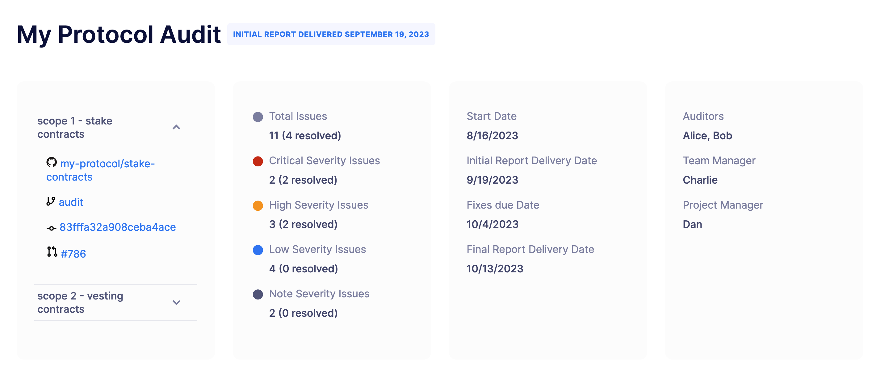
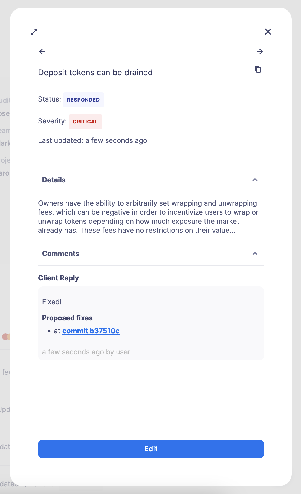
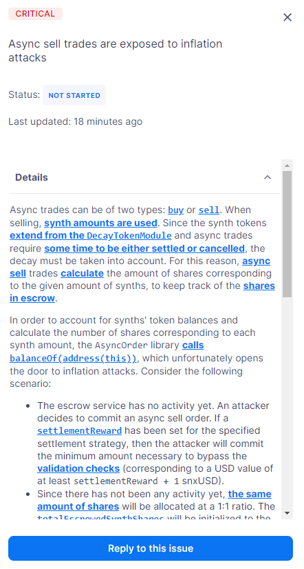
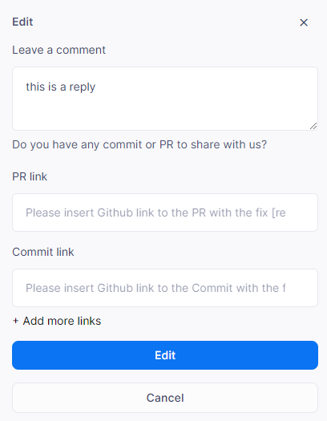
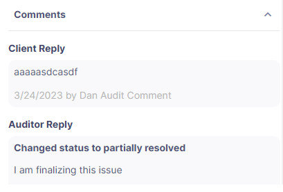

# Audit
审计功能允许您召集我们的安全专家团队，以最高的审查标准验证您的系统是否按预期工作。您可以跟踪问题和解决方案，并直接与审计员进行交互，以实现更快速、更高效的沟通。

## Use cases
* 维护所有智能合约审计和问题的可搜索存储库。

* 简化审计员和开发人员之间的交互。

* 自动化修复所有已识别问题的审查过程。

* 跟踪审计中识别的所有问题，直到完成。

## Auditors and Reports
在Defender 2.0中，审计员有特殊的角色。审计经理能够将审计报告从GitHub同步到Defender 2.0，并添加审计员，他们能够阅读和跟踪问题和问题。审计经理还可以确定您的团队中哪些成员有权限阅读或评论审计。

一旦审计经理将审计报告同步并交付给Defender 2.0，任何被分配了审计阅读或审计评论角色的团队成员都能看到它。所有活动的和历史的审计报告都将可见，团队成员可以点击任何审计报告查看详细信息。

审计页面最初包括项目的名称、状态和报告日期。在此之下，您可以找到审计的执行摘要，它提供了审计发现和智能合约或项目的整体安全状况的概述。它还包括范围、时间线和审计员的链接和信息。

在执行摘要下面，您可以找到审计的不同部分。

### Overview
"概述"部分提供了关于被审计的项目或智能合约的背景信息和上下文。这个部分通常从对项目的简短介绍开始，包括项目的名称、目的和它的目标。接下来是对项目架构和关键组件的概述，通过对智能合约或区块链应用如何构建以及不同模块或组件如何相互交互的高级描述来支持。可能会包括项目中使用的技术堆栈的信息。这可能包括在开发中使用的编程语言、库、框架和区块链平台。

根据审计，这个部分还可能包含关于智能合约特权角色的额外信息，以解释其在项目中的目的和责任。这有助于审计员和读者理解谁对关键功能有控制权，以及他们可以执行什么操作。同样，通常会提到信任假设，以概述项目开发者对项目依赖的外部组件、服务或实体的安全性和可靠性的明示或暗示假设。最后，"概述"部分可能包括客户发现的漏洞（如果客户提供）。这些是在审计之前由项目的用户或客户发现的漏洞或问题，帮助审计员理解与项目相关的安全问题的上下文和历史。

### Issues
"问题"部分提供了在审计过程中发现的安全漏洞、错误或问题的深入检查。在这个部分，您可以按内容、严重性或状态过滤问题。按内容过滤可以让您查找具有特定标题或描述的问题。按严重性过滤可以让您查找具有特定严重性级别的问题，如严重、高、中、低、注意或客户报告。按状态过滤可以让您查找具有特定状态的问题，如未解决、无回应、已回应、已解决、部分解决、已确认未解决或已确认将解决。

这个部分的每个问题都包含一个标题、描述、日期和状态。您可以点击一个以展开信息并能够对其进行回应。

描述解释了问题的性质、可能的影响和理解问题所需的任何技术细节。问题也被标记为严重性评估，帮助描述问题的影响、可能性和难度，以便于优先级和透明度。

### Recommendations
"建议"部分提供了基于审计结果改善项目安全状况的可行指导。这个部分通常由缓解策略、监控建议、应急响应计划、潜在陷阱和其他技术和非技术建议组成。

这个部分包含的监控和应急响应建议对于确保您的区块链项目或智能合约的持续安全和弹性至关重要。这些建议关注于有效地检测和响应安全事件、违规或异常的主动措施。提供的信息将详细说明如何使用Defender*监控器*、*操作*和*应急响应场景应用*这些建议。我们建议按照本文档中的教程学习如何使用Defender模块，如*监控器*、*操作*和*应急响应教程*。

建议通常包括：

* **事件监控**：事件监控以跟踪和分析您的智能合约发出的事件。这对于识别可能表明安全问题的不寻常或意外行为至关重要。

* **自定义警报**：基于特定条件或事件的自定义警报。这符合应急响应建议要有警报机制。

* **自动响应**：对特定事件或条件的自动响应，使得能够快速缓解事件。结合*操作*和*应急响应场景*。

* **阈值监控**：监控与设定阈值的不寻常偏差是常见的应急响应实践。Defender可以协助设置基于阈值的*监控*，并通过自动*应急响应场景*进行反应。

* **部署注意事项**：使用Defender Deploy最小化风险，同时避免不必要的延迟和*部署*后的问题。利用自动分析避免存储冲突或其他问题，并从跨链确定性部署、字节码验证等功能中受益。

### Conclusion
"结论"部分总结了审计的发现，并提供了项目安全状况的整体评估。这个部分从对审计的关键发现的简洁总结开始，包括在评估过程中发现的关键安全漏洞、问题或问题的回顾，以及为每个识别的问题分配的安全级别，帮助利益相关者理解哪些问题构成了最高的风险。根据发现的问题，"结论"部分也可能重新陈述解决问题的高优先级建议，强调提高安全性所需的立即行动。

这个部分还会传达与项目当前安全状态相关的风险，以帮助项目所有者、投资者和用户做出明智的决策。可能会提供额外的有价值的见解，以支持利益相关者的某些决策，如部署、进一步开发和改进。如果提供了建议，这些将在这个部分作为高级概述重新陈述。

## Fix-Review process
在交付审计报告后，报告中的每个问题都可以接受回应和评论，直到它们被审计经理最终确定。审计员和被分配了审计评论角色的团队成员都可以回应和评论。团队成员可以向审计员提问或提供信息。

要启动对问题的回应，点击审计页面的"问题"部分中的问题，然后点击"回复此问题"。

团队成员可以为审计员留下评论。特别是，团队成员可以提供指向他们的GitHub仓库中的拉取请求（PR）或提交的链接，这些代表与特定问题相关的修复。可以添加多个链接。

Defender 2.0将保留并显示审计员和团队成员在每个问题上的所有通信记录。

根据修复和审查的结果，审计员可能会将问题的状态更新为部分解决或已解决。一旦所有问题的修复-审查过程完成，审计经理将最终确定审计，此后，所有活动的轨迹都可见，但不再允许任何回应或评论。在审计结束时，审计经理还可以提供包括修复-审查过程在内的审计的PDF报告。

对于您的审计过程有任何问题，请与您的指定审计经理联系。您可以通过其*反馈表单*向Defender提供反馈——您的评论和建议将对我们塑造审计模块的未来起到关键的作用！