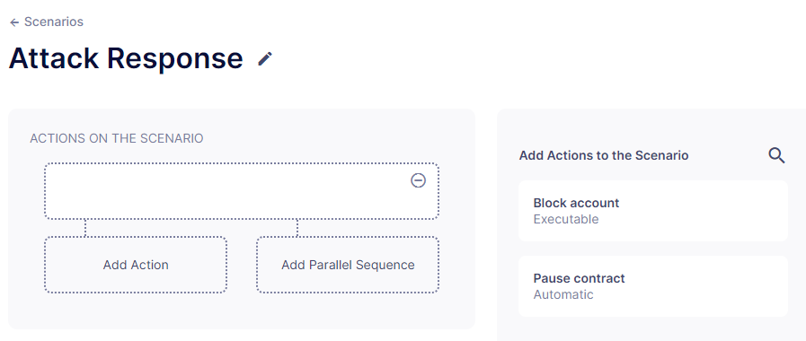
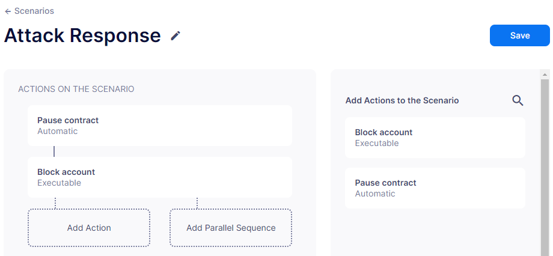
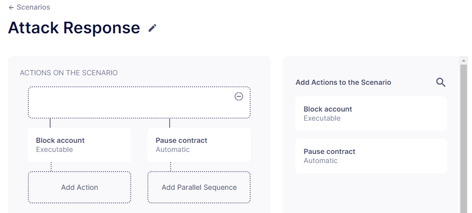
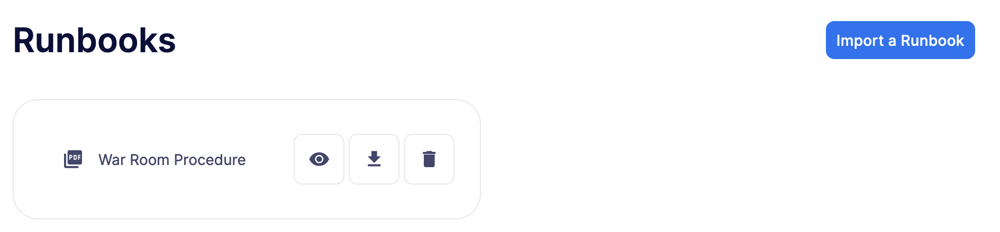
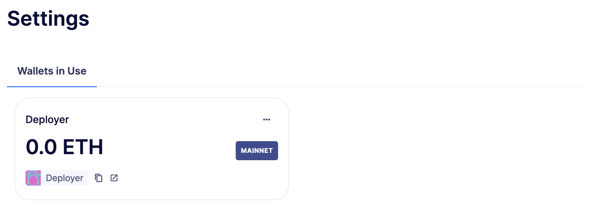

# Incident Response
事故响应（IR）允许你通过预定义的操作和场景即时检测、响应和解决威胁和攻击。你还可以在分叉网络上进行攻击模拟和测试真实世界的场景。

## Use cases
* 定义并选择在响应场景中自动运行的操作。

* 使用场景将不同的操作组合成工作流程。

* 手动或通过[监视器](../Monitor/Monitor.md)触发事故响应场景。

* 上传操作手册以维护操作程序和政策。

* 将手册与场景关联，以便快速执行决策。

## Actions
操作是无代码（基于表单）或基于代码的链上交易，用于在事故响应期间自动化任务，例如：

* 暂停智能合约

* 将账户添加到智能合约黑名单（例如，防止恶意行为者转移被盗资金）

* 向值班寻呼系统或团队消息频道发送通知

* 拉取相关事件数据并存储以供分析

* 从访问控制中移除地址的角色

操作有两种类型：

* **自动操作：**与中继器或多签名钱包关联的自动化交易，由JavaScript代码定义。它们可以发送链上交易、触发配置频道的通知、使用存储在秘密中的密钥调用外部API，并在键值存储中保持有状态的数据。

* **交易模板：**通过无代码表单定义的按需交易。它们从中继器或多签名钱包调用智能合约函数，并带有自定义参数。

## Scenarios
场景是将自动操作和交易模板组合成一个工作流的过程。操作可以并行运行或顺序连接。场景可以手动触发，也可以通过[监视器](../Monitor/Monitor.md)触发。

创建场景是一个无缝的体验，通过表单引导你轻松地在工作流程中组织操作。

要填充场景，你必须将右侧列表中的现有操作拖到表单上。操作垂直执行，意味着前一个操作必须成功完成才能开始执行新行。并行操作同时执行。但是，如果操作出现错误，场景会完全停止。

要并行运行多个操作，请点击“添加并行序列”并将操作拖到并排的框中。

你可以将操作拖回场景外部以移除它们，或点击右上角可见的减号图标以移除空步骤。右上角的“保存”按钮保存场景及其配置和名称。

## Runbooks
手册是定义生产支持和安全响应的操作程序和政策的PDF文件。你可以导入和命名手册，这样就更容易与场景关联。

手册作为系统管理员、操作员、决策者、钥匙持有者、安全人员、顾问和通信人员的指南非常有用。

例如，手册可以涵盖以下内容：

* 区块链提供商中断

* 关键内部或第三方系统故障

* 系统升级后检测到的问题

* 响应财务攻击

* 战争室步骤和程序

我们建议将事故响应场景与手册相结合。此外，你可以创建具有对事故响应的独家只读访问权限的角色，供外部审计员或保安使用。

要填充，只需点击按钮导入手册PDF。通过点击卡片按钮，可以查看、下载和移除手册。

## Settings
在设置中，你可以访问和管理场景中操作使用的中继器。通过点击中继器，你可以存款、提款和编辑其设置。

> NOTE
我们提供了一个快速入门教程，以通过Defender 2.0创建和使用事故响应场景。在[这里](../../Tutorials/Incident-Response/Incident-Response.md)查看！