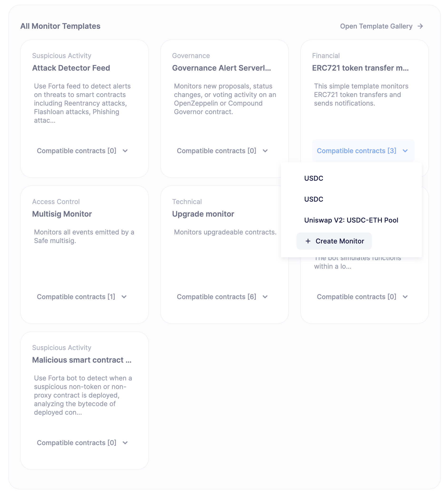
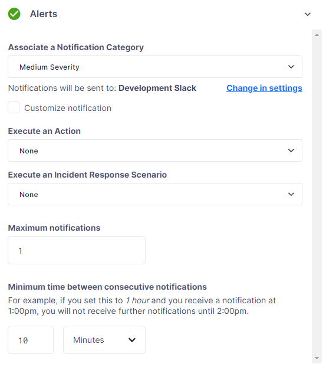
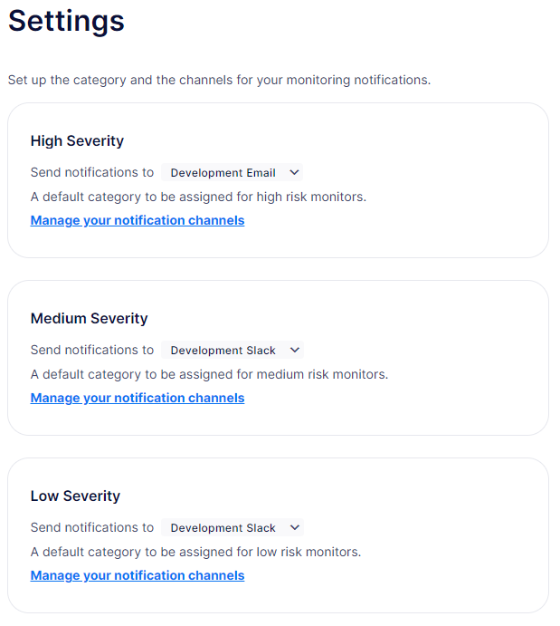

# Monitor
监视器允许你完全了解智能合约的风险和行为。你可以检测威胁，获取对威胁和异常的警报，并自动响应和解决问题。

## Use cases
* 监控关键事件和授权功能，如所有权转移、暂停或铸造。

* 警报可能危险的交易或运营问题。

* 集成通知到Slack、Telegram、Discord、电子邮件、PagerDuty、Opsgenie或自定义API。

* 使用预建模板快速轻松地设置监控。

* 结合其他Defender 2.0模块，使用监控触发器执行链上交易。

## Monitors
监视器可以从头开始创建，也可以使用模板创建，这些模板是为常见用例设计的。模板会自动预填充一个监视器，因此你可以轻松修改和重新适应它们。


监视器模板
监视器根据它们监控的风险类型分为五个类别：

* 治理

* 访问控制

* 可疑活动

* 财务

* 技术

你还可以为每个警报指定一个严重性级别，你的团队可以使用这个级别来优先处理通知。然后，每个严重性可以与一个或多个通知渠道关联。

* 高严重性

* 中等严重性

* 低严重性

严重性和通知渠道应根据项目组合使用。例如，DeFi协议可能更喜欢使用高优先级渠道（如Slack/Telegram）的财务监控器，以及使用低优先级渠道（如电子邮件）的技术监控器。

## Configuring a Monitor
监视器监控所有链上合约交易，并在匹配参数、过滤器或事件时发出通知。

> IMPORTANT
目前，除了Fantom之外，所有*网络*都支持监视器。

### General Information
* **名称：**分配给监视器的名称。

* **风险类别：**监视器的风险类别，用于过滤或分组。

* **合约：**要监控的智能合约。监控依赖于底层的ABI，因此每个监视器只能有1个ABI。如果有多个智能合约，监视器必须遵循相同的ABI/接口。

* **确认区块：**如果你希望在对交易被接受有一定信心后才收到通知，则推荐更高的确认区块级别，但如果你希望尽快得到通知，并能容忍重组，则较低的确认区块级别更好。在接受安全和最终区块标签的链上，你也可以选择它们作为确认区块级别。

#### Matching Rules
要触发通知的交易必须满足以下**所有**条件：

* 交易**必须**有一个与配置地址匹配的To、From或Address（来自日志）。

* 如果指定了**交易过滤器**
    * 交易**必须**匹配**交易过滤器**。

* 如果选择了**事件**
    * 交易**必须**发出任何选定的事件并匹配**事件条件**（如果有）。

* 如果选择了**函数**
    * 交易*必须*直接调用任何选定的函数（目前无法检测到合约调用）并匹配**函数条件**（如果有）。

### Transaction Filters
交易过滤器允许缩小被监控的交易范围。这些可以作为属性表达式或JavaScript代码输入，提供了极大的灵活性。为了适应校验和和非校验和地址的比较，比较是不区分大小写的。

> NOTE
要接收涉及所选事件/函数的所有交易，不应指定交易条件。

* 条件可以使用AND、OR、NOT和()

* 条件可以使用==、<、>、>=、<=进行比较

* 数字值可以通过十六进制（0xabc123）或十进制（10000000000）引用

* 字符串值只能通过==比较

* 包括基本数学运算符：+、-、*、/、^

> IMPORTANT
如果指定了交易过滤器条件，则交易必须满足此条件才能触发通知。

交易条件可以引用以下属性

* **to**是交易的接收地址

* **from**是交易的发送地址

* **gasPrice**是交易中发送的燃气价格。在EIP1559交易中，它等于或低于maxFeePerGas。

* **maxFeePerGas**是交易愿意为交易支付的最高价格。仅在EIP1559交易中存在。

* **maxPriorityFeePerGas**是交易愿意支付给矿工以包含在内的BASE_FEE之上的最大wei金额。仅在EIP1559交易中存在。

* **gasLimit**是交易中发送的燃气限制

* **gasUsed**是交易中使用的燃气量

* **value**是交易中发送的价值

* **nonce**是特定交易的nonce

* **status**是一个派生值，可以与"success"或"failed"进行比较

#### Example Conditions
被回滚的交易
```
status == "failed"
```

排除来自 0xd5180d374b6d1961ba24d0a4dbf26d696fda4cad 的交易
```
from != "0xd5180d374b6d1961ba24d0a4dbf26d696fda4cad"
```

既有高于 50 gwei 的 gasPrice 又有高于 20000 的 gasUsed 的交易
```
gasPrice > 50000000000 and gasUsed > 20000
```

### Custom Filters
自定义过滤器支持使用自定义代码来过滤交易。如果指定了自定义过滤器，它将在找到给定区块的匹配项时被调用。这允许监控器使用其他数据源和自定义逻辑来评估交易是否匹配。

> NOTE
只有与其他条件（事件、函数、交易）匹配的交易才会触发自定义过滤器。

> NOTE
每次调用最多可以包含 25 笔交易。

#### Request Schema
请求体将包含以下结构。在 Typescript 中，可以在 [defender-sdk-action-client ](https://www.npmjs.com/package/@openzeppelin/defender-sdk-action-client)包中使用 MonitorConditionRequest 类型来进行自定义过滤器。
```
{
  "events": [
  {
    "hash": "0xab..123",                          // the transaction hash
    "timestamp": "1699857792",                    // the timestamp of the transaction (block)
    "blockNumber": 18561272,                      // the block number of the transaction
    "blockHash": "0xab..123",                     // block hash from where this transaction was seen
    "transaction": {                              // eth_getTransactionReceipt response body
      ...                                         // see https://eips.ethereum.org/EIPS/eip-1474
    },
    "matchReasons": [                             // the reasons why monitor triggered
      {
        "type": "event",                          // event, function, or transaction
        "address": "0x123..abc",                  // address of the event emitting contract
        "signature": "...",                       // signature of your event/function
        "condition": "value > 5",                 // condition expression (if any)
        "args": ["5"],                            // parameters by index (unnamed are present)
        "params": { "value": "5" }                // parameters by name (unnamed are not present)
      }
    ],
    "matchedAddresses": ["0xabc..123"],           // the addresses from this transaction your are monitoring
    "matchedChecksumAddresses": ["0xAbC..123"],   // the checksummed addresses from this transaction your are monitoring
    "monitor": {
      "id": "44a7d5...31df5",                     // internal ID of your monitor
      "name": "Monitor Name",                     // name of your monitor
      "abi": [...],                               // abi of your addresses (or undefined)
      "addresses": ["0x000..000"],                // addresses your monitor is watching
      "confirmBlocks": 0,                         // number of blocks monitor waits (can be 'safe' or 'finalized' on PoS clients)
      "network": "rinkeby"                        // network of your addresses
      "chainId": 4                                // chain Id of the network
    },
    "metadata": "..."                             // metadata (if available)
  }
  ]
}
```

#### Response Schema
自定义过滤器必须返回一个包含所有匹配项的结构。返回一个空对象表示没有匹配发生。该对象的类型为 MonitorConditionResponse。

> IMPORTANT
错误将被视为不匹配。
```
{
  "matches": [
    {
      "hash": "0xabc...123",   // transaction hash
      "metadata": {
        "foo": true            // any object to be shared with notifications
      }
    },
    {
      "hash": "0xabc...123"    // example with no metadata specified
    }
  ]
}
```

#### Example Custom Filters
```
exports.handler = async function(payload) {
  const conditionRequest = payload.request.body;
  const matches = [];
  const events = conditionRequest.events;
  for(const evt of events) {

    // add custom logic for matching here

    // metadata can be any JSON-marshalable object (or undefined)
    matches.push({
       hash: evt.hash,
       metadata: {
        "id": "customId",
        "timestamp": new Date().getTime(),
        "numberVal": 5,
        "nested": { "example": { "here": true } }
       }
    });
  }
  return { matches }
}
```

### Events and Functions
事件和函数可以被选作过滤器。选择多个事件作为一个“或”条件（对任何选定的事件触发）。函数的选择也适用同样的规则。

事件或函数的条件可以进一步缩小监控范围。这些条件可以通过名称（如果参数被命名）或索引（例如，$0、$1…）来引用签名中的参数。变量必须与界面中显示的类型匹配。如果条件留空，则会忽略该条件。

> NOTE
如果没有指定事件或函数，则所有发往或来自合约的交易都将在监控范围内。

>IMPORTANT
监控器无缝支持所有网络上智能合约发出的事件的通知，无论这些事件是直接触发的还是通过第三方合约的内部调用触发的。然而，跟踪并提供智能合约内部函数调用的通知的能力目前仅限于以太坊主网。

#### Example Conditions
发出 Transfer(…​) 事件的交易，其值介于 1 到 100 ETH 之间（以十六进制表示）
```
// Event Signature: Transfer(address to, address from, uint256 value)
value > 0xde0b6b3a7640000 and value < 0x56bc75e2d63100000
```

发出 ValsEvent(…​) 事件的交易，其数组的第一个元素等于 5
```
// Event Signature: ValsEvent(uint256[3] vals)
vals[0] == 5
```

调用 greet(…​) 函数的交易，其未命名字符串为 "hello"
```
// Function Signature: greet(address, string)
$1 == "hello"
```

## Alerts
监控器可以使用其类别的通知渠道或自定义渠道。还可以连接应该与监控器一起运行的动作或事件响应场景。

为了防止来自单个监控器的重复警报并控制通知率，你可以使用警报阈值和连续通知之间的最小时间字段。

* 警报阈值：定义监控器在单位时间内必须触发多少次，然后才发送通知或触发动作。时间单位由连续通知之间的最小时间字段定义。

* 连续通知之间的最小时间：设置发送通知之间的最小等待时间。


### Customizing Notification
你还可以使用通知渠道选择器下方的自定义通知复选框来修改消息正文内容和格式。

#### Template
```
**Monitor Name**

{{ monitor.name }}

**Network**

{{ monitor.network }}

**Block Hash**

{{ blockHash }}

**Transaction Hash**

{{ transaction.transactionHash }}

**Transaction Link**

[Block Explorer]({{ transaction.link }})

{{ matchReasonsFormatted }}

**value**

{{ value }}
```

#### Preview
```
*Monitor Name*

Monitor

*Network*

rinkeby

*Block Hash*

0x22407d00e953e5f8dabea57673b9109dad31acfc15d07126b9dc22c33521af52

*Transaction Hash*

0x1dc91b98249fa9f2c5c37486a2427a3a7825be240c1c84961dfb3063d9c04d50

https://rinkeby.etherscan.io/tx/0x1dc91b98249fa9f2c5c37486a2427a3a7825be240c1c84961dfb3063d9c04d50[Block Explorer]

*Match Reason 1*

_Type:_ Function

_Matched Address_:_ 0x1bb1b73c4f0bda4f67dca266ce6ef42f520fbb98

_Signature:_ greet(name)

_Condition:_ name == 'test'

_Params:_

name: test

*Match Reason 2*

_Type:_ Transaction

_Condition:_ gasPrice > 10

*Value*

0x16345785D8A0000
```

#### Message Syntax
自定义通知支持有限的Markdown语法：

* 加粗（**这段文字是加粗的**）

* 斜体（*这段文字* 和 _这段文字_ 是斜体）

* 链接（这是一个[链接](https://example.com)）

对于其他Markdown语法，只有部分支持，并且不同平台的渲染行为各不相同。电子邮件支持完整的HTML，并且具有最丰富的功能集，但其他消息平台有限制，包括对标准Markdown功能如标题、块引用和表格的支持。支持的功能组合（例如，加粗和斜体文本）也有混合支持。如果Markdown包含任何具有混合平台支持的语法，警告消息将直接出现在编辑器下方。

#### Monitor Event Schema
在使用自定义通知模板时，你可以访问以下模式。如果你配置监控以执行操作，该模式也会传递给操作。
```
{
  "transaction": {                     // eth_getTransactionReceipt response body
    ...                                // see https://eips.ethereum.org/EIPS/eip-1474
  },
  "blockHash": "0xab..123",            // block hash from where this transaction was seen
  "matchReasons": [                    // the reasons why monitor triggered
    {
      "type": "event",                 // event, function, or transaction
      "address": "0x123..abc",         // address of the event emitting contract
      "signature": "...",              // signature of event/function
      "condition": "value > 5",        // condition expression (if any)
      "args": ["5"],                   // parameters by index (unnamed are present)
      "params": { "value": "5" }       // parameters by name (unnamed are not present)
    }
  ],
  "matchedAddresses":["0x000..000"]    // the addresses from this transaction monitored
  "monitor": {
    "id": "44a7d5...31df5",            // internal ID of monitor
    "name": "Monitor Name",           // name of monitor
    "abi": [...],                      // abi of address (or undefined)
    "addresses": ["0x000..000"],       // addresses monitored
    "confirmBlocks": 0,                // number of blocks monitor waits (can be 'safe' or 'finalized' on PoS clients)
    "network": "rinkeby"               // network of address
    "chainId": 4                       // chain Id of the network
  },
  "value": "0x16345785D8A0000"         // value of the transaction
  "metadata": {...}                // metadata injected by action condition (if applicable)
}
```

#### Dynamic Content
自定义通知模板使用内联模板渲染动态内容。任何被双大括号包围的字符串都将根据事件模式被解析。可以使用点表示法访问深层嵌套的项目（包括数组中的项目）。

除了标准事件模式之外，还注入了以下参数以便在自定义通知消息中使用：

* transaction.link

* matchReasonsFormatted

#### Character Limit
如果消息超过平台的字符限制，将会被截断。最佳实践是将消息限制在1900个字符以内。

## Settings
在设置标签页中，你可以指定与不同严重性级别（高、中、低）相关联的默认通知渠道。


## Pausing and Deleting
在监控页面上，你可以暂停已激活的监控器。通过点击卡片上的点状按钮，你可以删除监控器或将其保存为模板。

保存监控器为模板会存储其配置和参数，你可以通过点击模板库标签页找到这些信息。

> NOTE
我们提供了一个快速入门教程，用于使用Defender 2.0监控智能合约。点击*这里*查看！