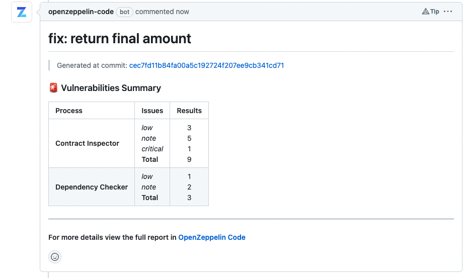
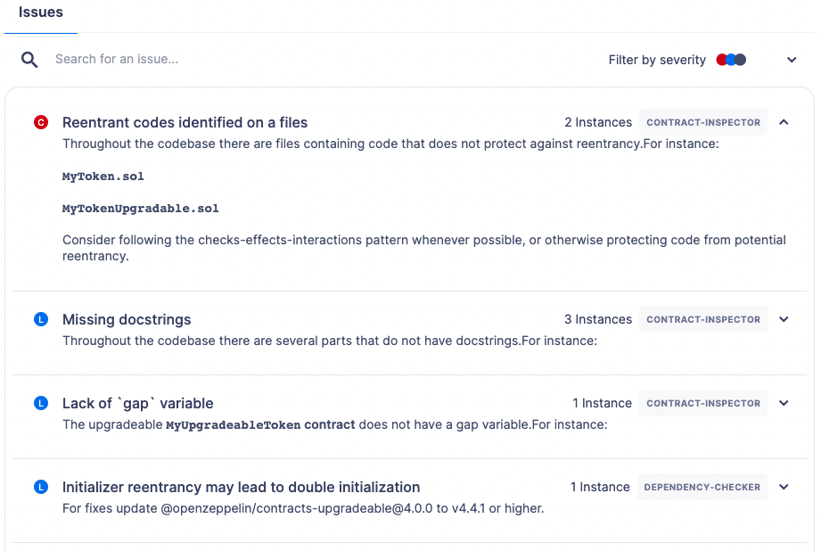
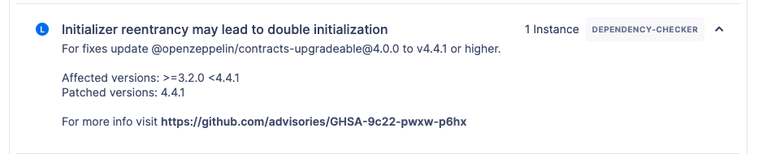
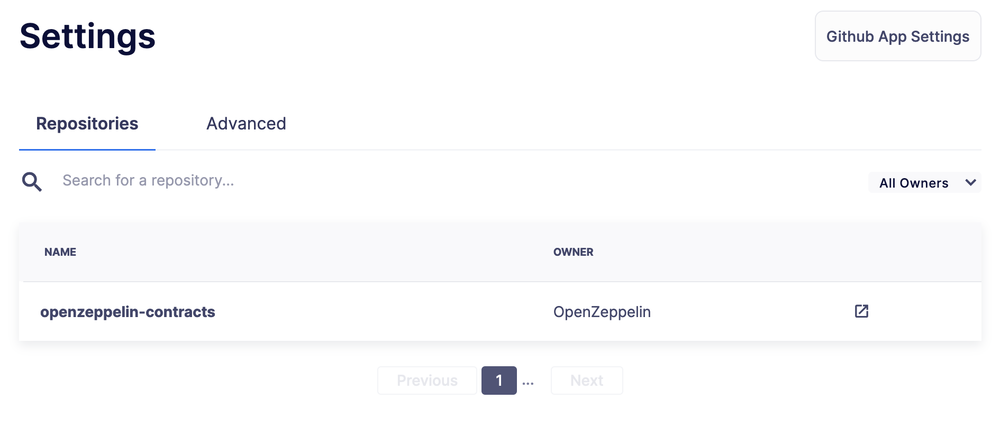
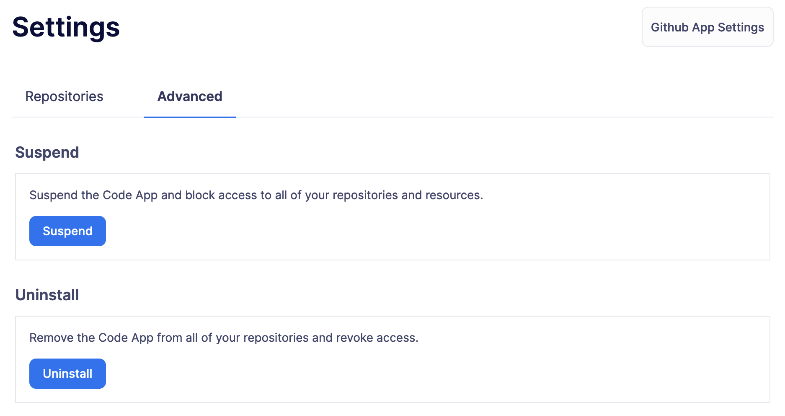

# Code
代码无缝集成Github，通过自动代码分析、机器学习智能和最先进的工具，最大限度地提高开发过程的每一步的安全性。

每次向代码推送时，OpenZeppelin代码应用都会进行详细的检查，识别潜在的漏洞，并建议改进以提高代码质量。它生成一个简洁的报告，可以在你的PR评论中进行总结，以便快速和即时访问，同时在Defender 2.0上提供更详细的报告。

## Use Cases
* 自动对拉取请求进行安全分析，识别漏洞并提出改进建议。

* 在拉取请求中使用总结报告，立即了解代码的健康状况和安全性。

* 在Defender 2.0上访问全面、详细的报告，深入了解潜在的漏洞和代码优化区域。

* 使用OpenZeppelin的依赖性检查器来识别重用的合同，并将它们与已知漏洞的数据库进行匹配。

* 使用合同检查器对Solidity文件应用静态分析规则，识别潜在问题及其严重性，以维护高质量的代码。

## 流程

### Dependency Checker
依赖性检查器是一种创新工具，专门用于检测重用的智能合约代码并识别相关的漏洞。在智能合约开发中，常常使用预先存在的智能合约作为新项目的构建块。然而，这种做法可能会无意中将已知的漏洞引入到你的代码库中，使得依赖性检查器成为你开发工具包中的重要工具。

在功能上，依赖性检查器扫描你仓库中的所有合同，为每一个合同计算一个独特的"指纹"哈希。这个指纹作为一个独特的标识符，允许进行有效和精确的匹配，对已知漏洞的全面数据库进行匹配。

一旦匹配，该工具立即生成一个问题，为你提供修复漏洞和加强智能合约防御潜在威胁所需的关键信息。

### Contract Inspector
> IMPORTANT
合同检查员发现的一些问题是由我们的AI模型检测到的。请记住，虽然我们提供了信心水平，但模型可能偶尔会生成错误或误导性的信息。请确保相应地验证信息，我们很乐意听到你的反馈。

OpenZeppelin的合同检查员是一个全面的工具，对Solidity文件进行静态分析。这个强大的资源通过识别潜在的漏洞和建议代码增强，大大提高了你的智能合约的安全性。

合同检查员使用由机器学习模型驱动的广泛的静态分析规则集来检查你的Solidity文件，涵盖了各种潜在问题和严重性级别。这种检查使你能够发现并解决从简单的编码最佳实践到关键安全漏洞的问题。

以下是该工具识别的一些问题：

* 测试建议：将模糊测试应用到函数的机会，为你提供可能需要进一步测试的区域。

* 外部呼叫安全：突出可能构成严重问题的外部呼叫的安全性。

* 标准兼容性：你的合同与已建立的标准的兼容性，标记出可能的兼容性问题。

* 重入攻击向量：在文件和函数级别识别潜在的重入攻击向量，为这些威胁分配高严重性标签。

* 代码可读性：函数中缺少docstrings和代码库中拼写错误的单词，确保你的代码尽可能清晰和易于理解。

* 代码效率和安全实践：你的代码中可以进行改进以获得更好性能的区域，并突出潜在的安全风险，使你能够更有效地优化和保护你的合同。

## Installation
> NOTE
安装必须从Defender 2.0开始。直接从GitHub安装应用程序将无法正确设置集成。

安装过程连接你的Defender 2.0帐户和你的GitHub仓库。按照以下步骤操作：

1. 导航到Defender 2.0上的[代码页面](https://defender.openzeppelin.com/v2/#/code)。

2. 点击安装代码应用程序按钮，该按钮将重定向你到Github。

3. 选择并批准安装应用程序的仓库。

4. 通过在已安装应用程序的仓库中创建或更新拉取请求，生成你的第一个报告。

安装目前仅通过Defender 2.0完成，确保报告的无缝连接。安装后，无需进行任何额外设置。如果你遇到安装问题，请参阅我们的*故障排除部分*以获取指导。

## Usage
代码应用程序旨在简化你的代码分析工作流程。安装后，只要在你的GitHub仓库中打开一个拉取请求（PR），或者向现有的PR推送一个新的提交，应用程序就会被触发。

应用程序会为每个新的提交自动生成一个摘要报告，该报告将作为你PR中的一条评论发布。这个摘要报告会持续更新，包含最近提交中发现的最新问题，提交哈希直接在报告中可见。

除了PR评论中的摘要报告外，每个提交都会创建一个详细报告，可以在Defender 2.0上访问，提供关于识别问题及如何修复它们的深入信息。

如果你希望停止接收特定仓库的报告，只需导航到代码应用程序的设置，并从列表中删除相应的仓库即可。

## Reports

### 摘要报告
摘要报告提供了在审查过程中代码中检测到的潜在漏洞的清晰概述。报告便利地按照过程和严重性级别分类，使得更容易识别需要关注的区域。你可以通过提供的链接在Defender 2.0上导航到完整的报告。每个报告都与特定的提交绑定，确保准确跟踪随时间变化的更改和问题。

在这个例子中，你可以看到合同检查员和依赖性检查器检测到的问题数量，以及它们各自的严重性级别。通过点击报告底部的链接，你可以在Defender 2.0上查看这些漏洞的完整详细信息。

### Full Report

#### Contract Inspector
如下图所示，详细的合同检查员报告使用广泛的规则识别你的智能合约中的问题。这些规则涵盖了许多方面，如已知的漏洞、最佳实践、代码效率和安全编码原则。

每个问题都根据对合同功能和安全性的潜在影响分配一个严重性级别。每个被标记的问题都附带一个解释，阐述了关注的原因。

对于每个问题，报告还建议一个解决方案，以改善你的代码质量和整体安全性。这可能包括推荐精炼你的代码、修改可见性范围、应用必要的数学检查、增强文档，或遵循特定的以太坊标准。

通过审查和应用这个报告中提出的解决方案，你可以增强你的智能合约的健壮性和可靠性，确保遵循最佳实践和行业标准。这使得审计过程更加顺畅，并提高了你的合同成功部署的准备程度。

#### Dependency Checker
依赖性检查器报告提供了你项目依赖性中发现的潜在漏洞的全面视图。

每个报告的漏洞都根据严重性进行分类，并附有对其潜在影响的简短描述。报告还识别出特定的依赖性及其版本，准确指出问题所在。

为了帮助你解决这些问题，报告提供了可以解决漏洞的更新或补丁的建议。甚至提供了相关的咨询链接，以便更详细地了解问题。

此外，依赖性检查器还会提醒你使用的合同的最新版本的可用性，建议进行可能的更新以增强功能和提高安全性。这使你能够保持最新状态，并进一步加强你的智能合约的安全性。

## Settings
设置页面允许你管理代码应用程序的权限和访问级别。

在仓库选项卡中，你可以查看当前安装了应用程序的所有仓库，帮助你跟踪应用程序正在积极进行代码分析的地方。如果你需要更改应用程序可以访问的仓库，一个方便的链接将直接带你到应用程序的GitHub设置页面，方便你无障碍地管理仓库。

在高级选项卡中，你可以全局暂停或卸载应用程序，使你可以完全控制其在你的项目中的操作。

## Troubleshooting

### Installation Issues
* **在Defender 2.0之外安装应用程序**：代码应用程序必须通过Defender 2.0安装。如果你尝试从其他地方安装，安装将不会成功。确保你已登录到你的OpenZeppelin帐户，并从Defender 2.0导航到代码应用程序，以进行成功的安装。

* **代码应用程序访问**：需要访问代码应用程序才能成功安装。如果你发现你没有访问权限，而你认为这是一个错误，请联系OpenZeppelin支持以获取必要的权限。