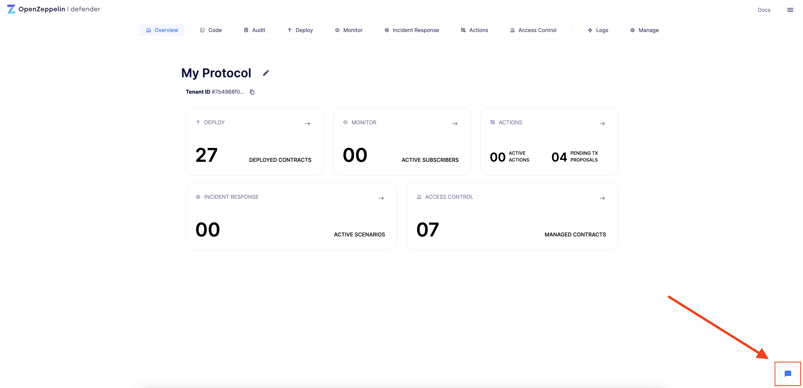

# Defender 2.0
OpenZeppelin Defender 2.0是一个关键的开发者安全平台，用于以**信心编码**、**审计**、**部署**、**监控**和**操作区块链应用**。

Defender 2.0直接集成到开发者的工作流程中，使开发者和运营者能够轻松快速地在部署前后预防和修复安全问题。

## Modules
Defender 2.0的模块可以无缝协同工作，为用户提供强大的功能和卓越的集成体验。点击每个模块的卡片，了解更多信息。

### [Code](../Modules/code/Code.md)
使用OpenZeppelin代码应用自动化GitHub PRs的安全检查。

### [Audit](../Modules/Audit/Audit.md)
管理智能合约审计过程并跟踪问题和解决方案。

### [Deploy](../Modules/Deploy.md)
管理部署和升级以确保安全发布。

### [Monitor](../Modules/Monitor/Monitor.md)
通过触发操作和警报检测智能合约活动和异常。

### [Incident Response](../Modules/Incident-Response/Incident-Response.md)
配置预定义的事件响应场景，由监视器自动触发或按需触发。

### [Actions](../Modules/Actions/Actions.md)
执行链上和链下操作的自动化行为。

### [Access Control](../Modules/Access-Control/Access-Control.md)
轻松管理智能合约账户，角色和权限。

## Available networks
Defender 2.0与大多数主网和测试网，以及本地主网分叉兼容。

* [以太坊主网](https://ethereum.org/en/)，Goerli测试网和Sepolia测试网。

* [zkSync Era主网](https://zksync.io/)和zkSync Era测试网。

* [Polygon (Matic)](https://www.polygon.technology/) 和 Mumbai。

* [Arbitrum One](https://arbitrum.io/)，[Arbitrum Nova](https://nova.arbitrum.io/)和Arbitrum Goerli。

* [Optimism](https://optimism.io/)和Optimism Goerli。

* [Moonbeam](https://moonbeam.network/)，Moonriver和Moonbase Alpha (测试网)。

* [Gnosis Chain](https://www.gnosis.io/)和Sokol。

* [币安智能链](https://docs.binance.org/smart-chain/guides/bsc-intro.html)和BSC测试网。

* [Avalanche C](https://docs.avax.network/learn/platform-overview#contract-chain-c-chain)和FUJI C-Chain。

* [Fuse](https://fuse.io/)。

* [Fantom](https://fantom.foundation/what-is-fantom-opera/)和Fantom测试网。

* [Celo](https://celo.org/)和Alfajores。

* [Harmony Shard 0](https://www.harmony.one/)和Harmony测试网Shard 0。

* [Aurora](https://aurora.dev/)和Aurora测试网。

* [Hedera](https://hedera.com/)和Hedera测试网。

* [Base主网](https://base.org/)和Base Goerli。

* [Linea主网](https://linea.build/)和Linea Goerli。

如果有任何其他网络或第二层解决方案你希望从Defender 2.0使用，请通过[Defender上的表单与我们联系](#feedback)！

## Integrations
Defender 2.0的集成功能允许用户连接其他服务和工具。在[这里](../Integrations.md)找到集成列表和更多信息。

## Feedback
作为Defender 2.0的用户，你的反馈非常重要！请通过屏幕右下角的表格向我们提供反馈。
