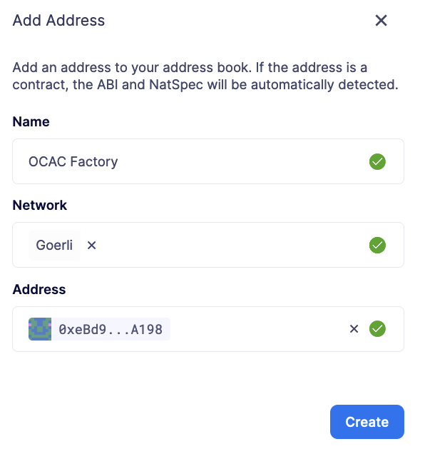
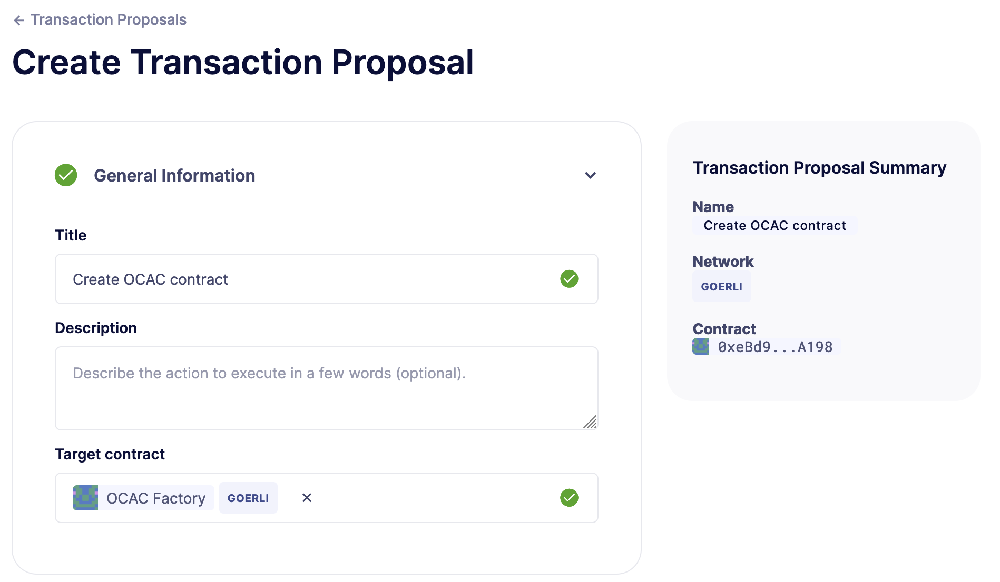
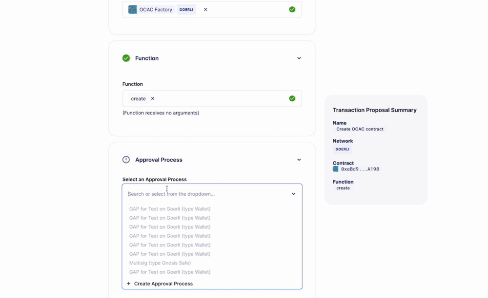
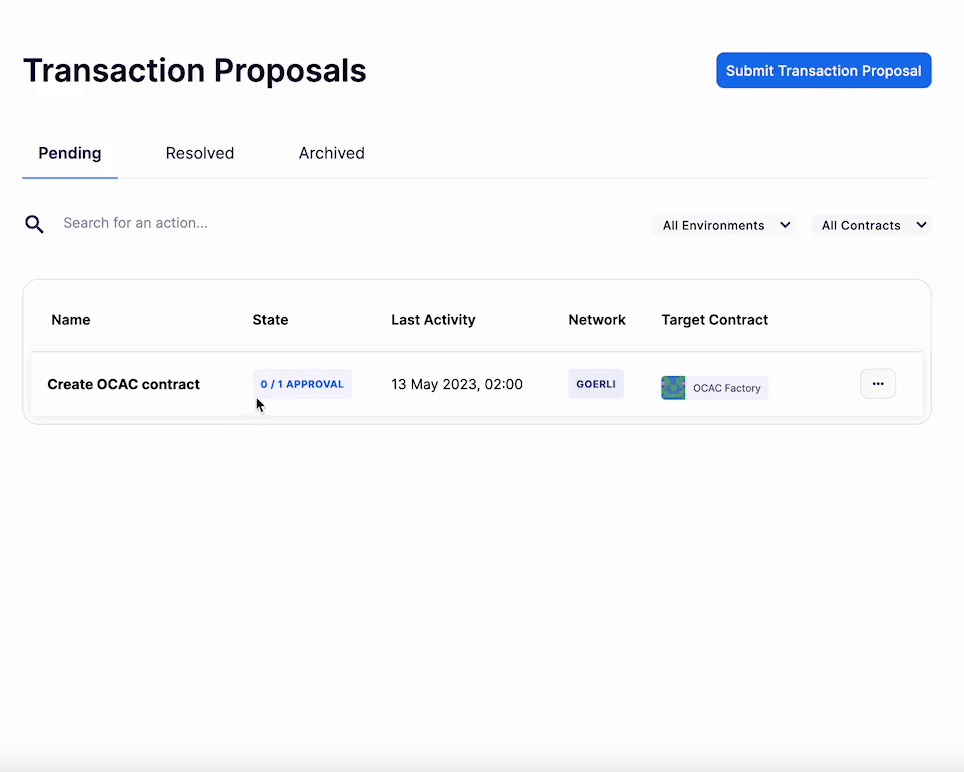
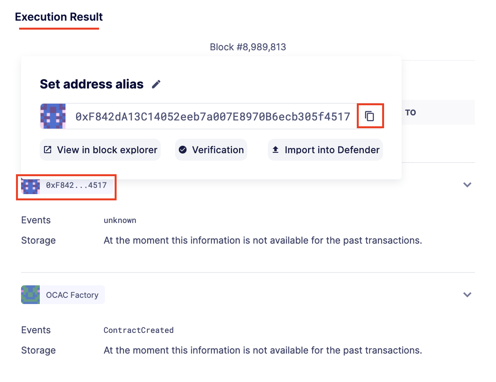
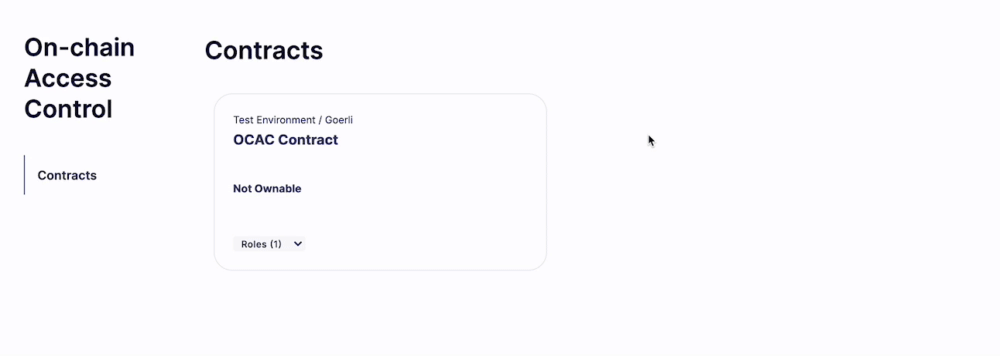
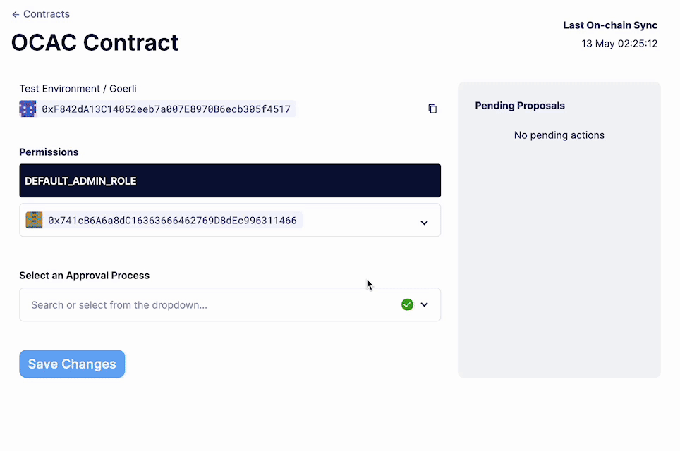

# Modify and assign roles in a role-based access control smart contract

Defender 2.0 允许你无缝地监督和指挥合约权限，具有查看和控制访问权限的能力，可以进行细粒度的管理。本教程将展示如何添加一个智能合约以查看和管理其角色，包括分配和移除角色。

## Pre-requisites
* OpenZeppelin Defender 2.0 账户。你可以在[此处](https://www.openzeppelin.com/defender2-waitlist)注册 Defender 2.0 的早期访问权限。

* 任何外部钱包（如 Metamask），其中包含一个在 Goerli 上持有资金的 EOA（外部拥有的账户）。

## 1. Add contract
> NOTE
对于本教程，你将创建一个使用[此](https://goerli.etherscan.io/address/0xeBd906d6b14699574bDe9B3293894af8Fe38A198)工厂部署到 Goerli 的合约，该合约实现了基于角色的访问控制库。你创建的合约将自动为你分配管理其角色的管理员角色。

1. 在 Web 浏览器中打开 Defender 2.0 [地址簿](https://defender.openzeppelin.com/v2/#/manage/address-book/new)。

2. 用以下值填写表单，然后点击“创建”：

* 名称：访问控制工厂

* 网络：Goerli

* 地址：0xeBd906d6b14699574bDe9B3293894af8Fe38A198



3. 导航到[交易提案](https://defender.openzeppelin.com/v2/#/actions/executable/new?)。

4. 用以下值填写**General Information**部分：

* 名称：创建访问控制合约

* 目标合约：访问控制工厂



5. 对于**Function**部分，选择 create 函数。

6. 打开**Approval Process**部分，点击输入字段并选择“创建审批流程”。

7. 用以下值填写审批流程表单，然后点击“保存更改”：

* 名称：访问控制管理员

* 类型：EOA

* 地址：你钱包的 EOA 地址

8. 连接你的钱包，使用创建的审批流程的 EOA 地址，然后点击“提交交易提案”。



9. 点击“创建访问控制合约”交易提案。

10. 点击右上角的“批准并执行”按钮，并在你的钱包上确认交易。



11. 向下滚动，在**Execution Result**下，将鼠标悬停在第一个合约上以复制其地址。



12. 导航到 [Defender 2.0 地址簿](https://defender.openzeppelin.com/v2/#/manage/address-book/new)，以添加你新创建的合约。

13. 用以下值填写表单，然后点击“创建”：

* 名称：访问控制合约

* 网络：Goerli

* 地址：从前面的步骤中复制的合约地址

* ABI：复制并粘贴以下内容
```
[{"inputs":[],"stateMutability":"nonpayable","type":"constructor"},{"anonymous":false,"inputs":[{"indexed":true,"internalType":"bytes32","name":"role","type":"bytes32"},{"indexed":true,"internalType":"bytes32","name":"previousAdminRole","type":"bytes32"},{"indexed":true,"internalType":"bytes32","name":"newAdminRole","type":"bytes32"}],"name":"RoleAdminChanged","type":"event"},{"anonymous":false,"inputs":[{"indexed":true,"internalType":"bytes32","name":"role","type":"bytes32"},{"indexed":true,"internalType":"address","name":"account","type":"address"},{"indexed":true,"internalType":"address","name":"sender","type":"address"}],"name":"RoleGranted","type":"event"},{"anonymous":false,"inputs":[{"indexed":true,"internalType":"bytes32","name":"role","type":"bytes32"},{"indexed":true,"internalType":"address","name":"account","type":"address"},{"indexed":true,"internalType":"address","name":"sender","type":"address"}],"name":"RoleRevoked","type":"event"},{"inputs":[],"name":"DEFAULT_ADMIN_ROLE","outputs":[{"internalType":"bytes32","name":"","type":"bytes32"}],"stateMutability":"view","type":"function"},{"inputs":[],"name":"RANDOM_ROLE","outputs":[{"internalType":"bytes32","name":"","type":"bytes32"}],"stateMutability":"view","type":"function"},{"inputs":[{"internalType":"bytes32","name":"role","type":"bytes32"}],"name":"getRoleAdmin","outputs":[{"internalType":"bytes32","name":"","type":"bytes32"}],"stateMutability":"view","type":"function"},{"inputs":[{"internalType":"bytes32","name":"role","type":"bytes32"},{"internalType":"address","name":"account","type":"address"}],"name":"grantRole","outputs":[],"stateMutability":"nonpayable","type":"function"},{"inputs":[{"internalType":"bytes32","name":"role","type":"bytes32"},{"internalType":"address","name":"account","type":"address"}],"name":"hasRole","outputs":[{"internalType":"bool","name":"","type":"bool"}],"stateMutability":"view","type":"function"},{"inputs":[{"internalType":"bytes32","name":"role","type":"bytes32"},{"internalType":"address","name":"account","type":"address"}],"name":"renounceRole","outputs":[],"stateMutability":"nonpayable","type":"function"},{"inputs":[{"internalType":"bytes32","name":"role","type":"bytes32"},{"internalType":"address","name":"account","type":"address"}],"name":"revokeRole","outputs":[],"stateMutability":"nonpayable","type":"function"},{"inputs":[{"internalType":"bytes4","name":"interfaceId","type":"bytes4"}],"name":"supportsInterface","outputs":[{"internalType":"bool","name":"","type":"bool"}],"stateMutability":"view","type":"function"}]
```

14. 导航到[访问控制页面](https://defender.openzeppelin.com/v2/#/access-control/contracts)。

15. 观察你新添加的合约，以及持有管理员角色的地址数量。



16. 点击合约卡片。

## 2. View and modify roles
在你特定合约的页面上，你可以看到持有 DEFAULT_ADMIN_ROLE 角色的地址，这是你用来部署合约的审批流程中的 EOA 地址。要进行更改，请点击角色并输入新地址（或者如果你想从角色中移除它，则移除一个地址）。按照以下步骤将新地址添加到 DEFAULT_ADMIN_ROLE：

1. 点击 DEFAULT_ADMIN_ROLE 角色。

2. 从下拉菜单中选择任何地址或添加一个新地址。

3. 向下滚动并点击“选择审批流程”。

4. 选择你的访问控制管理员审批流程。

5. 检查你的钱包是否使用正确的 EOA 地址连接。如果没有，请点击字段下方的按钮连接你的钱包。

6. 点击“保存更改”并在你的钱包上确认交易。

7. 等待交易执行并检查新地址是否持有 DEFAULT_ADMIN_ROLE 角色。



对于可拥有的合约，你只能使用与当前所有者地址匹配的审批流程来更改所有者角色。当使用多签名作为审批流程时，你将在页面右侧看到待处理的提案。

页面每分钟同步一次，并在修改角色时更新。

## Next steps
恭喜你！你可以导入其他合约并修改它们的角色。

> NOTE
在配置访问控制后，我们建议设置事故响应场景。在此处了解如何使用事故响应的教程。

## Reference
* [Access Control Documentation](https://docs.openzeppelin.com/defender/v2/module/access-control)

* [Access Control Contract](https://etherscan.io/address/0xbC760FAa5d2366B38C0EF7eC6814A61952504B72)