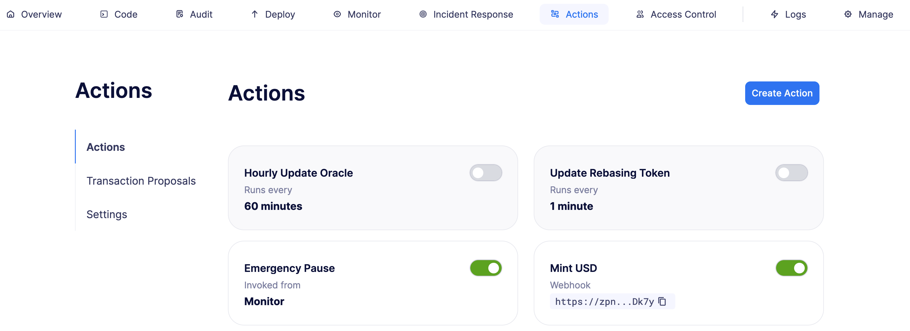
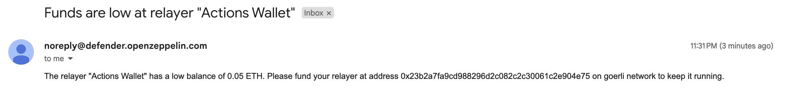

# Automate smart contract transaction for hourly activity
Defender 2.0允许你自动化智能合约的运营任务，并且可以轻松集成到Defender 2.0的其他部分。本教程将展示如何构建一个动作，该动作每小时发送一次链上交易，向一个箱子中添加一个物体，并增加箱内物体的数量。

## Pre-requisites
你可以在[此处](https://www.openzeppelin.com/defender2-waitlist)注册 OpenZeppelin Defender 2.0 的早期访问权限。

学习如何通过 Defender 2.0 *部署*和*监控*合约！

## 1. Set up action
你将配置一个操作，该操作每小时发送一次带有 addObject() 函数的交易到 Goerli 网络中的 0x7A99C479775C945C2Ea4CF6986425de1d816DaE4 合约，该合约是在*部署*教程中部署的 Box 合约的一个示例。要执行此操作，请按照以下步骤操作：

1. 在你的终端运行以下命令：

2. 在网络浏览器中打开 [Defender 2.0 管理](https://defender.openzeppelin.com/v2/#/manage/relayers)界面。

3. 点击创建名为 Actions Relayer 的**中继器**，并选择 Goerli 网络。

4. 为其充值一些 Goerli ETH。这个中继器将发送并支付自动化交易的费用。

5. 打开 [Defender 2.0 操作](https://defender.openzeppelin.com/v2/#/actions)界面。

6. 点击**Create Action**。

7. 将操作命名为 Hourly object add。

8. 选择 **Schedule** 作为触发器，并设置**时间跨度**为 1 小时的计划。

9. 选择已连接的**中继器**为 Actions Relayer。

10. 在代码字段中**粘贴**以下代码：

```javascript
const { Defender } = require('@openzeppelin/defender-sdk');

exports.handler = async function(credentials) {
  const client = new Defender(credentials);

  const txRes = await client.relaySigner.sendTransaction({
    to: '0x7A99C479775C945C2Ea4CF6986425de1d816DaE4',
    speed: 'fast',
    data: '0x62029d2a',
    gasLimit: '80000',
  });

  console.log(txRes);
  return txRes.hash;
}
```

合约地址是目标，即 0x7A99C479775C945C2Ea4CF6986425de1d816DaE4，数据是 0x62029d2a，这是合约的 addObject() 函数的编码版本。

11. 点击保存操作。

保存后，操作页面应该如下所示：



你的操作现在将每小时运行一次！你可以查看 [Defender 2.0 日志](https://defender.openzeppelin.com/v2/#/logs)以获取更详细的活动信息。

## 2. Verify activity
操作运行一段时间后，你可以验证交易是否每小时被发送一次。为此，请打开 [Etherscan 合约](https://goerli.etherscan.io/address/0x7A99C479775C945C2Ea4CF6986425de1d816DaE4)页面并查找来自配置的中继器的交易。另一种方法是在 Etherscan 中搜索你的中继器，并查找发送到合约的交易。

如果操作失败（例如，如果中继器耗尽了气体），你还将收到警报。它们看起来像这样：



## Next steps
恭喜！你可以修改操作以自动化其他合约并构建更复杂的交易。如果你对高级用例感兴趣，我们正在编写与操作相关的指南。

> NOTE
除了操作之外，我们还建议使用访问控制通过 Defender 2.0 管理合约的权限。在*这里*了解如何使用其教程中的访问控制。

## Reference

* [Actions Documentation](https://docs.openzeppelin.com/defender/v2/module/actions)

* [More information on Action’s Javascript code](https://docs.openzeppelin.com/defender/v2/module/actions#defining-code)

* [Box Goerli contract](https://goerli.etherscan.io/address/0x7A99C479775C945C2Ea4CF6986425de1d816DaE4)