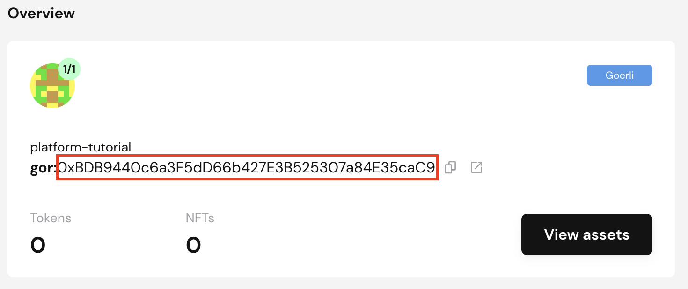
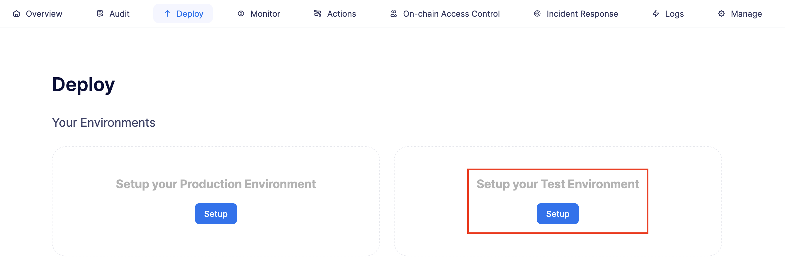
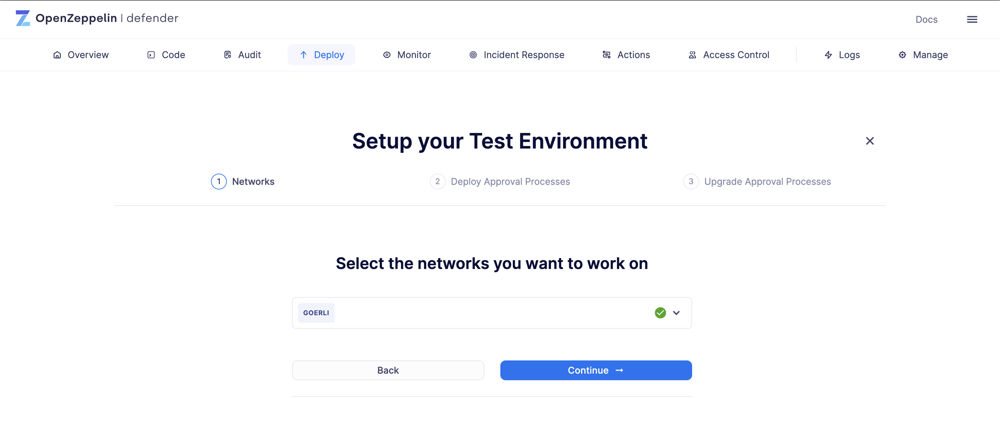
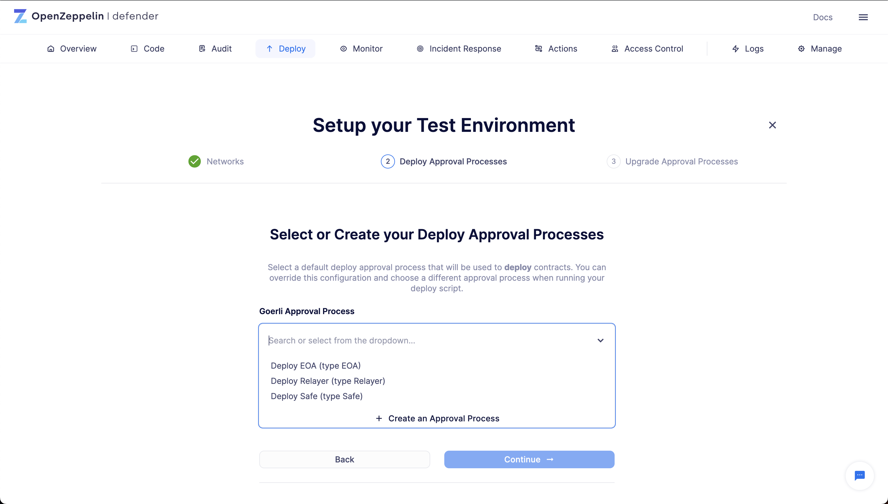
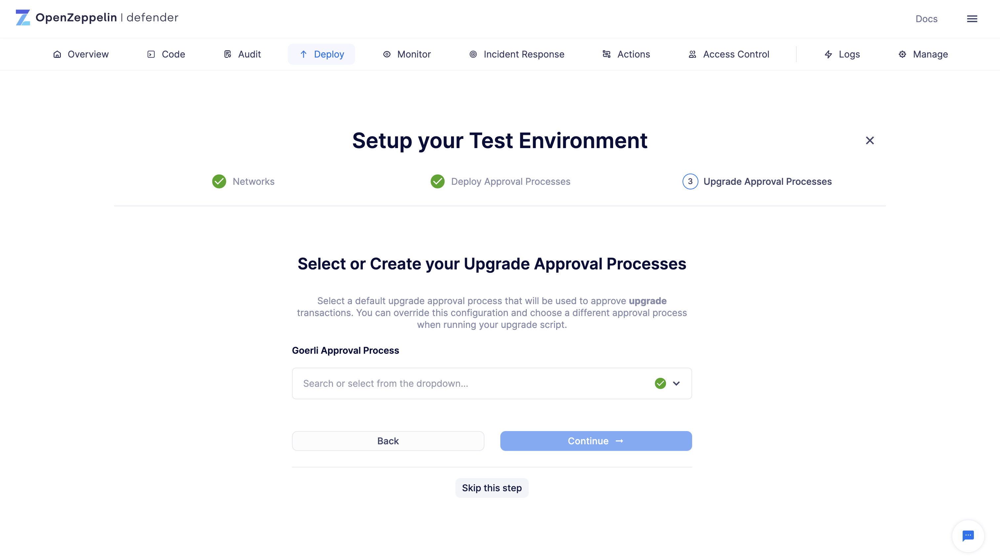
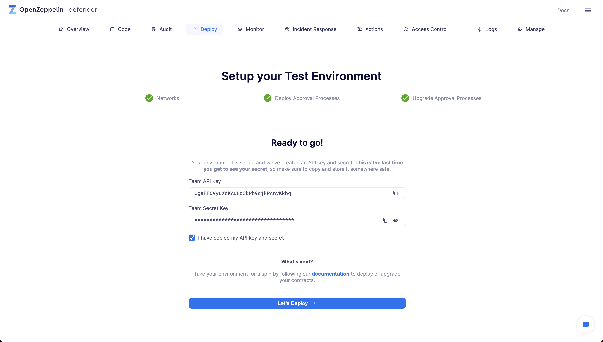
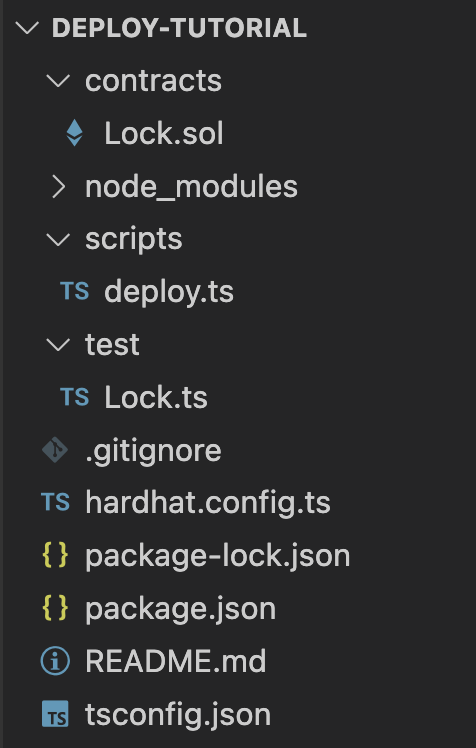
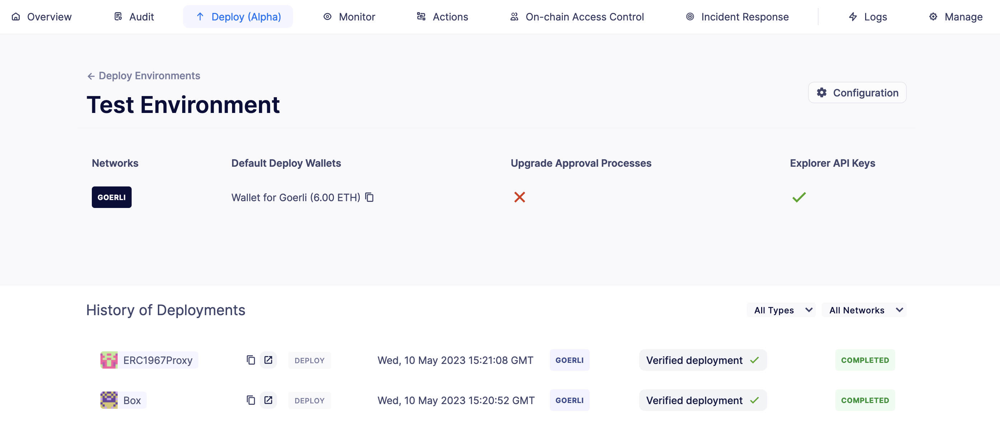
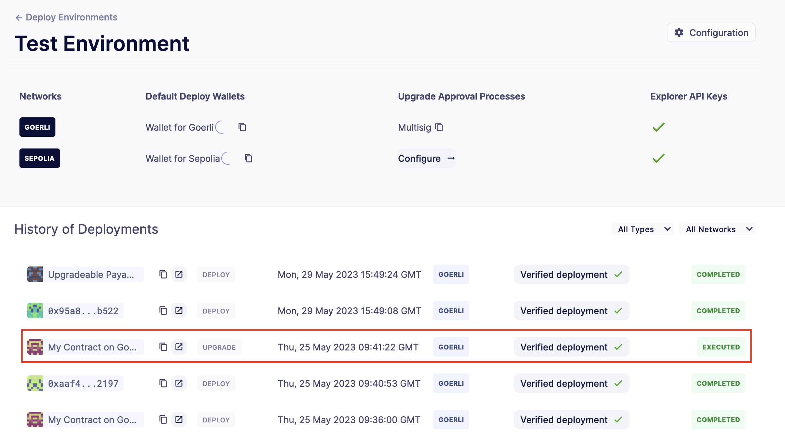

# Securely deploy and upgrade a smart contract
Defender 2.0 允许你在保持最佳安全实践的同时，轻松地跨链部署和升级智能合约。本教程将展示如何使用 *Relayer* 通过 [Safe 钱包](https://safe.global/)（多签名）部署名为 Box 的合约，并使用 UUPS 代理模式对其进行升级。

## Pre-requisites
* OpenZeppelin Defender 2.0 账户。你可以在[此处](https://www.openzeppelin.com/defender2-waitlist)注册 Defender 2.0 的早期访问权限。

* [NodeJS和NPM](https://nodejs.org/en)已安装[Hardhat](https://hardhat.org/hardhat-runner/docs/getting-started#installation)，并配有ethers v6（推荐的Hardhat版本为v2.19.0）

* 任何 IDE 或文本编辑器

* 安装了 Metamask（或任何其他兼容钱包）的网络浏览器，并在 Goerli 测试网上充值了 ETH。

## 1. Configure
### Safe wallet
首先，你需要创建 Safe 钱包来管理升级过程。为此，请按照以下步骤操作：

1. 在网络浏览器中打开 [Safe 应用](https://app.safe.global/welcome)，并连接你的钱包（确保你已连接到 [Goerli 测试网](https://goerli.etherscan.io/)）。

2. 点击**Create new Account**并按照步骤操作。

3. 记下你创建的 Safe 钱包的地址，稍后你将需要它。


### Environment setup
现在，你将创建一个Defender 2.0测试环境，并在Goerli测试网上部署和升级智能合约。请按照以下步骤操作：

1. 打开[Defender 2.0 Deploy](https://defender.openzeppelin.com/v2/#/deploy)。

2. 点击**Setup**。



3. 从下拉菜单中选择**Goerli**。



4. 选择与你已资金注入的中继器相关联的审批流程，该中继器将执行测试环境的部署。如果你还没有审批流程，Defender 2.0将允许你在向导流程中创建一个。中继器自动支付燃气费，并负责私钥的安全存储、交易签名、nonce管理、燃气价格估算和重新提交。不过，你也可以选择使用EOA（“外部拥有的账户”）或Safe钱包进行部署。

> NOTE
在*这里*阅读更多关于中继器以及如何管理它们的信息。



5. 点击“审批流程”字段以展开下拉菜单，然后点击**Create an Approval Process**。输入“Safe Wallet审批流程”作为名称，展开合约字段并点击**Add contract**。输入“Safe Wallet”作为名称，粘贴你之前复制的Safe钱包地址并点击**Create**。在合约下拉菜单中选择“Safe Wallet”，然后点击**Continue**。


6. Defender 2.0将为这个环境生成一个API密钥和密钥，所以请复制并安全地存储它们。点击**Let’s Deploy**访问环境页面。



> NOTE
你配置了测试环境，以便在不冒失去实际资金的风险的情况下学习。设置生产环境的步骤是相同的。

### Hardhat Integration
通过 Defender 2.0 部署非常简单，一旦安装了 Hardhat，按照以下步骤创建一个新目录和项目：

1. 在终端中运行以下命令：
```
mkdir deploy-tutorial && cd deploy-tutorial && npx hardhat init
```

2. Hardhat 会询问一些问题来设置配置，因此请按照以下回答：

* 你想做什么：创建一个 Typescript 项目

* Hardhat 项目根目录：保持原样

* 你想使用 .gitignore 吗：是

* 你想用 npm 安装这个示例项目的依赖吗：是

3. 现在，Hardhat 将安装工具库，并为你创建项目文件。之后，使用以下命令安装 OpenZeppelin 包：
```
npm i @openzeppelin/hardhat-upgrades @openzeppelin/contracts-upgradeable@4.9.3 dotenv --save-dev
```

安装完所有东西后，你的初始目录结构应该看起来像这样:


4. 你现在需要编辑你的 Hardhat 配置，以添加 Defender 2.0 密钥和 Goerli 网络。打开 hardhat.config.ts 文件，并用以下代码替换其内容:
```
import { HardhatUserConfig } from "hardhat/config";
import "@nomicfoundation/hardhat-toolbox";
import "@openzeppelin/hardhat-upgrades";

require("dotenv").config();

const config: HardhatUserConfig = {
  solidity: "0.8.18",
  defender: {
    apiKey: process.env.DEFENDER_KEY as string,
    apiSecret: process.env.DEFENDER_SECRET as string,
  },
  networks: {
    goerli: {
      url: "https://rpc.ankr.com/eth_goerli",
      chainId: 5
    },
  },
};

export default config;
```

5. 在项目根目录中创建一个名为 .env 的新文件，并添加以下内容，其中包含在创建 Defender 2.0 环境后收到的密钥:
```
DEFENDER_KEY = "<<YOUR_KEY>>"
DEFENDER_SECRET = "<<YOUR_SECRET>>"
```

## 2. Deploy
1. 在contracts目录中创建一个名为Box.sol的新文件，并添加以下代码：
```
// SPDX-License-Identifier: Unlicense
pragma solidity ^0.8.18;

import {Initializable} from  "@openzeppelin/contracts-upgradeable/proxy/utils/Initializable.sol";
import {UUPSUpgradeable} from "@openzeppelin/contracts-upgradeable/proxy/utils/UUPSUpgradeable.sol";
import {OwnableUpgradeable} from "@openzeppelin/contracts-upgradeable/access/OwnableUpgradeable.sol";

/// @title Box
/// @notice A box with objects inside.
contract Box is Initializable, UUPSUpgradeable, OwnableUpgradeable {
    /*//////////////////////////////////////////////////////////////
                                VARIABLES
    //////////////////////////////////////////////////////////////*/

    /// @notice Number of objects inside the box.
    uint256 public numberOfObjects;

    /*//////////////////////////////////////////////////////////////
                                FUNCTIONS
    //////////////////////////////////////////////////////////////*/

    /// @notice No constructor in upgradable contracts, so initialized with this function.
    function initialize(uint256 objects, address multisig) public initializer {
        __UUPSUpgradeable_init();
        __Ownable_init();

        numberOfObjects = objects;

        // Initialize OwnableUpgradeable explicitly with given multisig address.
        transferOwnership(multisig);
    }

    /// @notice Remove an object from the box.
    function removeObject() external {
        require(numberOfObjects > 1, "Nothing inside");
        numberOfObjects -= 1;
    }

    /// @dev Upgrades the implementation of the proxy to new address.
    function _authorizeUpgrade(address) internal override onlyOwner {}
}
```

这是一个模拟箱子的合约，包含三个函数：

* initialize()：使用初始实现初始化可升级代理，并将所有权转移给给定的多签名地址。

* removeObject()：通过移除一个物体来减少箱子中的物体数量。

* _authorizeUpgrade()：将代理指向一个新的实现地址。

2. 打开位于scripts目录下的deploy.ts文件。这个脚本将通过Defender 2.0部署一个可升级的Box合约，并在合约部署后使用initializer选项调用initialize()函数，初始时箱子内有5个物体，并且所有者是在环境设置中配置的多签名地址。将下面的代码复制并粘贴到deploy.ts中:
```
import { ethers, defender } from "hardhat";

async function main() {
  const Box = await ethers.getContractFactory("Box");

  const defaultApprovalProcess = await defender.getDefaultApprovalProcess();

  if (defaultApprovalProcess.address === undefined) {
    throw new Error(`Upgrade approval process with id ${defaultApprovalProcess.approvalProcessId} has no assigned address`);
  }

  const deployment = await defender.deployProxy(Box, [5, defaultApprovalProcess.address], { initializer: "initialize" });

  await deployment.waitForDeployment();

  console.log(`Contract deployed to ${await deployment.getAddress()}`);
}

// We recommend this pattern to be able to use async/await everywhere
// and properly handle errors.
main().catch((error) => {
  console.error(error);
  process.exitCode = 1;
});
```

对于可升级的合约，你应该使用 deployProxy()、deployBeacon() 和 deployImplementation() 方法进行部署，而对于非可升级的合约，则应使用 deployContract() 方法。如果你想强制使用 deployContract()，需要将 unsafeAllowDeployContract 选项设置为 true。更多信息请参考[这里](https://github.com/OpenZeppelin/openzeppelin-upgrades/blob/master/docs/modules/ROOT/pages/defender-deploy.adoc)。

通过运行以下命令来部署你的 box，该命令将执行你的部署脚本:
```
npx hardhat run --network goerli scripts/deploy.ts
```

成功！你的合约应该已经在Goerli测试网络中部署。导航至Defender 2.0中的“部署”页面，并检查代理和实现是否已在测试环境中部署。所有Box交易都应发送到代理地址，因为它将存储状态并指向给定的实现。复制代理的地址以便下一步升级它。


### Caveats
Defender 2.0 默认使用 CREATE 操作码来部署合约。这种方法创建一个新的合约实例，并为其分配一个唯一的地址。这个地址由交易的 nonce 和发送者的地址决定。

Defender 2.0 还提供了一个高级部署选项，使用 CREATE2 操作码。当部署请求包含一个 salt 时，Defender 2.0 切换到使用 CREATE2 操作码。这个操作码允许你基于发送者地址、salt 和合约字节码的组合，部署合约到一个确定性的地址。

> WARNING
尽管 CREATE2 提供了确定性的合约地址，但它改变了 msg.sender 的行为。在 CREATE2 部署中，构造函数或初始化代码中的 msg.sender 指的是工厂地址，而不是标准 CREATE 部署中的部署地址。当选择 CREATE2 时，这种区别可能会影响合约逻辑，因此在选择 CREATE2 时需要进行仔细的测试和考虑。

## 3. Upgrade
升级智能合约允许在保持相同地址和存储的情况下更改其逻辑。按照以下步骤升级你的 Box 合约，以添加新功能：

1. 在 contracts 目录中创建一个名为 BoxV2.sol 的文件，并添加以下代码:
```
// SPDX-License-Identifier: Unlicense
pragma solidity ^0.8.18;

import {Box} from "./Box.sol";

/// @title BoxV2
/// @notice An improved box with objects inside.
contract BoxV2 is Box {
    /*//////////////////////////////////////////////////////////////
                                FUNCTIONS
    //////////////////////////////////////////////////////////////*/

    /// @notice Add an object to the box.
    function addObject() external {
        numberOfObjects += 1;
    }

    /// @notice Returns the box version.
    function boxVersion() external pure returns (uint256) {
        return 2;
    }
}
```

这是一个合约，为你的盒子添加了两个新功能：

* addObject()：通过添加一个物体来增加盒子中物体的数量。

* boxVersion()：返回盒子实现的版本。

2. 在scripts目录下创建一个名为upgrade.ts的文件，并粘贴以下代码。确保用你之前复制的盒子地址替换<BOX ADDRESS>。

```
import { ethers, defender } from "hardhat";

async function main() {
  const BoxV2 = await ethers.getContractFactory("BoxV2");

  const proposal = await defender.proposeUpgradeWithApproval('<BOX ADDRESS>', BoxV2);

  console.log(`Upgrade proposed with URL: ${proposal.url}`);
}

// We recommend this pattern to be able to use async/await everywhere
// and properly handle errors.
main().catch((error) => {
  console.error(error);
  process.exitCode = 1;
});
```

3. 使用以下命令使用升级脚本创建升级提案：
```
npx hardhat run --network goerli scripts/upgrade.ts
```

4. 导航到[Defender 2.0测试环境](https://defender.openzeppelin.com/v2/#/deploy/environment/test)，并点击升级提案，这将在屏幕的右侧展开一个模态框。

5. 点击查看**交易提案**，并在页面右上角点击**批准并执行**。使用你创建Safe Wallet时使用的钱包签名并执行交易。

哇！你的盒子现在应该升级到新版本了。你的测试环境页面中的升级提案现在应该被标记为**已执行**。



## Next steps
恭喜你！你现在可以使用相同的环境部署和升级其他合约了。如果你对高级用例感兴趣，我们正在编写相关的部署指南。

> NOTE
部署合约后，我们推荐使用Defender 2.0来监控其状态和交易。在*这里*学习如何使用Monitor的教程。

## Reference
[部署文档](https://docs.openzeppelin.com/defender/v2/module/deploy)

[Hardhat Upgrades包](https://www.npmjs.com/package/@openzeppelin/hardhat-upgrades)

[Upgrades Core包](https://www.npmjs.com/package/@openzeppelin/upgrades-core)