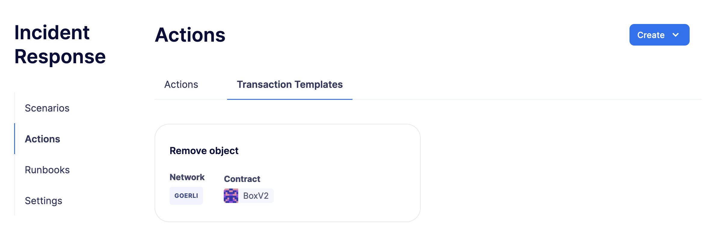
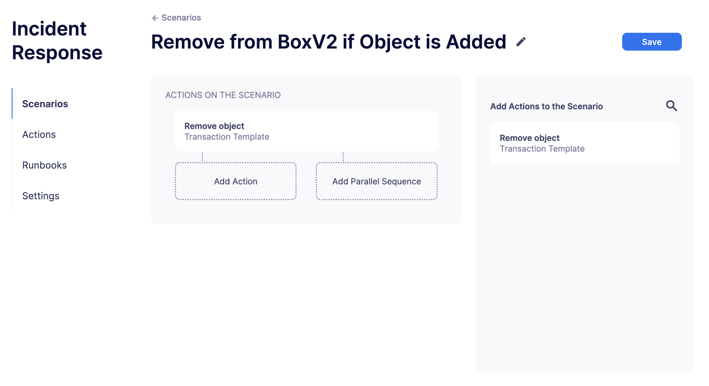
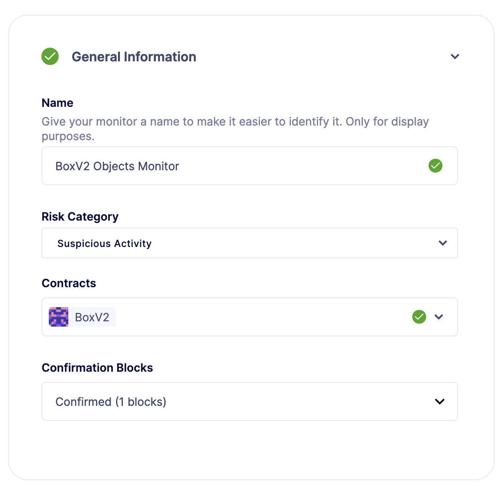
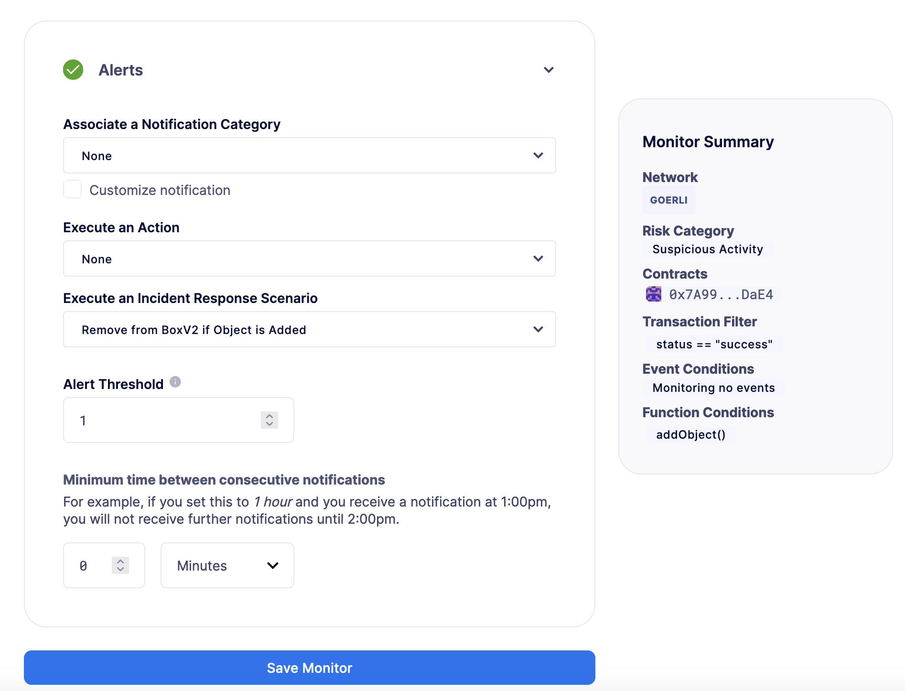
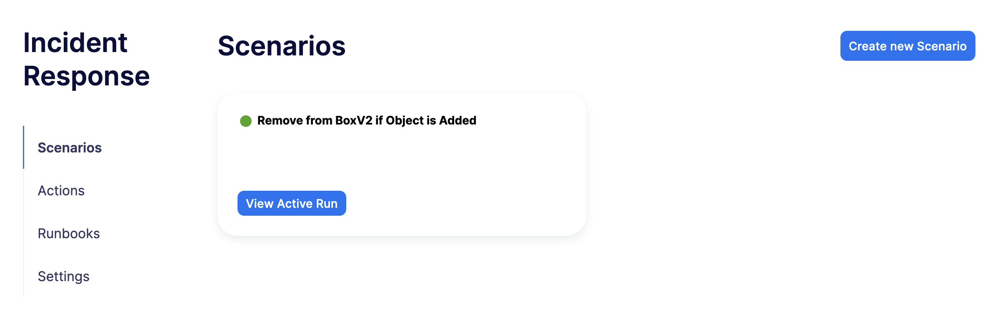
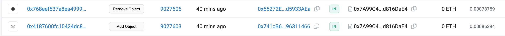

# Create an Incident Response scenario to decrease the number of objects in a Box contract
Defender 2.0允许您快速针对和激活链上活动，使用事件响应场景。本教程将展示如何创建一个场景，该场景监控Box合约中的对象数量，并在向其中添加对象时执行操作。

## Pre-requisites
OpenZeppelin Defender 2.0账户。您可以在[此处](https://www.openzeppelin.com/defender2-waitlist)注册Defender 2.0的早期访问权限。

## 1. Action setup
在本教程中，您将监控Goerli上的[这个](https://goerli.etherscan.io/address/0x7A99C479775C945C2Ea4CF6986425de1d816DaE4)合约，它存储了一些对象，同时允许任何人使用addObject()和removeObject()函数分别添加或移除对象。对于每个添加的对象，您的场景将执行一个操作，移除一个对象并将总数减少一个。按照以下步骤设置动作：

1. 在Web浏览器中打开[Defender 2.0管理中继器](https://defender.openzeppelin.com/v2/#/manage/relayers/new)。

2. 填写以下参数并点击**Create**：

* **名称：**Goerli中继器

* **网络：**Goerli

3. 将一些Goerli ETH转移到上一步中创建的中继器地址。

4. 导航至[Defender 2.0地址簿](https://staging.defender-dev.openzeppelin.com/#/manage/address-book/new)以导入BoxV2合约。

5. 填写以下参数并点击**Create**：

* **名称：**BoxV2

* **网络：**Goerli

* **地址：**0x7A99C479775C945C2Ea4CF6986425de1d816DaE4

6. 导航至Defender 2.0事件响应交易模板创建页面。

7. 在**通用信息部分**填写以下参数：

* **名称：**移除对象

* **合约：**BoxV2

8. 在**函数**部分的下拉菜单中选择removeObject函数。

9. 展开**审批流程**部分的下拉菜单并点击创建审批流程。

10. 填写以下参数并点击**Save Changes**：

* **名称：**BoxV2 IR发送者

* **中继器：**Goerli中继器（在第一步中创建）

11. 选择BoxV2 IR发送者作为审批流程并点击保存交易模板

## 2. Scenario setup
配置好动作后，您需要创建场景。按照以下步骤操作：

1. 打开[Defender 2.0事件响应场景创建页面](https://defender.openzeppelin.com/v2/#/incident-response/scenarios/new)。

2. 将场景重命名为“如果添加对象则从BoxV2移除”。

3. 将移除对象动作拖到第一行。

4. 点击**Save**。

## 3. Monitor setup
创建场景后，您需要配置一个监控器，以跟踪BoxV2合约中的对象数量并触发场景。按照以下步骤操作：

1. 打开[Defender 2.0监控器创建页面](https://defender.openzeppelin.com/v2/#/monitor/new/custom)。

2. 在**通用信息部分**填写以下参数：

* **名称：**BoxV2对象监控器

* **风险类别：**可疑活动

* **合约：**BoxV2

* **确认区块：**已确认（1个区块）

3. 在**交易过滤器**部分，为交易属性字段添加status == "success"。

4. 在**函数**部分，选择addObject()

5. 在**警报**部分，为执行事件响应场景选项选择“如果添加对象则从BoxV2移除”场景。

6. 点击保存监控器，它将开始运行。

## 4. Seeing it in action
当监控器运行时，它将检测任何与addObject()函数匹配的交易以触发事件响应场景。要手动执行这样的交易，请按照以下步骤操作：

1. 打开Defender 2.0交易提案创建页面。

2. 填写以下参数：

* **名称：**BoxV2添加对象触发器

* **合约：**BoxV2

* **函数：**addObject

* **审批流程：**BoxV2 IR发送者

3. 点击提交交易提案。

4. 点击交易提案以打开其页面。

5. 点击右上角的**Approve and Execute**按钮以执行交易，这将通过监控器触发事件响应场景。

6. 等待交易执行并打开[Defender 2.0事件响应场景](https://defender.openzeppelin.com/v2/#/incident-response/scenarios)页面。

7. 点击查看**活动运行**并检查您的场景响应详情。

8. 运行成功执行后，您可以通过检查[Etherscan](https://goerli.etherscan.io/address/0x7A99C479775C945C2Ea4CF6986425de1d816DaE4)上的合约活动来验证响应。它应该看起来像这样：

## Next steps

恭喜！您现在有了一个完整的事件响应场景，它将运行并检查每个确认的区块。场景可以通过并行动作进行扩展，以实现更多技术组合。如果您对高级用例感兴趣，我们正在编写与事件响应相关的指南。

## Reference
* [Incident Response Documentation](https://docs.openzeppelin.com/defender/v2/module/incident-response)

* [BoxV2](https://goerli.etherscan.io/address/0x7A99C479775C945C2Ea4CF6986425de1d816DaE4)