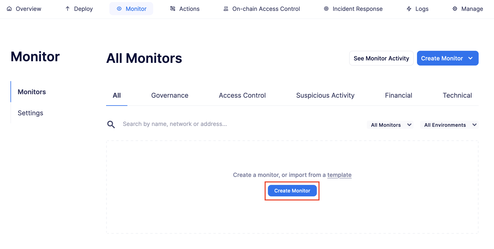
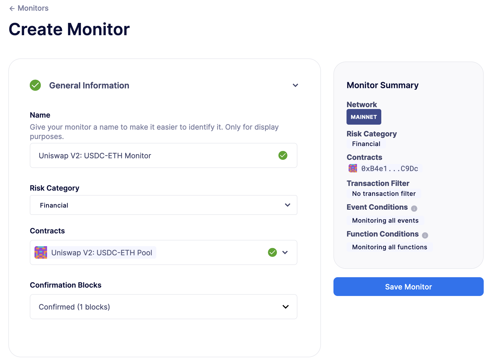
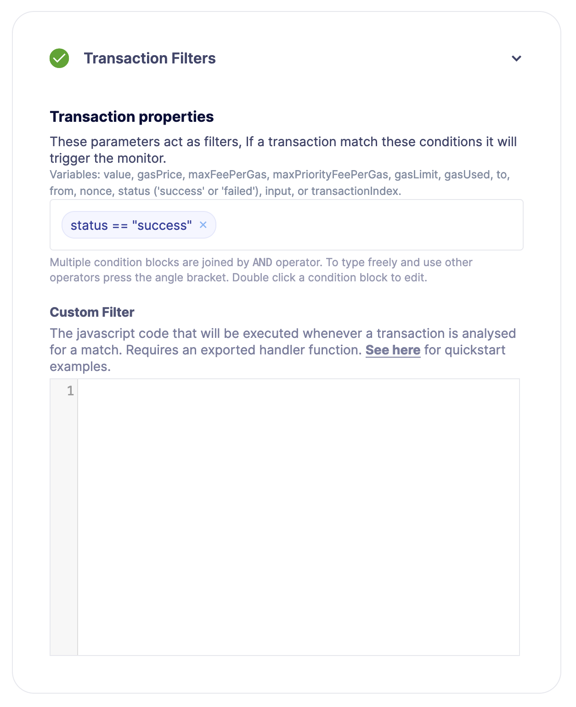
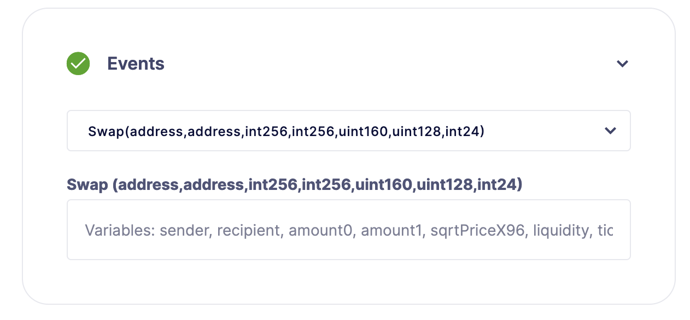
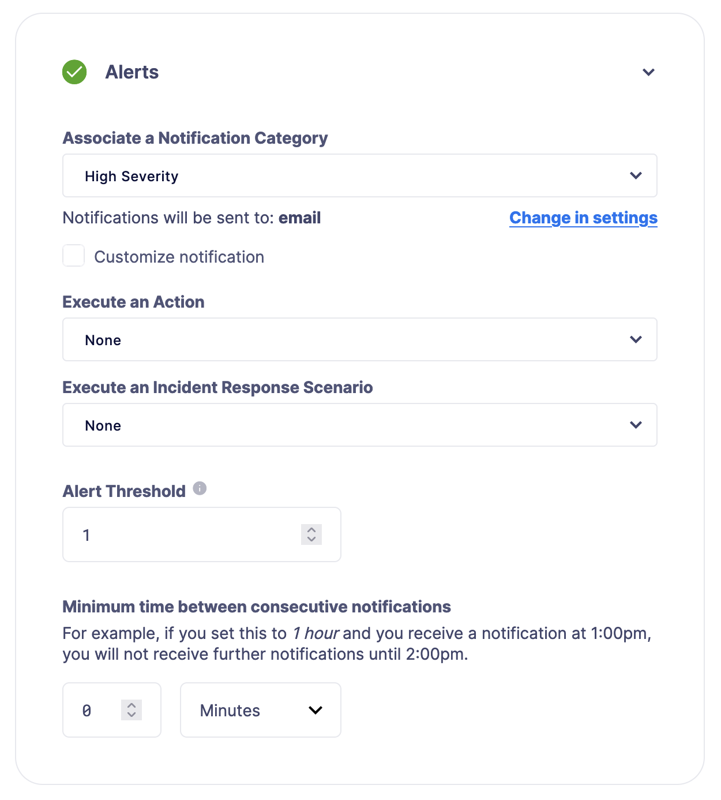
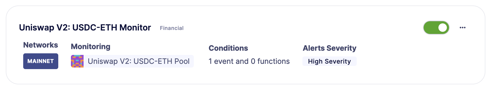
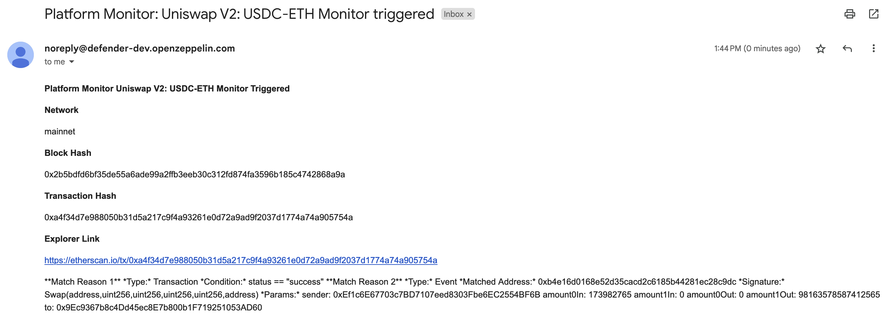
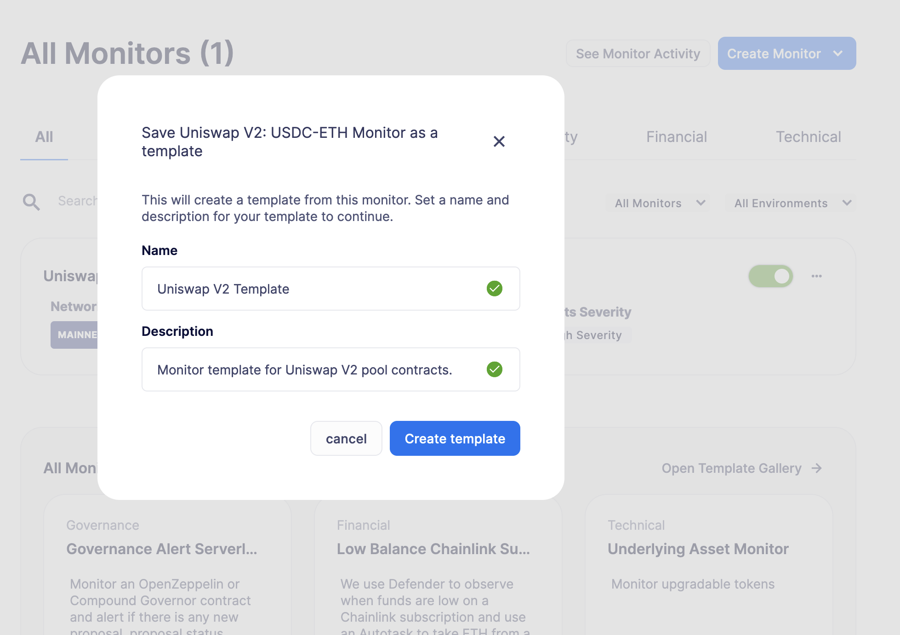

# Monitor a smart contract for on-chain activity
OpenZeppelin Defender 2.0 允许你跨链监控智能合约的交易和事件。本教程将展示如何构建一个定制的监控模板，并在现实世界中使用它来监控 [Uniswap V2](https://uniswap.org/) 池。

## Pre-requisites
* OpenZeppelin Defender 2.0 账户。你可以在[这里](https://www.openzeppelin.com/defender2-waitlist)注册 Defender 2.0 的早期访问权限。

> NOTE
学习如何使用 Defender 2.0 部署合约，请点击[这里](../Deploy/Deploy.md)！

## 1. Configure the monitor
你将监控以太坊主网上的 0xB4e16d0168e52d35CaCD2c6185b44281Ec28C9Dc 合约，这是 [Uniswap V2 的 USDC-ETH 池](https://etherscan.io/address/0xB4e16d0168e52d35CaCD2c6185b44281Ec28C9Dc)。由于该合约活动频繁，因此非常适合观察监控器的响应速度。按照以下步骤配置监控器：

1. 在网页浏览器中打开 [Defender 2.0 监控器](https://defender.openzeppelin.com/v2/#/monitor)。

2. 点击**Create Monitor**。

3. 将此监控器命名为 Uniswap V2: USDC-ETH 监控器。

4. 选择“金融风险”类别。

5. 点击**Contracts**字段并选择添加一个新地址。

6. 用以下参数填写表单，并选择它作为要监控的合约：

* 名称：Uniswap V2: USDC-ETH 池

* 网络：Mainnet

* 地址：0xB4e16d0168e52d35CaCD2c6185b44281Ec28C9Dc

7. 选择 1 个确认区块。Defender 2.0 将自动获取 ABI，因此我们可以接下来选择交易过滤器。

8. 添加 status == "success" 参数到**交易属性**中，以便按交易级数据过滤，并确认交易已成功确认且未被回滚。

9. 从下拉菜单中选择“交换”事件。每次在池中进行交换时都会发出此事件。

10. 跳过函数级别的过滤器，因为你已经在跟踪从合约发出的所有“交换”事件。

11. 选择与你选择的频道（如电子邮件）绑定的“高严重性”通知类别。

12. 点击**Save Monitor**。

你的监控器现在正在运行！

## 2. Receive alerts
警报将在监视器激活后开始滚动。如果你选择了电子邮件作为通知渠道，你的通知应该如下所示：

你可以在[Defender 2.0监视器](https://defender.openzeppelin.com/v2/#/monitor)页面上暂停或删除监视器。这个监视器会频繁触发，所以在你收到几个警报后，你可能会想要使用右侧的开关暂停它。你还可以通过点击其卡片上的点状图标并选择“保存为模板”来保存监视器为模板。

## Next steps
恭喜！你可以修改监视器以过滤特定的Swap数据或针对另一个池。如果你对高级用例感兴趣，我们正在编写与监视器相关的指南。

> NOTE
设置监视器后，我们建议在Defender 2.0上创建动作。在[这里](../Actions/Actions.md)学习如何使用动作及其教程。

## Reference
* [Actions Documentation](../../Modules/Actions/Actions.md)

* [Manage Notificacion Channels Documentation](../../Manage/Manage.md#notification-channels)

* [Uniswap V2 USDC-ETH Pool](https://etherscan.io/address/0xB4e16d0168e52d35CaCD2c6185b44281Ec28C9Dc)