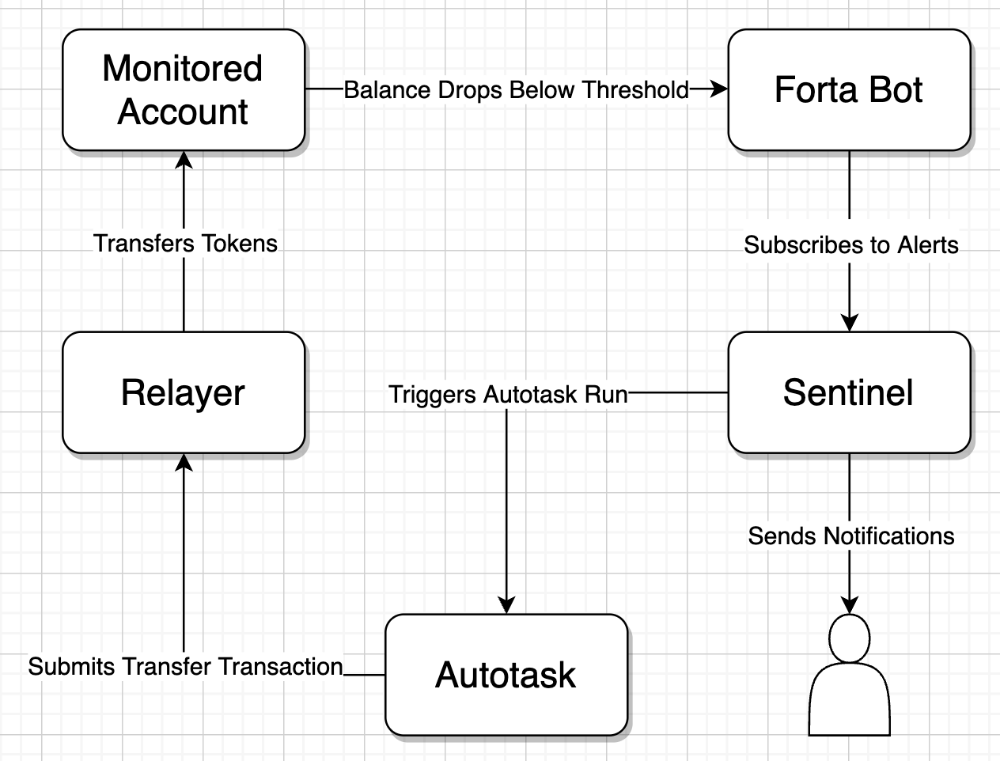

# Automate ERC20 Token Balance Maintenance Using A Forta Bot and Defender Autotask
本指南是将自定义 Forta 机器人与 Defender 集成的 A 到 Z 步骤。您将通过 Sentinel 将该机器人连接到 Defender。每当机器人触发警报时，Sentinel 将向您发送通知并触发 Autotask 运行自定义逻辑以发送交易（通过 Relayer）以自动为受监视帐户充值。在此示例中，我们将监视 Polygon 网络上的 LINK，但可以轻松替换任何 ERC20 代币。



[演示仓库](https://github.com/offgridauthor/automate-balance-topping-demo)

## 安装依赖项
>NOTE
尽管本指南使用defender-client包创建中继器、哨兵和自动任务，但完全相同的功能也可以通过Defender Web界面使用。

您需要安装相关的Defender NPM包。请注意，Forta机器人的创建还需要安装[Docker](https://www.docker.com/get-started)。
```
$ mkdir minimum-balance && cd minimum-balance
$ npm init -y
$ npm i --save-dev defender-relay-client defender-autotask-client defender-sentinel-client dotenv
```

## 创建中继器
从Defender Web界面，打开右上角的汉堡菜单。获取您的团队API密钥和密钥，并将它们保存到本地的.env文件中。

使用defender-relay-client，在Polygon网络上创建一个新的*中继器*，并将中继器的ID保存到您的.env文件中。
```
const { RelayClient } = require('defender-relay-client');
const { appendFileSync } = require('fs');

async function run() {
  require('dotenv').config();
  const { API_KEY: apiKey, API_SECRET: apiSecret } = process.env;
  const relayClient = new RelayClient({ apiKey, apiSecret });

  // create relay using defender client
  const requestParams = {
    name: 'LINK Low Balance Relayer',
    network: 'matic',
    minBalance: BigInt(1e17).toString(),
  };
  const relayer = await relayClient.create(requestParams);

  // store relayer info in file (optional)
  appendFileSync('.env', relayer.relayerId)
  console.log('Relayer created: ', relayer);
}

run().catch((error) => {
  console.error(error);
  process.exitCode = 1;
});
```
保存文件并运行脚本。拥有Relayer的ID就足以通过Autotask运行交易。

## 创建Autotask
接下来，您需要创建一个*Autotask*，利用ethers.js将LINK从*集成的Relayer*转移到您希望由Forta机器人监视的帐户。
```
$ mkdir autotasks && touch autotasks/index.js
```

在index.js文件中，包含运行transfer函数的逻辑：
```
// ...
async function handler(event) {
  const provider = new DefenderRelayProvider(event)
  const signer = new DefenderRelaySigner(event, provider, { speed: 'fast' })

  const contract = new ethers.Contract(LINK_CONTRACT, ABI, signer)
  const amount = ethers.utils.parseUnits("1.0", 18);
  const tx = await contract.connect(signer).transfer(MONITORED_ADDRESS, amount);
}

// ...
```

Autotask可以通过在创建Autotask时指定其ID来连接到Relayer。凭据传递会自动且安全地处理。

使用[defender-autotask-client](https://www.npmjs.com/package/defender-autotask-client)，在一个单独的文件中编写一个脚本，创建一个新的Autotask，并从autotasks/index.js上传代码。

```
const { AutotaskClient } = require('defender-autotask-client')
const { appendFileSync } = require('fs')

async function main() {
  require('dotenv').config()
  const credentials = {
    apiKey: process.env.API_KEY,
    apiSecret: process.env.API_SECRET,
  }
  const autotaskClient = new AutotaskClient(credentials)

  const params = {
    name: 'LINK low balance transfer',
    encodedZippedCode: await autotaskClient.getEncodedZippedCodeFromFolder(
      './autotasks'
    ),
    trigger: {
      type: 'webhook',
    },
    paused: false,
    relayerId: process.env.RELAYER_ID,
  }

  const createdAutotask = await autotaskClient.create(params)
  console.log('Created Autotask with ID: ', createdAutotask.autotaskId)

  appendFileSync('.env', `\nAUTOTASK_ID="${createdAutotask.autotaskId}"`)
}

if (require.main === module) {
  main()
    .then(() => process.exit(0))
    .catch((error) => {
      console.error(error)
      process.exit(1)
    })
}
```

保存脚本并运行它。

现在是构建Forta机器人的时候了。

## 安装Forta CLI
在这个演示中，您将使用命令行包来开发Forta机器人。

$ mkdir forta-bot && cd forta-bot $ npx forta-agent@latest init --typescript

将生成一个密钥文件在 ~/.forta，您将使用密码加密它。

## 创建机器人
首先，需要安装bignumber包：

$ npm install --save-dev bignumber

在/src目录中，打开agent.ts文件，替换起始代码。

导出一个处理方法，检查账户余额是否低于0.1 LINK：
```
import BigNumber from 'bignumber.js'
import {
  BlockEvent,
  Finding,
  HandleBlock,
  FindingSeverity,
  FindingType,
  getEthersProvider,
  ethers
} from 'forta-agent'

export const ABI = `[ { "constant": true, "inputs": [ { "name": "_owner", "type": "address" } ], "name": "balanceOf", "outputs": [ { "name": "balance", "type": "uint256" } ], "payable": false, "type": "function" } ]`
export const ACCOUNT = "[Your Account Address]" // The account you'd like to monitor
export const MIN_BALANCE = "100000000000000000" // 0.1 LINK
export const LINK = "0xb0897686c545045afc77cf20ec7a532e3120e0f1" //  LINK address on polygon

const ethersProvider = getEthersProvider()

function provideHandleBlock(ethersProvider: ethers.providers.JsonRpcProvider): HandleBlock {
  return async function handleBlock(blockEvent: BlockEvent) {
    // report finding if specified account balance falls below threshold
    const findings: Finding[] = []

    const erc20Contract = new ethers.Contract(LINK, ABI, ethersProvider)
    const accountBalance = new BigNumber((await erc20Contract.balanceOf(ACCOUNT, {blockTag:blockEvent.blockNumber})).toString())

    if (accountBalance.isGreaterThanOrEqualTo(MIN_BALANCE)) return findings

    findings.push(
      Finding.fromObject({
        name: "Minimum Account Balance",
        description: `Account balance (${accountBalance.toString()}) below threshold (${MIN_BALANCE})`,
        alertId: "FORTA-6",
        severity: FindingSeverity.Info,
        type: FindingType.Suspicious,
        metadata: {
          balance: accountBalance.toString()
        }
      }
    ))

    return findings
  }
}

export default {
  provideHandleBlock,
  handleBlock: provideHandleBlock(ethersProvider)
}
```

编辑package.json，为您的机器人指定一个唯一的名称（小写）和描述，并指定链ID。
```
{
  "name": "minimum-link-balance-polygon-example",
  "version": "0.0.1",
  "description": "Forta bot that reports whether an account has fallen below .1 LINK balance",
  "chainIds": [137],
  // ...
```

您可以通过在本地运行它并在代码中指定一个没有 LINK 的账户来观察机器人的功能，以使用实时的区块链数据。
```
$ npx hardhat forta:run
```

## 部署机器人
机器人的部署可以通过CLI、应用程序或Hardhat插件进行。

请记住，您要从已经资助了一些MATIC的帐户进行部署。
```
$ npm run publish
```

这将构建代理图像并将其推送到远程存储库。在输入安装 forta-agent 时创建的密码后，您将获得代理 ID 和清单。
```
❯ npm run publish

> minimum-link-balance-polygon-example@0.0.1 publish
> forta-agent publish

building agent image...
pushing agent image to repository...
✔ Enter password to decrypt keyfile UTC--2022-08-26T21:52:34.343Z--3c89fa18f6cb70585b5831970e6b0c067ae46598 … ********
pushing agent documentation to IPFS...
pushing agent manifest to IPFS...
adding agent to registry...
successfully added agent id 0xd6d29c1584801d5baa867c9edaf595e794be63d207758155f28bed8ffa98d472 with manifest QmSNSaNwbjcvi2SuX73pqzEUcTzb4zdXpjPRbiCzsBLKuo
```

恭喜您部署了一个 Forta 机器人！

为了方便起见，将代理 ID 保存到您的主项目文件夹中的 .env 文件中。在创建订阅此机器人的 Sentinel 时，您将需要它。

## 创建 Forta Sentinel
使用 sentinel-client 包，编写一个脚本，创建一个连接到您的 Relayer 和 Autotask 的 Forta Sentinel。
```
require('dotenv').config()
const { SentinelClient } = require('defender-sentinel-client')

const BOT = process.env.BOT_ID

async function main() {
  require('dotenv').config()
  const client = new SentinelClient({
    apiKey: process.env.API_KEY,
    apiSecret: process.env.API_SECRET,
  })

  const notificationChannels = await client.listNotificationChannels();
  const { notificationId, type } = notificationChannels[0];

  const requestParams = {
    type: 'FORTA',
    name: 'Low balance alert - trigger refill',
    agentIDs: [BOT],
    fortaConditions: {
      minimumScannerCount: 2,
      severity: 1, // (unknown=0, info=1, low=2, medium=3, high=4, critical=5)
    },
    autotaskTrigger: process.env.AUTOTASK_ID,
    alertTimeoutMs: 120000,
    notificationChannels: [notificationChannels[0].notificationId],
  }

  const newSentinel = await client.create(requestParams)
  console.log(newSentinel)
}

main().catch((error) => {
  console.error(error)
  process.exitCode = 1
})
```
Sentinel被配置为在机器人发送警报时触发通知以及Autotask。为了防止多次触发相同的低余额事件，alertTimeoutMs已被设置。

运行脚本创建Sentinel。

恭喜！您现在可以进一步尝试此集成，通过从受监视的帐户转移LINK以使余额降至0.1以下。 Forta机器人将发出警报，导致Sentinel触发Autotask，该Autotask在Relayer上运行传输函数，重新填充受监视的帐户。

## 参考资料

* [Forta快速入门指南](https://docs.forta.network/en/latest/quickstart/)
* [示例机器人](https://github.com/forta-network/forta-bot-examples)
* [机器人模板](https://github.com/arbitraryexecution/forta-bot-templates)
* [Forta机器人库](https://docs.forta.network/en/latest/useful-libraries/)
* [Hardhat插件](https://www.npmjs.com/package/hardhat-forta)
* [机器人创建向导](https://docs.forta.network/en/latest/wizard/)