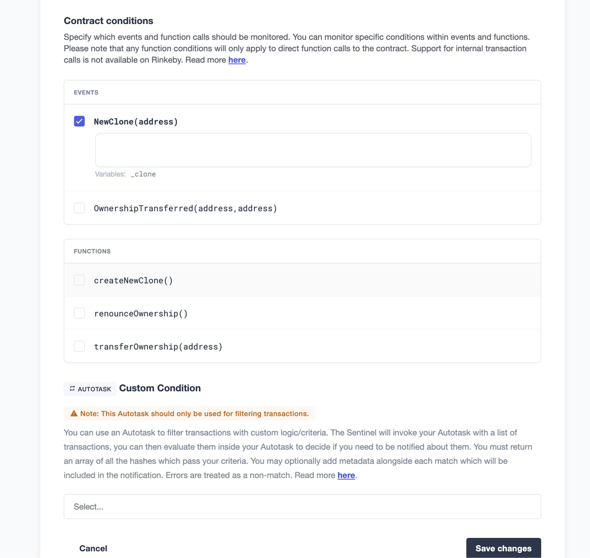
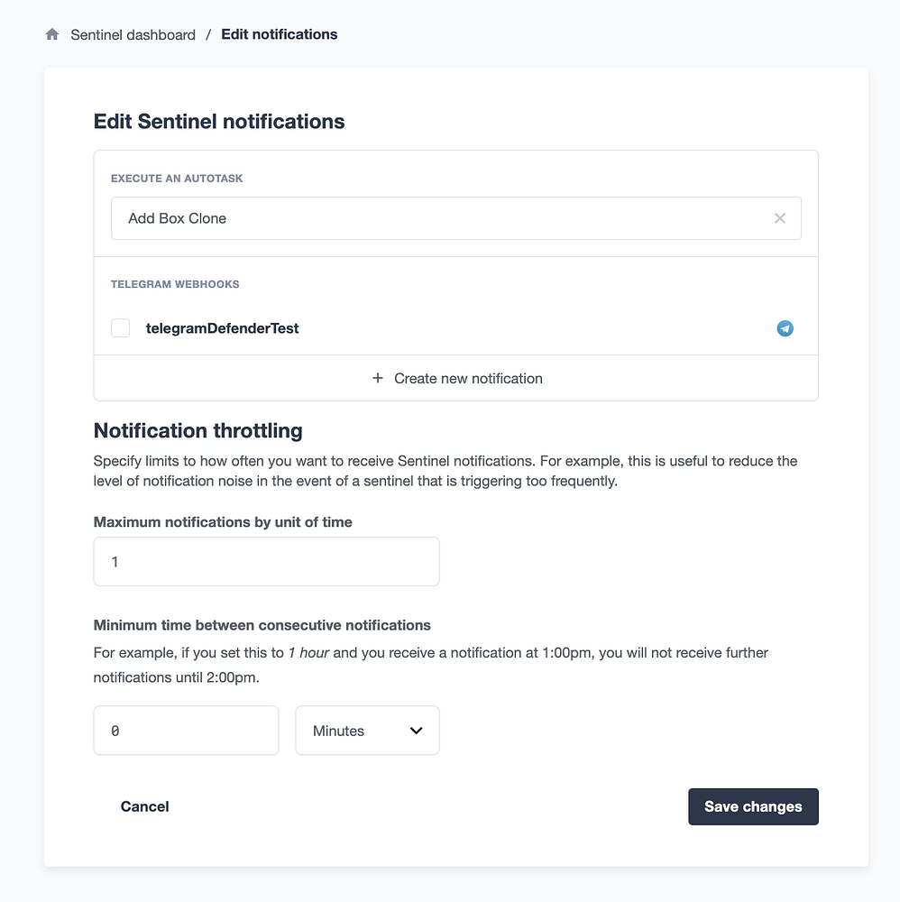
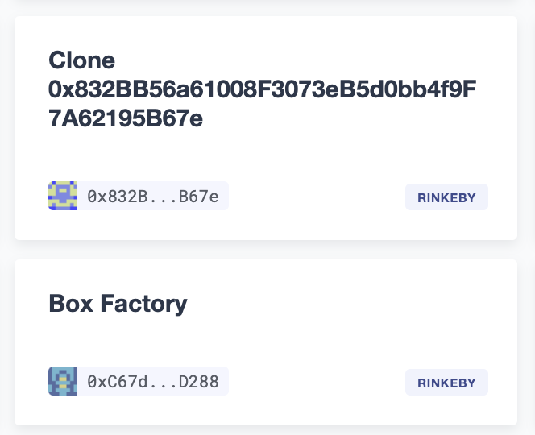
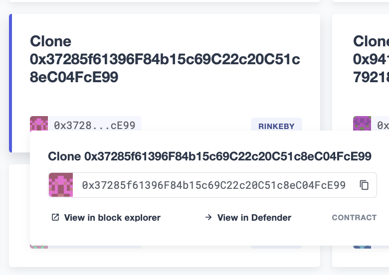

# Automated Security Monitoring of Factory Clones
工厂克隆模式可以优化gas成本。然而，由于每个克隆都需要部署到新地址，有效地跟踪和监控这些合约可能是一项挑战。

本指南展示了如何使用Defender自动化安全监控工厂合约以及由它创建的克隆合约。

这种自动化通过以下Defender组件之间的关系实现：

* Sentinel监视由创建克隆的合约发出的每个成功事件。如果检测到，它会触发Autotask运行并[传递有关交易的信息](../../Components/Sentinel/Sentinel.md)

* Autotask使用[Admin API](https://www.npmjs.com/package/defender-admin-client)将新创建的合约地址添加到Admin仪表板，以便轻松监控克隆合约状态

* Autotask使用[Sentinel API](https://www.npmjs.com/package/defender-sentinel-client)将克隆地址添加到由Contract Sentinel监视的地址列表中

在这种情况下，合约的 ABI 可以预先提供，因为克隆合约将具有相同的 ABI。或者，你可以使用 [Etherscan 的 API ](https://docs.etherscan.io/api-endpoints/contracts)动态地从已验证的合约地址检索 ABI。

## 生成API密钥

为了以编程方式将合约添加到Admin仪表板中，defender-admin-client API需要API密钥和和secret.

你可以使用现有的API密钥或创建一个仅用于此目的的API密钥。

要创建一个新密钥，请打开右上角的菜单，然后选择团队API密钥。生成一个新的具有至少创建Admin提议能力的密钥和secret。将其复制并保存在安全位置。


你可以使用Defender的便捷[Secrets vault](../../Components/Autotasks/Autotasks.md)来安全地存储在之前步骤中创建的Admin API密钥和secret。

从左侧选择Autotask，然后选择Secrets。为API密钥和密钥命名，并粘贴相应的字符串。


## 创建Autotask
从Autotask仪表板的右侧选择创建Autotask。

命名Autotask并选择Webhook。

粘贴以下Autotask代码并点击Create。
```
const { AdminClient } = require('defender-admin-client')

exports.handler = async function (event) {
  const credentials = {
    apiKey: event.secrets.API_KEY,
    apiSecret: event.secrets.API_SECRET,
  }
  const adminClient = new AdminClient(credentials)
  const payload = event.request.body
  const matchReasons = payload.matchReasons
  const newCloneAddress = matchReasons[0].params._clone
  const newCloneAbi = `[
    {
      "anonymous": false,
      "inputs": [
        {
          "indexed": false,
          "internalType": "uint256",
          "name": "value",
          "type": "uint256"
        }
      ],
      "name": "ValueChanged",
      "type": "event"
    },
    {
      "inputs": [
        {
          "internalType": "uint256",
          "name": "value",
          "type": "uint256"
        }
      ],
      "name": "initialize",
      "outputs": [],
      "stateMutability": "nonpayable",
      "type": "function"
    },
    {
      "inputs": [],
      "name": "retrieve",
      "outputs": [
        {
          "internalType": "uint256",
          "name": "",
          "type": "uint256"
        }
      ],
      "stateMutability": "view",
      "type": "function"
    },
    {
      "inputs": [
        {
          "internalType": "uint256",
          "name": "value",
          "type": "uint256"
        }
      ],
      "name": "store",
      "outputs": [],
      "stateMutability": "nonpayable",
      "type": "function"
    }
  ]`
  // 添加新的box克隆合约到管理员
  await adminClient.addContract({
    network: 'rinkeby',
    address: newCloneAddress,
    name: `Clone ${newCloneAddress}`,
    abi: newCloneAbi,
  })
}
```


现在，Autotask已经准备好由Sentinel触发。

请注意，手动触发此Autotask将被标记为错误，因为Autotask依赖于由实际触发Sentinel所提供的数据（例如新部署的克隆合约地址）。

## 设置Factory Sentinel
此Sentinel将监视由合约发出的事件，表示已创建了一个新的克隆。

从左侧选择Sentinel，然后创建Sentinel。

将Sentinel类型保留为Contract。

给它一个名称，例如“检测到新克隆事件”

选择适当的网络。

如果工厂合约已加载到Admin仪表板中，请从地址下拉列表中选择合约名称。粘贴合约地址和ABI。

将确认块保留在1以进行快速检测，或者指定更高的块号以进行更彻底的检测。

选择下一步。


现在是选择触发Sentinels的条件的时候了。可以调用监视函数或事件发送。

选择克隆创建事件名称，并将字段留空以捕获所有发射的克隆创建事件。选择下一步。

在执行自动任务下，选择在上一步中创建的自动任务名称。

与任何帐户操作一样，触发此Sentinels将记录在Defender日志中。如果需要，可以选择在触发此Sentinels时接收通知的方式。只需从“创建新通知”中选择你的选择。

选择创建。


## 进行测试运行
要从UI进行测试，请从Admin仪表板中选择工厂合约，导航到New Proposal → Admin action，并选择合约创建功能以及基于合约权限的执行策略。

然后在下一个屏幕上，验证信息并选择批准和执行并支付gas费。


前往Logging以验证Admin提案的状态、Sentinel的触发、Autotask的执行，最后将合约添加到Admin仪表板中。


导航到Admin以查看仪表板中的新合约以及其他合约。


你需要克隆合约的地址，以进行下一步操作。从仪表板上的列表中复制其地址。


## 创建监视克隆合约的Sentinels
现在你有了一个克隆合约作为所有未来克隆合约的模板，是时候创建一个Sentinels了。

从左侧面板中选择Sentinels→创建Sentinels。

为Sentinels命名，选择适当的网络，并粘贴克隆合约的合约地址。

已验证合约的ABI将自动导入。粘贴合约的ABI并将块验证留在1，除非需要更加彻底的验证。

点击下一步，然后选择要监视的参数。对于Box示例，我们将监视存储值的变化。

如果需要细粒度过滤，可以使用Autotask。

选择下一步，然后选择所需的通知方法。

最后，选择创建Sentinels。

在当前状态下，Sentinels监视单个克隆合约的值变化。但是，合约Sentinels可以监视多个地址，前提是它们遵守相同的ABI。

在下一步中，你将向现有Autotask添加一个额外的组件，该组件利用SentinelsAPI将其他合约地址推送到由此Sentinels监视的合约数组中。

## 将Sentinels代码添加到Autotask中
将[以下代码](https://github.com/offgridauthor/defender-admin-autoadd/blob/main/autotasks/index.js)添加到先前创建的Autotask中：
```
const { SentinelClient } = require('defender-sentinel-client')
```

可以使用与defender-admin-client相同的API密钥，前提是该密钥具有编辑Sentinels所需的权限。

请注意，subscriberId变量是指Sentinel的ID。你可以通过以下方式找到此值：

* 使用await client.list()查询已创建的Sentinel列表；

* 查看Logging（如果Sentinel已被触发）；

* 获取Sentinel URL的最后一部分。

在处理程序内部，添加下面列出的代码。
```
const sentinelClient = new SentinelClient(credentials)
const subscriberId = '1cf990de-ebb3-4255-8c12-67eec8fbbfa7'
const sentinel = await sentinelClient.get(subscriberId)
const subscribedAddresses = sentinel.addressRules[0].addresses
subscribedAddresses.push(newCloneAddress)
await sentinelClient.update(subscriberId, { addresses: subscribedAddresses })
```

点击保存更改。

现在当Autotask运行时，它不仅会将合约添加到管理员仪表板中，还会将新创建的克隆合约添加到Contract Sentinel监视的地址数组中。

为了验证，从工厂创建另一个Box克隆合约。在Logging中，你将看到一系列步骤已成功触发。


## 资源

* [文档](../../Overview.md)

* [演示仓库](https://github.com/offgridauthor/defender-admin-autoadd)