# How to manage roles on a TimelockController using Defender Admin
## 时间锁定角色
**提案者**：负责安排（和取消）操作的地址（智能合约或EOA）。在TimelockController合约中，提案者角色（或**PROPOSER_ROLE**）由以下值标识：0xb09aa5aeb3702cfd50b6b62bc4532604938f21248a27a1d5ca736082b6819cc1

**执行者**：负责在Timelock过期后执行操作的地址（智能合约或EOA）。在TimelockController合约中，执行者角色（或**EXECUTOR_ROLE**）由以下值标识：0xd8aa0f3194971a2a116679f7c2090f6939c8d4e01a2a8d7e41d55e5351469e63

**管理员**：负责授予提议者和执行者角色的地址（智能合约或EOA）。在TimelockController合约中，管理员角色（或**TIMELOCK_ADMIN_ROLE**）由以下值标识：0x5f58e3a2316349923ce3780f8d587db2d72378aed66a8261c916544fa6846ca5

只有拥有管理员角色的人才能授予或撤销角色。在部署时间锁时，时间锁和合约部署者都具有此特权。如果只有时间锁拥有管理员角色，则TimelockController是**自我治理**的。

## 导入合约
Defender Admin允许用户将现有智能合约导入到Defender中，以更轻松地管理它们。可以通过以下方式实现：
1. 导航到管理页面。

2. 点击“添加合约”。

3. 选择“导入合约”。
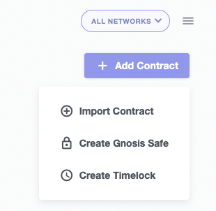
4. 给合约起一个相关的名称，以便您可以轻松识别它。

5. 选择合约部署的网络。

6. 复制合约地址，可选择给它起一个别名以便于识别。

7. 如果您的合约未在Etherscan上进行验证，Defender将无法自动检索ABI。您需要手动粘贴ABI。

8. 添加您的合约。

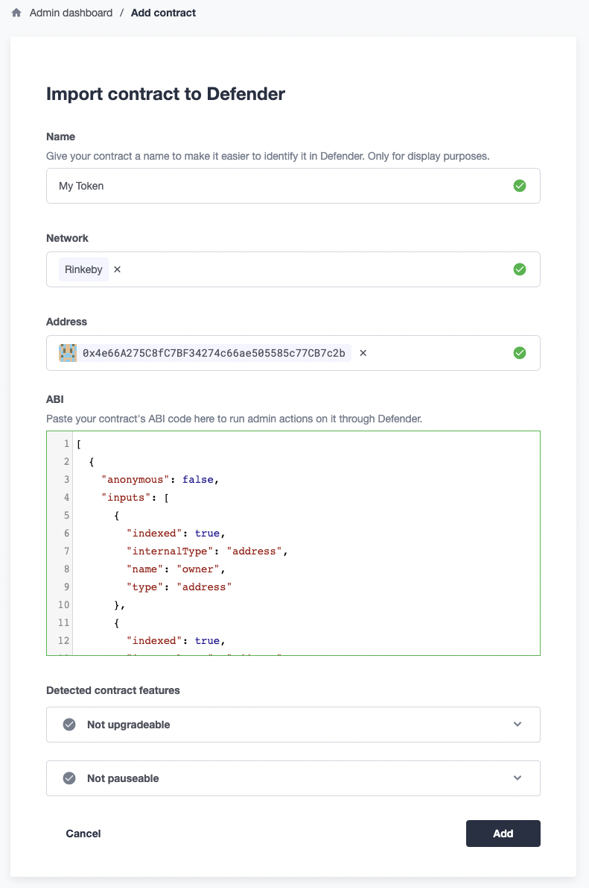

## 创建时间锁提案
Defender管理员允许用户创建和管理提案。提案又允许您直接在TimelockController合约上执行操作或计划延迟执行函数。为了创建一个新提案：

1. 导航到管理员。

2. 选择你的时间锁合约。

3. 创建一个新的提案（“管理员操作”）。
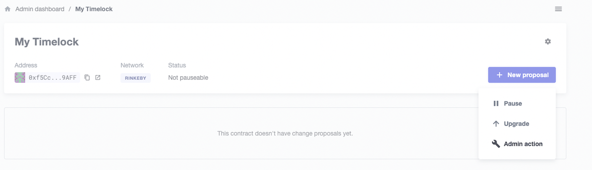

在右侧，您将看到合约状态，包括与前述角色相关联的三个值。
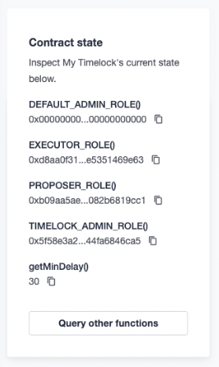

## 授予角色
为了授予某人角色：

1. 连接您的钱包，该钱包具有timelock上的管理员或提议者权限。如果管理员或提议者是多重签名，连接一个是该多签名钱包签名者的钱包。。

2. 从下拉菜单中选择grantRole函数。

3. 输入您希望授予的角色的值（您可以从右侧的合约状态中复制和粘贴此值）。

4. 选择您希望授予角色的帐户。
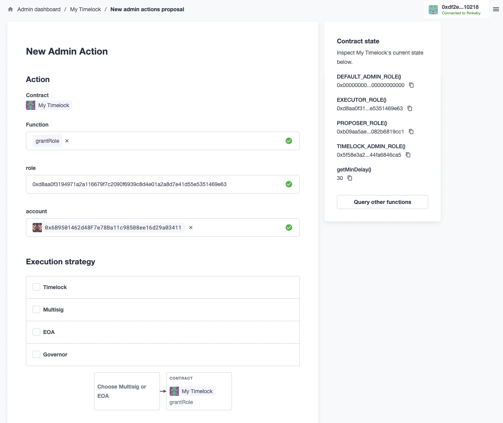
5. 选择您的执行策略：
   * 如果您的EOA或多签持有timelock的管理员角色，则可以使用EOA或多签名执行策略创建提案。
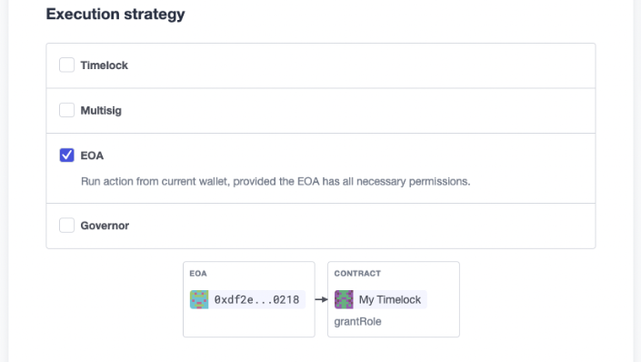

   * 如果你的时间锁是自我管理的，您将需要选择timelock执行策略，然后选择作为timelock提议者的EOA或多签名。
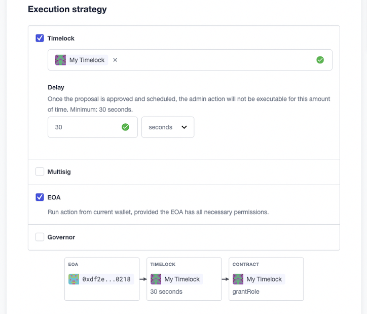
6. 描述您的提案并提交表格。

7. 核准并安排/执行您的提案。

    * 如果您的EOA或多重签名持有时间锁的管理员角色，则可以立即执行提案，或者在多重签名达到批准阈值后执行提案。

    * 如果您的时间锁是自我治理的，您将可以安排提案，并且必须等待timelock延迟，直到您可以返回并执行它，此时它将实际生效。
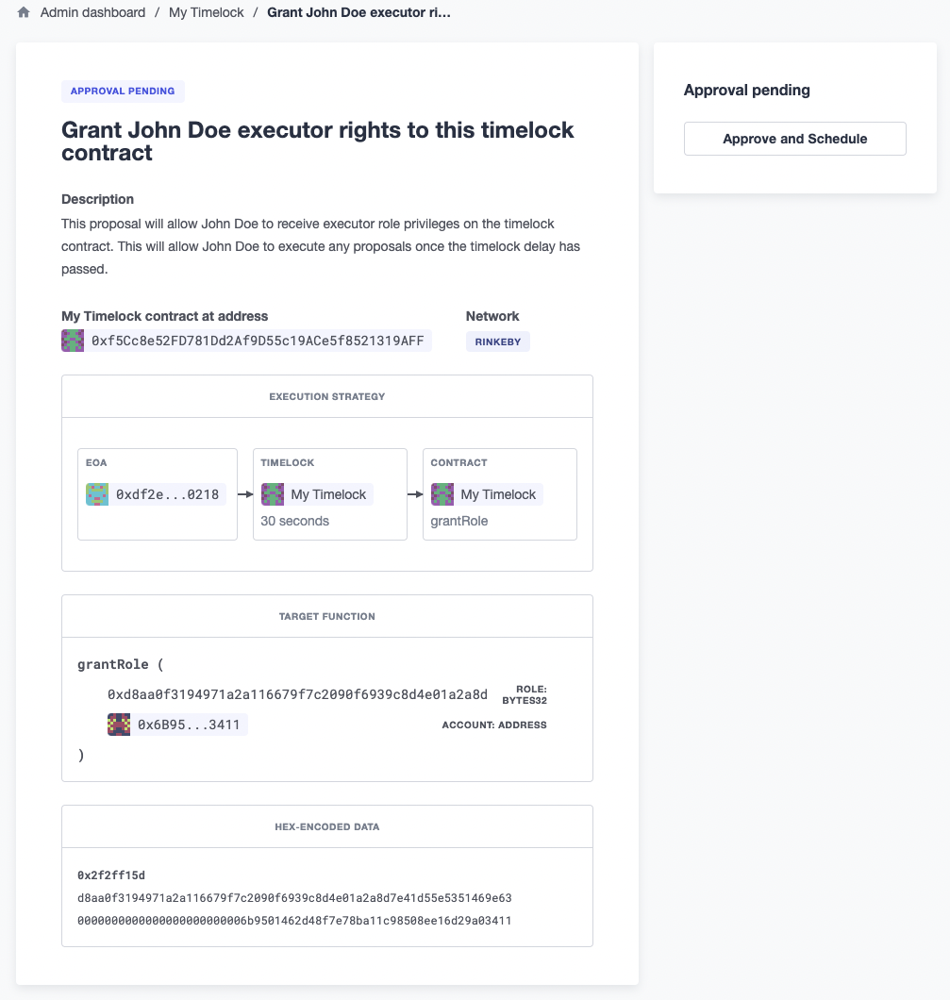

确保您的提案已正确执行。这可以通过单击“执行”按钮后的状态标签进行验证。
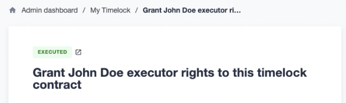

## 撤销角色
为了撤销一个角色：

1. 连接具有timelock上的管理员或提议者权限的钱包。如果管理员或提案人是一个多重签名钱包，连接一个是该多重签名钱包签署人的钱包。

2. 从下拉菜单中选择revokeRole函数。

3. 输入你想要撤销的角色的值（你可以从右侧的合约状态中复制和粘贴）。例如，要撤销某个地址的执行者角色，请使用：0xd8aa0f3194971a2a116679f7c2090f6939c8d4e01a2a8d7e41d55e5351469e63

4. 选择你希望从中撤销角色的账户。
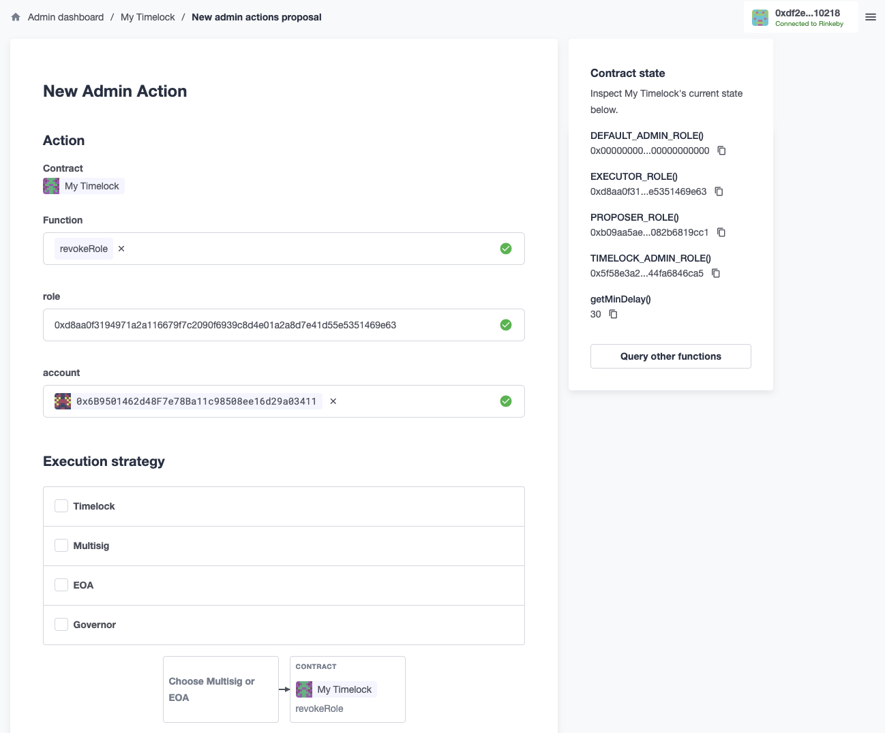
5. 选择您的执行策略：
    * 如果您的EOA或多重签名持有时间锁的管理员角色，您将能够使用EOA或多重签名执行策略创建提案。
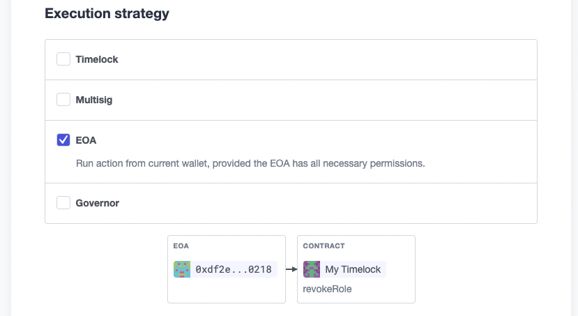
    * 如果您的时钟是自我管理的，则需要选择timelock执行策略，然后选择作为timelock提议者的EOA或多签名。
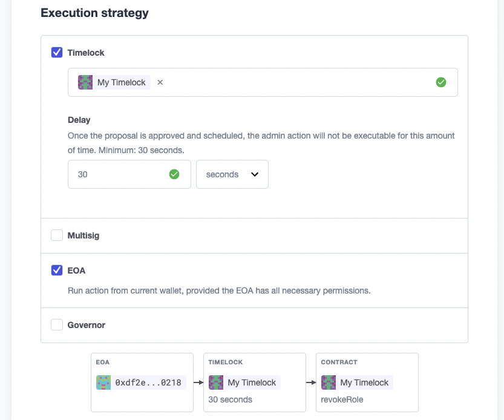
1. 描述您的提议并提交表格。

2. 根据需要批准并安排/执行您的提议。
    * 如果您的EOA或多重签名在timelock上具有管理员角色，则您将能够立即执行提议，或者一旦达到多重签名的批准阈值，您将能够执行提议。
    * 如果您的timelock是自我管理的，则您将能够安排提议，并且必须等待timelock的延迟，直到您可以返回并执行它，此时它将实际生效。
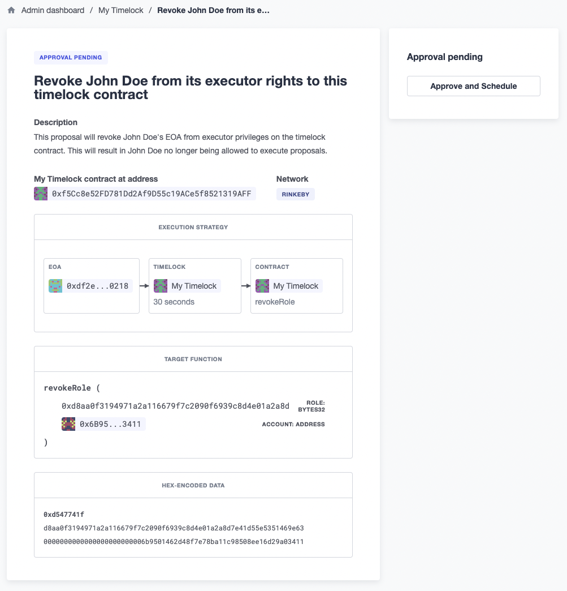

确保您的提案已正确执行。这可以通过单击“执行”按钮后的状态标签进行验证。

## 注意事项
1. 如果时间锁完全由自我管理，确保在撤销提案人或执行者时，您至少有另一个信任的用户分配到该角色。否则，没有人将具有正确的权限在TimelockController合约上创建或执行提案，从而将其锁定。

2. 如果您想在TimelockController指定任何人都可以执行时撤销执行者角色，请简单地撤销帐户角色0x0000000000000000000000000000000000000000。在执行此操作之前，请确保将该角色授予指定的地址，否则TimelockController合约可能会被锁定（请参见上述第1点）。

有关TimelockControllers及其访问角色的更多信息，请查看我们的[TimelockControllers文档](../../../Contracts/Contracts.4.x/API/Governance.md)。