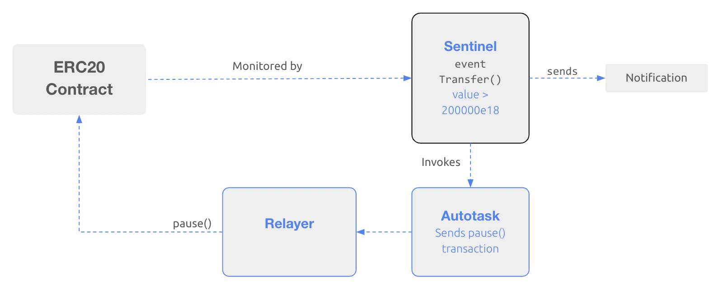
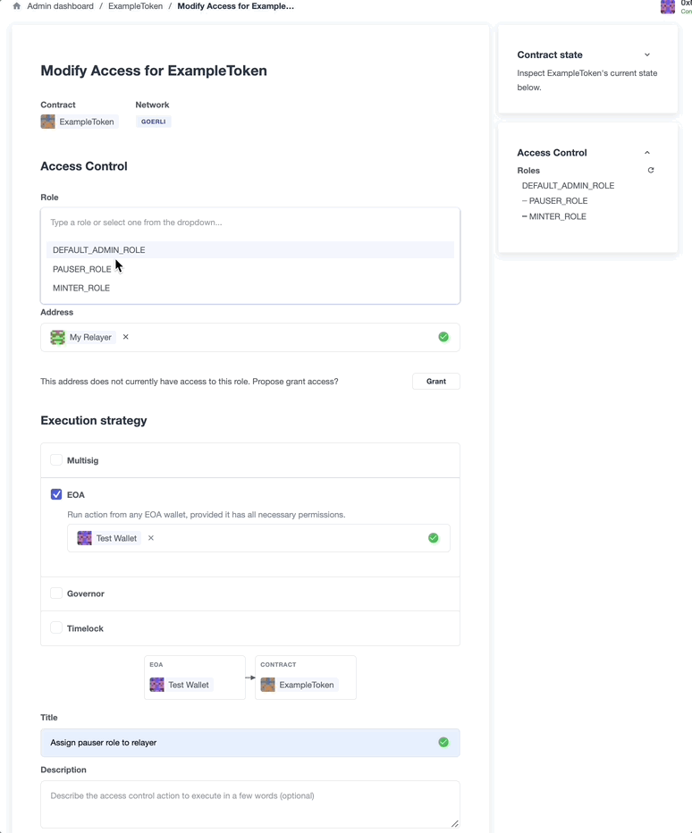

# Pause Guardian - Automated Incident Response Using Defender
OpenZeppelin Defender的关键功能之一是其在安全监控和一般自动化方面的实用性。本指南利用了多个Defender组件，以自动化应对ERC20合约上的一组条件的事件响应。

## 概述
一个[Sentinel](../../Components/Sentinel/Sentinel.md)监控合约上的交易，并设置在大量代币转移事件发生时自动触发[Autotask](../../Components/Autotasks/Autotasks.md)。Autotask脚本通过[Relayer](../../Components/Relay/Relay.md) 向ERC20合约发送暂停交易。


## 设置
首先，注册 [Defender](https://defender.openzeppelin.com/)，并确保用于合约部署的 EOA 获得了 Goerli ETH（[通过水龙头](https://forum.openzeppelin.com/t/goerli-testnet-faucets/26710)）。

fork [demo 仓库](https://github.com/offgridauthor/pause-guardian)。

克隆您的fork并安装依赖项：
```
$ git clone https://github.com/[GitHub username]/pause-guardian.git
$ cd pause-guardian
$ npm install
```

在本地的 .env 文件中提供必要的 API 密钥。以下值是期望的：

* PRIVATE_KEY：用于在 Goerli 网络上部署合约
* API_KEY：Defender 团队 API 密钥
* API_SECRET：Defender 团队 API 密钥

## 部署 ERC20 合约
OpenZeppelin [Contracts Wizard](https://wizard.openzeppelin.com/) 提供了一个易于创建智能合约的 API。生成一个[可暂停](../../../Contracts/Contracts.3.x/API/Utils.md)、可铸造、可暂停和实现[基于角色的访问控制](../../../Contracts/Contracts.3.x/Access%20Control.md)的ERC20合约，预铸100万个代币。预提供的脚本自动化了这个过程：
```
import { erc20 } from '@openzeppelin/wizard'

const params = {
  name: 'ExampleToken',
  symbol: 'ETK',
  mintable: true,
  premint: '1000000',
  access: 'roles',
  pausable: true,
}

const contract = erc20.print(params)
```

首先运行 $ npm run generate。

接下来，运行 $ npm run deploy 来编译和部署合约。
```
  const adminClient = new AdminClient({
    apiKey: process.env.API_KEY,
    apiSecret: process.env.API_SECRET,
  })

  const contractDetails = {
    network: 'goerli',
    address: contract.address,
    name: NAME,
    abi: contractABI,
  }

  const newAdminContract = await adminClient.addContract(contractDetails)
```

该脚本利用了Defender的admin-client，并在部署后立即将合约加载到Admin仪表板中。

## 创建Relayer 并分配暂停角色
创建Relayer 以通过API运行区块链交易：

`$ npm run relay`

现在您已经拥有了Relayer ，需要授予它适当的角色。

通过Defender的Web界面，可以轻松管理访问控制。通过Admin仪表板，选择新创建的ERC20合约，然后选择New Proposal -→ Modify Access。在下一个屏幕上，从下拉菜单中选择PAUSER角色，并提供刚刚创建的Relayer 的地址。选择EOA作为执行策略，并选择用于部署合约的帐户的地址。给访问提案一个标题并执行它。


## 创建Autotask以发送暂停交易
现在您已经拥有了适当访问权限的Relayer 来暂停合约，是时候开始构建自动化功能了。

创建一个Autotask，使用Relayer 向部署的ERC20合约发送暂停交易。

`$ npm run autotask`

该脚本在Defender中创建一个新的Autotask，并上传Autotask代码，使用刚刚创建的Relayer的ID来运行使用Relayer的交易。

```
async function handler(event) {
  const provider = new DefenderRelayProvider(event)
  const signer = new DefenderRelaySigner(event, provider, { speed: 'fast' })

  const erc20 = new ethers.Contract(ADDRESS, ABI, signer)

  const isPaused = await erc20.paused()
  if (!isPaused) {
    const tx = await erc20.pause()
    console.log(tx)
  } else if (isPaused) {
    console.log('Contract is paused; doing nothing')
  }
}
```

创建完Autotask后，最后的构建块是设置一个Sentinel来监视链上事件并触发Autotask。

## 创建Sentinel以触发Autotask
Sentinel可以监视各种合约条件，并在触发时发送通知或触发Autotask。

运行$ npm run sentinel创建一个Sentinel，如果检测到高交易量的令牌转移，则触发Autotask：
```
    eventConditions: [
      {
        eventSignature: 'Transfer(address,address,uint256)',
        expression: 'value > 200000e18',
      },
    ],
```

## 测试自动暂停自动化
现在所有的构建块都已经建立，系统已经准备好进行测试。尝试将大于200000个代币从合约转移到另一个账户。Sentinel将检测到高交易量的Transfer事件并触发Autotask，Autotask将通过Relayer 发送暂停交易，ERC20合约将被暂停。因此，任何后续的高交易量转移都将失败。

## 资源
* [OpenZeppelin Defender Sentinel文档](https://docs.openzeppelin.com/defender/sentinel)

* [OpenZeppelin Defender Sentinel客户端API](https://www.npmjs.com/package/defender-sentinel-client)

* [OpenZeppelin Contracts Wizard API](https://www.npmjs.com/package/@openzeppelin/wizard)