# Registering an Upkeep on Chainlink Keepers
本文将指导您使用Defender Admin在Chainlink Keepers上注册您的合约作为**Upkeep**，并利用Relayer s、Autotasks和Sentinels进行[监控和操作](https://andrecronje.medium.com/scaling-keep3r-with-chainlink-2832bbc76506)，这是[Keep3r Network](https://keep3r.network/)的一次改进。

## 什么是Chainlink Keepers？
Chainlink Keepers旨在提供智能合约选项，以信任最小化（去中心化）的方式外包常规维护任务（收获、清算、重新基准等）。该网络旨在为保持者生态系统提供激励和治理协议。

此网络有三个主要角色：

* Upkeep：这些是需要外部实体服务其维护任务的智能合约。
* Keepers：执行发布的维护的外部参与者。
* Registry：为上述参与者提供发现机制，并提供钩子以保持网络的健康。

## 先决条件
您需要LINK代币以支付Upkeep合约的执行。对于Kovan，您可以在此[水龙头](https://kovan.chain.link/)中获取它们。对于Mainnet，您可以在Uniswap上购买它们。您还需要ETH来支付任何需要发送的交易。

## 实现Upkeep接口
将合约注册为Upkeep的第一步是实现所需的Upkeep接口，该接口由以下[两种方法](https://docs.chain.link/docs/chainlink-keepers/compatible-contracts/)组成：

* checkUpKeep：此函数将在每个块（约15秒）中调用，布尔返回值决定此时是否需要为合约提供服务。如果需要维护，您还可以返回将传递给performUpkeep函数的字节。

* performUpkeep：这个函数是合约需要维护的实际维护。只有在checkUpKeep返回true时才会调用此函数。

```
pragma solidity 0.7.6;

interface KeeperCompatibleInterface {

  /**
   * @notice method that is simulated by the keepers to see if any work actually
   * needs to be performed. This method does does not actually need to be
   * executable, and since it is only ever simulated it can consume lots of gas.
   * @dev To ensure that it is never called, you may want to add the
   * cannotExecute modifier from KeeperBase to your implementation of this
   * method.
   * @param checkData specified in the upkeep registration so it is always the
   * same for a registered upkeep. This can easily be broken down into specific
   * arguments using `abi.decode`, so multiple upkeeps can be registered on the
   * same contract and easily differentiated by the contract.
   * @return upkeepNeeded boolean to indicate whether the keeper should call
   * performUpkeep or not.
   * @return performData bytes that the keeper should call performUpkeep with, if
   * upkeep is needed. If you would like to encode data to decode later, try
   * `abi.encode`.
   */
  function checkUpkeep(
    bytes calldata checkData
  )
    external
    returns (
      bool upkeepNeeded,
      bytes memory performData
    );

  /**
   * @notice method that is actually executed by the keepers, via the registry.
   * The data returned by the checkUpkeep simulation will be passed into
   * this method to actually be executed.
   * @dev The input to this method should not be trusted, and the caller of the
   * method should not even be restricted to any single registry. Anyone should
   * be able call it, and the input should be validated, there is no guarantee
   * that the data passed in is the performData returned from checkUpkeep. This
   * could happen due to malicious keepers, racing keepers, or simply a state
   * change while the performUpkeep transaction is waiting for confirmation.
   * Always validate the data passed in.
   * @param performData is the data which was passed back from the checkData
   * simulation. If it is encoded, it can easily be decoded into other types by
   * calling `abi.decode`. This data should not be trusted, and should be
   * validated against the contract's current state.
   */
  function performUpkeep(
    bytes calldata performData
  ) external;
}
```
完成这些方法后，您可以使用您喜欢的工具链编译和部署您的合约。

## 在Etherscan上验证您的合约代码
为了被Chainlink Keepers网络接受，您的Upkeep合约源代码需要在Etherscan上进行验证。您可以使用您喜欢的[工具链](https://hardhat.org/plugins/nomiclabs-hardhat-etherscan.html)来完成这个过程。

## 在网络上注册
一旦部署完成，您可以将您的合约注册为Keeper网络上的Upkeep。使用Defender来完成此操作，首先在Admin中添加您的合约。Defender将自动检查您的合约是否正确实现了Upkeep接口。
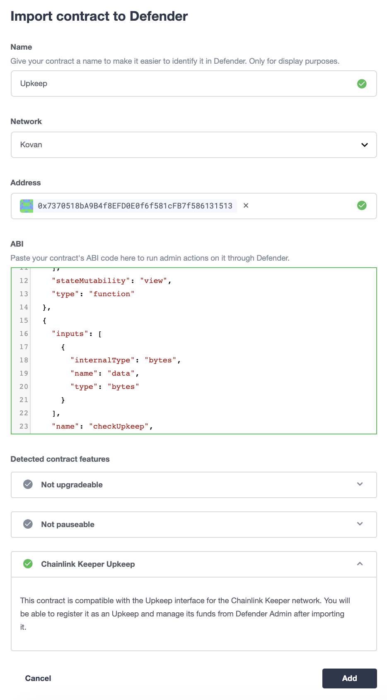

从您的合约页面开始，您现在可以通过点击“在Chainlink Keeper中注册”来开始Chainlink Keeper的维护注册。
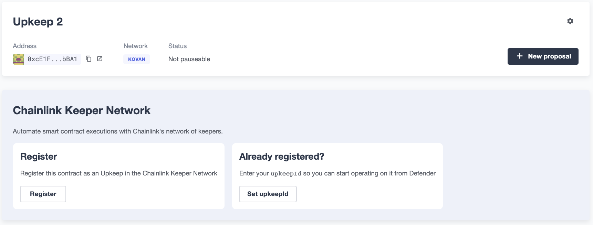

为开始注册流程，Defender会要求您填写一个注册Google表单。这个表格将由Chainlink Keepers入门团队进行审查，作为开放测试版批准流程的一部分。您填写的信息将有助于改进Chainlink Keepers，为您的用例提供最佳解决方案。

点击打开注册Google表单，填写详细信息，在完成后返回Defender。
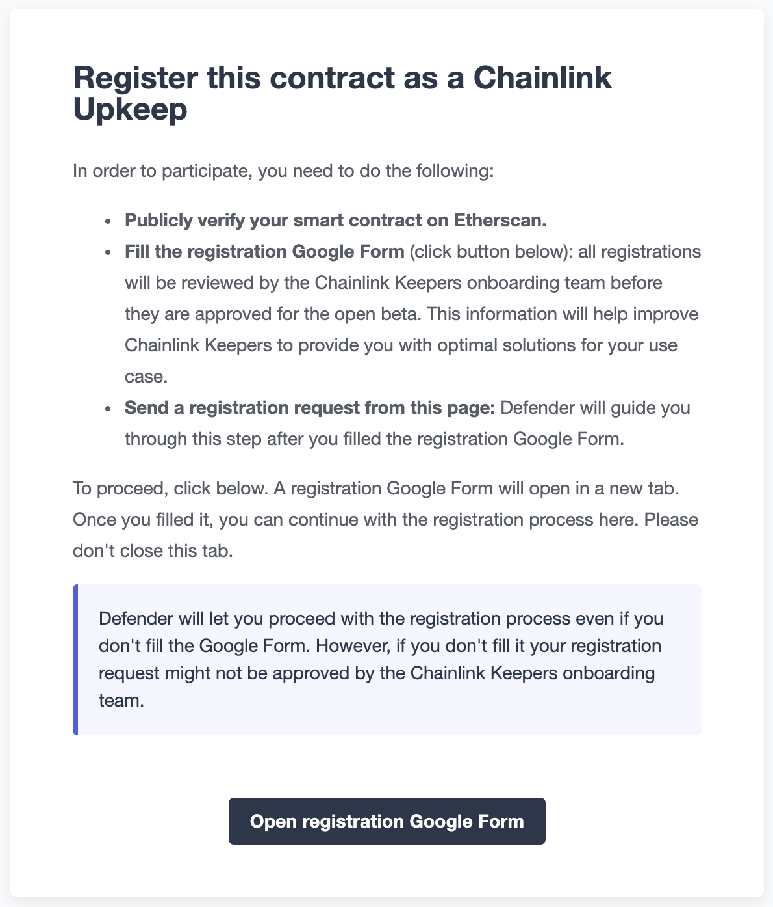

当您填写完注册Google表格后返回，Defender将要求您输入管理员地址（可以提取资金）、电子邮件（用于Chainlink的通知目的）和Keeper调用的Gas限制（在2300和2500000之间）。

在撰写本文时，注册流程要求您为您的合约提供至少5个LINK的初始资金，因此请确保您用于请求注册的帐户至少拥有该金额的LINK。您可以选择将这个初始资金变得更大，以节省未来的加油费。
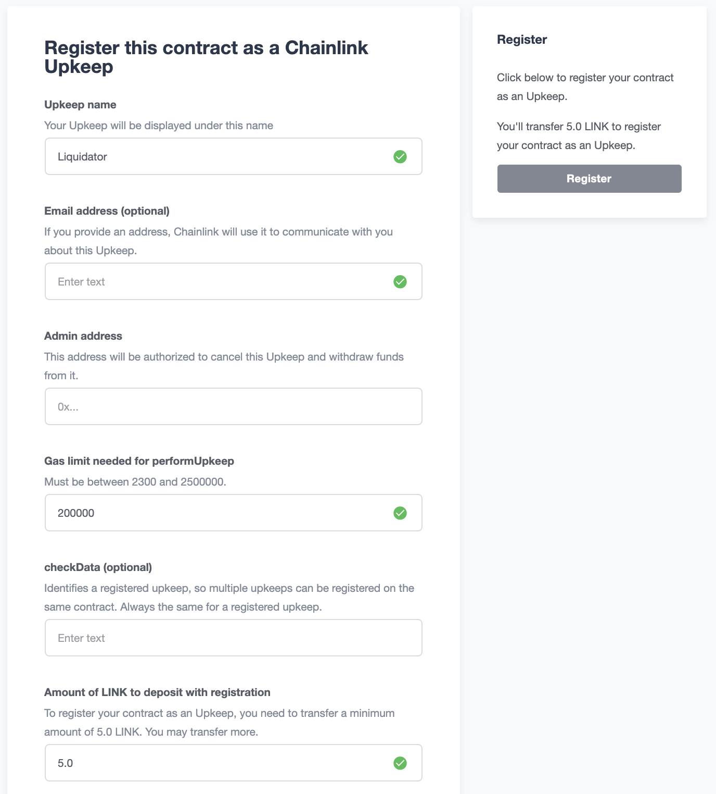

一旦提交注册申请，您将有不超过几天的等待期，之后您的Upkeep将被注册为有效的Upkeep，并在注册表中分配一个数字标识符。 Defender将在您合约页面的Chainlink Keepers上反映这一点。请参见下面的截图，显示注册已提交，但其批准仍在等待中时您的合约页面的外观。
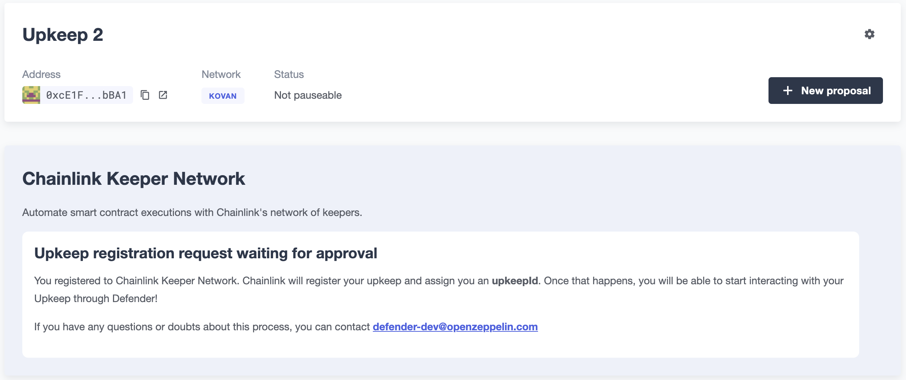

当您的注册被批准后，Defender将向您显示您的Upkeep余额以及网络保管人的最新执行情况。请注意，为了使您的合约得到网络的服务，您还需要用LINK令牌为其提供资金。您也可以通过在Defender上点击“存入LINK”来完成这个过程。
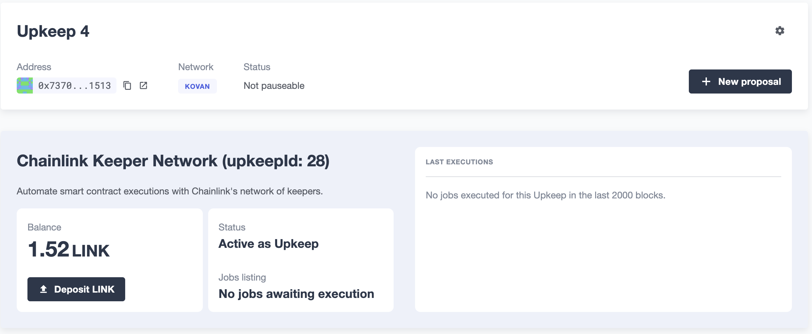

## 监控您的Upkeep
您可以利用Defender *Sentinel*和*Autotasks*监控网络中的Upkeep。例如，您可以监控执行失败、低资金或未执行任务等情况。

### 执行失败
您可以设置*Sentinels*，在一段时间内警报您的合约有一个或多个执行失败，以便您调查失败原因并根据需要调整您的Upkeep代码。

要做到这一点，首先创建一个新的Sentinel来[监视Chainlink Keeper Registry](https://kovan.etherscan.io/address/0xAaaD7966EBE0663b8C9C6f683FB9c3e66E03467F)（Kovan上的0x109A81F1E0A35D4c1D0cae8aCc6597cd54b47Bc6）。
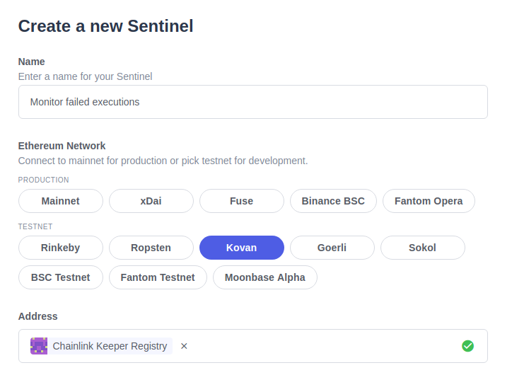

并监听UpkeepPerformed事件，其中作业ID与您自己的匹配，并且执行未成功。
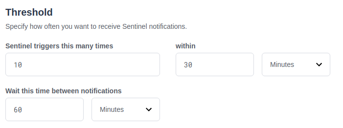

接下来，您可以选择如何接收通知。Sentinels支持电子邮件、Slack、Telegram和Discord通知。
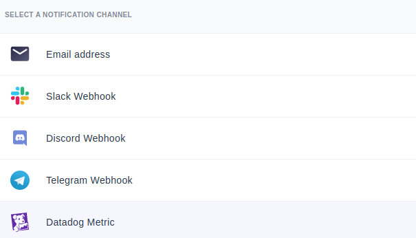

最后，你可以选择在每次执行失败时接收提醒，或者只在一段时间窗口内出现多次失败时接收提醒，例如半小时内出现五次失败。你还可以过滤通知，以免频繁接收提醒，例如每小时不超过一次。
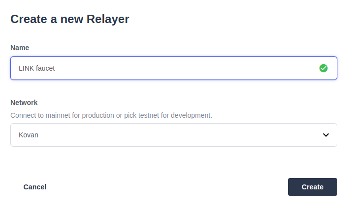

###资金短缺

当您的LINK余额不足时，您可以将*Sentinels*与*Autotasks*和*Relayer s*结合使用，以补充您的维护费用。

> NOTE
作为自动资金的替代方案，您也可以让Autotask发送通知，以便您手动添加资金。

要这样做，首先创建一个Relayer ，我们将用它来补充您的Upkeep。您在Defender中创建的每个Relayer 都有一个唯一的地址，并且只能由您的团队使用。请确保您在Kovan或Mainnet网络中创建您的Relayer ，具体取决于您在哪个网络上运行您的Upkeep。
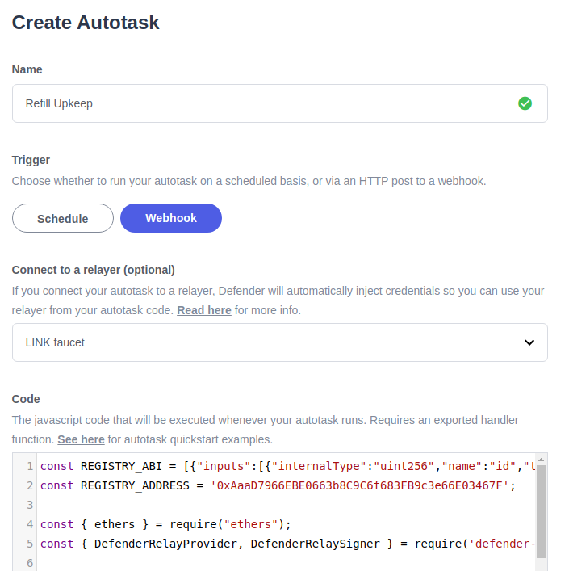

创建完成后，将一些LINK和ETH转移到Relayer 的地址，以便它可以为您的Upkeep工作充值，并支付它发送的交易的燃气费用。在Kovan上，您可以从[此水龙头](https://kovan.chain.link/)获取测试LINK。

下一步是创建一个Autotask，该Autotask可以查询您的Upkeep余额，并在其低于阈值时添加LINK资金。将此Autotask设置为在连接到您先前创建的Relayer 的Webhook上运行，并使用[defender-autotask-examples存储库](https://github.com/OpenZeppelin/defender-autotask-examples/)中的[low-funds代码](https://github.com/OpenZeppelin/defender-autotask-examples/blob/master/chainlink/src/low-funds.js)。
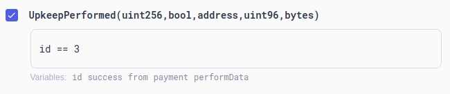

每当这个Autotask运行时，如果它检测到余额低于您配置的令牌数量，它将使用您的Relayer 发送更多的LINK来资助您的Upkeep。

最后一步是触发这个Autotask。您可以将其设置为定时运行，而不是Webhook模式，也可以在执行作业后触发它。如果您选择后者，您将需要创建一个Sentinel来监视[Chainlink Keeper Registry](https://kovan.etherscan.io/address/0x109A81F1E0A35D4c1D0cae8aCc6597cd54b47Bc6)（Kovan上的0x42dD7716721ba279dA2f1F06F97025d739BD79a8），并按照前面的场景过滤您的作业上的所有UpkeepPerformed事件。


并将其设置为在工作完成后立即调用您的Autotask。您还可以限制Autotask的调用频率，例如每十分钟最多一次。
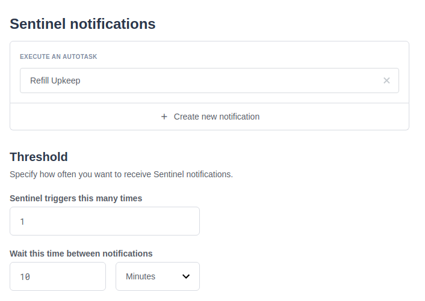

## 问题
如果您有任何问题或评论，请在论坛上毫不犹豫地提出！