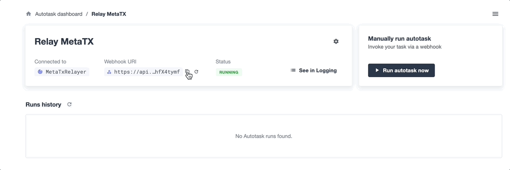

# How to Relay Gasless Meta-Transactions
*无燃气元交易*为用户提供了更无缝的体验，并且潜在地使他们不必花费太多资金与区块链互动。这种方法为用户提供了免费签署交易的选项，并由第三方安全地执行，该第三方支付燃气费用以执行交易。

使用OpenZeppelin Defender可以轻松安全地实现无燃气元交易Relayer ，通过[Relayer ](https://docs.openzeppelin.com/defender/relay)。Defender Relay允许您轻松发送交易，并处理私钥存储、交易签名、nonce管理、燃气估算以及必要时的自动重新提交。

此[演示应用程序](https://github.com/OpenZeppelin/workshops/tree/master/25-defender-metatx-api)使用*MinimalForwarder*和*ERC2771Context*实现元交易，以将msg.sender与 Relayer 的地址分离。所有用户需要做的就是使用他们想要发出交易的账户签署消息。签名是使用用户的私钥从目标合约和所需交易的数据形成的。这种签名在链外进行，不需要燃气费用。将签名传递给Relayer ，以便它可以为用户执行交易（并支付燃气费用）。

## 演示应用程序概述
您可以在此处查看[实时演示dapp](https://defender-metatx-workshop-demo.openzeppelin.com/)。如果用户有可用的资金支付交易，则直接接受注册，否则将数据作为元交易发送。

在示例代码中，[SimpleRegistry合约](https://github.com/OpenZeppelin/workshops/blob/master/25-defender-metatx-api/contracts/SimpleRegistry.sol)的功能是获取字符串并存储它。通过将签署者与交易发送者解耦，合约的[元交易实现](https://github.com/OpenZeppelin/workshops/blob/master/25-defender-metatx-api/contracts/Registry.sol)可以实现相同的结果。

在比较代码时，请注意元交易使用_msgSender()而不是SimpleRegistry使用的msg.sender。通过从ERC2771Context和MinimalForwarder扩展，合约变得具有元交易功能。（请注意，所有OpenZeppelin合约都兼容使用_msgSender()。）

两个合约之间的第二个基本变化是元交易合约需要指定受信任的转发器地址，本例中为MinimalForwarder合约的地址。

## 配置项目
首先，fork存储库，然后将其git clone到您的计算机并安装依赖项：
```
$ git clone https://github.com/[GitHub username]/workshops.git
$ cd workshops/25-defender-metatx-api/
$ yarn
```

在项目根目录中创建一个.env文件，并提供来自Defender的Team API密钥和密钥。本地测试将使用私钥，但 Relayer 将用于实际的合约部署。
```
PRIVATE_KEY="Goerli private key"
TEAM_API_KEY="Defender Team API key, used for uploading autotask code"
TEAM_API_SECRET="Defender Team API secret"
```

## 创建 Relayer 
运行 Relayer 创建脚本：
```
$ yarn create-relay
```

编辑 [scripts/createRelay.js](https://github.com/OpenZeppelin/workshops/blob/master/25-defender-metatx-api/scripts/createRelay.js) 文件，在 .env 文件中提供您的 Defender API 密钥，并根据需要调整变量名称。

使用 create 方法创建 Relayer ：
```
const relayClient = new RelayClient({ apiKey, apiSecret });

const requestParams = {
  name: 'MetaTxRelayer ',
  network: 'goerli',
  minBalance: BigInt(1e17).toString(),
};
const Relayer  = await relayClient.create(requestParams);
```

请注意，您稍后需要从控制台日志或创建的relay.json文件中获取Relayer Id。在创建Autotask时，您将使用此ID。

当您想要通过API发送交易时，将使用Relayer 的API密钥和密钥。在上面的代码中，它附加到现有的.env文件中。

## 使用Hardhat编译合约
请使用以下代码编写您的Registry.sol合约：
```
// SPDX-License-Identifier: MIT
pragma solidity ^0.8.0;

import "@openzeppelin/contracts/metatx/ERC2771Context.sol";
import "@openzeppelin/contracts/metatx/MinimalForwarder.sol";

contract Registry is ERC2771Context {
  event Registered(address indexed who, string name);

  mapping(address => string) public names;
  mapping(string => address) public owners;

  constructor(MinimalForwarder forwarder) // Initialize trusted forwarder
    ERC2771Context(address(forwarder)) {
  }

  function register(string memory name) external {
    require(owners[name] == address(0), "Name taken");
    address owner = _msgSender(); // Changed from msg.sender
    owners[name] = owner;
    names[owner] = name;
    emit Registered(owner, name);
  }
}
```

运行npx hardhat compile以准备部署代码。

## 使用Relayer 进行部署
您可以轻松地部署已编译的智能合约，而无需处理私钥，方法是使用Defender Relayer 客户端。

创建relay-client的实例，将Relay的API密钥和密钥作为其凭据提供，并在调用deploy()时连接到它。
```
// ...
  const credentials = {
    apiKey: process.env.Relayer _API_KEY,
    apiSecret: process.env.Relayer _API_SECRET,
  }
  const provider = new DefenderRelayProvider(credentials)
  const relaySigner = new DefenderRelaySigner(credentials, provider, {
    speed: 'fast',
  })

  const Forwarder = await ethers.getContractFactory('MinimalForwarder')
  const forwarder = await Forwarder.connect(relaySigner)
    .deploy()
    .then((f) => f.deployed())
// ...
```

deploy.js脚本从本地的.env文件中获取Relayer 的凭据，以及Registry和MinimalForwarder合约的Artifacts，并使用ethers.js进行部署。这些合约的相关地址保存在本地文件deploy.json中。

在演示应用程序中，使用yarn deploy运行此脚本。

代码部署后，可以安全地删除Relayer 密钥和密钥。除非需要进行其他本地测试，否则它们不需要。

## 通过API创建Autotask
演示应用程序使用*Autotask*提供必要的逻辑，告诉Relayer 向转发器合约发送交易，提供签名者的地址。每次从dapp调用其webhook时，Autotask将被触发。

由于组件之间的紧密关系，只需实例化新的提供程序和签名者即可将Relayer 凭据安全地提供给Autotask。

Autotask的位置非常重要-仅将Autotask的webhook暴露给前端。 Autotask的角色是根据分配给它的逻辑执行交易：如果用户有资金，则支付交易费用。如果没有，则Relayer 支付交易费用。

重要的是，Relayer 的API密钥和密钥与前端隔离。如果Relayer 密钥暴露，任何人都可以潜在地使用Relayer 发送他们想要的任何交易。
```
const ethers = require('ethers');
const { DefenderRelaySigner, DefenderRelayProvider } = require('defender-relay-client/lib/ethers');

const { ForwarderAbi } = require('../../src/forwarder');
const ForwarderAddress = require('../../deploy.json').MinimalForwarder;
const RegistryAddress = require('../../deploy.json').Registry;

async function relay(forwarder, request, signature, whitelist) {
  // Decide if we want to relay this request based on a whitelist
  const accepts = !whitelist || whitelist.includes(request.to);
  if (!accepts) throw new Error(`Rejected request to ${request.to}`);

  // Validate request on the forwarder contract
  const valid = await forwarder.verify(request, signature);
  if (!valid) throw new Error(`Invalid request`);

  // Send meta-tx through Relayer  to the forwarder contract
  const gasLimit = (parseInt(request.gas) + 50000).toString();
  return await forwarder.execute(request, signature, { gasLimit });
}

async function handler(event) {
  // Parse webhook payload
  if (!event.request || !event.request.body) throw new Error(`Missing payload`);
  const { request, signature } = event.request.body;
  console.log(`Relaying`, request);

  // Initialize Relayer  provider and signer, and forwarder contract
  const credentials = { ... event };
  const provider = new DefenderRelayProvider(credentials);
  const signer = new DefenderRelaySigner(credentials, provider, { speed: 'fast' });
  const forwarder = new ethers.Contract(ForwarderAddress, ForwarderAbi, signer);

  // Relay transaction!
  const tx = await relay(forwarder, request, signature);
  console.log(`Sent meta-tx: ${tx.hash}`);
  return { txHash: tx.hash };
}

module.exports = {
  handler,
  relay,
}
```

请注意，Autotask代码必须包括一个导出处理程序入口的index.js文件。如果代码依赖于任何外部依赖项（例如导入的ABI），则需要使用webpack、rollup等打包Autotask。

虽然可以使用Defender网页客户端创建Autotask，但使用脚本利用[Defender的API](https://www.npmjs.com/package/defender-autotask-client)可能更方便。

在演示应用程序中，运行yarn create-autotask编译Autotask代码、在Defender中创建Autotask并通过调用Autotask客户端的.create()方法上传打包的代码：
```
// ...
  const client = new AutotaskClient({ apiKey, apiSecret });
  const {autotaskId } = await client.create({
    name: "Relay MetaTX",
    encodedZippedCode: await client.getEncodedZippedCodeFromFolder('./build/relay'),
    Relayer Id: Relayer Id,
    trigger: {
      type: 'webhook'
    },
    paused: false
  });
// ...
```

前往[Defender](https://defender.openzeppelin.com/)并获取Autotask的Webhook，以便您可以测试功能并将应用程序连接到Autotask以Relayer 元交易。


将Autotask webhook保存到您的.env文件中，命名为WEBHOOK_URL，并在/app .env文件中命名为REACT_APP_WEBHOOK_URL。

通过yarn sign和yarn invoke测试元交易的功能。

## 创建Web应用程序
关键构建块已经建立，下一步是创建一个利用这些组件的Web应用程序。

您可以在[register.js](https://github.com/OpenZeppelin/workshops/blob/master/25-defender-metatx-api/app/src/eth/register.js)文件中查看此关系的详细信息。用户的交易请求通过Autotask的webhook发送到Relayer ，这将根据应用程序提供的参数执行Autotask的逻辑。请注意，签名者的nonce将从交易中递增。
```
import { ethers } from 'ethers';
import { createInstance } from './forwarder';
import { signMetaTxRequest } from './signer';

async function sendTx(registry, name) {
  console.log(`Sending register tx to set name=${name}`);
  return registry.register(name);
}

async function sendMetaTx(registry, provider, signer, name) {
  console.log(`Sending register meta-tx to set name=${name}`);
  const url = process.env.REACT_APP_WEBHOOK_URL;
  if (!url) throw new Error(`Missing Relayer  url`);

  const forwarder = createInstance(provider);
  const from = await signer.getAddress();
  const data = registry.interface.encodeFunctionData('register', [name]);
  const to = registry.address;

  const request = await signMetaTxRequest(signer.provider, forwarder, { to, from, data });

  return fetch(url, {
    method: 'POST',
    body: JSON.stringify(request),
    headers: { 'Content-Type': 'application/json' },
  });
}

export async function registerName(registry, provider, name) {
  if (!name) throw new Error(`Name cannot be empty`);
  if (!window.ethereum) throw new Error(`User wallet not found`);

  await window.ethereum.enable();
  const userProvider = new ethers.providers.Web3Provider(window.ethereum);
  const userNetwork = await userProvider.getNetwork();
  if (userNetwork.chainId !== 5) throw new Error(`Please switch to Goerli for signing`);

  const signer = userProvider.getSigner();
  const from = await signer.getAddress();
  const balance = await provider.getBalance(from);

  const canSendTx = balance.gt(1e15);
  if (canSendTx) return sendTx(registry.connect(signer), name);
  else return sendMetaTx(registry, provider, signer, name);
}
```

## 尝试应用程序
使用所需的依赖项安装并运行应用程序。
```
$ cd app
$ yarn
$ yarn start
```

1. 打开应用程序：http://localhost:3000/

2. 在Metamask中切换到Goerli网络

3. 输入一个名称以注册并在MetaMask中签署元交易

4. 您的名称将被注册，显示创建元交易的地址和名称。

使用前端界面自行查看它的工作原理！比较使用具有资金的帐户签署注册表时会发生什么，然后尝试使用余额为零的帐户进行操作。

## 资源
[演示存储库-元交易名称注册表](https://github.com/OpenZeppelin/workshops/tree/master/25-defender-metatx-api)

[文档-元交易](https://docs.openzeppelin.com/contracts/4.x/api/metatx)