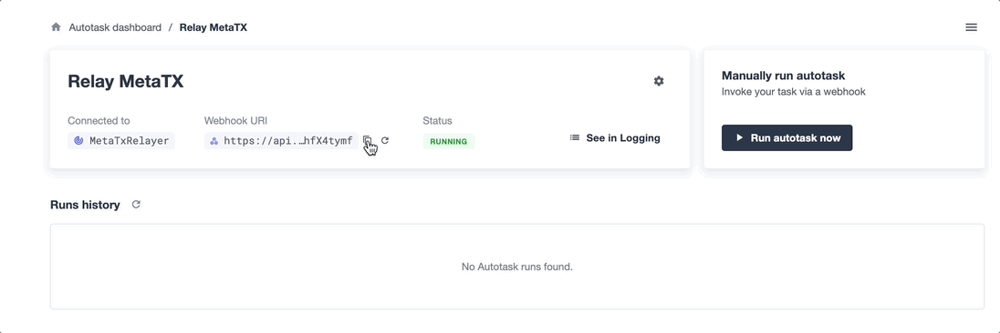

# How to Relay Gasless Meta-Transactions
[无需gas元交易](../../../Contracts/Contracts.4.x/API/Meta%20Transactions.md)为用户提供了更无缝的体验，使他们在与区块链互动时不必花费太多的钱。这种方法允许用户免费签署交易，并由第三方安全执行，而第三方支付燃气费用以执行交易。

使用OpenZeppelin Defender可以轻松安全地实现无需燃气的元交易中继。Defender [Relay](../../Components/Relay/Relay.md)允许您轻松发送交易，并处理私钥存储、交易签名、nonce管理、燃气估算以及必要时的自动重新提交。

此[演示应用程序](https://github.com/OpenZeppelin/workshops/tree/master/25-defender-metatx-api)使用[MinimalForwarder](../../../Contracts/Contracts.4.x/API/Meta-Transactions.md#minimalforwarder)和[ERC2771Context](../../../Contracts/Contracts.4.x/API/Meta-Transactions.md#erc2771context)实现元交易，以将msg.sender与 Relayer 的地址分离。用户需要做的就是使用他们想要发出交易的账户签署消息。签名是使用用户的私钥与目标合约和所需交易的数据形成的。这种签名在链外进行，不需要燃气费用。将签名传递给Relayer ，以便它可以为用户执行交易（并支付燃气费用）。

## 演示应用程序概述
您可以在此处查看[实时演示dapp](https://defender-metatx-workshop-demo.openzeppelin.com/)。如果用户有可用的资金支付交易，则直接接受注册，否则将数据作为元交易发送。

在示例代码中，[SimpleRegistry合约](https://github.com/OpenZeppelin/workshops/blob/master/25-defender-metatx-api/contracts/SimpleRegistry.sol)的功能是获取字符串并存储它。通过将签署者与交易发送者分离，合约的[元交易实现](https://github.com/OpenZeppelin/workshops/blob/master/25-defender-metatx-api/contracts/Registry.sol)可以实现相同的结果。

在比较代码时，请注意元交易使用_msgSender()与SimpleRegistry使用的msg.sender的区别。通过扩展ERC2771Context和MinimalForwarder扩展，合约变得具有元交易功能。（请注意，所有OpenZeppelin合约都兼容使用_msgSender()。）

两个合约之间的第二个基本变化是元交易合约需要指定受信任的Relayer地址，本例中为MinimalForwarder合约的地址。

## 配置项目
首先，fork存储库，然后将其git clone到您的计算机并安装依赖项：
```
$ git clone https://github.com/[GitHub username]/workshops.git
$ cd workshops/25-defender-metatx-api/
$ yarn
```

在项目根目录中创建一个.env文件，并提供来自Defender的Team API密钥和secret。本地测试将使用私钥，但 Relayer 将用于实际的合约部署。
```
PRIVATE_KEY="Goerli private key"
TEAM_API_KEY="Defender Team API key, used for uploading autotask code"
TEAM_API_SECRET="Defender Team API secret"
```

## 创建 Relayer 
运行 Relayer 创建脚本：
```
$ yarn create-relay
```

编辑 [scripts/createRelay.js](https://github.com/OpenZeppelin/workshops/blob/master/25-defender-metatx-api/scripts/createRelay.js) 文件，在 .env 文件中提供您的 Defender API 密钥，并根据需要调整变量名称。

使用 create 方法创建 Relayer ：
```
const relayClient = new RelayClient({ apiKey, apiSecret });

const requestParams = {
  name: 'MetaTxRelayer ',
  network: 'goerli',
  minBalance: BigInt(1e17).toString(),
};
const Relayer  = await relayClient.create(requestParams);
```

请注意，您稍后需要从控制台日志或创建的relay.json文件中获取Relayer Id。在创建Autotask时，您将使用此ID。

当您想要通过API发送交易时，将使用Relayer 的API密钥和secret。在上面的代码中，它附加到现有的.env文件中。

## 使用Hardhat编译合约
请使用以下代码编写您的Registry.sol合约：
```
// SPDX-License-Identifier: MIT
pragma solidity ^0.8.0;

import "@openzeppelin/contracts/metatx/ERC2771Context.sol";
import "@openzeppelin/contracts/metatx/MinimalForwarder.sol";

contract Registry is ERC2771Context {
  event Registered(address indexed who, string name);

  mapping(address => string) public names;
  mapping(string => address) public owners;

  constructor(MinimalForwarder forwarder) // Initialize trusted forwarder
    ERC2771Context(address(forwarder)) {
  }

  function register(string memory name) external {
    require(owners[name] == address(0), "Name taken");
    address owner = _msgSender(); // Changed from msg.sender
    owners[name] = owner;
    names[owner] = name;
    emit Registered(owner, name);
  }
}
```

运行npx hardhat compile以准备部署代码。

## 使用Relayer 进行部署
您可以轻松地部署已编译的智能合约，而无需处理私钥，方法是使用Defender Relayer 客户端。

创建relay-client的实例，将Relay的API密钥和secret作为其凭据提供，并在调用deploy()时连接到它。
```
// ...
  const credentials = {
    apiKey: process.env.Relayer _API_KEY,
    apiSecret: process.env.Relayer _API_SECRET,
  }
  const provider = new DefenderRelayProvider(credentials)
  const relaySigner = new DefenderRelaySigner(credentials, provider, {
    speed: 'fast',
  })

  const Forwarder = await ethers.getContractFactory('MinimalForwarder')
  const forwarder = await Forwarder.connect(relaySigner)
    .deploy()
    .then((f) => f.deployed())
// ...
```

deploy.js脚本从本地的.env文件中获取Relayer 的凭据，以及Registry和MinimalForwarder合约的Artifacts，并使用ethers.js进行部署。这些合约的相关地址保存在本地文件deploy.json中。

在演示应用程序中，使用yarn deploy运行此脚本。

代码部署后，可以安全地删除Relayer 密钥和secret。除非需要进行其他本地测试，否则不需要它们。

## 通过API创建Autotask
演示应用程序使用[Autotask](../../Components/Autotasks/Autotasks.md)提供必要的逻辑，告诉Relayer 向转发器合约发送交易，提供签名者的地址。每次从dapp调用其webhook时，Autotask将被触发。

由于组件之间的紧密关系，Relayer凭据通过实例化新的提供程序和签名者安全地提供给Autotask。

Autotask的位置非常重要-只有Autotask的webhook对前端公开。 Autotask的角色是根据分配给它的逻辑执行交易：如果用户有资金，则支付交易费用。如果没有，则Relayer 支付交易费用。

重要的是，Relayer 的API密钥和secret与前端隔离。如果Relayer 密钥暴露，任何人都有可能使用Relayer发送任何他们想要的交易。
```
const ethers = require('ethers');
const { DefenderRelaySigner, DefenderRelayProvider } = require('defender-relay-client/lib/ethers');

const { ForwarderAbi } = require('../../src/forwarder');
const ForwarderAddress = require('../../deploy.json').MinimalForwarder;
const RegistryAddress = require('../../deploy.json').Registry;

async function relay(forwarder, request, signature, whitelist) {
  // Decide if we want to relay this request based on a whitelist
  const accepts = !whitelist || whitelist.includes(request.to);
  if (!accepts) throw new Error(`Rejected request to ${request.to}`);

  // Validate request on the forwarder contract
  const valid = await forwarder.verify(request, signature);
  if (!valid) throw new Error(`Invalid request`);

  // Send meta-tx through Relayer  to the forwarder contract
  const gasLimit = (parseInt(request.gas) + 50000).toString();
  return await forwarder.execute(request, signature, { gasLimit });
}

async function handler(event) {
  // Parse webhook payload
  if (!event.request || !event.request.body) throw new Error(`Missing payload`);
  const { request, signature } = event.request.body;
  console.log(`Relaying`, request);

  // Initialize Relayer  provider and signer, and forwarder contract
  const credentials = { ... event };
  const provider = new DefenderRelayProvider(credentials);
  const signer = new DefenderRelaySigner(credentials, provider, { speed: 'fast' });
  const forwarder = new ethers.Contract(ForwarderAddress, ForwarderAbi, signer);

  // Relay transaction!
  const tx = await relay(forwarder, request, signature);
  console.log(`Sent meta-tx: ${tx.hash}`);
  return { txHash: tx.hash };
}

module.exports = {
  handler,
  relay,
}
```

请注意，Autotask代码必须包含一个导出处理程序入口的index.js文件。如果代码依赖于任何外部依赖项（例如导入的ABI），则需要使用webpack、rollup等打包Autotask。

虽然可以使用Defender网页客户端创建Autotask，但使用[Defender的API](https://www.npmjs.com/package/defender-autotask-client)的脚本会方便。

在演示应用程序中，运行yarn create-autotask编译Autotask代码、在Defender中创建Autotask并通过调用Autotask客户端的.create()方法上传打包的代码：
```
// ...
  const client = new AutotaskClient({ apiKey, apiSecret });
  const {autotaskId } = await client.create({
    name: "Relay MetaTX",
    encodedZippedCode: await client.getEncodedZippedCodeFromFolder('./build/relay'),
    Relayer Id: Relayer Id,
    trigger: {
      type: 'webhook'
    },
    paused: false
  });
// ...
```

前往[Defender](https://defender.openzeppelin.com/)获取Autotask的Webhook，以便您可以测试功能将应用程序连接到Autotask以Relayer 元交易。


将Autotask webhook保存到您的.env文件中，命名为WEBHOOK_URL，并在/app .env文件中命名为REACT_APP_WEBHOOK_URL。

使用yarn sign，然后使用yarn invoke测试元交易的功能。

## 创建Web应用程序
关键构建块已经建立，下一步是创建一个利用这些组件的Web应用程序。

您可以在[register.js](https://github.com/OpenZeppelin/workshops/blob/master/25-defender-metatx-api/app/src/eth/register.js)文件中查看此关系的详细信息。用户的交易请求通过Autotask的webhook发送到Relayer ，根据应用程序提供的参数执行Autotask的逻辑。请注意，签名者的nonce将从交易中递增。
```
import { ethers } from 'ethers';
import { createInstance } from './forwarder';
import { signMetaTxRequest } from './signer';

async function sendTx(registry, name) {
  console.log(`Sending register tx to set name=${name}`);
  return registry.register(name);
}

async function sendMetaTx(registry, provider, signer, name) {
  console.log(`Sending register meta-tx to set name=${name}`);
  const url = process.env.REACT_APP_WEBHOOK_URL;
  if (!url) throw new Error(`Missing Relayer  url`);

  const forwarder = createInstance(provider);
  const from = await signer.getAddress();
  const data = registry.interface.encodeFunctionData('register', [name]);
  const to = registry.address;

  const request = await signMetaTxRequest(signer.provider, forwarder, { to, from, data });

  return fetch(url, {
    method: 'POST',
    body: JSON.stringify(request),
    headers: { 'Content-Type': 'application/json' },
  });
}

export async function registerName(registry, provider, name) {
  if (!name) throw new Error(`Name cannot be empty`);
  if (!window.ethereum) throw new Error(`User wallet not found`);

  await window.ethereum.enable();
  const userProvider = new ethers.providers.Web3Provider(window.ethereum);
  const userNetwork = await userProvider.getNetwork();
  if (userNetwork.chainId !== 5) throw new Error(`Please switch to Goerli for signing`);

  const signer = userProvider.getSigner();
  const from = await signer.getAddress();
  const balance = await provider.getBalance(from);

  const canSendTx = balance.gt(1e15);
  if (canSendTx) return sendTx(registry.connect(signer), name);
  else return sendMetaTx(registry, provider, signer, name);
}
```

## 尝试应用程序
使用以下命令安装必要的依赖项并运行应用程序。
```
$ cd app
$ yarn
$ yarn start
```

1. 打开应用程序：http://localhost:3000/

2. 在Metamask中切换到Goerli网络

3. 在MetaMask中输入要注册和签名的名称

4. 注册成功，显示创建元交易的地址和名称。

使用前端界面自行查看它的工作方式！比较使用具有资金的帐户签署注册表时会发生的情况，然后尝试使用余额为零的帐户进行操作。

## 资源
[演示存储库-元交易名称注册表](https://github.com/OpenZeppelin/workshops/tree/master/25-defender-metatx-api)

[文档-元交易](../../../Contracts/Contracts.4.x/API/Meta-Transactions.md)