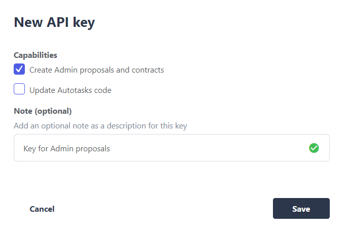
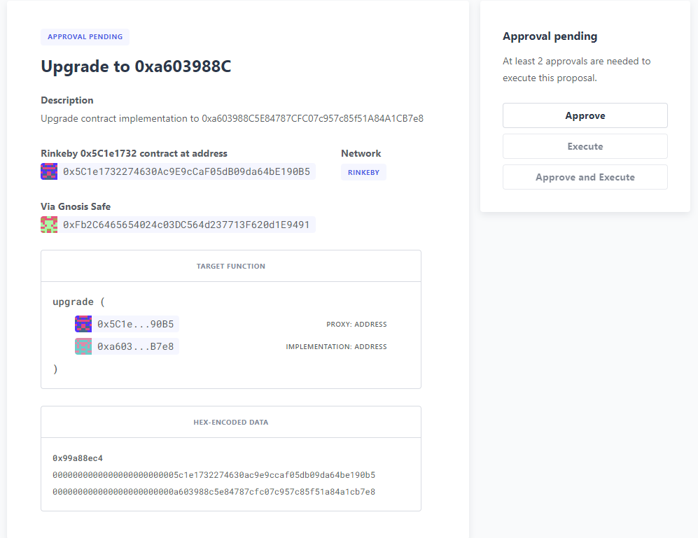

# Upgrading a contract via a multisig
本指南将指导您使用多重签名钱包保护的生产中的智能合约升级过程，使用*Defender Admin*作为界面，Hardhat脚本在后台运行。具体来说，我们将：

* 使用Hardhat的Upgrades Plugin编写和部署可升级的合约
* 将升级权限转移给多重签名钱包以增加安全性
* 使用Hardhat验证、部署和提出新实现
* 通过Defender Admin在多重签名钱包中执行升级

## 什么是升级？
以太坊中的智能合约默认情况下是不可变的。一旦创建，就无法更改它们，实际上它们在参与者之间充当不可打破的合约。

可升级合约允许我们修改智能合约以修复错误、添加其他功能或仅仅更改其强制执行的规则。

这允许我们更改合约代码，同时保留状态、余额和地址。

## 升级过程
升级管理员帐户（*ProxyAdmin*合约的所有者）是具有*升级*可升级合约的能力的帐户。默认所有者是用于部署合约的外部拥有的帐户。虽然这可能对于本地或测试网部署足够好，但在生产中，您需要更好地保护您的合约。获取您的升级管理员帐户的攻击者可以更改您项目中的任何可升级合约！

建议在部署后将**ProxyAdmin的所有权转移给一个多重签名**，要求多个所有者批准升级提案。

创建可升级合约并稍后升级的过程如下：

1. **创建可升级合约**。开发应包括适当的测试和审核。

2. **部署可升级合约**。使用Hardhat Upgrades Plugins for Hardhat和开发人员控制的私钥，部署实现合约、ProxyAdmin和代理合约。

3. **将升级控制权（ProxyAdmin的所有权）转移给多重签名**。这意味着我们无法在本地计算机上进行升级。

4. （一段时间后）**创建我们的实现的新版本**。开发应包括适当的测试和审核。

5. **提出升级**。这将检查新实现的升级安全性，部署合约并创建提案。

6. **升级合约**。需要多重签名的所有者批准并最终执行升级。

## 先决条件
要开始，您需要以下内容：

1. Defender帐户。前往[Defender](https://defender.openzeppelin.com/)注册一个新帐户。

2. 用于支付交易燃气的ETH。交易需要燃气执行，因此请确保有一些ETH可用。对于本指南，我们将使用Rinkeby ETH。

3. 多重签名。一个多重签名合约来控制我们的可升级合约。在本指南中，我们将使用[Gnosis Safe](https://safe.gnosis.io/)，但您也可以使用任何支持的多重签名，如传统的[Gnosis MultiSigWallet](https://github.com/gnosis/MultiSigWallet)。在Rinkeby网络上创建一个[Gnosis Safe多重签名](https://help.gnosis-safe.io/en/articles/3876461-create-a-safe-multisig)，M > N/2且M > 1。这应该至少是2个3。

4. Hardhat项目。安装了*Hardhat Upgrades*插件、Hardhat Defender、ethers.js和dotenv的Hardhat项目。

```
npm install --save-dev @openzeppelin/hardhat-upgrades @openzeppelin/hardhat-defender @nomiclabs/hardhat-ethers ethers dotenv
```

## 创建可升级合约
创建可升级合约的第一步是创建一个可升级的合约。在本指南中，我们将使用来自*OpenZeppelin Learn指南*的Box.sol合约。在项目根目录下创建一个contracts目录，然后在contracts目录中创建Box.sol，其中包含以下Solidity代码。

> NOTE
可升级合约使用*初始化函数而不是构造函数*来初始化状态。为了保持简单，我们将使用公共存储函数来初始化我们的状态，该函数可以从任何帐户调用多次，而不是受保护的单次使用初始化函数。
```
// contracts/Box.sol
// SPDX-License-Identifier: MIT
pragma solidity ^0.7.0;

contract Box {
    uint256 private value;

    // Emitted when the stored value changes
    event ValueChanged(uint256 newValue);

    // Stores a new value in the contract
    function store(uint256 newValue) public {
        value = newValue;
        emit ValueChanged(newValue);
    }

    // Reads the last stored value
    function retrieve() public view returns (uint256) {
        return value;
    }
}
```

## 部署可升级合约
为了部署我们的合约，我们将使用一个脚本。*Hardhat Upgrades*插件提供了一个deployProxy函数来部署我们的可升级合约。这会部署我们的实现合约、*ProxyAdmin*（我们项目的代理管理员）和代理，同时调用任何初始化。

在项目根目录中创建一个scripts目录，然后在scripts目录中创建以下deploy.js脚本。

在本指南中，我们没有初始化函数，因此我们将使用store函数来初始化状态。
```
// scripts/deploy.js
async function main () {
  const Box = await ethers.getContractFactory('Box');
  console.log('Deploying Box...');
  const box = await upgrades.deployProxy(Box, [42], { initializer: 'store' });
  console.log('Box deployed to:', box.address);
}

main()
  .then(() => process.exit(0))
  .catch(error => {
    console.error(error);
    process.exit(1);
  });
```
通常我们会先进行测试，然后部署到本地测试网络并手动进行交互。为了本指南的目的，我们将直接跳到部署到公共测试网络。

在本指南中，我们将部署到 Rinkeby，因为 Gnosis Safe 支持 Rinkeby 测试网络。如果您需要配置帮助，请参阅*连接到公共测试网络*和 *Hardhat：部署到实时网络*。

我们可以创建一个 .env 文件来存储我们的助记词和提供程序 API 密钥。您应该将 .env 添加到您的 .gitignore 中。

```
MNEMONIC="Enter your seed phrase"
ALCHEMY_API_KEY="Enter your Alchemy API Key"
DEFENDER_TEAM_API_KEY="Enter your Defender Team API Key"
DEFENDER_TEAM_API_SECRET_KEY="Enter your Defender Team API Secret"
```

> WARNING
任何秘密信息，如助记词或API密钥都不应该提交到版本控制中。

我们将使用以下hardhat.config.js来部署到Rinkeby。

> NOTE
在本指南中，我们将使用Alchemy，但您也可以使用Infura或其他公共节点提供者连接到网络。

```
// hardhat.config.js
require('dotenv').config();
require('@nomiclabs/hardhat-ethers');
require('@openzeppelin/hardhat-upgrades');

const mnemonic = process.env.MNEMONIC;
const alchemyApiKey = process.env.ALCHEMY_API_KEY;

/**
 * @type import('hardhat/config').HardhatUserConfig
 */
module.exports = {
  networks: {
    rinkeby: {
      url: `https://eth-rinkeby.alchemyapi.io/v2/${alchemyApiKey}`,
      accounts: { mnemonic },
    },
  },
  solidity: '0.7.3',
};
```

运行我们的deploy.js并部署到Rinkeby网络。我们的实现合约、ProxyAdmin和代理将被部署。

> NOTE
我们需要跟踪我们的代理地址，稍后我们会用到它。

```
npx hardhat run --network rinkeby scripts/deploy.js
Compiling 2 files with 0.7.3
Compilation finished successfully
Deploying Box...
Box deployed to: 0x5C1e1732274630Ac9E9cCaF05dB09da64bE190B5
```

## 将升级的控制权转移给多重签名。
我们将使用多重签名来控制合约的升级。Defender Admin支持[Gnosis Safe](https://safe.gnosis.io/)和传统的[Gnosis MultiSigWallet](https://github.com/gnosis/MultiSigWallet)。

我们的代理管理员（可以执行升级）是一个ProxyAdmin合约。只有ProxyAdmin的所有者才能升级我们的代理。

> WARNING
确保仅将*ProxyAdmin*的所有权转移给我们控制的地址。

在scripts目录中创建transfer-ownership.js，并使用以下JavaScript更改gnosisSafe的值为您的Gnosis Safe地址。

```
// scripts/transfer-ownership.js
async function main () {
  const gnosisSafe = '0xFb2C6465654024c03DC564d237713F620d1E9491';

  console.log('Transferring ownership of ProxyAdmin...');
  // The owner of the ProxyAdmin can upgrade our contracts
  await upgrades.admin.transferProxyAdminOwnership(gnosisSafe);
  console.log('Transferred ownership of ProxyAdmin to:', gnosisSafe);
}

main()
  .then(() => process.exit(0))
  .catch(error => {
    console.error(error);
    process.exit(1);
  });
```
我们可以在Rinkeby网络上运行转移所有权的代码。
```
npx hardhat run --network rinkeby scripts/transfer-ownership.js
Transferring ownership of ProxyAdmin...
Transferred ownership of ProxyAdmin to: 0xFb2C6465654024c03DC564d237713F620d1E9491
```

## 创建我们实现的新版本
一段时间后，我们决定向我们的合约添加功能。在本指南中，我们将向我们的Box合约添加一个增量函数。

> NOTE
我们不能对我们的合约进行任意更改，有关哪些修改是有效的的详细信息，请参见*升级*。

在您的合约目录中创建新的实现，BoxV2.sol，其中包含以下Solidity代码。
```
// contracts/BoxV2.sol
// SPDX-License-Identifier: MIT
pragma solidity ^0.7.0;

import "./Box.sol";

contract BoxV2 is Box {
    // Increments the stored value by 1
    function increment() public {
        store(retrieve() + 1);
    }
}
```
为了测试我们的升级，我们应该为新实现合约创建单元测试，同时创建更高级别的测试以通过代理测试交互，并检查状态是否在升级中保持不变。可以参考*OpenZeppelin Upgrades: Step by Step Tutorial for Hardhat*的示例测试。

## 创建Defender Team API密钥
为了通过API创建Defender管理提案，我们需要一个团队API密钥。

要获取密钥，请从右上角的Defender菜单中选择**Team API Keys**，然后选择**Create API Key**。我们只需要**创建管理提案和合约的能力**，因此选择此选项，并设置一个可选的注释来描述该密钥。

我们可以将API密钥和秘密密钥复制并存储在项目的.env文件中。

> NOTE
我们无法再从Defender中检索我们的秘密密钥。相反，我们需要创建一个新的团队API密钥。

## 提出升级建议后
一旦我们将升级的控制权（ProxyAdmin的所有权）转移到了我们的多重签名账户，我们就不能简单地升级合约了。相反，我们需要首先提出一个升级建议，供多重签名账户的所有者审查，一旦审查通过，批准并执行升级合约的建议。

要提出升级建议，我们使用[Hardhat的Defender插件](https://www.npmjs.com/package/@openzeppelin/hardhat-defender)。

我们需要在hardhat.config.js中注册Hardhat Defender插件。
```
require("@openzeppelin/hardhat-defender");
```
我们还需要将我们的 Defender Team API 密钥添加到 hardhat.config.js 中导出的配置中：
```
module.exports = {
  defender: {
    apiKey: process.env.DEFENDER_TEAM_API_KEY,
    apiSecret: process.env.DEFENDER_TEAM_API_SECRET_KEY,
  }
}
```
我们的 hardhat.config.js 应该如下所示：
```
// hardhat.config.js
require('dotenv').config();
require('@nomiclabs/hardhat-ethers');
require('@openzeppelin/hardhat-upgrades');
require('@openzeppelin/hardhat-defender');

const mnemonic = process.env.MNEMONIC;
const alchemyApiKey = process.env.ALCHEMY_API_KEY;

/**
 * @type import('hardhat/config').HardhatUserConfig
 */
module.exports = {
  defender: {
    apiKey: process.env.DEFENDER_TEAM_API_KEY,
    apiSecret: process.env.DEFENDER_TEAM_API_SECRET_KEY,
  },
  networks: {
    rinkeby: {
      url: `https://eth-rinkeby.alchemyapi.io/v2/${alchemyApiKey}`,
      accounts: { mnemonic },
    },
  },
  solidity: '0.7.3',
};
```
一旦我们设置好配置，我们可以提出升级建议。这将验证实施是否具备升级安全性，部署我们的新实现合约并提出升级建议。

在scripts目录中创建propose-upgrade.js，包含以下代码。

> NOTE
我们需要更新脚本以指定我们的代理地址。
```
// scripts/propose-upgrade.js
const { defender } = require("hardhat");

async function main() {
  const proxyAddress = '0x5C1e1732274630Ac9E9cCaF05dB09da64bE190B5';

  const BoxV2 = await ethers.getContractFactory("BoxV2");
  console.log("Preparing proposal...");
  const proposal = await defender.proposeUpgrade(proxyAddress, BoxV2);
  console.log("Upgrade proposal created at:", proposal.url);
}

main()
  .then(() => process.exit(0))
  .catch(error => {
    console.error(error);
    process.exit(1);
  })
```
我们可以在Rinkeby网络上运行脚本来提出升级。
```
npx hardhat run --network rinkeby scripts/propose-upgrade.js
Compiling 1 file with 0.7.3
Compilation finished successfully
Preparing proposal...
Upgrade proposal created at: https://defender.openzeppelin.com/#/admin/contracts/rinkeby-0x5C1e1732274630Ac9E9cCaF05dB09da64bE190B5/proposals/bd8ab482-2c12-47f9-8052-d0b77a7313dc
```

## 升级合约
一旦我们提出了升级建议，多重签名的所有者可以使用Defender Admin进行审查和批准。使用propose-upgrade.js中的链接，我们团队的每个成员都可以在Defender中审查该建议。多重签名的所需所有者可以批准该建议，然后最终执行以升级我们的合约。


我们可以在Defender管理员的提案列表中看到已执行的升级提案，我们的合约已经升级。


##总结

让我们回顾一下我们刚刚完成的步骤：

* 编写和部署了一个可升级的合约
* 将我们的可升级合约的升级权限转移到了一个多重签名钱包
* 验证、部署和提出了一个新的实现
* 通过Defender Admin在多重签名中执行了升级提案

使用多重签名来控制升级权限可以更好地保护我们的可升级合约。此外，使用Defender Admin来更好地管理升级过程。

## 问题

如果您有任何问题或评论，请在[论坛](https://forum.openzeppelin.com/c/support/defender/36)上提出！