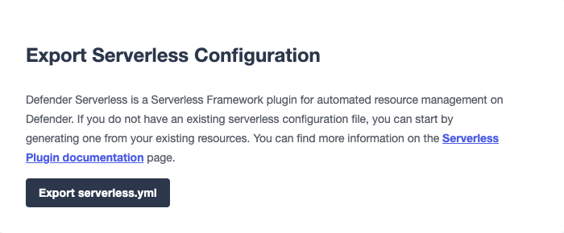

# Defender Serverless Plugin
Defender Serverless是一个用于在Defender上自动化资源管理的Serverless Framework插件。

> WARNING
该插件仍在开发中，可能存在错误。请谨慎使用。

## 先决条件
Serverless Framework：https://www.serverless.com/framework/docs/getting-started/

## 安装
您可以直接使用我们预配置的模板初始化Serverless项目：
```
sls install --url https://github.com/OpenZeppelin/defender-serverless/tree/main/template -n my-service
```

> NOTE
要使上述命令正确运行，您需要访问此存储库。

或者，您可以使用以下命令将其直接安装到现有项目中：

yarn add defender-serverless

## 设置
有几种方法可以设置serverless.yml配置：

* 从头开始创建；

* 使用Defender的Serverless导出功能；

* 利用defender-serverless存储库中提供的示例模板。

如果您已经在Defender中拥有资源，例如合约、通知、Relayer 、自动任务等，则可以从Defender的设置页面导出包含这些资源的serverless.yml配置文件。


> NOTE
如果您之前已经使用defender-serverless部署到同一个账户，并且随后通过Defender用户界面创建了新的资源，则导出功能将根据最新部署堆栈的名称自动为新资源分配stackResourceId。如果您以前没有使用defender-serverless部署过，则将使用默认堆栈名称my-stack。

该插件允许您从serverless.yml中声明性地定义Autotasks、Sentinels、Notifications、Relayer s、Contracts、Policies和Secrets，并通过使用serverless deploy命令行界面进行配置。以下是一个示例模板，其中定义了一个Autotask、一个Relayer 、一个Policy和一个单一的Relayer  API密钥：
```
service: defender-serverless-template
configValidationMode: error
frameworkVersion: '3'

provider:
  name: defender
  stage: ${opt:stage, 'dev'}
  stackName: 'mystack'
  ssot: false

defender:
  key: '${env:TEAM_API_KEY}'
  secret: '${env:TEAM_API_SECRET}'

functions:
  autotask-example-1:
    name: 'Hello world from serverless'
    path: './autotasks/hello-world'
    Relayer : ${self:resources.Resources.Relayer s.Relayer -1}
    trigger:
      type: 'schedule'
      frequency: 1500
    paused: false

resources:
  Resources:
    policies:
      policy-1:
        gas-price-cap: 1000
        whitelist-receivers:
          - '0x0f06aB75c7DD497981b75CD82F6566e3a5CAd8f2'
        eip1559-pricing: true

    Relayer s:
      Relayer -1:
        name: 'Test Relayer  1'
        network: 'goerli'
        min-balance: 1000
        policy: ${self:resources.Resources.policies.policy-1}
        api-keys:
          - key1

plugins:
  - defender-serverless
```
这需要在YAML文件的defender属性下设置密钥和 secrets 。我们建议使用环境变量或安全（gitignored）配置文件来检索这些值。相应地修改serverless.yml。

确保Defender团队API密钥具有所有适当的API功能。

stackName（例如mystack）与资源键（例如Relayer -1）结合使用，以唯一地标识每个资源。此标识符称为stackResourceId（例如mystack.Relayer -1），允许您在同一Defender团队中管理多个部署。

### SSOT模式
在serverless.yml文件的provider属性下，您可以选择添加ssot布尔值。 SSOT或单一真相源确保Defender中堆栈的状态与serverless.yml模板完全同步。这意味着，除了 Relayer 之外，在您当前模板文件中未定义的所有Defender资源都将从Defender中删除。如果在模板中未定义SSOT，则默认为false。

任何从serverless.yml文件中删除的资源都不会自动删除，以防止意外的资源删除。为了预期这种行为，必须启用SSOT模式。

###  secrets （Autotask）
Autotask secrets 可以全局定义和每个堆栈定义。在全局下定义的 secrets 不会受到stackName更改的影响，并且在重新部署到新的stack下时将保留。在堆栈下定义的 secrets 将在重新部署到新的stackName下时被删除（在启用*SSOT模式*的情况下）。要引用在堆栈下定义的 secrets ，请使用以下格式：<stackname> _ <secretkey>，例如mystack_test。
```
secrets:
  # optional - global secrets are not affected by stackName changes
  global:
    foo: ${self:custom.config.secrets.foo}
    hello: ${self:custom.config.secrets.hello}
  # optional - stack secrets (formatted as <stackname>_<secretkey>)
  stack:
    test: ${self:custom.config.secrets.test}
```

类型和模式验证

我们基于JSON模式提供自动生成的文档：

* Defender属性

* Provider属性

* Function（Autotask）属性

* Resources Property

更多关于类型的信息可以在[此处](https://github.com/OpenZeppelin/defender-serverless/blob/main/src/types/index.ts)找到。具体来说，可以查看以Y开头的类型（例如YRelayer ）。有关模式，可以查看[docs-schema文件夹](https://github.com/OpenZeppelin/defender-serverless/blob/main/src/types/docs-schemas)中的文档。

此外，还提供了一个[示例项目](https://github.com/OpenZeppelin/defender-serverless/blob/main/examples/defender-test-project/serverless.yml)，其中提供了可以在serverless.yml文件中定义的大部分属性。

## 命令

### 部署

您可以使用sls deploy将当前堆栈部署到Defender。

部署接受一个可选的--stage标志，默认为从上面的模板安装时的dev。

此外，serverless.yml文件可能包含一个ssot属性。有关更多信息，请参见*SSOT模式*部分。

此命令将在当前工作目录的.defender文件夹中附加一个日志条目。此外，如果创建了任何新的 Relayer 密钥，则将这些密钥存储为JSON对象在.defender / Relayer -keys文件夹中。

> WARNING
在安装模板时，我们确保忽略.defender文件夹中的任何git提交。但是，如果直接安装，请确保将此文件夹添加到您的.gitignore文件中。

### 信息

您可以使用sls info检索在serverless.yml文件中定义的每个资源的信息，包括唯一标识符和每个Defender组件特有的属性。

### 删除

您可以使用sls remove删除在serverless.yml文件中定义的所有Defender资源。

> NOTE
为了避免潜在的资金损失，只能直接从Defender UI中删除 Relayer 。

### 日志

您可以使用sls logs --function <stack_resource_id> --data {…}检索给定自动任务标识符（例如mystack.autotask-example-1）的最新自动任务日志。此命令将连续运行并每2秒检索一次日志。--data标志是可选的。

### 调用

您可以使用sls invoke --function <stack_resource_id>手动运行自动任务，给定其标识符（例如mystack.autotask-example-1）。

> NOTE
每个命令都有一个标准输出到JSON对象。

更多信息可以在我们的*文档页面*上找到。

## 注意事项

在部署过程中抛出的错误不会撤消任何先前的更改。常见错误包括：

* 未设置API密钥和 secrets 

* API密钥权限不足

* serverless.yml文件的验证错误（请参见*类型和模式验证*）

通常，修复错误并重试部署应足够，因为任何现有资源都将落在部署的更新条款中。但是，如果不确定，您可以随时调用sls remove来删除整个堆栈，并重试。