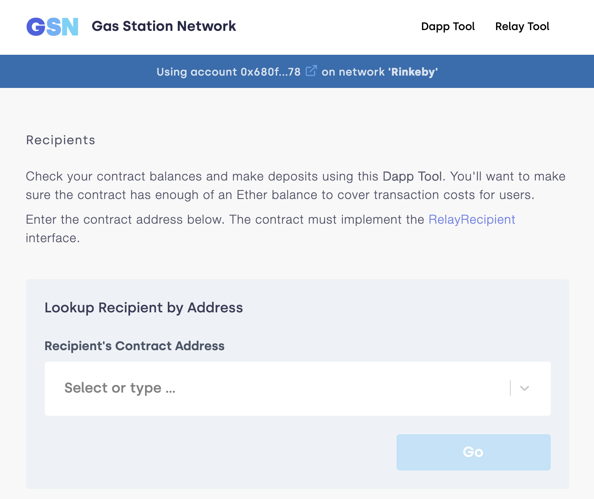

# Sending gasless transactions
> WARNING
这篇指南现在已经过时，因为它使用的是GSNv1，这个版本已经不再被支持。你可以考虑使用Defender来设置你自己的元交易中继器，或者使用OpenGSN团队的GSNv2来实现去中心化的解决方案。

> WARING
这篇文章不再维护。更多信息请点击这里阅读。

任何发送以太坊交易的人都需要拥有以太币来支付其gas费用。这迫使新用户在开始使用dapp之前必须购买以太币（这可能是一项艰巨的任务）。这是用户入门的一个主要障碍。

在这篇指南中，我们将探讨无gas（也称为元）交易的概念，用户无需支付其gas费用。我们还将介绍Gas Station Network，这是一个去中心化的解决方案，以及OpenZeppelin库，让你可以在你的dapps中利用它：

* 了解什么是元交易以及它们为什么重要

* Gas Station Network作为一个去中心化的元交易解决方案

* 从头开始构建一个GSN-powered DApp

* 使用GSN Starter Kit快速入门

## 什么是元交易？
所有的以太坊交易都使用gas，每个交易的发送者都必须拥有足够的以太币来支付花费的gas。尽管这些gas费用对于基本交易来说很低（几分钱），但获取以太币并不容易：dApp用户通常需要经过客户知识和反洗钱流程（KYC & AML），这不仅需要时间，而且通常涉及到在互联网上发送一张自拍照，手持他们的护照（！）。除此之外，他们还需要提供财务信息，以便通过交易所购买以太币。只有最硬核的用户才会忍受这种麻烦，而当需要以太币时，dApp的采用率会大大降低。我们可以做得更好。

元交易就是这样一个简单的概念：第三方（称为中继器）可以发送其他用户的交易，并为自己支付gas费用。在这个方案中，用户签署消息（而不是交易），包含他们想要执行的交易的信息。然后，中继器负责用这些信息签署有效的以太坊交易，并将它们发送到网络，支付gas费用。一个基础合约保留了最初请求交易的用户的身份。这样，用户可以直接与智能合约交互，而无需拥有钱包或拥有以太币。

这意味着，为了在你的应用中支持元交易，你需要保持一个中继器进程运行 - 或者利用一个去中心化的中继器网络。

## Gas Station Network
Gas Station Network（GSN）是一个去中心化的中继器网络。它允许你构建dapps，你为你的用户交易付费，所以他们不需要持有以太币来支付gas，简化他们的入门过程。

> NOTE
GSN最初由TabooKey设计和构思，现在已经发展成包括许多在以太坊空间工作的公司，他们希望共同解决将用户引入以太坊应用的问题。
然而，GSN中的中继器并不是在运行慈善机构：他们在运营一项业务。他们愿意为你的用户支付gas费用的原因是，他们会反过来向你的合约，也就是接收者收费。这样，中继器就可以拿回他们的钱，再加上一点作为他们服务的费用。

这一开始可能听起来有点奇怪，但为用户入门支付费用是一种非常常见的商业实践。在广告、免费试用、新用户折扣等方面花费了大量的钱，所有这些都是为了用户获取。与这些相比，几笔以太坊交易的成本实际上非常小。

此外，你可以利用GSN在你的用户提前在链下向你支付（例如，通过信用卡）的情况下，每个GSN调用都会从你的系统上的余额中扣除。可能性是无穷的！

此外，GSN的设置方式是，中继器最有利于为你的请求服务，如果他们行为不端，会有措施惩罚他们。所有这些都是自动发生的，所以你可以安全地开始使用他们的服务，无需担忧。

> TIP
你可以在与RelayHub交互中了解更多关于GSN如何工作的信息。

## Building a GSN-powered DApp
在这一部分，我们将使用：

- create-react-app包来引导一个React应用程序，以及OpenZeppelin Network JS来轻松设置支持GSN的web3对象
- OpenZeppelin GSN Helpers来模拟你的本地ganache实例中的GSN
- @openzeppelin/contracts-ethereum-package智能合约库来获取GSN
- OpenZeppelin CLI来管理和部署我们的合约

> NOTE
这里可能有很多移动的部分，但每个组件在构建这个应用程序中都有明确定义的角色。也就是说，如果你对OpenZeppelin平台不熟悉，那么在继续阅读之前，可能需要查看OpenZeppelin Contracts GSN指南和构建Dapp教程。

我们将创建一个简单的合约，只计算发送给它的交易，但会将它与GSN关联起来，这样用户在发送这些交易时就不必支付gas费用。让我们开始吧！

### Setting up the Environment
我们将首先创建一个新的npm项目并安装所有依赖项，包括Ganache（我们将用它来运行一个本地网络）：

```
$ mkdir gsn-dapp && cd gsn-dapp
$ npm init -y
$ npm install @openzeppelin/network
$ npm install --save-dev @openzeppelin/gsn-helpers @openzeppelin/contracts-ethereum-package @openzeppelin/upgrades @openzeppelin/cli ganache-cli
```

使用CLI设置一个新项目并按照提示进行操作，这样我们就可以编写我们的第一个合约了。
```
$ npx oz init
```

> TIP
如果你对它不熟悉，可以查看OpenZeppelin CLI的入门指南。

### Creating our Contract
我们将在新创建的contracts文件夹中编写我们的基础Counter合约。

```
// contracts/Counter.sol
pragma solidity ^0.5.0;

contract Counter {
    uint256 public value;

    function increase() public {
        value += 1;
    }
}
```

这已经足够简单了。现在，让我们修改它以添加GSN支持。这需要从GSNRecipient合约扩展并实现acceptRelayedCall方法。这个方法必须返回我们是否接受或拒绝支付用户交易的费用。为了简单起见，我们将支付发送到这个合约的所有交易的费用。

> NOTE
对于大多数（d）apps来说，这可能不是一个好主意，因为任何恶意用户都可以轻易地耗尽你的合约的资金。请查看我们关于GSN支付策略的指南，了解解决这个问题的不同方法。

```
// contracts/Counter.sol
pragma solidity ^0.5.0;

import "@openzeppelin/contracts-ethereum-package/contracts/GSN/GSNRecipient.sol";

contract Counter is GSNRecipient {
    uint256 public value;

    function increase() public {
        value += 1;
    }

    function acceptRelayedCall(
        address relay,
        address from,
        bytes calldata encodedFunction,
        uint256 transactionFee,
        uint256 gasPrice,
        uint256 gasLimit,
        uint256 nonce,
        bytes calldata approvalData,
        uint256 maxPossibleCharge
    ) external view returns (uint256, bytes memory) {
        return _approveRelayedCall();
    }

    // We won't do any pre or post processing, so leave _preRelayedCall and _postRelayedCall empty
    function _preRelayedCall(bytes memory context) internal returns (bytes32) {
    }

    function _postRelayedCall(bytes memory context, bool, uint256 actualCharge, bytes32) internal {
    }
}
```

在另一个终端上运行npx ganache-cli来启动ganache。然后，使用OpenZeppelin CLI通过运行npx oz create并按照提示创建我们新合约的实例，包括选择调用一个函数来初始化实例。

请务必记下你的实例的地址，这在整个过程的最后会返回！

> NOTE
记住在创建合约时调用initialize()函数非常重要，因为这将使你的合约准备好在GSN中使用。

```
openzeppelin create
✓ Compiled contracts with solc 0.5.9 (commit.e560f70d)
? Pick a contract to instantiate Counter
? Pick a network development
All contracts are up to date
? Call a function to initialize the instance after creating it? Yes
? Select which function * initialize()
✓ Instance created at 0xCfEB869F69431e42cdB54A4F4f105C19C080A601
```

很好！现在，如果我们将这个合约部署到主网或goerli测试网，我们几乎就可以开始向它发送不消耗gas的交易了，因为GSN已经在这两个网络上设置好了。然而，由于我们在本地的ganache上，我们需要自己设置。

### Deploying a Local GSN for Development
GSN由一个中心的RelayHub合约组成，该合约协调所有的中继交易，以及多个去中心化的中继器。中继器是通过HTTP接口接收中继交易请求并通过RelayHub将它们发送到网络的进程。

在ganache运行的情况下，你可以在新的终端中使用以下命令从OpenZeppelin GSN Helpers启动一个中继器：

```
npx oz-gsn run-relayer
Deploying singleton RelayHub instance
RelayHub deployed at 0xd216153c06e857cd7f72665e0af1d7d82172f494
Starting relayer
 -Url http://localhost:8090
...
RelayHttpServer starting. version: 0.4.0
...
Relay funded. Balance: 4999305160000000000
```

> NOTE
在底层，这个命令处理了几个步骤，以便在本地启动并运行一个中继器。首先，它将为你的平台下载一个中继器二进制文件并启动它。然后，它将把RelayHub合约部署到你的本地ganache，注册中继器到hub，并为其充值，以便它可以中继交易。你可以通过使用其他的oz-gsn命令或者直接从你的JavaScript代码中运行这些步骤。

最后一步将是为我们的Counter合约充值。GSN中继器需要接收合约有资金，因为它们将向合约收取中继交易的费用（加上一笔费用！）。我们将再次使用oz-gsn的命令集来做这个：

```
npx oz-gsn fund-recipient --recipient 0xCfEB869F69431e42cdB54A4F4f105C19C080A601
```

请确保将接收者地址替换为你的Counter合约实例的地址！
太棒了！现在我们有了我们的GSN驱动的合约和一个本地GSN来试验，让我们来构建一个小型的（d）app。

### Creating the Dapp
我们将使用create-react-app包创建我们的（d）app，这个包可以使用React快速创建一个简单的客户端应用。

```
npx create-react-app client
```
首先，创建一个符号链接，这样我们就可以访问我们编译的合约.json文件。在client/src目录内运行：

```
ln -ns ../../build
```

这将允许我们的前端访问我们的合约工件。

然后，用以下代码替换client/src/App.js。这将使用OpenZeppelin Network JS创建一个连接到本地网络的新提供者。它将使用现场生成的密钥代表用户签署所有交易，并使用GSN将它们中继到网络。这允许你的用户立即开始与你的（d）app交互，即使他们没有安装MetaMask，没有以太坊账户，或者根本没有以太币。
```
// client/src/App.js
import React, { useState, useEffect, useCallback } from "react";
import { useWeb3Network } from "@openzeppelin/network/react";

const PROVIDER_URL = "http://127.0.0.1:8545";

function App() {
  // get GSN web3
  const context = useWeb3Network(PROVIDER_URL, {
    gsn: { dev: true }
  });

  const { accounts, lib } = context;

  // load Counter json artifact
  const counterJSON = require("./build/contracts/Counter.json");

  // load Counter Instance
  const [counterInstance, setCounterInstance] = useState(undefined);

  if (
    !counterInstance &&
    context &&
    context.networkId
  ) {
    const deployedNetwork = counterJSON.networks[context.networkId.toString()];
    const instance = new context.lib.eth.Contract(counterJSON.abi, deployedNetwork.address);
    setCounterInstance(instance);
  }

  const [count, setCount] = useState(0);

  const getCount = useCallback(async () => {
    if (counterInstance) {
      // Get the value from the contract to prove it worked.
      const response = await counterInstance.methods.value().call();
      // Update state with the result.
      setCount(response);
    }
  }, [counterInstance]);

  useEffect(() => {
    getCount();
  }, [counterInstance, getCount]);

  const increase = async () => {
    await counterInstance.methods.increase().send({ from: accounts[0] });
    getCount();
  };

  return (
    <div>
      <h3> Counter counterInstance </h3>
      {lib && !counterInstance && (
        <React.Fragment>
          <div>Contract Instance or network not loaded.</div>
        </React.Fragment>
      )}
      {lib && counterInstance && (
        <React.Fragment>
          <div>
            <div>Counter Value:</div>
            <div>{count}</div>
          </div>
          <div>Counter Actions</div>
            <button onClick={() => increase()} size="small">
              Increase Counter by 1
            </button>
        </React.Fragment>
      )}
    </div>
  );
}

export default App;
```

> NOTE
您可以在设置提供者时向gsn选项传递一个dev: true标志。这将使用GSNDevProvider而不是常规的GSN提供者。这是一个专为测试或开发设置的提供者，它不需要运行中继器就可以工作。这可以使开发更容易，但它会感觉不像实际的GSN体验。如果你想使用一个实际的中继器，你可以在本地运行npx oz-gsn run-relayer（参见准备测试环境以获取更多信息）。

很好！我们现在可以从客户端文件夹中运行npm start来启动我们的应用程序。记住要保持你的ganache和中继器运行。你应该能够向你的Counter合约发送交易，而不必使用MetaMask或拥有任何ETH！

### Moving to a Testnet
在你的ganache网络中发送一个本地交易并不令人印象深刻，因为你已经有了一堆充足的账户。为了见证GSN的全部潜力，让我们将我们的应用程序移动到goerli测试网。如果你稍后想转到主网，指令是一样的。

你需要在networks.js文件中创建一个新条目，该条目有一个已经被资助的goerli账户。关于如何做到这一点的详细指导，请查看部署到公共测试网络。

我们现在可以将我们的Counter合约部署到goerli：

```
$ openzeppelin create
✓ Compiled contracts with solc 0.5.9 (commit.e560f70d)
? Pick a contract to instantiate: Counter
? Pick a network: goerli
✓ Added contract Counter
✓ Contract Counter deployed
? Call a function to initialize the instance after creating it?: Yes
? Select which function * initialize()
✓ Setting everything up to create contract instances
✓ Instance created at 0xCfEB869F69431e42cdB54A4F4f105C19C080A601
```

下一步将是指导我们的(d)app连接到一个goerli节点，而不是本地网络。在你的App.js中将PROVIDER_URL更改为，例如，一个Infura goerli端点。

我们现在将使用一个真正的GSN提供者，而不是我们的开发环境，所以你可能也想提供一个配置对象，这将给你更多的控制权，比如你愿意支付的gas价格。对于生产(d)apps，你会想根据你的需求来配置这个。

```
import { useWeb3Network, useEphemeralKey } from "@openzeppelin/network/react";

// inside App.js#App()
const context = useWeb3Network('https://goerli.infura.io/v3/' + INFURA_API_TOKEN, {
  gsn: { signKey: useEphemeralKey() }
});
```

我们快到了！如果你现在尝试使用你的(d)app，你会注意到你无法发送任何交易。这是因为你的Counter合约在这个网络上还没有被资助。我们将使用在线gsn-tool通过粘贴你的实例地址来代替我们之前使用的oz-gsn fund-recipient命令。为了做到这一点，web界面要求你在goerli网络上使用MetaMask，这将允许你向你的合约中存入资金。


就是这样！我们现在可以开始从我们的浏览器向goerli网络上的Counter合约发送交易，甚至不需要安装MetaMask。

## The GSN Starter Kit
启动套件是预配置的项目模板，用于引导dapp开发。其中一个，GSN启动套件，是一个已经连接到GSN的即用型dapp，其设置与我们在上一节中从头开始构建的设置类似。

如果你正在构建一个新的dapp，并想要包含元交易支持，你可以运行oz unpack gsn来快速启动你的开发，并开始使用一个GSN启用的盒子！

## 下一步
要了解更多关于GSN的信息，可以参考以下资源：

要了解如何使用OpenZeppelin合约来构建一个GSN能力合约，可以参考GSN基础指南。

如果你想了解如何使用OpenZeppelin合约的预制接受和收费策略，可以参考GSN策略指南。

如果你想了解更多关于如何从你的应用程序中使用GSN的信息，可以参考OpenZeppelin GSN提供者指南。

关于如何测试GSN启用的合约的信息，可以参考OpenZeppelin GSN助手文档。